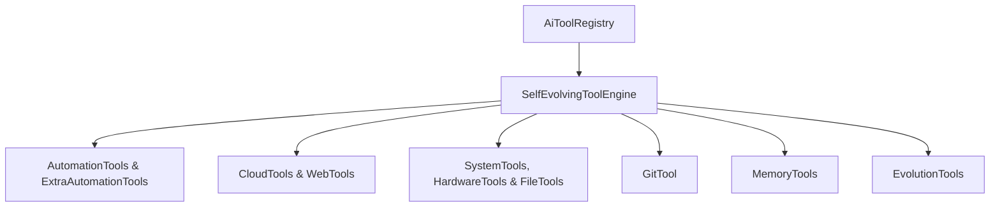

# AI TOOLS & SELF-EVOLVING TOOL ENGINE (`Modules/Layer0/AiTools/`)

## ARCHITECTURE OVERVIEW
Jarvis features an extensible tool invocation and self-evolution subsystem under `Modules/Layer0/AiTools/`. All tools implement the `IAiTool` interface and are registered in `AiToolRegistry`.

---

## CORE TOOL MODULES

### 1. `AiToolRegistry.cs` & `IAiTool.cs`
- **`IAiTool` Interface**:
  - `string Name`: Tool identifier.
  - `string Description`: Parameter schema and capabilities.
  - `Task<string> ExecuteAsync(Dictionary<string, string> args)`: Asynchronous execution entry point.
- **`AiToolRegistry`**: Central registry pattern that registers, dispatches, and validates tool argument schemas.

### 2. `SelfEvolvingToolEngine.cs` & `EvolutionTools.cs`
- **Dynamic Tool Assembly**: Enables Jarvis to write new tool code snippets, compile them in memory, and register them into `AiToolRegistry` during runtime sessions.
- **Execution Benchmarking**: Evaluates tool success rates, execution latency, and output accuracy, auto-patching failing scripts.

### 3. `AutomationTools.cs` & `ExtraAutomationTools.cs`
- Keyboard, mouse, and desktop UI automation.
- Window management, process launching, batch PowerShell command execution, and task scheduling.

### 4. `CloudTools.cs` & `WebTools.cs`
- **`CloudTools`**: Interacts with Google Cloud Platform (`gcloud`, BigQuery, Cloud Run, Compute Engine VM instances).
- **`WebTools`**: Performs HTTP requests, headless web page extraction, API querying, and web element interaction.

### 5. `FileTools.cs` & `GitTool.cs`
- **`FileTools`**: Recursive directory search, file hash verification, regex file search, encoding detection, and file batch transforms.
- **`GitTool`**: Local Git repository operations (status, diffs, branch creation, staging, committing, and remote push).

### 6. `HardwareTools.cs` & `SystemTools.cs`
- **`HardwareTools`**: Telemetry reporting for CPU load, GPU utilization, RAM consumption, disk I/O, and thermal sensors.
- **`SystemTools`**: Inspection of running Windows services, environment variables, network adapters, and active sockets.

### 7. `MemoryTools.cs`
- Key-value ephemeral memory store and persistent session state caching for LLM prompts and tools.
