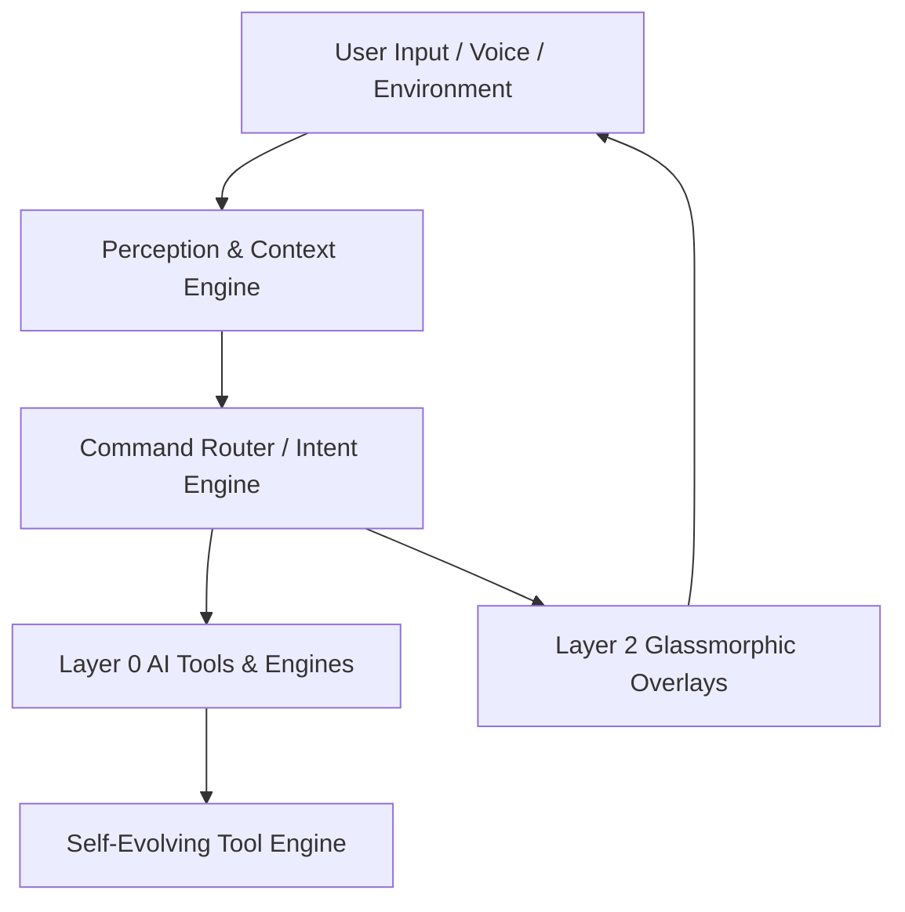

# JARVIS ASSISTANT PURPOSE, IDENTITY & COGNITIVE ARCHITECTURE

## ASSISTANT IDENTITY & MISSION
**Jarvis** is a desktop AI assistant, glassmorphic system companion, developer workspace deck, and autonomous automation engine designed to operate locally on Windows. Its core mission is to act as an extension of the developer's thought process—providing instant command navigation, binary analysis, code assistance, system monitoring, and context-aware background intelligence.

---

## CORE COGNITIVE SUBSYSTEMS

### 1. Context & Perception System (`Modules/Layer0/`)
Jarvis maintains a continuous model of user state, developer intent, and environment:
- **`BackgroundContextManager` & `ContextOptimizer`**: Tracks active windows, recently edited files, clipboard history, and short-term conversation context, pruning tokens dynamically to keep LLM context windows lean.
- **`ActionJournalManager` & `ChronoLogManager`**: Maintains an append-only timeline of developer actions, execution runs, file modifications, and system events for historical retrieval.
- **`EmotionalContextManager` & `EnvironmentalAudioAnalyzer`**: Uses ambient microphone streams (processed via `AudioFeatureExtractor` and `AcousticMlClassifier`) to infer user context, voice commands, and speech triggers via `LocalWakeWordDetector`.

### 2. Autonomous Interjection & Evolution Engine
- **`AutonomousAgentEngine` & `AutonomousInterjectionManager`**: Jarvis does not merely wait for explicit commands. It monitors system events (build failures, high memory load, long-running commands, file changes) and generates proactive suggestions or alerts when intervention is beneficial.
- **`SelfEvolvingToolEngine` & `EvolutionManager`**: Allows Jarvis to discover, assemble, and register new automation capabilities at runtime using modular tools (`IAiTool` implementations under `Modules/Layer0/AiTools/`).

### 3. Dual-LLM Copilot & Code Assistance
- **`DualLlmCopilot`**: Leverages fast, low-latency models for rapid code autocomplete and intent parsing alongside high-reasoning models for architectural planning and complex decompilation analysis.
- **`CodeTeacherManager` & `CodeAssistManager`**: Provides inline code explanation, step-by-step refactoring proposals, and automated syntax analysis for open codebase files.

---

## INTERACTION PHILOSOPHY FOR AI DEVELOPERS
When extending or updating Jarvis:
1. **Proactive & Non-Intrusive**: UI overlays should pop up quickly, perform their action, and allow smooth keyboard dismissal (e.g. Esc key).
2. **Context Preservation**: Avoid resetting state when user re-opens overlays. Preserve search input, scroll offsets, and active tab states.
3. **Resilient Failure Handling**: Backend tasks (scraping, disassembly, process manipulation) must fail gracefully, catch specific exceptions, and display clear human-readable error banners rather than crashing the launcher process.
