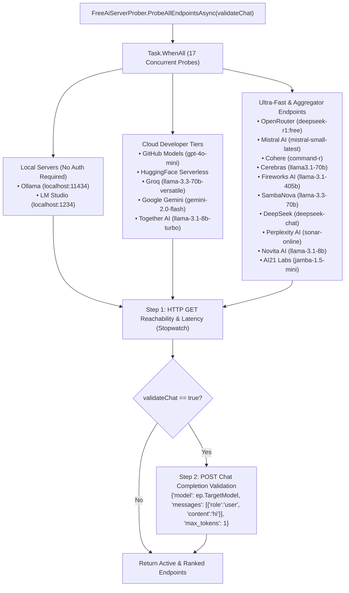

# LAYER 0: CORE UTILITIES, MANAGERS & AUTOMATION ENGINES

> [!IMPORTANT]
> **Isolation Constraint**: Layer 0 modules must be strictly self-contained. **No Layer 0 module can reference, require, or index any other Layer 0 module.** This prevents cross-coupling and circular dependencies at the lowest foundation layer.

---

## 1. FREE AI WEBSERVER & MODEL PROBER (`FreeAiServerProber.cs`)

[`FreeAiServerProber`](file:///c:/Users/Kyle/Downloads/Projects/Jarvis/Modules/Layer0/FreeAiServerProber.cs) is a parallel diagnostic and binding engine that probes, benchmarks, and validates 17 free-tier and local AI inference endpoints simultaneously.



### 1.1 Supported Endpoints Matrix (17 Providers)

| # | Provider Name | Target Model | Endpoint URL | Chat URL | Key / Env Resolution |
| :--- | :--- | :--- | :--- | :--- | :--- |
| 1 | **Local Ollama** | `llama3.2:3b` | `http://localhost:11434/api/tags` | `http://localhost:11434/api/chat` | None (100% Free / Local) |
| 2 | **Local LM Studio** | `local-model` | `http://localhost:1234/v1/models` | `http://localhost:1234/v1/chat/completions` | None (100% Free / Local) |
| 3 | **GitHub Models** | `gpt-4o-mini` | `https://models.inference.ai.azure.com/chat/completions` | `https://models.inference.ai.azure.com/chat/completions` | `%GITHUB_TOKEN%` |
| 4 | **HuggingFace** | `meta-llama/Llama-3.2-3B-Instruct` | `https://api-inference.huggingface.co/models/meta-llama/Llama-3.2-3B-Instruct` | `.../v1/chat/completions` | `HUGGINGFACE_TOKEN` / `%HF_TOKEN%` |
| 5 | **Groq Free Tier** | `llama-3.3-70b-versatile` | `https://api.groq.com/openai/v1/models` | `https://api.groq.com/openai/v1/chat/completions` | `GROQ_API_KEY` / `%GROQ_API_KEY%` |
| 6 | **Google Gemini** | `gemini-2.0-flash` | `https://generativelanguage.googleapis.com/v1beta/models` | `.../gemini-2.0-flash:generateContent` | `GEMINI_API_KEY` / `%GEMINI_API_KEY%` |
| 7 | **Together AI** | `meta-llama/Llama-3.1-8B-Instruct-Turbo` | `https://api.together.xyz/v1/models` | `https://api.together.xyz/v1/chat/completions` | `%TOGETHER_API_KEY%` |
| 8 | **OpenRouter** | `deepseek/deepseek-r1:free` | `https://openrouter.ai/api/v1/models` | `https://openrouter.ai/api/v1/chat/completions` | `%OPENROUTER_API_KEY%` |
| 9 | **Mistral AI** | `mistral-small-latest` | `https://api.mistral.ai/v1/models` | `https://api.mistral.ai/v1/chat/completions` | `%MISTRAL_API_KEY%` |
| 10 | **Cohere** | `command-r` | `https://api.cohere.com/v2/models` | `https://api.cohere.com/v2/chat` | `%COHERE_API_KEY%` |
| 11 | **Cerebras** | `llama3.1-70b` | `https://api.cerebras.ai/v1/models` | `https://api.cerebras.ai/v1/chat/completions` | `%CEREBRAS_API_KEY%` |
| 12 | **Fireworks AI** | `llama-v3p1-405b-instruct` | `https://api.fireworks.ai/inference/v1/models` | `https://api.fireworks.ai/inference/v1/chat/completions` | `%FIREWORKS_API_KEY%` |
| 13 | **SambaNova** | `Meta-Llama-3.3-70B-Instruct` | `https://api.sambanova.ai/v1/models` | `https://api.sambanova.ai/v1/chat/completions` | `%SAMBANOVA_API_KEY%` |
| 14 | **DeepSeek** | `deepseek-chat` | `https://api.deepseek.com/models` | `https://api.deepseek.com/chat/completions` | `%DEEPSEEK_API_KEY%` |
| 15 | **Perplexity AI** | `llama-3.1-sonar-small-128k-online` | `https://api.perplexity.ai/models` | `https://api.perplexity.ai/chat/completions` | `%PERPLEXITY_API_KEY%` |
| 16 | **Novita AI** | `meta-llama/llama-3.1-8b-instruct` | `https://api.novita.ai/v3/openai/models` | `https://api.novita.ai/v3/openai/chat/completions` | `%NOVITA_API_KEY%` |
| 17 | **AI21 Labs** | `jamba-1.5-mini` | `https://api.ai21.com/studio/v1/models` | `https://api.ai21.com/studio/v1/chat/completions` | `%AI21_API_KEY%` |

---

### 1.2 Probing Mechanics & Algorithms

1. **Parallel Execution via `Task.WhenAll`**:
   ```csharp
   public static async Task<List<FreeAiEndpointInfo>> ProbeAllEndpointsAsync(bool validateChat = false)
   {
       var probeTasks = DefinedEndpoints.Select(ep => ProbeEndpointAsync(ep, validateChat)).ToList();
       var results = await Task.WhenAll(probeTasks);
       return results.OrderByDescending(r => r.IsActive)
                     .ThenBy(r => r.LatencyMs < 0 ? long.MaxValue : r.LatencyMs)
                     .ToList();
   }
   ```
2. **Key Resolution Priority**:
   - Evaluates `SettingsManager.Current` reflection property first (via `ep.SettingsKeyProperty`).
   - If empty or absent, falls back to the system environment variable (`ep.KeyEnvVariable`).
3. **Reachability Check**:
   - Measures round-trip latency in milliseconds using `System.Diagnostics.Stopwatch`.
   - Considers endpoint reachable if status code is `200 OK` or valid server responses (`405 Method Not Allowed`, `400 Bad Request`, `401 Unauthorized`, `403 Forbidden`).
4. **Chat Completion Validation (`ValidateChatAsync`)**:
   - Executes minimal synthetic completion payload:
     `{"model": ep.TargetModel, "messages": [{"role": "user", "content": "hi"}], "max_tokens": 1}`
   - Flags `IsChatValidated = true` only when the endpoint completes inference with `200 OK`.
5. **Best Endpoint Selection (`GetBestEndpointAsync`)**:
   - Returns lowest-latency active local/unauthenticated endpoint (e.g. Ollama / LM Studio) first, then lowest-latency authenticated cloud endpoint.

---

## 2. SEARCH & MATCHING (`SearchUtil.cs`)
- Utility `SearchUtil.IsClose(query, target)`: Substring boundary and fuzzy proximity matching.
- Utility `SearchUtil.GetSimilarity(query, target)`: Returns similarity score on a 0.0 to 10.0 scale. Boosts custom command handler triggers to `5.0` to override system desktop apps (default `4.5`).

---

## 3. AUTOMATION & AI TOOL REGISTRY (`Modules/Layer0/AiTools/`)
- **`AiToolRegistry`**: Central registry registering all `IAiTool` modules.
- **`SelfEvolvingToolEngine`**: Runtime adaptation and invocation of system and automation APIs.
- **Sub-Tools**:
  - `FileTools`: File discovery, streaming reads, line replacements, and directory tree synthesis.
  - `GitTool`: Coordinates repository status, stage/commit loops, branch switches, and push/pull sync.
  - `SystemTools` & `HardwareTools`: Direct OS telemetry, CPU/RAM utilization, process management, and volume/display controls.
  - `CloudTools` & `WebTools`: REST APIs, web searching, and browser orchestration.

---

## 4. AUDIO & CONTEXT DETECTORS (`Modules/Layer0/`)
- `LocalWakeWordDetector`: Voice recognition activation handler.
- `AcousticMlClassifier` & `AudioFeatureExtractor`: Analyzes ambient audio signals and spectral features.
- `EmotionalContextManager` & `EnvironmentalAudioAnalyzer`: Tracks user emotional inflection and audio context metrics.
- `AutonomousAgentEngine` & `AutonomousInterjectionManager`: Initiates AI actions based on background activity logs.

---

## 5. DEVELOPER & CODE INTEGRATION
- `CodeAssistManager`: Backend engine for automated refactoring.
- `CodeEditorManager`: Memory cache and edits tracking for code blocks.
- `CodeTeacherManager`: Explainers generator for codebase files.
- `IpaCompilerManager`: Compiles iOS payload projects dynamically.
- `SyntaxHighlighter`: Fast regex-based parser mapping keywords to WPF document text runs.

---

## 6. FILE PARSING & COMPILATION ORCHESTRATION

### 6.1 File Outline Parser (`AsyncCSharpFileLoader.cs`)
- Performs lightweight, Roslyn-free C# file parsing utilizing compiled regular expressions.
- Maps syntax segments to file records: `FileOutline`, `TypeOutline` (class, struct, interface), `MethodOutline` (return type, parameters, source lines), and `ParameterOutline`.
- Filters out control flow matches (e.g. `if`, `while`, `using`) during regex outlines.

### 6.2 Universal Build Orchestrator (`BuildSystemManager.cs`)
- Launches process shells synchronously with logging redirects to build projects:
  - **C# / .NET**: `dotnet build`
  - **C++**: `cmake --build .`
  - **Rust**: `cargo build --release`
  - **Python**: `python -m PyInstaller --onefile`
  - **Node.js**: `npm run build`

### 6.3 File Organizer Algorithms (`FileOrganizer.cs`)
- **Extension Clustering**: Maps extensions into directory categories (Images, Documents, Video, Audio, Archives, Code, Executables).
- **Date Archiving**: Groups local files into chronological folders (`yyyy-MM`).
- **MD5 Duplicate Finding**: Groups directories by size first, then runs MD5 hash comparisons to locate byte-identical files.
- **Fuzzy Duplicate Detection**: Detects similar filenames using Levenshtein distance (threshold $\le 3$, length difference $\le 4$) and copy indicator strings (e.g. `(1)`, `copy`, `- copy`).
- **Junk & Temp Purge**: Identifies and deletes junk extensions (`.tmp`, `.log`, `.bak`, `.old`, `.part`, `.chk`, `.temp`, `.db`) and system files (`thumbs.db`, `desktop.ini`, `.ds_store`).
- **Stale Recency Auditing**: Locates stale files that have not been modified or accessed within a user-defined days threshold.

---

## 7. WEB RESOURCE CRAWLING & PULLING (`UrlPullerManager.cs` & `WebScraperManager.cs`)
- **`UrlPullerManager`**: Handles crawling, downloading, and querying content from target web URLs dynamically. Configured via `PullRequestConfig` (`Url`, `Headers`, `Cookies`, `Method`, `Body`, `ContentType`).
- **`WebScraperManager`**: High-level page extraction, HTML table matrices, readability main content extraction, and recursive link crawlers.

---

## 8. REVERSE ENGINEERING THIRD-PARTY INTEGRATION (`EnsureToolsInstalledAsync`)
Automatically installs, configures, and invokes external disassembly and decompilation packages inside a local workspace subfolder:
- **Ghidra**: Downloads and extracts NSA Ghidra release zip packages for PE/ELF headless analysis.
- **pycdc**: Clones and compiles the pycdc C++ decompiler framework locally using CMake for Python bytecode (`.pyc`).
- **Krakatau**: Clones the Krakatau decompiler script library for Java `.class` / `.jar` bytecode.
- **Android-Disassembler**: Clones Java/Dex assembly analyzers to deconstruct APK resources.

---

## 9. FILE MANAGER SERVICE (`FileManagerService.cs`)

> **Layer**: 0 (pure I/O, no WPF/UI imports allowed)

Core backend powering the Jarvis File Manager overlay. All extraction and filesystem operations live here; the UI overlay in Layer 2 calls these APIs.

### 9.1 Key Types
- **`FileItem`**: Represents a file or directory entry with `Name`, `FullPath`, `Kind` (`File`, `Directory`, `Archive`), `SizeBytes`, `Modified`, `Icon` (emoji), and `SizeDisplay` (human-readable size).
- **`FileItemType`**: Enum — `File`, `Directory`, `Archive`.

### 9.2 API Reference
| Method | Description |
| :--- | :--- |
| `ListDirectory(path)` | Returns `List<FileItem>` of all children (dirs first, then files). Silently skips inaccessible entries. |
| `ListArchiveContents(path)` | Returns a flat `List<string>` of entry paths inside a `.zip`, `.rar`, `.7z`, `.tar`, `.gz` — for previewing before extracting. |
| `ExtractArchiveAsync(archivePath, destFolder, progress, ct)` | Extracts a single archive with live per-file progress reporting. `.zip` uses native `System.IO.Compression.ZipFile`; all other formats use SharpCompress. |
| `MassExtractAsync(paths, destRoot, progress, ct)` | Extracts **multiple** archives sequentially. Each archive is extracted into `destRoot/<ArchiveNameWithoutExtension>/`. Supports cancellation. |
| `GetDefaultStartPath()` | Returns `~/Downloads` if it exists, otherwise the user's home folder. |
| `GetDrives()` | Returns all ready drive roots (e.g., `C:\`, `D:\`). |
| `DeleteItem(path)` | Recursively deletes directory or file. Returns `bool` success. |
| `RenameItem(path, newName)` | Renames a file or directory in-place. |
| `CopyItem(source, destDir)` | Copies file (or recursively copies directory) to `destDir`. |

### 9.3 Supported Archive Formats
`.zip` (native), `.rar`, `.7z`, `.tar`, `.gz`, `.bz2`, `.xz`, `.tgz` (via **SharpCompress**).

### 9.4 SharpCompress Dependency — Self-Healing Runtime Bootstrap
SharpCompress is declared as a compile-time NuGet reference in `JarvisLauncher.csproj` — it is **always bundled into the output EXE** automatically on every `dotnet build`. No manual install is needed for normal development.

In addition, `App.xaml.cs` includes a **runtime safety net** (`EnsureDependenciesAsync`) that fires during the boot sequence:
1. Probes the assembly via reflection (`Assembly.Load(new AssemblyName("SharpCompress"))`).
2. If it loads $\to$ **fast-path exit** (< 1 ms, no action).
3. If it fails (corrupted/stripped deploy) $\to$ spawns `dotnet restore <csproj>` as a background process, waits up to 60 seconds, then continues.
