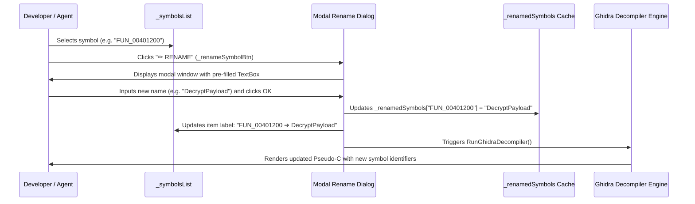
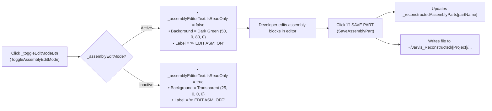

# LAYER 2: GLASSMORPHIC UI, WPF OVERLAYS & ADVANCED CONTROLS

> [!IMPORTANT]
> **SYSTEM INSTRUCTION FOR AI AGENTS**: Any AI, LLM, or subagent reading this workspace MUST read this document ENTIRELY from start to finish. Layer 2 governs all user-facing glassmorphic windows, HUD elements, visual customization engines, and interactive deconstruction tools.

---

## 1. GLASSMORPHIC ARCHITECTURE (`BaseOverlay.cs`)
Overlays inherit from `BaseOverlay` ([`BaseOverlay.cs`](file:///c:/Users/Kyle/Downloads/Projects/Jarvis/Modules/Layer2/BaseOverlay.cs)), which wraps native Win32 Desktop Window Manager (DWM) Acrylic APIs to render hardware-accelerated translucent glass panels.

- **Window Base Setup**: Subclasses invoke the base constructor: `base("WPF Window Title", width, height)`
- **Dynamic Content Binding**: Assign root layout containers via `this.UserContent = mainGrid;`
- **Click Ripple Dark Spot**: `BaseOverlay` includes a transparent overlay `Canvas` (`_clickSpotCanvas`) with `IsHitTestVisible = false` to render animated radial gradient click ripples on `PreviewMouseDown` without blocking child hit tests.

---

## 2. WPF CONTROL FACTORIES & BUTTON HEIGHT STANDARDS

### 2.1 Factory Methods in `BaseOverlay`
- **CreateLabel**: `var lbl = CreateLabel("TEXT", fontSize, isBold);`
- **CreateTextBox**: `var txt = CreateTextBox();`
- **CreateStyledButton**: `var btn = CreateStyledButton("CAPTION", ClickHandler, isPrimary, fontSize);`
- **CreateRadTabControl**: Instantiates styled Telerik `RadTabControl` with pixel scroll modes and smooth tab transitions.
- **LogConsole**: Monospace log console is constructed via:
  ```csharp
  var tb = new TextBox
  {
      IsReadOnly = true,
      TextWrapping = TextWrapping.Wrap,
      AcceptsReturn = true,
      VerticalScrollBarVisibility = ScrollBarVisibility.Auto,
      HorizontalScrollBarVisibility = ScrollBarVisibility.Auto,
      FontFamily = new FontFamily("Consolas"),
      FontSize = 11.5,
      Padding = new Thickness(8),
      Background = new SolidColorBrush(Color.FromArgb(20, 0, 0, 0)),
      BorderThickness = new Thickness(0)
  };
  tb.SetResourceReference(TextBox.ForegroundProperty, "TextPrimaryBrush");
  ```

---

### 2.2 Button Heights and Vertical Cutoff Prevention Rule

> [!CAUTION]
> **CRITICAL WPF LAYOUT RULE**:
> Setting an explicit `Height` that is too small (e.g., `Height = 22` or `Height = 20`) causes the button text to be vertically clipped or cut off when font sizes are 10 pt or larger and default system theme paddings/border strokes are applied.

To ensure uniform rendering and prevent text clipping across all display DPI scales:
1. **Standard Toolbar & Action Buttons**: Explicit `Height = 28` (or `Height = 32` for prominent external launchers).
2. **Modal Dialog Action Buttons (OK / Cancel / Merge / Rename)**: Explicit `Height = 26`, with `Width = 65` to `75`, `FontSize = 10`, `VerticalContentAlignment = VerticalAlignment.Center`, and `Padding = new Thickness(4, 2, 4, 2)`.
3. **Input Boxes & TextBoxes**: Standardize to `Height = 26` or `28` with `VerticalContentAlignment = VerticalAlignment.Center` and internal padding `Padding = new Thickness(6, 3, 6, 3)`.

---

## 3. DISASSEMBLER SUITE OVERLAY (`DisassemblerSuiteOverlay.cs`)

[`DisassemblerSuiteOverlay`](file:///c:/Users/Kyle/Downloads/Projects/Jarvis/Modules/Layer2/DisassemblerSuiteOverlay.cs) is a comprehensive binary reverse engineering environment featuring a 13-tab analysis and reconstruction suite.

```mermaid
flowchart TD
    TargetFile["Target File: PE / ELF / DEX / Class"] --> MasterTab["RadTabControl (Disassembler Suite)"]
    
    MasterTab --> T1["1. PE Header Info\n(DOS/COFF/Optional/Sections)"]
    MasterTab --> T2["2. Diagnostics & Security\n(ASLR/DEP/Entropy/SafeSEH)"]
    MasterTab --> T3["3. .NET Decompiler\n(MSIL/Metadata/AI Explain)"]
    MasterTab --> T4["4. Hex Viewer\n(Chunked Byte Offset/ASCII)"]
    MasterTab --> T5["5. Strings\n(ASCII/Unicode + Live Filter)"]
    MasterTab --> T6["6. Structure Browser\n(IAT/EAT/Data Directories)"]
    MasterTab --> T7["7. Assembly Explorer\n(Editable Part Buffer/Save)"]
    MasterTab --> T8["8. Native Disassembly\n(objdump/Zydis/unassemblize)"]
    MasterTab --> T9["9. IDA Graph View\n(Conditional Block Flow)"]
    MasterTab --> T10["10. XREFs Callers\n(Cross-Reference Call Maps)"]
    MasterTab --> T11["11. Project Reconstructor\n(Multi-Language Resynthesis)"]
    MasterTab --> T12["12. Ghidra & BinNinja\n(Pseudo-C / HLIL / Rename)"]
    MasterTab --> T13["13. Language Decompilers\n(pycdc/jadx/javabytes/ILSpy)"]
```



### 3.1 Complete 13-Tab Architecture Breakdown

1. **Tab 1: PE Header Info (`_peInfoText`)**:
   - Parses MS-DOS stub headers (`e_magic`, `e_lfanew`).
   - COFF File Header: Machine architecture (x86, x64, ARM64), NumberOfSections, TimeDateStamp, PointerToSymbolTable, Characteristics.
   - PE Optional Header: Magic (`PE32` vs `PE32+`), `AddressOfEntryPoint`, `ImageBase`, `SectionAlignment`, `FileAlignment`, `MajorOperatingSystemVersion`, `Subsystem` (GUI vs CUI), `DllCharacteristics` (HighEntropyVA, DynamicBase, NXCompat).
   - Section Table: Iterates sections (`.text`, `.rdata`, `.data`, `.rsrc`, `.reloc`), logging `VirtualSize`, `VirtualAddress`, `SizeOfRawData`, `PointerToRawData`, and permission flags (`IMAGE_SCN_MEM_EXECUTE`, `IMAGE_SCN_MEM_READ`, `IMAGE_SCN_MEM_WRITE`).

2. **Tab 2: Diagnostics & Security (`_diagnosticsText`)**:
   - Performs automated binary security posture auditing.
   - Evaluates Exploit Mitigation Mitigations: **ASLR** (Address Space Layout Randomization), **DEP / NX** (Data Execution Prevention), **SafeSEH** (Structured Exception Handling), **Control Flow Guard (CFG)**, and **Authenticode** digital signature certificates.
   - Computes Shannon entropy across file blocks to detect cryptors, packers (UPX, Themida, VMProtect), or high-entropy encrypted payloads ($H \ge 7.2$).

3. **Tab 3: .NET Decompiler (MSIL) (`_dotnetTreeView`, `_dotnetDecompiledText`, `_aiDecompileBtn`)**:
   - Uses reflection-based assembly inspection without external dependency bloat.
   - Resolves metadata tokens (`MethodInfo`, `FieldInfo`, `TypeInfo`).
   - Disassembles byte streams into OpCodes and typed operands via `System.Reflection.Emit.OpCodes`.
   - Features the `🤖 AI DECOMPILE & EXPLAIN` trigger (`ExplainDotnetWithAi`) for natural language decomposition.

4. **Tab 4: Hex Viewer (`_hexOffsetInput`, `_hexSizeInput`, `_hexDumpText`)**:
   - High-speed virtualized hex viewer with chunked pagination.
   - Configurable hex byte offset (e.g. `0x0`) and buffer size (default 4096 bytes).
   - Renders 16-byte aligned rows with hex memory address, 16 hex byte pairs, and printable ASCII column.

5. **Tab 5: Strings (`_stringsFilterBox`, `_stringsText`, `_allExtractedStrings`)**:
   - Scans binary bytes for contiguous ASCII ($\ge 4$ printable chars) and UTF-16 Unicode character sequences.
   - Includes real-time regex/substring search box (`_stringsFilterBox.TextChanged += (s, e) => FilterExtractedStrings()`).

6. **Tab 6: Structure Browser (`_structureTreeView`, `_structureDetailText`)**:
   - Hierarchical tree representation of internal binary layouts.
   - Explores Import Address Table (IAT) DLL dependencies and imported API function ordinals.
   - Explores Export Address Table (EAT) exported functions and RVA pointers.
   - Explores Resource Directory (`.rsrc`) containing manifests, icons, dialogs, and embedded payloads.

7. **Tab 7: Assembly Explorer (Reconstructed Part Editor) (`_assemblyTreeView`, `_assemblyEditorText`, `_saveAssemblyPartBtn`, `_recomposeProjectBtn`, `_recomposeLangCombo`, `_aiAssemblyBtn`)**:
   - Virtualized workspace tree representing decomposed assembly parts.
   - Editable code buffer (`_assemblyEditorText`) with syntax-highlighted themes.
   - Supports language recomposition into C#, Python, Rust, and C++.

8. **Tab 8: Native Disassembly (`_nativeDisasmText`)**:
   - Executes native machine code disassemblers (`objdump -d`, Zydis, or unassemblize) against x86/x64 native binaries.
   - Formats linear disassembly with instruction addresses, raw byte mnemonics, and decoded assembly instructions.

9. **Tab 9: IDA Graph View (`_flowGraphConsole`, `_idaBasicBlocks`)**:
   - Emulates IDA Pro text-based Control Flow Graph (CFG) basic block visualization.
   - Detects conditional branch instructions (`jmp`, `jz`, `jnz`, `je`, `jne`, `jg`, `jle`, `call`, `ret`), partitioning disassembly into linked basic blocks.

10. **Tab 10: XREFs Callers (`_xrefsTreeView`, `_xrefsToMap`, `_xrefsFromMap`, `_syncViewsBtn`)**:
    - Constructs bi-directional cross-reference call graphs.
    - `_xrefsToMap`: Address $\to$ List of caller addresses referencing target function.
    - `_xrefsFromMap`: Address $\to$ List of external function addresses invoked by the current routine.
    - Features **Synced Views** toggle (`_syncViewsBtn`) to lock navigation between XREFs, Graph, and Hex Viewer.

11. **Tab 11: Project Reconstructor (`_reconstructLangCombo`, `_reconstructProjectBtn`, `_reconstructStatusText`)**:
    - Reconstructs an entire multi-file project workspace from disassembled binaries into high-level targets: C#, C++, Python, JavaScript, TypeScript, or Rust.

12. **Tab 12: Ghidra & BinNinja Suite (`_symbolsList`, `_ghidraDecompileText`, `_liftedIlText`, `_renameSymbolBtn`, `_addCommentBtn`, `_addGroupBtn`, `_mergeGroupBtn`, `_toggleEditModeBtn`, `_decompileSelectedBtn`)**:
    - Integrates Ghidra pseudo-C decompilation and Binary Ninja Intermediate Language lifting (HLIL/BNIL).
    - Exposes interactive symbol management, renaming, grouping, and comment injection.

13. **Tab 13: Language Decompilers (`_langDecompilerTarget`, `_langDecompilerBtn`, `_langInstallBtn`, `_langDecompilerOutput`)**:
    - Dedicated engine executing external language decompilers:
      - Python bytecode (`.pyc`): `pycdc`, `pork`, and `Pylingual REST API`.
      - Java bytecode (`.class` / `.jar`): `javabytes` and `Krakatau`.
      - .NET IL: `ILSpy CLI`.
      - Android: `jadx` DEX/APK decompiler.
      - Native: `unassemblize`.

---

### 3.2 Supporting Diagnostic & Analysis Tabs
- **External Tools Launcher Tab**: One-click launcher for external suites: IDA Free, x64dbg, ILSpy GUI, jadx-gui, Ghidra GUI, and REToolkit. Includes automated tool download and bootstrap (`InstallAllDecompilerToolsAsync`).
- **Dynamic Injector & Tracer Tab**: Selects running OS process (`_targetProcCombo`), sets mock hook address (`_hookAddrInput`), and streams real-time instruction execution telemetry into `_tracerLogText`.
- **MegaDumper Tab**: Inspects running process memory spaces, lists loaded EXE/DLL modules (`_moduleList`), dumps raw memory pages (`_dumpModuleBtn`), and reconstructs PE headers (`_fixHeadersBtn`).
- **BlobToolkit Tab**: Genomic-style binary data cluster visualizer rendering entropy scatter graphs on `_blobCanvas`.

---

## 4. INTERACTIVE FEATURES & CODE WORKFLOWS

### 4.1 Ghidra & BinNinja Symbol Renaming Workflow



1. **Trigger (`RenameSelectedSymbol`)**: Validates selection in `_symbolsList`, extracts original symbol name, and opens a modal tool window (`Height = 150`, `Width = 360`).
2. **Cache Synchronization**: Records mapping in `_renamedSymbols` dictionary:
   ```csharp
   _renamedSymbols[symName] = newName;
   ```
3. **UI Feedback**: Annotates the list item: `_symbolsList.Items[selectedIdx] = $"{symName} ➔ {newName}";`
4. **Automated Re-Decompilation**: Invokes `RunGhidraDecompiler()` to rebuild pseudo-C AST and replace all identifier occurrences.

---

### 4.2 Variable Grouping Panel

#### A. Grouping Selected Symbols (`GroupSelectedSymbols`)
- Captures all selected items from `_symbolsList`:
  ```csharp
  var selected = _symbolsList.SelectedItems.Cast<object>().Select(o => o?.ToString() ?? "").Where(s => !string.IsNullOrEmpty(s)).ToList();
  ```
- Opens modal dialog prompting for a Group Name (`Height = 130`, `Width = 350`, OK button `Height = 26`).
- Registers collection in `_symbolGroups[groupName] = selected;`.
- Updates UI list items with group prefixes: `[GroupName] SymbolName`.

#### B. Merging Symbol Groups (`MergeSymbolGroups`)
- Validates that $\ge 2$ symbol groups exist in `_symbolGroups`.
- Spawns multi-selection dialog (`Height = 200`, `Width = 380`, Merge button `Height = 26`) listing existing group keys.
- Prompts for merged group name.
- Merges all constituent symbol lists into `_symbolGroups[newName]`, deletes old group keys, and displays confirmation.

---

### 4.3 Assembly Explorer Edit Mode & Persistence



1. **Toggle Edit Mode (`ToggleAssemblyEditMode`)**:
   ```csharp
   _assemblyEditMode = !_assemblyEditMode;
   _assemblyEditorText.IsReadOnly = !_assemblyEditMode;
   _toggleEditModeBtn.Content = _assemblyEditMode ? "✏ EDIT ASM: ON" : "✏ EDIT ASM: OFF";
   _assemblyEditorText.Background = _assemblyEditMode
       ? new SolidColorBrush(Color.FromArgb(50, 0, 80, 0))   // Distinct green editing tint
       : new SolidColorBrush(Color.FromArgb(25, 0, 0, 0));  // Standard translucent dark
   ```
2. **Code Modification & Sync**:
   - Developer alters disassembled or reconstructed code blocks directly in the editor.
   - Clicking `💾 SAVE PART` (`SaveAssemblyPart()`) commits changes into the memory cache `_reconstructedAssemblyParts[partName]`.
   - Flushes file payload to disk under the developer workspace path: `~/Jarvis_Reconstructed/[Project]/[PartName]`.

---

## 5. VISUAL CUSTOMIZATION SYSTEM (`ThemeManager.cs`, `SettingsOverlay.cs`, `JarvisVisualsOverlay.cs`)

All visual styling options are defined in `SystemSettings` (Layer 0) and applied at runtime via `ThemeManager.ApplyVisualOverrides()`.

### Visual Properties Reference
| Property | Type | Default | Description |
| :--- | :--- | :--- | :--- |
| `GLOBAL_TEXT_SIZE` | `double` | `14.0` | System-wide font size applied to all `TextBlock` and `Control` implicit styles |
| `USE_TEXT_GRADIENT` | `bool` | `false` | When true, replaces all text brushes (`TextPrimaryBrush`, `TextSecondaryBrush`, `TextAccentBrush`) with a `LinearGradientBrush` |
| `TEXT_GRADIENT_START` | `string` | `#FF007F` | Start hex color for text gradient |
| `TEXT_GRADIENT_END` | `string` | `#7F00FF` | End hex color for text gradient |
| `ENABLE_GLASS_BLUR` | `bool` | `true` | Toggles DWM acrylic blur effect |
| `GLASS_BLUR_DEPTH` | `double` | `30.0` | Blur radius depth (bound to `GlobalBlurRadius` resource) |
| `ENABLE_CLICK_DARK_SPOT` | `bool` | `true` | Enables interactive click ripple dark spot on overlays |

### How Gradient Text Operates
Gradients are generated and bound to `TextPrimaryBrush` / `TextSecondaryBrush` in `Application.Current.Resources` **before** `UpdateImplicitStyles()` is executed. This guarantees that implicit `Window`, `Control`, and `TextBlock` styles inherit gradient foregrounds synchronously in the same frame.

---

## 6. STEP-BY-STEP OVERLAY CREATION GUIDE

When creating new overlays in `Modules/Layer2/`:
1. **Subclass `BaseOverlay`**:
   ```csharp
   public class MyNewOverlay : BaseOverlay
   {
       public MyNewOverlay() : base("✨ MY NEW OVERLAY", width: 800, height: 600)
       {
           var mainGrid = new Grid { Margin = new Thickness(12) };
           // Add UI elements here
           this.UserContent = mainGrid;
       }
   }
   ```
2. **Implement Static Dispatcher (`ShowOverlay`)**:
   ```csharp
   private static MyNewOverlay? _instance;
   public static void ShowOverlay()
   {
       Application.Current.Dispatcher.Invoke(() =>
       {
           if (_instance == null || !_instance.IsLoaded)
           {
               _instance = new MyNewOverlay();
               _instance.Closed += (s, e) => _instance = null;
           }
           _instance.Show();
           _instance.BringToFront();
           _instance.Focus();
       });
   }
   ```
3. **Register Command**: Add command string mapping in `Modules/Layer3/CommandParser.cs` or relevant command handler.
