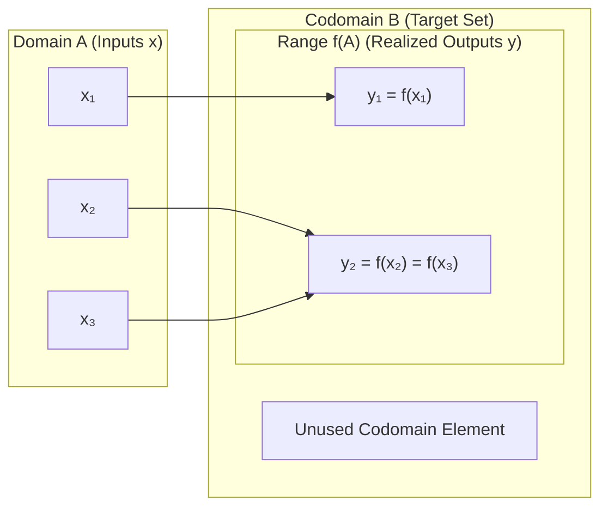
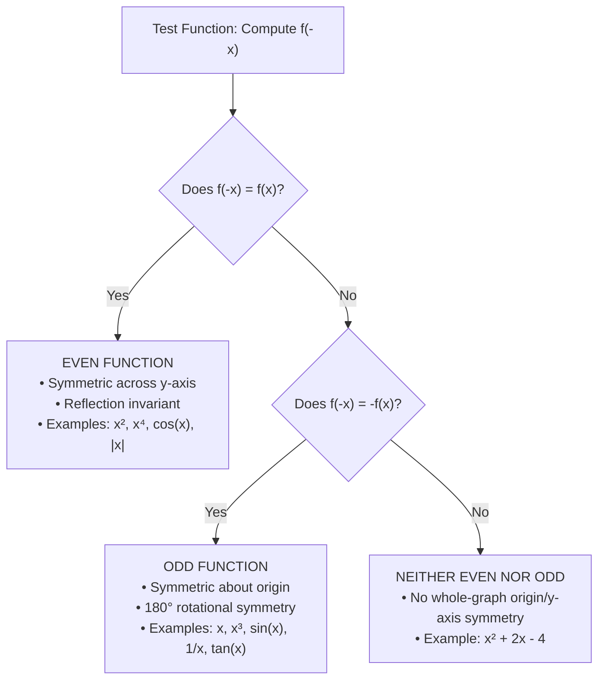

# JARVIS MATHEMATICAL REFERENCE - FUNCTIONS, CHANGE, AND MANUAL GRAPHING

> [!IMPORTANT]
> **SYSTEM INSTRUCTION FOR AI AGENTS**: Any AI, LLM, or subagent reading this workspace MUST read this document ENTIRELY from start to finish. Do NOT summarize, skip, or omit any formulas, rules, expansions, or examples. This reference provides the exact mathematical foundations required across Jarvis algorithmic, signal processing, and analytical modules.

---

## 1. FORMAL FUNCTION DEFINITIONS, DOMAIN, AND RANGE

### 1.1 Formal Definition of a Function
A **function** $f$ from a set $A$ (the domain) into a set $B$ (the codomain), denoted formally as:
$$f: A \to B$$
is a binary relation or mapping that assigns to **each** element $x \in A$ exactly **one** unique element $y \in B$.
- **Notation**: $y = f(x)$, where $x$ is the input argument and $y$ is the evaluated value.
- **Independent Variable**: The symbol $x$ representing arbitrary input values chosen from the domain set $A$.
- **Dependent Variable**: The symbol $y$ representing output values in $B$ whose values depend upon $x$ via the rule $f$.



### 1.2 Domain vs. Codomain vs. Range
1. **Domain ($A$ or $\text{dom}(f)$)**:
   The complete set of all admissible input values for which the function rule $f(x)$ is mathematically defined and produces a real number output ($f(x) \in \mathbb{R}$).
2. **Codomain ($B$)**:
   The declared target set containing all potential output values. By convention in standard calculus, $B = \mathbb{R}$.
3. **Range (or Image, $\text{range}(f) = f(A) \subseteq B$)**:
   The actual set of all realized output values generated by evaluating $f$ over every element of $A$:
   $$\text{range}(f) = \{ y \in B \mid \exists x \in A \text{ such that } y = f(x) \}$$
   The range is always a subset of the codomain ($\text{range}(f) \subseteq B$) and is not necessarily equal to the entire codomain.

---

## 2. THE IMPLICIT DOMAIN CONVENTION

> [!NOTE]
> **Implicit Domain Rule**:
> *"If the domain of a function is not explicitly given, we will assume the domain is the set of all real numbers that make sense in the context of the function's definition."*

When determining the natural or implicit domain $\text{dom}(f) \subseteq \mathbb{R}$, exclude any real numbers $x$ that violate algebraic rules:

| Condition / Construction | Algebraic Restriction | Domain Constraint | Example |
| :--- | :--- | :--- | :--- |
| **Fraction / Rational** $\frac{P(x)}{Q(x)}$ | Division by zero is undefined | $Q(x) \neq 0$ | $f(x) = \frac{1}{x-3} \implies x \neq 3$ |
| **Even Root** $\sqrt[2k]{g(x)}$ ($k \in \mathbb{Z}^+$) | Radicand must be non-negative | $g(x) \ge 0$ | $f(x) = \sqrt{4-x^2} \implies x \in [-2, 2]$ |
| **Odd Root** $\sqrt[2k+1]{g(x)}$ ($k \in \mathbb{Z}^+$) | Defined for all real numbers | $g(x) \in \mathbb{R}$ | $f(x) = \sqrt[3]{x-5} \implies x \in (-\infty, \infty)$ |
| **Logarithm** $\log_b(g(x))$ | Argument must be strictly positive | $g(x) > 0$ | $f(x) = \ln(x+2) \implies x > -2$ |
| **Physical Context** (e.g. price, time, length) | Quantities cannot be negative | $x \ge 0$ | $p(x) \text{ where } x \text{ is price} \implies x \ge 0$ |

---

## 3. WORKED EXAMPLES: DOMAIN, RANGE, AND EVALUATION

### Example 3.1: Rational Function Analysis
Let $f(x) = \frac{1}{1-x}$.

1. **Evaluate $f\left(\frac{1}{2}\right)$**:
   $$f\left(\frac{1}{2}\right) = \frac{1}{1 - \frac{1}{2}} = \frac{1}{\frac{1}{2}} = 2$$

2. **Find $x$-values for which $f(x) = -5$**:
   $$\frac{1}{1-x} = -5 \implies 1 = -5(1-x) \implies 1 = -5 + 5x \implies 5x = 6 \implies x = \frac{6}{5}$$

3. **Determine the Domain**:
   Denominator cannot equal zero: $1 - x \neq 0 \implies x \neq 1$.
   $$\text{Domain} = \{x \in \mathbb{R} \mid x \neq 1\} = (-\infty, 1) \cup (1, \infty)$$

4. **Determine the Range**:
   Set $y = \frac{1}{1-x}$ and solve for $x$ in terms of $y$:
   $$y(1-x) = 1 \implies 1-x = \frac{1}{y} \implies x = 1 - \frac{1}{y}$$
   For $x$ to be real, $y \neq 0$. Thus, $y$ can take any real value except $0$.
   $$\text{Range} = \{y \in \mathbb{R} \mid y \neq 0\} = (-\infty, 0) \cup (0, \infty)$$

---

### Example 3.2: Quadratic Revenue / Profit Function
Fred manufactures and sells widgets (*Whatchies*) for $x$ dollars each. The net profit per widget is modeled by:
$$p(x) = x^2 + 2x - 4$$

1. **Domain of $p$**:
   Since $x$ represents unit sale price in dollars, $x$ cannot be negative:
   $$\text{Domain}(p) = [0, \infty)$$

2. **Range of $p$ (by Completing the Square)**:
   Rewrite $p(x)$ into vertex form:
   $$p(x) = (x^2 + 2x + 1) - 1 - 4 = (x + 1)^2 - 5$$
   For all $x \in \mathbb{R}$, $(x+1)^2 \ge 0$, which gives a theoretical minimum of $-5$ at $x = -1$.
   However, on the restricted domain $x \ge 0$:
   $$x \ge 0 \implies x + 1 \ge 1 \implies (x + 1)^2 \ge 1^2 = 1$$
   $$p(x) = (x+1)^2 - 5 \ge 1 - 5 = -4$$
   At $x = 0$, $p(0) = -4$. As $x \to \infty$, $p(x) \to \infty$.
   $$\text{Practical Range} = [-4, \infty)$$

3. **Evaluate and Simplify $p(x+1)$**:
   Substitute $(x+1)$ for every occurrence of $x$:
   $$p(x+1) = (x+1)^2 + 2(x+1) - 4 = (x^2 + 2x + 1) + (2x + 2) - 4 = x^2 + 4x - 1$$
   *Economic Interpretation*: $p(x+1)$ represents the profit per Whatchie if Fred increases the unit price by $\$1.00$.

4. **Calculate Change in Profit when Price Increases by $\$1$**:
   $$\Delta p = p(x+1) - p(x) = (x^2 + 4x - 1) - (x^2 + 2x - 4) = x^2 - x^2 + 4x - 2x - 1 + 4 = 2x + 3$$
   *Conclusion*: Raising price by $\$1$ increases profit per unit by $\$ (2x + 3)$.

---

## 4. CALCULATING CHANGE: $\Delta x$, $\Delta y$, AND THE DIFFERENCE QUOTIENT

### 4.1 Fundamental Formulas of Change
When an independent input variable transitions from an initial value $x_{\text{old}}$ to a new value $x_{\text{new}}$:
1. **Change in Input ($\Delta x$)**:
   $$\Delta x = x_{\text{new}} - x_{\text{old}} \quad \iff \quad x_{\text{new}} = x_{\text{old}} + \Delta x$$
   *(Often written interchangeably with $h = \Delta x$)*.

2. **Change in Output ($\Delta y$)**:
   $$\Delta y = y_{\text{new}} - y_{\text{old}} = f(x_{\text{new}}) - f(x_{\text{old}}) = f(x + \Delta x) - f(x)$$

3. **Average Rate of Change (Difference Quotient $\frac{\Delta y}{\Delta x}$)**:
   $$\frac{\Delta y}{\Delta x} = \frac{f(x + \Delta x) - f(x)}{\Delta x} \quad (\text{for } \Delta x \neq 0)$$

---

### 4.2 Detailed Expansion 1: Cubic Polynomial $g(x) = x^3 - 2x$
We calculate the exact change $\Delta y = g(x + \Delta x) - g(x)$:

- **Step 1: Set up the functional difference**:
  $$\Delta y = \left[ (x + \Delta x)^3 - 2(x + \Delta x) \right] - \left[ x^3 - 2x \right]$$

- **Step 2: Expand the binomial cubic term $(x + \Delta x)^3$**:
  $$(x + \Delta x)^3 = x^3 + 3x^2\Delta x + 3x(\Delta x)^2 + (\Delta x)^3$$

- **Step 3: Distribute the linear coefficient $-2$**:
  $$-2(x + \Delta x) = -2x - 2\Delta x$$

- **Step 4: Combine all terms in $g(x + \Delta x)$**:
  $$g(x + \Delta x) = x^3 + 3x^2\Delta x + 3x(\Delta x)^2 + (\Delta x)^3 - 2x - 2\Delta x$$

- **Step 5: Subtract $g(x) = x^3 - 2x$ and eliminate common terms**:
  $$\Delta y = \left( \mathbf{x^3} + 3x^2\Delta x + 3x(\Delta x)^2 + (\Delta x)^3 \mathbf{- 2x} - 2\Delta x \right) - \left( \mathbf{x^3 - 2x} \right)$$
  $$\Delta y = 3x^2\Delta x + 3x(\Delta x)^2 + (\Delta x)^3 - 2\Delta x$$

- **Step 6: Factored Form**:
  $$\Delta y = \Delta x \cdot \left( 3x^2 + 3x\Delta x + (\Delta x)^2 - 2 \right)$$

- **Step 7: Compute the Difference Quotient $\frac{\Delta y}{\Delta x}$**:
  $$\frac{\Delta y}{\Delta x} = \frac{\Delta x \cdot \left( 3x^2 + 3x\Delta x + (\Delta x)^2 - 2 \right)}{\Delta x} = 3x^2 + 3x\Delta x + (\Delta x)^2 - 2 \quad (\Delta x \neq 0)$$

---

### 4.3 Detailed Expansion 2: Rational Function $f(x) = \frac{1}{x}$
We compute both $\Delta y$ and $\frac{\Delta y}{\Delta x}$ step-by-step:

- **Step 1: Set up the functional difference**:
  $$\Delta y = f(x + \Delta x) - f(x) = \frac{1}{x + \Delta x} - \frac{1}{x}$$

- **Step 2: Find the common denominator $x(x + \Delta x)$**:
  $$\Delta y = \frac{1 \cdot x}{(x + \Delta x) \cdot x} - \frac{1 \cdot (x + \Delta x)}{x \cdot (x + \Delta x)} = \frac{x - (x + \Delta x)}{x(x + \Delta x)}$$

- **Step 3: Distribute the negative sign in the numerator**:
  $$x - (x + \Delta x) = x - x - \Delta x = -\Delta x$$

- **Step 4: Final Simplified Expression for $\Delta y$**:
  $$\Delta y = \frac{-\Delta x}{x(x + \Delta x)}$$

- **Step 5: Compute the Difference Quotient $\frac{\Delta y}{\Delta x}$**:
  $$\frac{\Delta y}{\Delta x} = \frac{1}{\Delta x} \cdot \Delta y = \frac{1}{\Delta x} \cdot \left( \frac{-\Delta x}{x(x + \Delta x)} \right)$$
  $$\frac{\Delta y}{\Delta x} = \frac{-\mathbf{\Delta x}}{\mathbf{\Delta x} \cdot x(x + \Delta x)} = \frac{-1}{x(x + \Delta x)} \quad (\text{for } \Delta x \neq 0)$$

---

## 5. GRAPHING WITHOUT A CALCULATOR: COMPLETE SYSTEMATIC GUIDE

### 5.1 Checklist of Fundamental Parent Functions
Every AI agent must know the qualitative shape, domain, range, intercepts, and critical features of these parent functions by hand:

```
      Linear: y = mx + b             Quadratic: y = x²                Cubic: y = x³
             y                              y                              y
             |   /                          |  |   |                       |    /
             |  /                           |  \   /                       |   /
        -----+-----> x                 -----+----\ /-----> x          -----+--/--> x
            /|                             |      V                       /|
           / |                             |                             / |

      Square Root: y = √x            Absolute Value: y = |x|         Reciprocal: y = 1/x
             y                              y                              y
             |   _--¯¯                      | \   /                        |  |
             | .¯                           |  \ /                         |  +---
        -----+---------> x             -----+---V--------> x          -----+---------> x
             |                              |                        ---|  |
             |                              |                           |  |
```

1. **Linear ($y = mx + b$)**:
   - Continuous straight line with slope $m = \frac{\Delta y}{\Delta x}$.
   - $y$-intercept at $(0, b)$; $x$-intercept at $\left(-\frac{b}{m}, 0\right)$ (for $m \neq 0$).
2. **Power Functions ($y = x^n$)**:
   - **Even $n$ ($n = 2, 4, 6, \dots$)**: Parabolic U-shape, symmetric across $y$-axis (even function), vertex at $(0,0)$, range $[0, \infty)$.
   - **Odd $n$ ($n = 1, 3, 5, \dots$)**: Inflected S-shape, symmetric about the origin (odd function), range $(-\infty, \infty)$, passes through $(-1, -1), (0,0), (1,1)$.
3. **Square Root ($y = \sqrt{x}$)**:
   - Domain $[0, \infty)$, range $[0, \infty)$. Upper half of horizontal parabola $x = y^2$.
4. **Absolute Value ($y = |x| = \begin{cases} x & x \ge 0 \\ -x & x < 0 \end{cases}$)**:
   - V-shape with sharp corner (non-differentiable cusp) at $(0,0)$. Slope $+1$ for $x > 0$, slope $-1$ for $x < 0$.
5. **Trigonometric Functions**:
   - **$y = \sin x$**: Wave passing through $(0,0)$, bounded range $[-1, 1]$, period $2\pi$, odd symmetry ($\sin(-x) = -\sin x$).
   - **$y = \cos x$**: Wave passing through $(0,1)$ (peak), bounded range $[-1, 1]$, period $2\pi$, even symmetry ($\cos(-x) = \cos x$).
   - **$y = \tan x = \frac{\sin x}{\cos x}$**: Periodic inflected branches with period $\pi$, vertical asymptotes at $x = \frac{\pi}{2} + k\pi$ ($k \in \mathbb{Z}$), passes through $(0,0)$, range $(-\infty, \infty)$.

---

### 5.2 Polynomials of Degree $n$: Shape & End Behavior
A polynomial of degree $n$:
$$P(x) = a_n x^n + a_{n-1} x^{n-1} + \dots + a_1 x + a_0 \quad (a_n \neq 0)$$

1. **End Behavior (Leading Term Test)**:
   As $x \to \pm\infty$, the graph behaves identically to the leading monomial term $y = a_n x^n$:
   - **$n$ Even, $a_n > 0$**: Both tails point UP ($\lim_{x \to \pm\infty} P(x) = +\infty$).
   - **$n$ Even, $a_n < 0$**: Both tails point DOWN ($\lim_{x \to \pm\infty} P(x) = -\infty$).
   - **$n$ Odd, $a_n > 0$**: Left tail points DOWN, right tail points UP ($\lim_{x \to -\infty} P(x) = -\infty, \lim_{x \to +\infty} P(x) = +\infty$).
   - **$n$ Odd, $a_n < 0$**: Left tail points UP, right tail points DOWN ($\lim_{x \to -\infty} P(x) = +\infty, \lim_{x \to +\infty} P(x) = -\infty$).

2. **Turning Points and Roots**:
   - A polynomial of degree $n$ has at most $n$ real roots ($x$-intercepts).
   - A polynomial of degree $n$ has at most $n-1$ local extrema (turning points).

3. **Multiplicity of Roots ($x - r)^k$**:
   - **Odd Multiplicity ($k = 1, 3, \dots$)**: Graph **crosses** the $x$-axis at $x = r$. (If $k \ge 3$, it flattens into an inflection point at the crossing).
   - **Even Multiplicity ($k = 2, 4, \dots$)**: Graph **touches and turns around (bounces)** at $x = r$ without crossing the axis.

---

### 5.3 Intercepts
1. **$y$-intercept**:
   Set $x = 0$ and evaluate $y = f(0)$. A function has at most one $y$-intercept $(0, f(0))$.
2. **$x$-intercepts**:
   Set $y = 0$ and solve the equation $f(x) = 0$ for real roots $x_1, x_2, \dots$.

---

### 5.4 Transformations: Translations, Scaling, and Flips
Given parent function $y = f(x)$, any transformed function $y = a \cdot f(b(x - c)) + d$ is graphed systematically via:

| Transformation | Equation | Geometric Effect | Operation on Coordinates $(x, y)$ |
| :--- | :--- | :--- | :--- |
| **Vertical Shift** | $y = f(x) + d$ | Shift UP by $d$ (if $d > 0$) or DOWN by $\|d\|$ (if $d < 0$) | $(x, y) \to (x, y + d)$ |
| **Horizontal Shift** | $y = f(x - c)$ | Shift RIGHT by $c$ (if $c > 0$) or LEFT by $\|c\|$ (if $c < 0$) | $(x, y) \to (x + c, y)$ |
| **Vertical Reflection (Flip)** | $y = -f(x)$ | Reflect across the **$x$-axis** | $(x, y) \to (x, -y)$ |
| **Horizontal Reflection (Flip)**| $y = f(-x)$ | Reflect across the **$y$-axis** | $(x, y) \to (-x, y)$ |
| **Vertical Stretch / Compress**| $y = a \cdot f(x)$ | Vertical stretch by factor $\|a\|$ (if $\|a\| > 1$), compress (if $0 < \|a\| < 1$) | $(x, y) \to (x, a \cdot y)$ |
| **Horizontal Compress / Stretch**| $y = f(k \cdot x)$ | Horizontal compress by factor $\frac{1}{k}$ (if $\|k\| > 1$), stretch (if $0 < \|k\| < 1$) | $(x, y) \to \left(\frac{x}{k}, y\right)$ |

---

### 5.5 Worked Graphing Example: $y = (x + 1)^2 - 3$
To manually sketch $y = (x + 1)^2 - 3$ without a calculator:

1. **Identify Parent Function**:
   $f(x) = x^2$ (standard upward parabola with vertex at $(0,0)$).

2. **Apply Horizontal Translation**:
   $x \to x + 1 = x - (-1) \implies$ Shift the parabola **LEFT by 1 unit**. Vertex is now at $(-1, 0)$.

3. **Apply Vertical Translation**:
   Subtract $3 \implies$ Shift the parabola **DOWN by 3 units**. Vertex is now at $(-1, -3)$.

4. **Calculate Intercepts**:
   - **$y$-intercept** ($x = 0$):
     $$y = (0 + 1)^2 - 3 = 1 - 3 = -2 \implies (0, -2)$$
   - **$x$-intercepts** ($y = 0$):
     $$(x + 1)^2 - 3 = 0 \implies (x + 1)^2 = 3 \implies x + 1 = \pm\sqrt{3} \implies x = -1 \pm \sqrt{3}$$
     Since $\sqrt{3} \approx 1.732$:
     $$x_1 = -1 + 1.732 = 0.732 \implies (0.732, 0)$$
     $$x_2 = -1 - 1.732 = -2.732 \implies (-2.732, 0)$$

5. **Symmetry Axis**:
   Vertical line $x = -1$. Plot symmetric point to $y$-intercept $(0, -2)$ across $x = -1$, yielding $(-2, -2)$.

```
                           y
                           |
                        ---|--- (x = -1 + √3 ≈ 0.732)
                       /   |   \
        --------------+----+----+-------------> x
        (x = -2.732) /     |     \
                    |      + (0, -2)
             (-2,-2)+      |
                     \     |
                      \    |
                       \---+--- (-1, -3) [Vertex]
                           |
```

---

### 5.6 Symmetry: Even vs. Odd Functions



1. **Even Function**:
   $$f(-x) = f(x) \quad \forall x \in \text{dom}(f)$$
   - **Geometric Property**: Symmetric with respect to the **$y$-axis**. If $(x, y)$ is on the graph, $(-x, y)$ is also on the graph.
   - **Examples**: $f(x) = x^2, x^4, \cos(x), |x|, x^2 + 5$.

2. **Odd Function**:
   $$f(-x) = -f(x) \quad \forall x \in \text{dom}(f)$$
   - **Geometric Property**: Symmetric with respect to the **origin** ($180^\circ$ rotational symmetry). If $(x, y)$ is on the graph, $(-x, -y)$ is also on the graph.
   - **Examples**: $f(x) = x, x^3, \sin(x), \frac{1}{x}, \tan(x), x^3 - 2x$.

---

### 5.7 Rational Function Asymptotes
For a rational function $R(x) = \frac{P(x)}{Q(x)} = \frac{a_n x^n + a_{n-1} x^{n-1} + \dots + a_0}{b_m x^m + b_{m-1} x^{m-1} + \dots + b_0}$ in lowest reduced terms:

1. **Vertical Asymptotes (VA)**:
   - Set the denominator equal to zero: $Q(x) = 0$.
   - If $x = c$ makes $Q(c) = 0$ and $P(c) \neq 0$, then $x = c$ is a **Vertical Asymptote**.
   - As $x \to c^+$ or $x \to c^-$, $R(x) \to \pm\infty$.
   - *(Note: If both $P(c) = 0$ and $Q(c) = 0$, factor out $(x - c)$ to reveal a removable discontinuity / hole).*

2. **Horizontal Asymptotes (HA)**:
   Determined by comparing the numerator degree $n$ with denominator degree $m$ as $x \to \pm\infty$:
   - **Case 1 ($n < m$)**: Numerator degree strictly less than denominator degree.
     $$\text{Horizontal Asymptote at } y = 0 \quad (\text{the } x\text{-axis})$$
     *Example*: $R(x) = \frac{3x + 1}{x^2 - 4} \implies \text{HA: } y = 0$.
   - **Case 2 ($n = m$)**: Numerator degree equals denominator degree.
     $$\text{Horizontal Asymptote at } y = \frac{a_n}{b_m} \quad (\text{ratio of leading coefficients})$$
     *Example*: $R(x) = \frac{4x^2 - 1}{2x^2 + 3} \implies \text{HA: } y = \frac{4}{2} = 2$.
   - **Case 3 ($n > m$)**: Numerator degree strictly greater than denominator degree.
     $$\text{No Horizontal Asymptote} \quad (\lim_{x \to \pm\infty} R(x) = \pm\infty)$$
     *(If $n = m + 1$, perform polynomial long division to find the **Slant / Oblique Asymptote** $y = mx + b$).*
