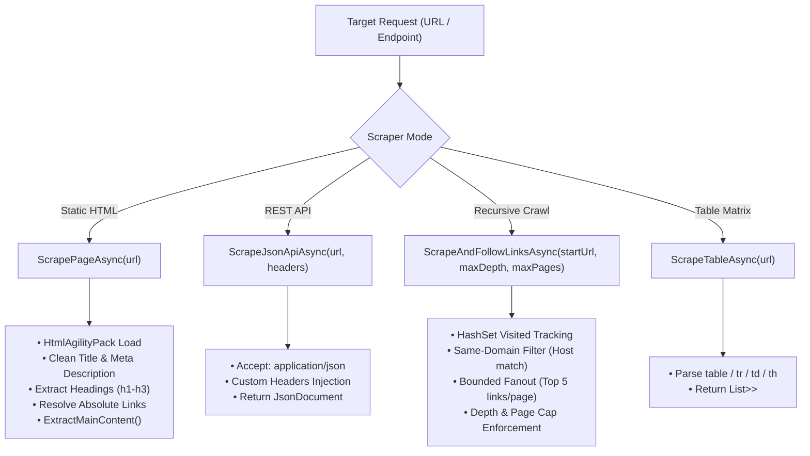
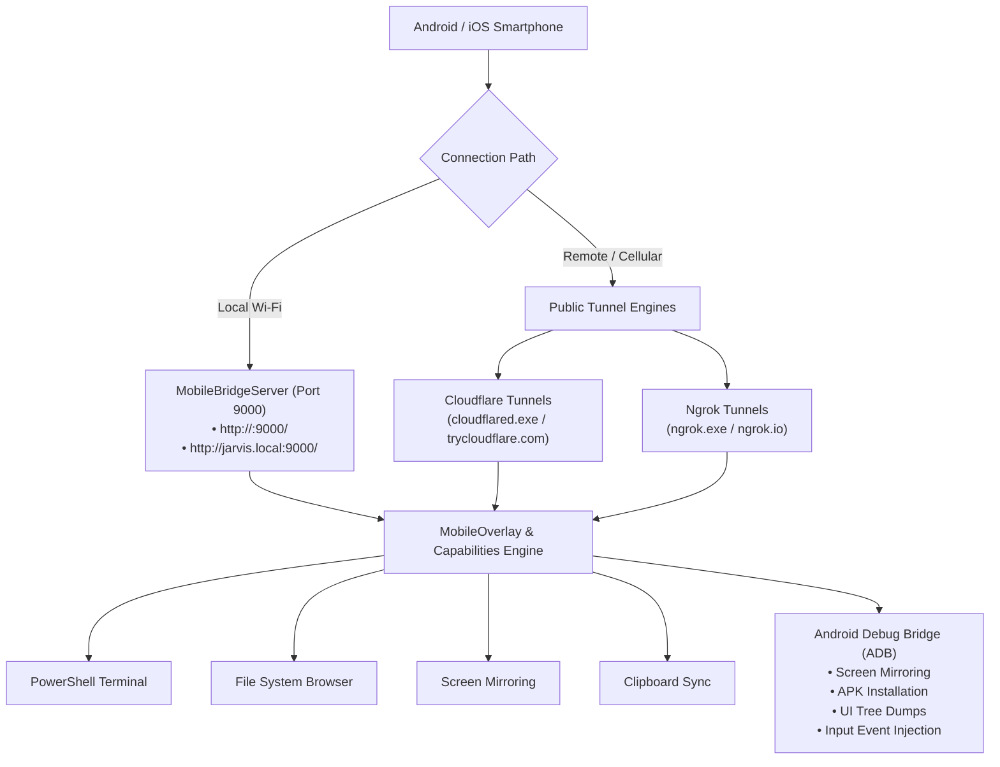

# WEB SCRAPING, DEVICE MANAGEMENT & TUNNEL SUBSYSTEMS

> [!IMPORTANT]
> **SYSTEM INSTRUCTION FOR AI AGENTS**: Any AI, LLM, or subagent reading this workspace MUST read this document ENTIRELY from start to finish. This document specifies web extraction pipelines, Chrome DevTools Protocol automation, Android Debug Bridge (ADB) controls, and mobile bridge server tunnels.

---

## 1. ADVANCED WEB SCRAPING ENGINE (`WebScraperManager.cs`)

[`WebScraperManager`](file:///c:/Users/Kyle/Downloads/Projects/Jarvis/Modules/Layer0/WebScraperManager.cs) is a self-contained Layer 0 web scraping engine utilizing `HtmlAgilityPack` and `System.Text.Json`.

### 1.1 `WebScraperManager` API Reference

#### 1. `ScrapePageAsync(string url) -> Task<ScrapeResult>`
Fetches static and server-rendered HTML pages, sanitizes DOM structures, and returns structured page metadata:
- **Protocol Enforcement**: Automatically prepends `https://` if protocol scheme is omitted.
- **Client Emulation**: Dispatches standard browser headers (`User-Agent: Mozilla/5.0 ... JarvisLauncher/2.0`, `Accept-Language`, `Accept: text/html...`).
- **Metadata Extraction**:
  - Title: Extracts and cleans `//title`.
  - Description: Evaluates `//meta[@name='description']` and OpenGraph `//meta[@property='og:description']`.
  - Headings: Extracts up to 25 `<h1>`, `<h2>`, and `<h3>` tags.
  - Links: Parses up to 60 valid hyperlinks (`//a[@href]`), converts relative paths (`/page`) to fully-qualified absolute URIs, and filters out anchors (`#`) and `javascript:` scripts.
  - Main Content: Executes `ExtractMainContent` algorithm.

#### 2. `ScrapeJsonApiAsync(string url, Dictionary<string, string>? headers = null) -> Task<JsonDocument?>`
Interrogates REST endpoints returning raw JSON:
- Adds `Accept: application/json`.
- Injects optional authentication, cookies, or custom headers without validation errors.
- Parses response stream directly into a memory-efficient `System.Text.Json.JsonDocument`.

#### 3. `ScrapeAndFollowLinksAsync(string startUrl, int maxDepth = 2, int maxPages = 20) -> Task<List<ScrapeResult>>`
Recursive web crawler engineered with cycle prevention and resource safeguards:
- **Cycle Prevention**: Maintains an ordinal case-insensitive `HashSet<string> visited` collection.
- **Domain Confinement**: Enforces strict same-host boundaries (`childUri.Host == baseUri.Host`) to prevent accidental third-party crawling.
- **Fanout Bounds**: Caps branch discovery to 5 child links per page to avoid exponential explosion.
- **Depth & Page Limits**: Strictly enforces `maxDepth` and `maxPages` cutoffs.

#### 4. `ExtractMainContent(string html) -> string`
Readability-style content distillation heuristic:
- **Noise Elimination**: Strips layout and interactive tags (`//script`, `//style`, `//nav`, `//header`, `//footer`, `//aside`, `//form`, `//noscript`, `//iframe`) and classes (`nav`, `menu`, `sidebar`, `ad`, `cookie`, `popup`).
- **Semantic Scored Containers**: Evaluates candidate nodes (`//article`, `//main`, `//*[contains(@class,'content')]`, `//*[contains(@class,'post')]`, `//*[contains(@id,'content')]`).
- Selects the container with the largest character count exceeding 200 characters.
- **Fallback**: Falls back to sanitized `//body` or document inner text.
- **Text Cleansing**: Decodes HTML entities (`System.Net.WebUtility.HtmlDecode`) and collapses multi-line whitespace into clean prose.

#### 5. `ScrapeTableAsync(string url) -> Task<List<List<List<string>>>>`
Scrapes all HTML tables within a page into a 3D matrix structure:
- Level 1: List of Tables on page.
- Level 2: List of Rows (`<tr>`) per table.
- Level 3: List of Cells (`<td>` / `<th>`) per row.

#### 6. `FormatReport(ScrapeResult r) -> string`
Produces an aligned ASCII report containing summary headers, discovered heading outlines, target hyperlink tables, and formatted main content body.

---

## 2. MOBILE COMPANION & ANDROID ADB INTEGRATION

Jarvis provides end-to-end smartphone connectivity through the Mobile Bridge Server, Public Tunnels, QR Code pairing, and Android Debug Bridge (ADB) automation.

### 2.1 Mobile Bridge Server Architecture (`MobileBridgeServer.cs`)
[`MobileBridgeServer`](file:///c:/Users/Kyle/Downloads/Projects/Jarvis/Modules/Layer1/MobileBridgeServer.cs) provides a high-performance, permission-independent HTTP server built directly on `System.Net.Sockets.TcpListener`.

- **Dual-Stack Socket Support**: Socket configured with `SocketOptionName.ReuseAddress = true` listening across IPv4 and IPv6 interfaces.
- **Local Endpoints**:
  - `ServerUrl`: `http://{GetLocalIPAddress()}:{Port}/` (e.g. `http://192.168.1.150:9000/`)
  - `JarvisDomain`: `http://jarvis.local:{Port}/`
  - `HostnameDomain`: `http://{MachineName}.local:{Port}/`
- **Configurable Port**: Defaults to port `9000`, adjustable dynamically via `SettingsManager.Current.MOBILE_PORT`.
- **Firewall & Permissions Repair (`FixFirewallPermissionsAsync`)**: Automatically provisions Windows Firewall inbound rules for the configured port via PowerShell/netsh scripts.

---

### 2.2 Public Tunnels Support (`CloudflareTunnelManager.cs` & `NgrokTunnelManager.cs`)

When the phone is outside the local Wi-Fi network, Jarvis exposes its mobile interface via secure SSL encrypted public tunnels:

#### 1. Cloudflare Tunnels ([`CloudflareTunnelManager.cs`](file:///c:/Users/Kyle/Downloads/Projects/Jarvis/Modules/Layer0/CloudflareTunnelManager.cs))
- **Self-Healing Binary Download**: Automatically checks for `Data/Tools/cloudflared.exe`. If missing, downloads the official 64-bit Windows binary from GitHub releases with custom User-Agent headers.
- **Orphan Process Cleanup**: Terminates old orphaned `cloudflared` instances prior to spin-up.
- **Operational Modes**:
  - **Quick Tunnel (Free / No Account)**: Spawns `cloudflared.exe tunnel --url http://127.0.0.1:{port} --no-autoupdate` and parses live output for assigned `https://*.trycloudflare.com` domain.
  - **Named Tunnel (Tokenized)**: If `Data/Tools/cloudflare_token.txt` exists, launches `tunnel run --token <token>` using custom configured hostnames (`cloudflare_domain.txt`).
- **Failover**: If a named token fails, it cleanly logs the error, purges invalid token files, and falls back to a Quick Tunnel.

#### 2. Ngrok Tunnels ([`NgrokTunnelManager.cs`](file:///c:/Users/Kyle/Downloads/Projects/Jarvis/Modules/Layer0/NgrokTunnelManager.cs))
- **Binary Provisioning & Version Check**: Auto-downloads and extracts `ngrok-v3-stable-windows-amd64.zip`. Validates that the binary version meets minimum requirements ($\ge 3.20.0$).
- **Auth Token Registration**: Injects token from `Data/Tools/ngrok_token.txt` via `ngrok.exe authtoken <token>`.
- **Tunnel Execution**: Launches `ngrok.exe http 127.0.0.1:{port} --log=stdout --log-format=json` and parses assigned `https://*.ngrok.io` endpoint.

#### 3. Tunnel Settings & Auto-Start
- Configurable via `SettingsManager.Current.MOBILE_PREFERRED_TUNNEL` (`None`, `Cloudflare`, `Ngrok`).
- `MOBILE_AUTO_START_TUNNEL`: When enabled, launching the Mobile Hub automatically starts the preferred tunnel.

---

### 2.3 QR Code Pairing & Mobile Remote Controls (`MobileOverlay.cs`)
[`MobileOverlay`](file:///c:/Users/Kyle/Downloads/Projects/Jarvis/Modules/Layer2/MobileOverlay.cs) provides the centralized control hub:

1. **Instant QR Code Pairing**:
   - **LAN IP QR Code**: Generates a scannable QR code of `MobileBridgeServer.ServerUrl` for instant on-network phone pairing.
   - **WebTunnel QR Code**: Generates a scannable QR code of the active Cloudflare/Ngrok URL for remote cellular pairing.
2. **Capability Security Toggles**:
   - `MOBILE_ALLOW_TERMINAL`: Toggles remote PowerShell execution permissions.
   - `MOBILE_ALLOW_FILES`: Toggles remote directory browsing and file retrieval.
   - `MOBILE_ALLOW_SCREEN_MIRROR`: Toggles remote desktop screen streaming.
   - `MOBILE_ALLOW_CLIPBOARD`: Toggles bi-directional clipboard sync.
   - **Privacy Lockdown**: One-click button that immediately disables all remote capabilities in `SettingsManager`.

---

### 2.4 Android Debug Bridge (ADB) Integration

Jarvis coordinates ADB operations for physical and emulated Android hardware:

| Operation | Command Pipeline | Description |
| :--- | :--- | :--- |
| **Device Enumeration** | `adb devices -l` | Discovers connected USB/Wi-Fi Android devices and serial numbers |
| **Screen Mirroring & Capture** | `adb exec-out screencap -p > screen.png` | Captures raw framebuffer screenshots without device storage overhead |
| **UI Hierarchy Tree Dump** | `adb shell uiautomator dump /sdcard/window_dump.xml && adb pull /sdcard/window_dump.xml` | Dumps current UI hierarchy XML for DOM inspection and button discovery |
| **APK Installation** | `adb install -r -d "path/to/app.apk"` | Reinstalls or downgrades Android application packages |
| **Input Event Injection** | `adb shell input tap <x> <y>` `adb shell input text "<text>"` `adb shell input keyevent <keycode>` | Injects synthetic touch coordinates, text keystrokes, and hardware keys (Home, Back, Power) |
| **Activity Shell Launch** | `adb shell am start -n <package>/<activity>` | Launches Android target activities directly |

---

## 3. ADDITIONAL SUBSYSTEMS

### 3.1 Discord Scraper (`DiscordScraperManager.cs`)
- Scrapes message history, channel structures, user mentions, and image/video attachments across Discord channels.
- Works in tandem with `DiscordScraperOverlay` for visual channel navigation.

### 3.2 Chrome Remote Control & CDP (`ChromeRemoteControl.cs`, `ChromeStreamTracker.cs`)
- Connects to Google Chrome via Chrome DevTools Protocol (CDP) debugging port (`--remote-debugging-port=9222`).
- Automates tab navigation, DOM inspection, JavaScript evaluation, synthetic click/typing events, and web stream request monitoring.

### 3.3 Media Downloader (`DownloadMediaRunner.cs`)
- Coordinates `yt-dlp` and `ffmpeg` pipelines to extract video/audio streams.
- Interfaces with `FlareSolverr` proxy scripts to bypass Cloudflare anti-bot challenges during media downloads.
