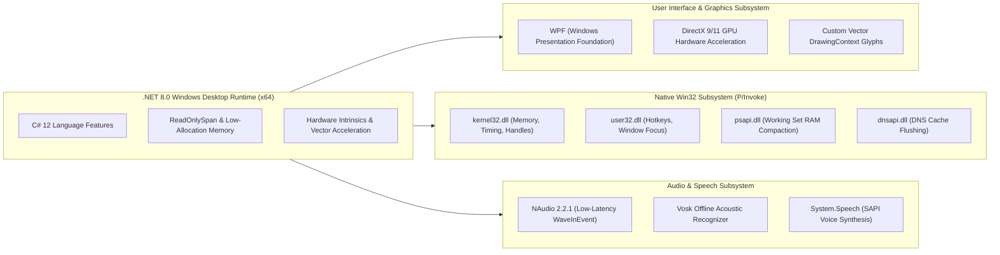

# 💻 Complete Technology Stack & Win32 Interop Matrix

## 📦 The Jarvis Technology Ecosystem

Jarvis combines modern .NET 8 desktop runtime capabilities with direct unmanaged Win32 P/Invoke APIs, hardware-accelerated DirectX vector graphics, offline speech recognition engines, dynamic Roslyn in-memory compilers, and reverse engineering tools.

---

## 📊 Comprehensive Component & Library Reference Matrix

| Subsystem / Layer | Library / Framework | Version | Technical Purpose & Architectural Role |
| :--- | :--- | :--- | :--- |
| **Runtime Target** | `.NET 8.0-windows` | 8.0.x | Core execution engine; modern garbage collector, Spans, SIMD optimizations, and native Windows interop bindings. |
| **Desktop GUI** | **WPF (PresentationFramework)** | .NET 8 Desktop | Hardware-accelerated GPU alpha transparency, vector geometry rendering, and animations. |
| **Display & Screens** | **WinForms (`System.Windows.Forms`)** | .NET 8 Forms | Per-monitor bounds detection, multi-monitor coordinate translation, and system tray integration. |
| **Audio Capture** | **NAudio** | 2.2.1 | Ultra-low latency PCM audio streaming (`WaveInEvent`, 16kHz, 16-bit Mono, 100ms buffers). |
| **Speech Recognition** | **Vosk Offline STT** | `Vosk.dll` (x64) | Local offline acoustic model recognition (`vosk-model-en-us`) with 0ms network latency. |
| **Speech Synthesis** | **System.Speech (SAPI)** | 8.0.0 | Windows native speech synthesis with dynamic voice modulation and speed adjustments. |
| **Win32 Kernel** | `kernel32.dll` | OS Native | High-precision CPU timing (`GetSystemTimes`), memory metrics (`GlobalMemoryStatusEx`), process handles. |
| **Win32 User** | `user32.dll` | OS Native | Global hotkey hooks (`RegisterHotKey`), window focus manipulation (`SetForegroundWindow`), key synthesis. |
| **Process Status** | `psapi.dll` | OS Native | Working set physical memory reclamation (`EmptyWorkingSet`). |
| **Network Interop** | `dnsapi.dll` | OS Native | Instant DNS resolver cache clearing (`DnsFlushResolverCache`). |
| **Embedded Server** | `System.Net.HttpListener` | .NET 8 Built-in | Asynchronous HTTP REST endpoints and full-duplex WebSocket event bus for mobile clients. |
| **Public WAN Tunnel** | **Ngrok CLI** | v3.x | Encrypted public HTTPS/WSS tunnel for remote mobile access without router port-forwarding. |
| **Dynamic Compilation**| **Microsoft.CodeAnalysis (Roslyn)**| 4.8.0 | In-memory dynamic compilation of C# tool classes for the self-evolving tool engine. |
| **Binary Disassembly** | **Unassemblize + LIEF** | Custom Native C++ | Static PE/COFF, ELF section analysis, export table extraction, and entropy scanning. |
| **Native Decompiler** | **Ghidra Headless Engine** | 11.0.3 Public | Disassembles and decompiles native x86/x64/ARM machine instructions into readable C code. |
| **AI LLM Gateways** | Google Gemini, Claude, GPT, Ollama | REST / SSE | Multi-modal visual reasoning, code intelligence, and autonomous ReAct planning loops. |
