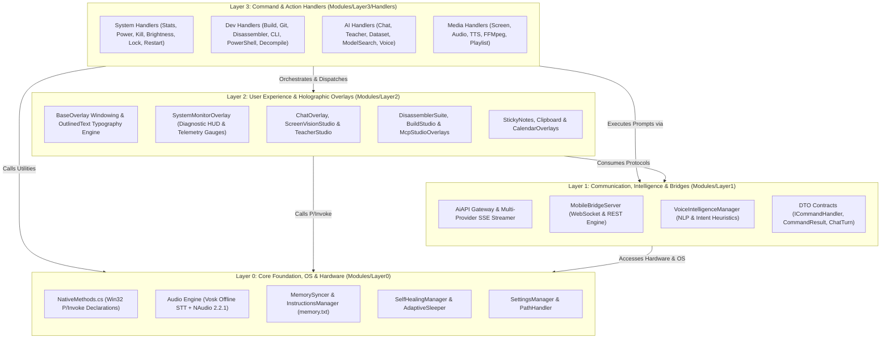
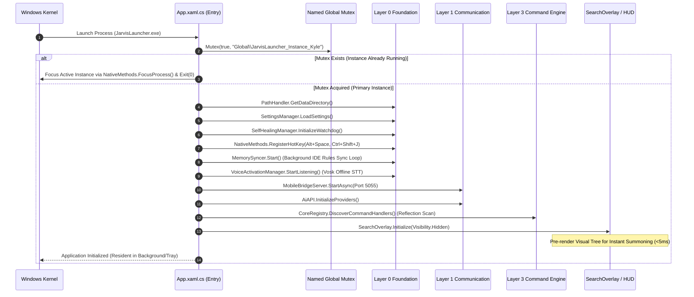

# 🏗️ Core System Architecture & 4-Layer Hierarchy

## 🏛️ Executive Architectural Overview

Jarvis is architected on a strict **4-tier layered architectural pattern (Layer 0 to Layer 3)**. This architectural hierarchy is designed to satisfy four mission-critical engineering objectives:
1. **Sub-Millisecond Responsiveness**: Decoupling the UI rendering thread from background I/O and native OS calls.
2. **Zero Circular Dependencies**: Enforcing a strict unidirectional dependency hierarchy where modules in Layer N can only call Layer M (where M <= N).
3. **Total Fault Isolation**: Ensuring that exceptions in AI cloud APIs or UI overlays can never crash low-level system services, memory watchdogs, or hotkey hooks.
4. **Autonomous Self-Healing**: Equipping the runtime with automatic memory compaction, thread watchdogs, and state restoration capabilities.



---

## 🔬 Layer Invariants & Structural Breakdown

### 1. Layer 0: Core Foundation, Hardware & OS
- **Directory**: `Modules/Layer0/`
- **Subsystems**: `Common`, `Audio`, `AI_ML`, `AiTools`, `Settings`
- **Architectural Mandate**: Provides unmanaged OS abstractions, low-latency audio capture, atomic file I/O, and self-healing memory management.
- **Dependency Invariant**: **Layer 0 must NEVER import or reference Layer 1, 2, or 3**. It is the immutable bedrock of the application.
- **Key Modules**:
  - `NativeMethods.cs`: P/Invoke signatures for `kernel32`, `user32`, `psapi`, `dnsapi`, `shell32`.
  - `AdaptiveSleeper.cs`: Dynamic power-saving sleep loops that yield execution to the Windows scheduler during idle states.
  - `SelfHealingManager.cs`: Large Object Heap (LOH) memory compaction and unhandled exception interception.
  - `InstructionsManager.cs`: Non-blocking multi-format system prompt and persistent memory manager (`memory.txt`).
  - `MemorySyncer.cs`: 2-minute autonomous background rules synchronization across Cursor, Windsurf, VS Code, and Cline.
  - `VoiceActivationManager.cs`: Vosk offline acoustic model voice recognition with zero cloud network latency.

### 2. Layer 1: Intelligence Core, Communication & Bridges
- **Directory**: `Modules/Layer1/`
- **Subsystems**: `Bridges`, `DTOs`, `Interfaces`
- **Architectural Mandate**: Bridges the low-level OS foundation with higher-level intelligence engines, mobile companion clients, and external AI providers.
- **Dependency Invariant**: **Layer 1 can ONLY reference Layer 0**.
- **Key Modules**:
  - `AiAPI.cs`: Multi-endpoint AI gateway supporting Google Gemini, OpenAI GPT, Anthropic Claude, and local Ollama with automatic failover.
  - `MobileBridgeServer.cs`: Asynchronous HttpListener REST API and full-duplex WebSocket telemetry server for remote companion apps.
  - `VoiceIntelligenceManager.cs`: Natural language heuristic parser translating spoken utterances into executable command intents.
  - `ICommandHandler.cs` & `CommandResult.cs`: Standardized command contracts for decoupled command registration.

### 3. Layer 2: User Experience & Holographic Overlays
- **Directory**: `Modules/Layer2/`
- **Subsystems**: `Core`, `System`, `AI`, `Dev`, `Media`
- **Architectural Mandate**: GPU-accelerated WPF holographic HUD interfaces that render seamlessly above full-screen games and IDEs without stealing Windows input focus.
- **Dependency Invariant**: **Layer 2 can reference Layer 1 and Layer 0**.
- **Key Modules**:
  - `BaseOverlay.cs`: Abstract window base class managing alpha transparency, non-activating window styles, acrylic borders, and multi-monitor DPI scaling.
  - `OutlinedText.cs`: Hardware-rendered vector text typography engine with glowing neon stroke outlines.
  - `SystemMonitorOverlay.cs`: 780x600 live diagnostic telemetry HUD featuring real-time CPU/RAM/Disk/Network gauges, interactive process management, and 1-click MAX PC optimization.
  - `ChatOverlay.cs`: Holographic conversational AI studio with real-time SSE token streaming, Markdown formatting, and syntax-highlighted code diffs.
  - `BuildStudioOverlay.cs` & `DisassemblerSuiteOverlay.cs`: Specialized developer HUDs.

### 4. Layer 3: Command Execution Engine
- **Directory**: `Modules/Layer3/Handlers/`
- **Subsystems**: `System`, `Dev`, `AI`, `Media`
- **Architectural Mandate**: High-speed fuzzy query matching, command discovery via reflection, and asynchronous task execution.
- **Dependency Invariant**: **Layer 3 sits at the pinnacle of the stack and orchestrates all lower layers**.
- **Key Modules**:
  - `SystemStatsCommandHandler.cs`: Real-time CPU and RAM telemetry suggestions.
  - `ProcessKillerCommandHandler.cs`: Terminating unresponsive tasks by PID or name.
  - `BuildCommandHandler.cs`: Background MSBuild / `dotnet build` compilation.
  - `GitCommandHandler.cs`: Git status, commits, and branch synchronization.
  - `DisassemblerSuiteCommandHandler.cs`: Reverse engineering HUD launcher.

---

## ⚡ Application Lifecycle & Threading Model



---

## 🛠️ Troubleshooting Guide: Architectural Errors & Verified Fixes

### 1. Issue: Circular Dependency Deadlock on Boot
- **Root Cause**: A Layer 0 module (e.g., `InstructionsManager`) attempting to call a Layer 2 UI component or Layer 3 handler directly.
- **Architectural Fix**: Strictly adhere to event-based or DTO-based communication. Lower layers emit events or write to shared logs (`DebugConsoleOverlay.Log`); higher layers subscribe to those events.

### 2. Issue: Multi-Instance Race Condition on Hotkeys
- **Root Cause**: Two instances of `JarvisLauncher.exe` running simultaneously, causing `RegisterHotKey` to return `false` (Error code `1409: ERROR_HOTKEY_ALREADY_REGISTERED`).
- **Architectural Fix**: Verify the named global mutex `Global\JarvisLauncher_Instance_Kyle` in `App.xaml.cs`. Run `run.bat` to forcefully terminate lingering background processes:
  ```powershell
  Get-Process -Name 'JarvisLauncher' -ErrorAction SilentlyContinue | Stop-Process -Force
  ```
