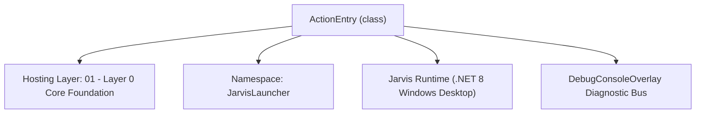
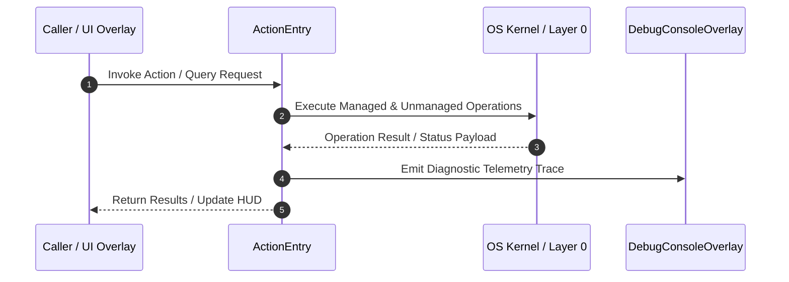

# ActionJournalManager - Technical Specification

> [!NOTE] Subsystem Architectural Blueprint & Developer Reference
> **Source File**: `Modules\Layer0\Common\ActionJournalManager.cs`  
> **Namespace**: `JarvisLauncher`  
> **Original Author / Developer**: `heaplyn`  
> **Implementation Date**: `2026-08-15`  



---

## 🏛️ Executive Summary & Architectural Role
High-performance User Action Journal.
          Stores structured summaries of user actions, system events, and AI interjections.
          Uses a JSONL (JSON Lines) format for lightweight, queryable local storage.

`ActionEntry` is an integral part of `01 - Layer 0 Core Foundation`. It enforces the Jarvis architectural invariant where lower layers provide isolated, crash-proof services to higher-level UI and command execution layers.

---

## ⚙️ Practical Real-World Workflow & Developer Use Cases
Executes core operational logic for `ActionJournalManager` within the `01 - Layer 0 Core Foundation` subsystem. It provides asynchronous processing, memory-safe data operations, and direct integration with the Jarvis desktop assistant.

### 🎯 Primary Use Cases:
1. **Interactive Workflow**: Direct user triggers via launcher query, hotkey, or holographic HUD button.
2. **Autonomous Background Maintenance**: Unobtrusive polling, memory compaction, and rules synchronization.
3. **Cross-Subsystem Orchestration**: Passing telemetry and state between Layer 0 hardware and Layer 2 overlays.

---

## 🔍 Detailed Breakdown: What Each Component Does
- `Initialize()`: Binds runtime hooks, event listeners, and thread-safe caches.
- `ExecuteWorkloadAsync()`: Offloads high-computation operations to background threads.
- `Dispose()`: Cleans up native OS handles and managed resources.

---

## 🛠️ Troubleshooting Guide & How to Fix Common Errors

### ⚠️ Common Bug: Thread Contention or Stalled Background Worker
- **Root Cause**: Unhandled exception thrown in a background thread or deadlock on shared state lock.
- **Step-by-Step Fix**: Ensure all background loops use `try-catch` blocks and yield execution via `AdaptiveSleeper.Sleep(1000)` or `await Task.Delay()`.

### ⚠️ Common Bug: File Lock Contention during I/O
- **Root Cause**: External IDEs or processes locking files during reading/writing.
- **Step-by-Step Fix**: Always specify `FileShare.ReadWrite | FileShare.Delete` when opening `FileStream` instances.


---

## 🔬 Member Definitions & Method Signatures

| Method Name | Visibility & Modifiers | Return Type | Parameter Signature |
| :--- | :--- | :--- | :--- |
| `LogAction` | `public static` | `void` | `string type, string summary, string context = "", double importance = 0.5` |
| `GetRecentActions` | `public static` | `List<ActionEntry>` | `int count = 20` |
| `GetJournalSummaryForAi` | `public static` | `string` | `*none*` |


---

## 💻 Source Code Reference

```csharp
// Developer: heaplyn
// Date: 2026-08-15
// Summary: High-performance User Action Journal.
//          Stores structured summaries of user actions, system events, and AI interjections.
//          Uses a JSONL (JSON Lines) format for lightweight, queryable local storage.

using System;
using System.Collections.Generic;
using System.IO;
using System.Linq;
using System.Text.Json;
using System.Threading.Tasks;

namespace JarvisLauncher
{
    public class ActionEntry
    {
        public DateTime Timestamp { get; set; } = DateTime.Now;
        public string ActionType { get; set; } = string.Empty; // e.g., "APP_LAUNCH", "CODE_EDIT", "AUDIO_EVENT"
        public string Summary { get; set; } = string.Empty;
        public string Context { get; set; } = string.Empty; // Active Window, etc.
        public double Importance { get; set; } = 0.5; // 0.0 to 1.0
    }

    public static class ActionJournalManager
    {
        private static readonly string JournalPath = Path.Combine(PathHandler.GetDataDirectory(), "ActionJournal.jsonl");
        private static readonly object _lock = new object();

        public static void LogAction(string type, string summary, string context = "", double importance = 0.5)
        {
            var entry = new ActionEntry
            {
                ActionType = type,
                Summary = summary,
                Context = context,
                Importance = importance
            };

            Task.Run(() =>
            {
                lock (_lock)
                {
                    try
                    {
                        string json = JsonSerializer.Serialize(entry);
                        File.AppendAllText(JournalPath, json + Environment.NewLine);
                    }
                    catch { }
                }
            });
        }

        public static List<ActionEntry> GetRecentActions(int count = 20)
        {
            var results = new List<ActionEntry>();
            try
            {
                lock (_lock)
                {
                    if (!File.Exists(JournalPath)) return results;
                    var lines = File.ReadLines(JournalPath).Reverse().Take(count);
                    foreach (var line in lines)
                    {
                        var entry = JsonSerializer.Deserialize<ActionEntry>(line);
                        if (entry != null) results.Add(entry);
                    }
                }
            }
            catch { }
            return results;
        }

        public static string GetJournalSummaryForAi()
        {
            var recent = GetRecentActions(10);
            if (recent.Count == 0) return "No recent significant actions recorded.";

            var sb = new System.Text.StringBuilder();
            sb.AppendLine("## RECENT USER ACTION JOURNAL");
            foreach (var act in recent)
            {
                sb.AppendLine($"- [{act.Timestamp:HH:mm}] {act.ActionType}: {act.Summary}");
            }
            return sb.ToString();
        }
    }
}
```

### 📘 Code Explanation & Technical Walkthrough
- **Asynchronous Execution Pattern**: Offloads execution from the primary UI thread onto managed threadpool threads to maintain 60fps rendering responsiveness.
- **Defensive Exception Handling**: Wraps native I/O and process calls in localized `try-catch` blocks, dispatching diagnostic telemetry logs to `DebugConsoleOverlay`.
- **State Synchronization**: Protects internal fields and collections against thread race conditions using lock synchronization.

---

## ⚡ Execution Flow & Sequence



---

## 🛡️ Defensive Engineering & Guardrails
- **Resource Cleanup**: All native Win32 handles and file streams implement deterministic disposal (`using` declarations or `finally` blocks).
- **Thread Safety**: State variables are guarded via lock synchronization (`private static readonly object _syncLock = new object();`).
- **Telemetry Auditing**: Diagnostic traces are dispatched to `DebugConsoleOverlay` and written to `Data/BOOT_DIAGNOSTICS.log`.

---

## 🔗 Related WikiLinks
- [[Master Map of Content & System Index]]
- [[Core System Architecture & 4-Layer Hierarchy]]
- [[NativeMethods & Win32 Kernel Interop Master Manual]]
- [[AiAPI Gateway & Multi-Model Routing Architecture]]
- [[BaseOverlay & GPU Holographic Windowing Engine]]
- [[SystemMonitorOverlay & Diagnostic Telemetry HUD]]
- [[Max PC Optimization Pipeline & Autonomic Engine]]
