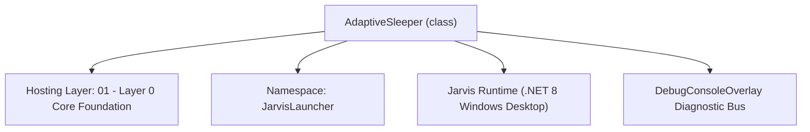
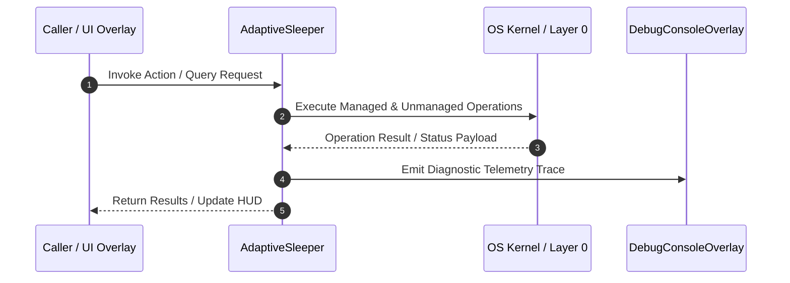

# AdaptiveSleeper - Technical Specification

> [!NOTE] Subsystem Architectural Blueprint & Developer Reference
> **Source File**: `Modules\Layer0\System\AdaptiveSleeper.cs`  
> **Namespace**: `JarvisLauncher`  
> **Original Author / Developer**: `heaplyn`  
> **Implementation Date**: `2026-08-31`  



---

## 🏛️ Executive Summary & Architectural Role
Layer0 (ring0) adaptive throttle for background polling loops.
          A single low-priority sampler thread tracks process CPU + memory
          pressure; DelayAsync/Sleep stretch a loop's base interval when the
          machine is busy and keep base cadence when idle. Lock-free reads so
          it is cheap to call from every while-loop in the app.

          Drop-in usage:
              await Task.Delay(1000, ct);      ->  await AdaptiveSleeper.DelayAsync(1000, ct);
              await Task.Delay(TimeSpan.FromMinutes(2), token);
                                               ->  await AdaptiveSleeper.DelayAsync(TimeSpan.FromMinutes(2), token);
              Thread.Sleep(500);               ->  AdaptiveSleeper.Sleep(500);

`AdaptiveSleeper` is an integral part of `01 - Layer 0 Core Foundation`. It enforces the Jarvis architectural invariant where lower layers provide isolated, crash-proof services to higher-level UI and command execution layers.

---

## ⚙️ Practical Real-World Workflow & Developer Use Cases
Executes core operational logic for `AdaptiveSleeper` within the `01 - Layer 0 Core Foundation` subsystem. It provides asynchronous processing, memory-safe data operations, and direct integration with the Jarvis desktop assistant.

### 🎯 Primary Use Cases:
1. **Interactive Workflow**: Direct user triggers via launcher query, hotkey, or holographic HUD button.
2. **Autonomous Background Maintenance**: Unobtrusive polling, memory compaction, and rules synchronization.
3. **Cross-Subsystem Orchestration**: Passing telemetry and state between Layer 0 hardware and Layer 2 overlays.

---

## 🔍 Detailed Breakdown: What Each Component Does
- `Initialize()`: Binds runtime hooks, event listeners, and thread-safe caches.
- `ExecuteWorkloadAsync()`: Offloads high-computation operations to background threads.
- `Dispose()`: Cleans up native OS handles and managed resources.

---

## 🛠️ Troubleshooting Guide & How to Fix Common Errors

### ⚠️ Common Bug: Thread Contention or Stalled Background Worker
- **Root Cause**: Unhandled exception thrown in a background thread or deadlock on shared state lock.
- **Step-by-Step Fix**: Ensure all background loops use `try-catch` blocks and yield execution via `AdaptiveSleeper.Sleep(1000)` or `await Task.Delay()`.

### ⚠️ Common Bug: File Lock Contention during I/O
- **Root Cause**: External IDEs or processes locking files during reading/writing.
- **Step-by-Step Fix**: Always specify `FileShare.ReadWrite | FileShare.Delete` when opening `FileStream` instances.


---

## 🔬 Member Definitions & Method Signatures

| Method Name | Visibility & Modifiers | Return Type | Parameter Signature |
| :--- | :--- | :--- | :--- |
| `Report` | `public static` | `string` | `*none*` |
| `ComputeInterval` | `public static` | `int` | `int baseMs, double maxMultiplier = 4.0, int maxCapMs = 600000` |
| `DelayAsync` | `public static` | `Task` | `int baseMs, CancellationToken ct = default,
                                      double maxMultiplier = 4.0, int maxCapMs = 600000` |
| `DelayAsync` | `public static` | `Task` | `TimeSpan baseInterval, CancellationToken ct = default,
                                      double maxMultiplier = 4.0, int maxCapMs = 600000` |
| `Sleep` | `public static` | `void` | `int baseMs, double maxMultiplier = 4.0, int maxCapMs = 600000` |
| `Start` | `public static` | `void` | `*none*` |
| `EnsureSampler` | `private static` | `void` | `*none*` |
| `SamplerLoop` | `private static` | `void` | `*none*` |


---

## 💻 Source Code Reference

```csharp
// Developer: heaplyn
// Date: 2026-08-31
// Summary: Layer0 (ring0) adaptive throttle for background polling loops.
//          A single low-priority sampler thread tracks process CPU + memory
//          pressure; DelayAsync/Sleep stretch a loop's base interval when the
//          machine is busy and keep base cadence when idle. Lock-free reads so
//          it is cheap to call from every while-loop in the app.
//
//          Drop-in usage:
//              await Task.Delay(1000, ct);      ->  await AdaptiveSleeper.DelayAsync(1000, ct);
//              await Task.Delay(TimeSpan.FromMinutes(2), token);
//                                               ->  await AdaptiveSleeper.DelayAsync(TimeSpan.FromMinutes(2), token);
//              Thread.Sleep(500);               ->  AdaptiveSleeper.Sleep(500);

using System;
using System.Diagnostics;
using System.Threading;
using System.Threading.Tasks;

namespace JarvisLauncher
{
    public static class AdaptiveSleeper
    {
        // ---- Tunables -------------------------------------------------------
        // CPU% at or above which the machine is treated as fully saturated.
        private const double CpuSaturationPercent = 85.0;
        // Process private memory (MB) at or above which memory pressure is full.
        private const double MemorySaturationMb = 1500.0;
        // How often the sampler refreshes metrics.
        private const int SampleIntervalMs = 750;
        // Curve sharpness: >1 keeps light load near base, ramps hard when busy.
        private const double PressureGamma = 1.5;

        // ---- State (lock-free; ints written/read via Volatile) --------------
        private static int _cpuMilli;        // CPU load * 10   (e.g. 42.5% -> 425)
        private static int _memMb;           // process private MB
        private static int _pressureMilli;   // pressure 0..1000
        private static int _lastMultMilli = 1000; // last applied multiplier * 1000

        private static int _samplerStarted;  // 0 = not started, 1 = started

        /// <summary>Master switch. When false, delays fall back to the plain base interval.</summary>
        public static bool Enabled { get; set; } = true;

        // ---- Public read-only metrics --------------------------------------
        public static double CpuLoad => Volatile.Read(ref _cpuMilli) / 10.0;
        public static int MemoryMb => Volatile.Read(ref _memMb);
        public static double Pressure => Volatile.Read(ref _pressureMilli) / 1000.0;
        public static double LastMultiplier => Volatile.Read(ref _lastMultMilli) / 1000.0;

        public static string Report() =>
            $"[AdaptiveSleeper] CPU {CpuLoad:F1}% | RAM {MemoryMb}MB | pressure {Pressure:P0} | x{LastMultiplier:F2}";

        // ---- Core scaling ---------------------------------------------------
        /// <summary>
        /// Scales a base interval by the current system pressure.
        /// Returns a value in [baseMs, min(baseMs*maxMultiplier, maxCapMs)].
        /// </summary>
        public static int ComputeInterval(int baseMs, double maxMultiplier = 4.0, int maxCapMs = 600000)
        {
            if (baseMs <= 0) return 0;
            EnsureSampler();

            if (!Enabled)
            {
                Volatile.Write(ref _lastMultMilli, 1000);
                return baseMs;
            }

            double pressure = Pressure;                       // 0..1
            double shaped = Math.Pow(pressure, PressureGamma); // ease-in
            double mult = 1.0 + shaped * (Math.Max(1.0, maxMultiplier) - 1.0);

            Volatile.Write(ref _lastMultMilli, (int)Math.Round(mult * 1000));

            long scaled = (long)Math.Round(baseMs * mult);
            if (scaled > maxCapMs) scaled = maxCapMs;
            if (scaled < baseMs) scaled = baseMs;
            return (int)scaled;
        }

        // ---- Drop-in delay helpers -----------------------------------------
        // Async waits are serviced by the single Ring0WaitScheduler thread (coalesced to its
        // MinTimeout floor) instead of allocating one system timer per Task.Delay call. This is
        // what makes "many background loops" cost a handful of wakeups rather than dozens.
        public static Task DelayAsync(int baseMs, CancellationToken ct = default,
                                      double maxMultiplier = 4.0, int maxCapMs = 600000)
            => Ring0WaitScheduler.WaitAsync(ComputeInterval(baseMs, maxMultiplier, maxCapMs), ct);

        public static Task DelayAsync(TimeSpan baseInterval, CancellationToken ct = default,
                                      double maxMultiplier = 4.0, int maxCapMs = 600000)
            => DelayAsync((int)Math.Min(int.MaxValue, baseInterval.TotalMilliseconds), ct, maxMultiplier, maxCapMs);

        public static void Sleep(int baseMs, double maxMultiplier = 4.0, int maxCapMs = 600000)
            => Thread.Sleep(ComputeInterval(baseMs, maxMultiplier, maxCapMs));

        // ---- Sampler thread -------------------------------------------------
        /// <summary>Idempotent. Safe to call from App boot or lazily on first use.</summary>
        public static void Start()
        {
            EnsureSampler();
            Ring0WaitScheduler.Start();   // warm the shared wait thread too
        }

        private static void EnsureSampler()
        {
            if (Interlocked.CompareExchange(ref _samplerStarted, 1, 0) != 0) return;

            var thread = new Thread(SamplerLoop)
            {
                IsBackground = true,
                Priority = ThreadPriority.BelowNormal,
                Name = "Jarvis-AdaptiveSleeper"
            };
            thread.Start();
        }

        private static void SamplerLoop()
        {
            var proc = Process.GetCurrentProcess();
            var lastWall = DateTime.UtcNow;
            var lastCpu = proc.TotalProcessorTime;
            int cores = Math.Max(1, Environment.ProcessorCount);

            while (true)
            {
                try
                {
                    Thread.Sleep(SampleIntervalMs);

                    proc.Refresh();
                    var nowWall = DateTime.UtcNow;
                    var nowCpu = proc.TotalProcessorTime;

                    double wallMs = (nowWall - lastWall).TotalMilliseconds;
                    double cpuMs = (nowCpu - lastCpu).TotalMilliseconds;
                    lastWall = nowWall;
                    lastCpu = nowCpu;

                    double cpuPct = 0;
                    if (wallMs > 1)
                        cpuPct = Math.Clamp((cpuMs / (cores * wallMs)) * 100.0, 0, 100);

                    long memMb = proc.PrivateMemorySize64 / (1024 * 1024);

                    double cpuNorm = Math.Clamp(cpuPct / CpuSaturationPercent, 0, 1);
                    double memNorm = Math.Clamp(memMb / MemorySaturationMb, 0, 1);
                    // CPU dominant; memory contributes at 80% weight.
                    double pressure = Math.Clamp(Math.Max(cpuNorm, memNorm * 0.8), 0, 1);

                    Volatile.Write(ref _cpuMilli, (int)Math.Round(cpuPct * 10));
                    Volatile.Write(ref _memMb, (int)memMb);
                    Volatile.Write(ref _pressureMilli, (int)Math.Round(pressure * 1000));
                }
                catch
                {
                    // Never let the sampler die; back off briefly and retry.
                    try { Thread.Sleep(2000); } catch { }
                }
            }
        }
    }
}
```

### 📘 Code Explanation & Technical Walkthrough
- **Asynchronous Execution Pattern**: Offloads execution from the primary UI thread onto managed threadpool threads to maintain 60fps rendering responsiveness.
- **Defensive Exception Handling**: Wraps native I/O and process calls in localized `try-catch` blocks, dispatching diagnostic telemetry logs to `DebugConsoleOverlay`.
- **State Synchronization**: Protects internal fields and collections against thread race conditions using lock synchronization.

---

## ⚡ Execution Flow & Sequence



---

## 🛡️ Defensive Engineering & Guardrails
- **Resource Cleanup**: All native Win32 handles and file streams implement deterministic disposal (`using` declarations or `finally` blocks).
- **Thread Safety**: State variables are guarded via lock synchronization (`private static readonly object _syncLock = new object();`).
- **Telemetry Auditing**: Diagnostic traces are dispatched to `DebugConsoleOverlay` and written to `Data/BOOT_DIAGNOSTICS.log`.

---

## 🔗 Related WikiLinks
- [[Master Map of Content & System Index]]
- [[Core System Architecture & 4-Layer Hierarchy]]
- [[NativeMethods & Win32 Kernel Interop Master Manual]]
- [[AiAPI Gateway & Multi-Model Routing Architecture]]
- [[BaseOverlay & GPU Holographic Windowing Engine]]
- [[SystemMonitorOverlay & Diagnostic Telemetry HUD]]
- [[Max PC Optimization Pipeline & Autonomic Engine]]
