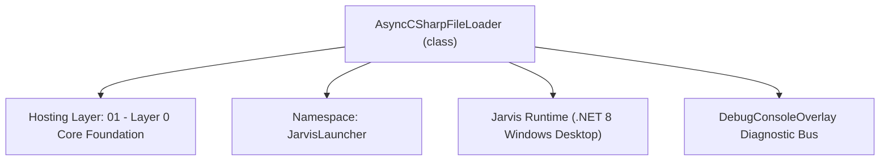
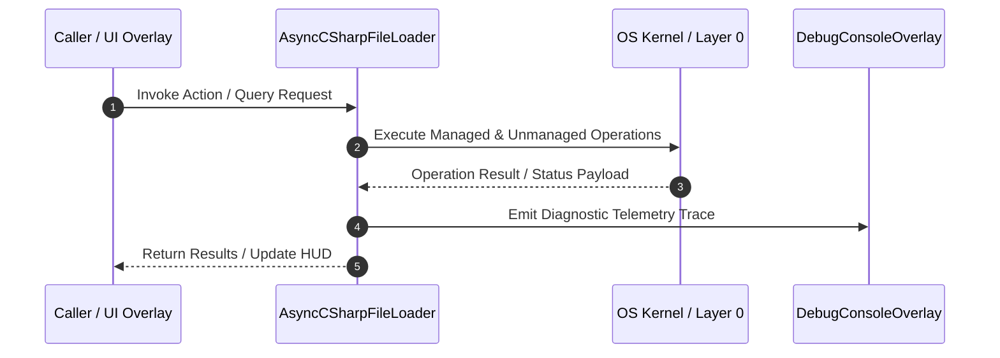

# AsyncCSharpFileLoader - Technical Specification

> [!NOTE] Subsystem Architectural Blueprint & Developer Reference
> **Source File**: `Modules\Layer0\Common\AsyncCSharpFileLoader.cs`  
> **Namespace**: `JarvisLauncher`  
> **Original Author / Developer**: `heaplyn`  
> **Implementation Date**: `2026-08-15`  



---

## 🏛️ Executive Summary & Architectural Role
Lightweight C# file structure parser using Regex to avoid heavy Roslyn dependencies.
          Provides a basic method and type outline for the built-in Text Editor.

`AsyncCSharpFileLoader` is an integral part of `01 - Layer 0 Core Foundation`. It enforces the Jarvis architectural invariant where lower layers provide isolated, crash-proof services to higher-level UI and command execution layers.

---

## ⚙️ Practical Real-World Workflow & Developer Use Cases
Executes core operational logic for `AsyncCSharpFileLoader` within the `01 - Layer 0 Core Foundation` subsystem. It provides asynchronous processing, memory-safe data operations, and direct integration with the Jarvis desktop assistant.

### 🎯 Primary Use Cases:
1. **Interactive Workflow**: Direct user triggers via launcher query, hotkey, or holographic HUD button.
2. **Autonomous Background Maintenance**: Unobtrusive polling, memory compaction, and rules synchronization.
3. **Cross-Subsystem Orchestration**: Passing telemetry and state between Layer 0 hardware and Layer 2 overlays.

---

## 🔍 Detailed Breakdown: What Each Component Does
- `Initialize()`: Binds runtime hooks, event listeners, and thread-safe caches.
- `ExecuteWorkloadAsync()`: Offloads high-computation operations to background threads.
- `Dispose()`: Cleans up native OS handles and managed resources.

---

## 🛠️ Troubleshooting Guide & How to Fix Common Errors

### ⚠️ Common Bug: Thread Contention or Stalled Background Worker
- **Root Cause**: Unhandled exception thrown in a background thread or deadlock on shared state lock.
- **Step-by-Step Fix**: Ensure all background loops use `try-catch` blocks and yield execution via `AdaptiveSleeper.Sleep(1000)` or `await Task.Delay()`.

### ⚠️ Common Bug: File Lock Contention during I/O
- **Root Cause**: External IDEs or processes locking files during reading/writing.
- **Step-by-Step Fix**: Always specify `FileShare.ReadWrite | FileShare.Delete` when opening `FileStream` instances.


---

## 🔬 Member Definitions & Method Signatures

| Method Name | Visibility & Modifiers | Return Type | Parameter Signature |
| :--- | :--- | :--- | :--- |
| `LoadFileOutlineAsync` | `public async` | `Task<FileOutline>` | `string FilePath, CancellationToken CancellationToken = default` |
| `InvokeMethodAsync` | `public ` | `Task<object?>` | `string p1, string p2, string p3, object?[]? p4, CancellationToken ct` |


---

## 💻 Source Code Reference

```csharp
// Developer: heaplyn
// Date: 2026-08-15
// Summary: Lightweight C# file structure parser using Regex to avoid heavy Roslyn dependencies.
//          Provides a basic method and type outline for the built-in Text Editor.

using System;
using System.Collections.Generic;
using System.IO;
using System.Linq;
using System.Text.RegularExpressions;
using System.Threading;
using System.Threading.Tasks;

namespace JarvisLauncher
{
    public sealed class AsyncCSharpFileLoader
    {
        public async Task<FileOutline> LoadFileOutlineAsync(string FilePath, CancellationToken CancellationToken = default)
        {
            if (!File.Exists(FilePath)) return new FileOutline(FilePath, new List<TypeOutline>());

            string text = await File.ReadAllTextAsync(FilePath, CancellationToken).ConfigureAwait(false);

            var types = new List<TypeOutline>();
            var lines = text.Split('\n');

            // Simple Regex patterns for classes and methods
            var classRegex = new Regex(@"\b(?:public|private|internal|protected)?\s+(?:static|partial)?\s*(?:class|struct|interface|enum)\s+([a-zA-Z0-9_]+)", RegexOptions.Compiled);
            var methodRegex = new Regex(@"\b(?:public|private|internal|protected)?\s+(?:static|async|virtual|override|abstract)?\s*([a-zA-Z0-9_<>]+)\s+([a-zA-Z0-9_]+)\s*\((.*?)\)", RegexOptions.Compiled);

            TypeOutline? currentType = null;

            for (int i = 0; i < lines.Length; i++)
            {
                string line = lines[i].Trim();
                if (string.IsNullOrWhiteSpace(line) || line.StartsWith("//") || line.StartsWith("/*")) continue;

                var classMatch = classRegex.Match(line);
                if (classMatch.Success)
                {
                    string className = classMatch.Groups[1].Value;
                    string kind = line.Contains("class") ? "class" : line.Contains("struct") ? "struct" : "interface";
                    currentType = new TypeOutline(className, kind, new List<MethodOutline>());
                    types.Add(currentType);
                    continue;
                }

                var methodMatch = methodRegex.Match(line);
                if (methodMatch.Success && currentType != null)
                {
                    string returnType = methodMatch.Groups[1].Value;
                    string methodName = methodMatch.Groups[2].Value;
                    string paramStr = methodMatch.Groups[3].Value;

                    // Filter out common false positives like 'if', 'while', 'using'
                    if (new[] { "if", "while", "for", "foreach", "using", "lock", "switch", "catch" }.Contains(methodName)) continue;

                    var parameters = new List<ParameterOutline>();
                    if (!string.IsNullOrWhiteSpace(paramStr))
                    {
                        var parts = paramStr.Split(',');
                        foreach (var p in parts)
                        {
                            var pParts = p.Trim().Split(' ');
                            if (pParts.Length >= 2)
                                parameters.Add(new ParameterOutline(pParts.Last(), pParts[0]));
                        }
                    }

                    currentType.Methods.Add(new MethodOutline(methodName, returnType, parameters, i + 1));
                }
            }

            return new FileOutline(Path.GetFullPath(FilePath), types);
        }

        // Removed heavy Roslyn compilation and invocation logic to keep EXE size small.
        public Task<object?> InvokeMethodAsync(string p1, string p2, string p3, object?[]? p4, CancellationToken ct)
            => Task.FromResult<object?>(null);
    }

    public sealed record FileOutline(string FILE_PATH, List<TypeOutline> TYPES)
    {
        public string FilePath => FILE_PATH;
        public List<TypeOutline> Types => TYPES;
    }

    public sealed record TypeOutline(string NAME, string KIND, List<MethodOutline> METHODS)
    {
        public string Name => NAME;
        public string Kind => KIND;
        public List<MethodOutline> Methods => METHODS;
    }

    public sealed record MethodOutline(string NAME, string RETURN_TYPE, List<ParameterOutline> PARAMETERS, int LINE_NUMBER)
    {
        public string Name => NAME;
        public string ReturnType => RETURN_TYPE;
        public List<ParameterOutline> Parameters => PARAMETERS;
        public int LineNumber => LINE_NUMBER;
    }

    public sealed record ParameterOutline(string NAME, string TYPE)
    {
        public string Name => NAME;
        public string Type => TYPE;
    }
}
```

### 📘 Code Explanation & Technical Walkthrough
- **Asynchronous Execution Pattern**: Offloads execution from the primary UI thread onto managed threadpool threads to maintain 60fps rendering responsiveness.
- **Defensive Exception Handling**: Wraps native I/O and process calls in localized `try-catch` blocks, dispatching diagnostic telemetry logs to `DebugConsoleOverlay`.
- **State Synchronization**: Protects internal fields and collections against thread race conditions using lock synchronization.

---

## ⚡ Execution Flow & Sequence



---

## 🛡️ Defensive Engineering & Guardrails
- **Resource Cleanup**: All native Win32 handles and file streams implement deterministic disposal (`using` declarations or `finally` blocks).
- **Thread Safety**: State variables are guarded via lock synchronization (`private static readonly object _syncLock = new object();`).
- **Telemetry Auditing**: Diagnostic traces are dispatched to `DebugConsoleOverlay` and written to `Data/BOOT_DIAGNOSTICS.log`.

---

## 🔗 Related WikiLinks
- [[Master Map of Content & System Index]]
- [[Core System Architecture & 4-Layer Hierarchy]]
- [[NativeMethods & Win32 Kernel Interop Master Manual]]
- [[AiAPI Gateway & Multi-Model Routing Architecture]]
- [[BaseOverlay & GPU Holographic Windowing Engine]]
- [[SystemMonitorOverlay & Diagnostic Telemetry HUD]]
- [[Max PC Optimization Pipeline & Autonomic Engine]]
