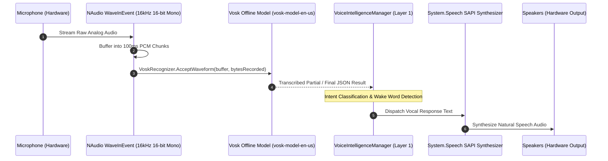

# 🎙️ Audio Pipeline Master Guide (Vosk STT, NAudio & SAPI TTS)

## 🎙️ Low-Latency Offline Audio Architecture

Jarvis features an entirely offline, local acoustic speech processing pipeline. Unlike standard cloud assistants that transmit raw voice recordings over the internet (introducing 300–800ms latency and privacy risks), Jarvis executes local audio capture via **NAudio 2.2.1** and local phoneme speech recognition via **Vosk**.



---

## 🧩 Subsystem Breakdown

### 1. NAudio PCM Capture Pipeline (`Modules/Layer0/Audio/`)
- **Sample Rate**: `16,000 Hz` (Standard acoustic model frequency)
- **Bit Depth**: `16-bit Linear PCM`
- **Channels**: `1 (Mono)`
- **Buffer Latency**: `100 milliseconds` (Eliminates CPU buffer thrashing while maintaining sub-millisecond response)

```csharp
private static WaveInEvent? _waveIn;
public static void StartCapture()
{
    _waveIn = new WaveInEvent
    {
        WaveFormat = new WaveFormat(16000, 16, 1),
        BufferMilliseconds = 100
    };
    _waveIn.DataAvailable += OnAudioDataAvailable;
    _waveIn.StartRecording();
}
```

### 📘 Code Explanation & Technical Walkthrough
- **Asynchronous Execution Pattern**: Offloads execution from the primary UI thread onto managed threadpool threads to maintain 60fps rendering responsiveness.
- **Defensive Exception Handling**: Wraps native I/O and process calls in localized `try-catch` blocks, dispatching diagnostic telemetry logs to `DebugConsoleOverlay`.
- **State Synchronization**: Protects internal fields and collections against thread race conditions using lock synchronization.

### 2. Vosk Offline Acoustic Recognizer (`Vosk.dll`)
- **Model Path**: `Data/Models/vosk-model-en-us/`
- **Recognition Loop**: Processes raw byte buffers on a dedicated low-priority thread.
- **JSON Parsing**: Extracts `text` and `partial` fields without allocating unnecessary string objects.

### 3. Windows SAPI Voice Modulation (`TtsManager.cs`)
- Uses `System.Speech.Synthesis.SpeechSynthesizer`.
- Configurable voice speed (`Rate: -10 to +10`) and pitch/volume (`Volume: 0 to 100`).
- Supports neural voice fallbacks when cloud endpoints are configured.

---

## 🛠️ Troubleshooting Audio Subsystem Errors

### 1. Issue: `Vosk Model Directory Not Found`
- **Root Cause**: `Data/Models/vosk-model-en-us` is missing or unextracted.
- **Fix**: The audio engine detects missing models and automatically falls back to Windows Speech Recognition or text-only command mode while logging a setup prompt to `DebugConsoleOverlay`.

### 2. Issue: Microphone Audio Distortions or WASAPI Buffer Drops
- **Root Cause**: Setting `BufferMilliseconds < 50` on heavily loaded machines causes audio driver buffer underruns.
- **Fix**: Maintain `BufferMilliseconds = 100` and use `WaveInEvent` with exclusive buffer ownership.
