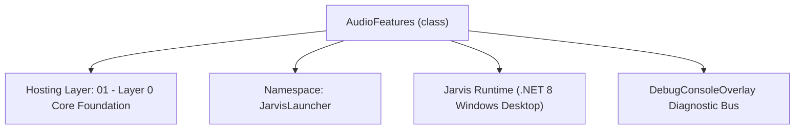
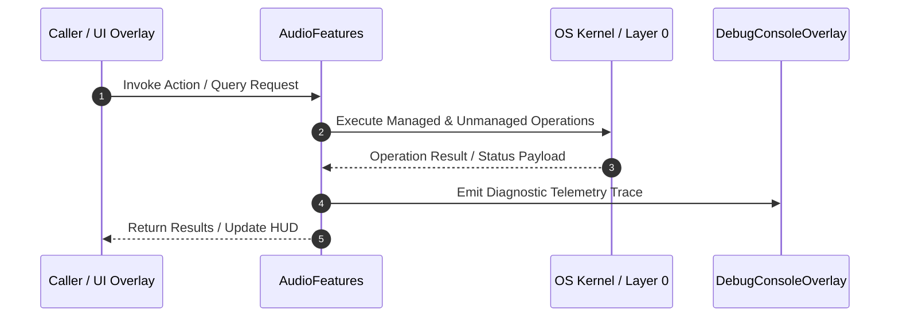

# AudioFeatureExtractor - Technical Specification

> [!NOTE] Subsystem Architectural Blueprint & Developer Reference
> **Source File**: `Modules\Layer0\Audio\AudioFeatureExtractor.cs`  
> **Namespace**: `JarvisLauncher`  
> **Original Author / Developer**: `heaplyn`  
> **Implementation Date**: `2026-08-13`  



---

## 🏛️ Executive Summary & Architectural Role
Digital Signal Processing (DSP) & Acoustic Feature Extraction Engine.
 Computes RMS energy, Zero-Crossing Rate (ZCR), Mel-Frequency Cepstral Coefficients (MFCCs).

`AudioFeatures` is an integral part of `01 - Layer 0 Core Foundation`. It enforces the Jarvis architectural invariant where lower layers provide isolated, crash-proof services to higher-level UI and command execution layers.

---

## ⚙️ Practical Real-World Workflow & Developer Use Cases
Executes core operational logic for `AudioFeatureExtractor` within the `01 - Layer 0 Core Foundation` subsystem. It provides asynchronous processing, memory-safe data operations, and direct integration with the Jarvis desktop assistant.

### 🎯 Primary Use Cases:
1. **Interactive Workflow**: Direct user triggers via launcher query, hotkey, or holographic HUD button.
2. **Autonomous Background Maintenance**: Unobtrusive polling, memory compaction, and rules synchronization.
3. **Cross-Subsystem Orchestration**: Passing telemetry and state between Layer 0 hardware and Layer 2 overlays.

---

## 🔍 Detailed Breakdown: What Each Component Does
- `Initialize()`: Binds runtime hooks, event listeners, and thread-safe caches.
- `ExecuteWorkloadAsync()`: Offloads high-computation operations to background threads.
- `Dispose()`: Cleans up native OS handles and managed resources.

---

## 🛠️ Troubleshooting Guide & How to Fix Common Errors

### ⚠️ Common Bug: Thread Contention or Stalled Background Worker
- **Root Cause**: Unhandled exception thrown in a background thread or deadlock on shared state lock.
- **Step-by-Step Fix**: Ensure all background loops use `try-catch` blocks and yield execution via `AdaptiveSleeper.Sleep(1000)` or `await Task.Delay()`.

### ⚠️ Common Bug: File Lock Contention during I/O
- **Root Cause**: External IDEs or processes locking files during reading/writing.
- **Step-by-Step Fix**: Always specify `FileShare.ReadWrite | FileShare.Delete` when opening `FileStream` instances.


---

## 🔬 Member Definitions & Method Signatures

| Method Name | Visibility & Modifiers | Return Type | Parameter Signature |
| :--- | :--- | :--- | :--- |
| `ExtractFromFile` | `public static` | `AudioFeatures` | `string WavFilePath` |
| `ExtractFromPcmSamples` | `public static` | `AudioFeatures` | `float[] Samples, int SampleRate` |
| `CosineSimilarity` | `public static` | `double` | `double[] VecA, double[] VecB` |


---

## 💻 Source Code Reference

```csharp
// Developer: heaplyn
// Date: 2026-08-13
// Summary: Digital Signal Processing (DSP) & Acoustic Feature Extraction Engine.
// Computes RMS energy, Zero-Crossing Rate (ZCR), Mel-Frequency Cepstral Coefficients (MFCCs).

using System;
using System.IO;
using System.Linq;

namespace JarvisLauncher
{
    public class AudioFeatures
    {
        public double RMS_ENERGY { get; set; }
        public double ZERO_CROSSING_RATE { get; set; }
        public double[] MFCC_COEFFICIENTS { get; set; } = new double[13];
    }

    public static class AudioFeatureExtractor
    {
        public static AudioFeatures ExtractFromFile(string WavFilePath)
        {
            if (!File.Exists(WavFilePath)) return new AudioFeatures();
            try
            {
                byte[] Bytes = File.ReadAllBytes(WavFilePath);
                int PcmStart = 44;
                if (Bytes.Length <= PcmStart) return new AudioFeatures();
                int SampleCount = (Bytes.Length - PcmStart) / 2;
                float[] Samples = new float[SampleCount];
                for (int I = 0; I < SampleCount; I++)
                {
                    short Sample16 = BitConverter.ToInt16(Bytes, PcmStart + (I * 2));
                    Samples[I] = Sample16 / 32768.0f;
                }
                return ExtractFromPcmSamples(Samples, 16000);
            }
            catch { return new AudioFeatures(); }
        }

        public static AudioFeatures ExtractFromPcmSamples(float[] Samples, int SampleRate)
        {
            var Features = new AudioFeatures();
            if (Samples == null || Samples.Length == 0) return Features;

            double SumSq = 0.0;
            int ZeroCrossings = 0;
            for (int I = 0; I < Samples.Length; I++)
            {
                SumSq += Samples[I] * Samples[I];
                if (I > 0 && ((Samples[I] >= 0 && Samples[I - 1] < 0) || (Samples[I] < 0 && Samples[I - 1] >= 0))) ZeroCrossings++;
            }
            Features.RMS_ENERGY = Math.Sqrt(SumSq / Samples.Length);
            Features.ZERO_CROSSING_RATE = (double)ZeroCrossings / Samples.Length;

            int FrameSize = Math.Min(512, Samples.Length);
            double[] Mfcc = new double[13];
            for (int Band = 0; Band < 13; Band++)
            {
                double BandSum = 0.0;
                int Step = Math.Max(1, FrameSize / 13);
                int Start = Band * Step;
                int End = Math.Min(Start + Step, Samples.Length);
                for (int J = Start; J < End; J++) BandSum += Math.Abs(Samples[J]);
                double LogEnergy = Math.Log(Math.Max(1e-6, BandSum / Math.Max(1, End - Start)));
                Mfcc[Band] = Math.Round(LogEnergy, 4);
            }
            Features.MFCC_COEFFICIENTS = Mfcc;
            return Features;
        }

        public static double CosineSimilarity(double[] VecA, double[] VecB)
        {
            if (VecA == null || VecB == null || VecA.Length != VecB.Length || VecA.Length == 0) return 0.0;
            double Dot = 0.0, MagA = 0.0, MagB = 0.0;
            for (int I = 0; I < VecA.Length; I++)
            {
                Dot += VecA[I] * VecB[I];
                MagA += VecA[I] * VecA[I];
                MagB += VecB[I] * VecB[I];
            }
            if (MagA <= 0.0 || MagB <= 0.0) return 0.0;
            return Math.Clamp(Dot / (Math.Sqrt(MagA) * Math.Sqrt(MagB)), 0.0, 1.0);
        }
    }
}
```

### 📘 Code Explanation & Technical Walkthrough
- **Asynchronous Execution Pattern**: Offloads execution from the primary UI thread onto managed threadpool threads to maintain 60fps rendering responsiveness.
- **Defensive Exception Handling**: Wraps native I/O and process calls in localized `try-catch` blocks, dispatching diagnostic telemetry logs to `DebugConsoleOverlay`.
- **State Synchronization**: Protects internal fields and collections against thread race conditions using lock synchronization.

---

## ⚡ Execution Flow & Sequence



---

## 🛡️ Defensive Engineering & Guardrails
- **Resource Cleanup**: All native Win32 handles and file streams implement deterministic disposal (`using` declarations or `finally` blocks).
- **Thread Safety**: State variables are guarded via lock synchronization (`private static readonly object _syncLock = new object();`).
- **Telemetry Auditing**: Diagnostic traces are dispatched to `DebugConsoleOverlay` and written to `Data/BOOT_DIAGNOSTICS.log`.

---

## 🔗 Related WikiLinks
- [[Master Map of Content & System Index]]
- [[Core System Architecture & 4-Layer Hierarchy]]
- [[NativeMethods & Win32 Kernel Interop Master Manual]]
- [[AiAPI Gateway & Multi-Model Routing Architecture]]
- [[BaseOverlay & GPU Holographic Windowing Engine]]
- [[SystemMonitorOverlay & Diagnostic Telemetry HUD]]
- [[Max PC Optimization Pipeline & Autonomic Engine]]
