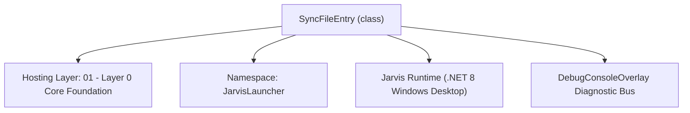
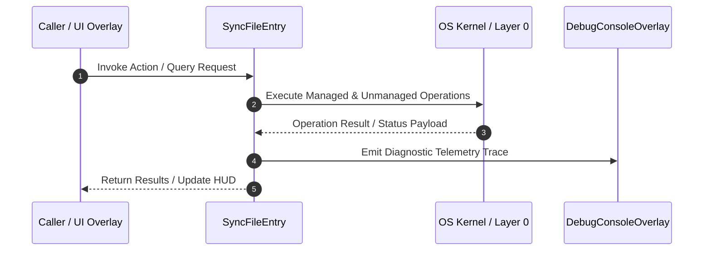

# BackupSyncManager - Technical Specification

> [!NOTE] Subsystem Architectural Blueprint & Developer Reference
> **Source File**: `Modules\Layer0\Database\BackupSyncManager.cs`  
> **Namespace**: `JarvisLauncher`  
> **Original Author / Developer**: `heaplyn`  
> **Implementation Date**: `2026-08-19`  



---

## 🏛️ Executive Summary & Architectural Role
Manages synchronization of training data and configuration between a Main PC and a Backup PC.
          Supports automated background syncing and manual "Pull" operations.

`SyncFileEntry` is an integral part of `01 - Layer 0 Core Foundation`. It enforces the Jarvis architectural invariant where lower layers provide isolated, crash-proof services to higher-level UI and command execution layers.

---

## ⚙️ Practical Real-World Workflow & Developer Use Cases
Executes core operational logic for `BackupSyncManager` within the `01 - Layer 0 Core Foundation` subsystem. It provides asynchronous processing, memory-safe data operations, and direct integration with the Jarvis desktop assistant.

### 🎯 Primary Use Cases:
1. **Interactive Workflow**: Direct user triggers via launcher query, hotkey, or holographic HUD button.
2. **Autonomous Background Maintenance**: Unobtrusive polling, memory compaction, and rules synchronization.
3. **Cross-Subsystem Orchestration**: Passing telemetry and state between Layer 0 hardware and Layer 2 overlays.

---

## 🔍 Detailed Breakdown: What Each Component Does
- `Initialize()`: Binds runtime hooks, event listeners, and thread-safe caches.
- `ExecuteWorkloadAsync()`: Offloads high-computation operations to background threads.
- `Dispose()`: Cleans up native OS handles and managed resources.

---

## 🛠️ Troubleshooting Guide & How to Fix Common Errors

### ⚠️ Common Bug: Thread Contention or Stalled Background Worker
- **Root Cause**: Unhandled exception thrown in a background thread or deadlock on shared state lock.
- **Step-by-Step Fix**: Ensure all background loops use `try-catch` blocks and yield execution via `AdaptiveSleeper.Sleep(1000)` or `await Task.Delay()`.

### ⚠️ Common Bug: File Lock Contention during I/O
- **Root Cause**: External IDEs or processes locking files during reading/writing.
- **Step-by-Step Fix**: Always specify `FileShare.ReadWrite | FileShare.Delete` when opening `FileStream` instances.


---

## 🔬 Member Definitions & Method Signatures

| Method Name | Visibility & Modifiers | Return Type | Parameter Signature |
| :--- | :--- | :--- | :--- |
| `StartAutoSync` | `public static` | `void` | `*none*` |
| `GenerateManifest` | `public static` | `List<SyncFileEntry>` | `*none*` |


---

## 💻 Source Code Reference

```csharp
// Developer: heaplyn
// Date: 2026-08-19
// Summary: Manages synchronization of training data and configuration between a Main PC and a Backup PC.
//          Supports automated background syncing and manual "Pull" operations.

using System;
using System.Collections.Generic;
using System.IO;
using System.IO.Compression;
using System.Linq;
using System.Net.Http;
using System.Text;
using System.Text.Json;
using System.Threading.Tasks;

namespace JarvisLauncher
{
    public class SyncFileEntry
    {
        public string RelativePath { get; set; } = "";
        public long Size { get; set; } = 0;
        public DateTime LastModified { get; set; }
    }

    public static class BackupSyncManager
    {
        private static readonly HttpClient _http = new HttpClient { Timeout = TimeSpan.FromMinutes(30) };
        private static bool _isSyncing = false;

        public static bool IsSyncing => _isSyncing;

        public static void StartAutoSync()
        {
            Task.Run(async () =>
            {
                while (true)
                {
                    var set = SettingsManager.Current;
                    if (set.AUTO_SYNC_WITH_BACKUP && !string.IsNullOrEmpty(set.BACKUP_PC_URL) && !set.IS_BACKUP_PC)
                    {
                        try { await RunSyncCycleAsync(); } catch { }
                    }
                    await AdaptiveSleeper.DelayAsync(TimeSpan.FromMinutes(Math.Max(5, set.AUTO_SYNC_INTERVAL_MINUTES)));
                }
            });
        }

        public static async Task<string> RunSyncCycleAsync()
        {
            if (_isSyncing) return "Sync already in progress.";
            var set = SettingsManager.Current;
            if (string.IsNullOrEmpty(set.BACKUP_PC_URL)) return "No backup PC URL configured.";

            _isSyncing = true;
            DebugConsoleOverlay.Log("Backup-Sync", $"Initiating sync with Backup PC: {set.BACKUP_PC_URL}");

            try
            {
                // 1. Get manifest from Backup PC
                var manifest = await GetBackupManifestAsync();
                if (manifest == null) throw new Exception("Failed to retrieve manifest from Backup PC.");

                // 2. Identify missing or outdated local files
                var dataDir = PathHandler.GetDataDirectory();
                var toDownload = new List<SyncFileEntry>();

                foreach (var entry in manifest)
                {
                    string localPath = Path.Combine(dataDir, entry.RelativePath);
                    if (!File.Exists(localPath))
                    {
                        toDownload.Add(entry);
                        continue;
                    }

                    var info = new FileInfo(localPath);
                    if (info.LastWriteTimeUtc < entry.LastModified.AddSeconds(-1)) // Buffer for FS precision
                    {
                        toDownload.Add(entry);
                    }
                }

                if (toDownload.Count == 0)
                {
                    DebugConsoleOverlay.Log("Backup-Sync", "Local training data is already up to date.");
                    return "Synchronization complete. No files updated.";
                }

                DebugConsoleOverlay.Log("Backup-Sync", $"Syncing {toDownload.Count} files from backup...");

                // 3. Download files (Batched or single zip if possible, but let's do one by one for robustness)
                int successCount = 0;
                foreach (var entry in toDownload)
                {
                    try
                    {
                        await DownloadFileAsync(entry.RelativePath);
                        successCount++;
                    }
                    catch (Exception ex)
                    {
                        DebugConsoleOverlay.Log("Backup-Sync-Error", $"Failed to sync {entry.RelativePath}: {ex.Message}");
                    }
                }

                string msg = $"Synchronization complete. Updated {successCount}/{toDownload.Count} files.";
                DebugConsoleOverlay.Log("Backup-Sync", msg);
                return msg;
            }
            catch (Exception ex)
            {
                DebugConsoleOverlay.Log("Backup-Sync-Error", $"Sync cycle failed: {ex.Message}");
                return $"Sync failed: {ex.Message}";
            }
            finally
            {
                _isSyncing = false;
            }
        }

        private static async Task<List<SyncFileEntry>?> GetBackupManifestAsync()
        {
            var set = SettingsManager.Current;
            string url = $"{set.BACKUP_PC_URL.TrimEnd('/')}/api/backup/manifest";

            var req = new HttpRequestMessage(HttpMethod.Get, url);
            if (!string.IsNullOrEmpty(set.BACKUP_PC_SECRET))
                req.Headers.Add("X-Jarvis-Secret", set.BACKUP_PC_SECRET);

            var resp = await _http.SendAsync(req);
            if (!resp.IsSuccessStatusCode) return null;

            string json = await resp.Content.ReadAsStringAsync();
            return JsonSerializer.Deserialize<List<SyncFileEntry>>(json);
        }

        private static async Task DownloadFileAsync(string relativePath)
        {
            var set = SettingsManager.Current;
            string url = $"{set.BACKUP_PC_URL.TrimEnd('/')}/api/backup/download?path={Uri.EscapeDataString(relativePath)}";

            var req = new HttpRequestMessage(HttpMethod.Get, url);
            if (!string.IsNullOrEmpty(set.BACKUP_PC_SECRET))
                req.Headers.Add("X-Jarvis-Secret", set.BACKUP_PC_SECRET);

            var resp = await _http.SendAsync(req, HttpCompletionOption.ResponseHeadersRead);
            if (!resp.IsSuccessStatusCode) throw new Exception($"Server returned {resp.StatusCode}");

            string localPath = Path.Combine(PathHandler.GetDataDirectory(), relativePath);
            Directory.CreateDirectory(Path.GetDirectoryName(localPath)!);

            using (var stream = await resp.Content.ReadAsStreamAsync())
            using (var fs = new FileStream(localPath, FileMode.Create, FileAccess.Write, FileShare.None))
            {
                await stream.CopyToAsync(fs);
            }

            // Sync the timestamp if the server provided it
            if (resp.Headers.TryGetValues("X-Last-Modified", out var values))
            {
                if (DateTime.TryParse(values.First(), out DateTime dt))
                    File.SetLastWriteTimeUtc(localPath, dt);
            }
        }

        // --- Server-Side Logic (Run on the Backup PC) ---

        public static List<SyncFileEntry> GenerateManifest()
        {
            var list = new List<SyncFileEntry>();
            var dataDir = PathHandler.GetDataDirectory();

            // Whitelist of directories to sync
            var targets = new[] { "Models", "Training", "Context", "Intelligence", "VoiceDataset" };

            foreach (var target in targets)
            {
                string dir = Path.Combine(dataDir, target);
                if (!Directory.Exists(dir)) continue;

                foreach (var file in Directory.GetFiles(dir, "*.*", SearchOption.AllDirectories))
                {
                    var info = new FileInfo(file);
                    list.Add(new SyncFileEntry
                    {
                        RelativePath = Path.GetRelativePath(dataDir, file),
                        Size = info.Length,
                        LastModified = info.LastWriteTimeUtc
                    });
                }
            }

            return list;
        }
    }
}
```

### 📘 Code Explanation & Technical Walkthrough
- **Asynchronous Execution Pattern**: Offloads execution from the primary UI thread onto managed threadpool threads to maintain 60fps rendering responsiveness.
- **Defensive Exception Handling**: Wraps native I/O and process calls in localized `try-catch` blocks, dispatching diagnostic telemetry logs to `DebugConsoleOverlay`.
- **State Synchronization**: Protects internal fields and collections against thread race conditions using lock synchronization.

---

## ⚡ Execution Flow & Sequence



---

## 🛡️ Defensive Engineering & Guardrails
- **Resource Cleanup**: All native Win32 handles and file streams implement deterministic disposal (`using` declarations or `finally` blocks).
- **Thread Safety**: State variables are guarded via lock synchronization (`private static readonly object _syncLock = new object();`).
- **Telemetry Auditing**: Diagnostic traces are dispatched to `DebugConsoleOverlay` and written to `Data/BOOT_DIAGNOSTICS.log`.

---

## 🔗 Related WikiLinks
- [[Master Map of Content & System Index]]
- [[Core System Architecture & 4-Layer Hierarchy]]
- [[NativeMethods & Win32 Kernel Interop Master Manual]]
- [[AiAPI Gateway & Multi-Model Routing Architecture]]
- [[BaseOverlay & GPU Holographic Windowing Engine]]
- [[SystemMonitorOverlay & Diagnostic Telemetry HUD]]
- [[Max PC Optimization Pipeline & Autonomic Engine]]
