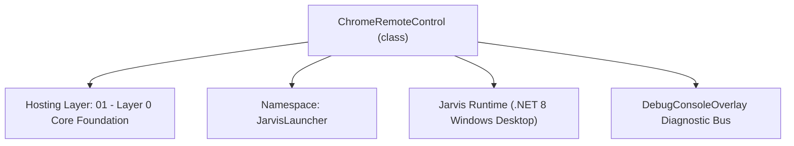
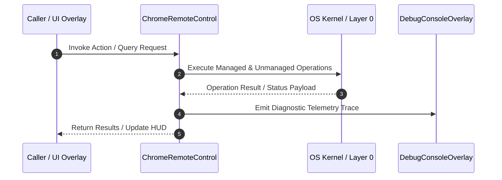

# ChromeRemoteControl - Technical Specification

> [!NOTE] Subsystem Architectural Blueprint & Developer Reference
> **Source File**: `Modules\Layer0\Common\ChromeRemoteControl.cs`  
> **Namespace**: `JarvisLauncher`  
> **Original Author / Developer**: `heaplyn`  
> **Implementation Date**: `2026-08-10`  



---

## 🏛️ Executive Summary & Architectural Role
Handles persistent WebSocket communication and CDP evaluation to query media duration/position, seek, and auto-skip ads within running Chrome/Edge streams.

`ChromeRemoteControl` is an integral part of `01 - Layer 0 Core Foundation`. It enforces the Jarvis architectural invariant where lower layers provide isolated, crash-proof services to higher-level UI and command execution layers.

---

## ⚙️ Practical Real-World Workflow & Developer Use Cases
Executes core operational logic for `ChromeRemoteControl` within the `01 - Layer 0 Core Foundation` subsystem. It provides asynchronous processing, memory-safe data operations, and direct integration with the Jarvis desktop assistant.

### 🎯 Primary Use Cases:
1. **Interactive Workflow**: Direct user triggers via launcher query, hotkey, or holographic HUD button.
2. **Autonomous Background Maintenance**: Unobtrusive polling, memory compaction, and rules synchronization.
3. **Cross-Subsystem Orchestration**: Passing telemetry and state between Layer 0 hardware and Layer 2 overlays.

---

## 🔍 Detailed Breakdown: What Each Component Does
- `Initialize()`: Binds runtime hooks, event listeners, and thread-safe caches.
- `ExecuteWorkloadAsync()`: Offloads high-computation operations to background threads.
- `Dispose()`: Cleans up native OS handles and managed resources.

---

## 🛠️ Troubleshooting Guide & How to Fix Common Errors

### ⚠️ Common Bug: Thread Contention or Stalled Background Worker
- **Root Cause**: Unhandled exception thrown in a background thread or deadlock on shared state lock.
- **Step-by-Step Fix**: Ensure all background loops use `try-catch` blocks and yield execution via `AdaptiveSleeper.Sleep(1000)` or `await Task.Delay()`.

### ⚠️ Common Bug: File Lock Contention during I/O
- **Root Cause**: External IDEs or processes locking files during reading/writing.
- **Step-by-Step Fix**: Always specify `FileShare.ReadWrite | FileShare.Delete` when opening `FileStream` instances.


---

## 🔬 Member Definitions & Method Signatures

| Method Name | Visibility & Modifiers | Return Type | Parameter Signature |
| :--- | :--- | :--- | :--- |
| `Shutdown` | `public static` | `void` | `*none*` |


---

## 💻 Source Code Reference

```csharp
// Developer: heaplyn
// Date: 2026-08-10
// Summary: Handles persistent WebSocket communication and CDP evaluation to query media duration/position, seek, and auto-skip ads within running Chrome/Edge streams.

using System;
using System.IO;
using System.Linq;
using System.Net.Http;
using System.Net.WebSockets;
using System.Text;
using System.Text.Json;
using System.Threading;
using System.Threading.Tasks;

namespace JarvisLauncher
{
    public static class ChromeRemoteControl
    {
        private static readonly HttpClient _httpClient = new HttpClient { Timeout = TimeSpan.FromMilliseconds(1000) };
        private static ClientWebSocket? _activeWs = null;
        private static string _activeWsUrl = string.Empty;
        private static readonly object _lock = new object();

        public class PageInfo
        {
            public string type { get; set; } = string.Empty;
            public string url { get; set; } = string.Empty;
            public string webSocketDebuggerUrl { get; set; } = string.Empty;
        }

        public static void Shutdown()
        {
            lock (_lock)
            {
                if (_activeWs != null)
                {
                    try
                    {
                        if (_activeWs.State == WebSocketState.Open)
                        {
                            _activeWs.CloseOutputAsync(WebSocketCloseStatus.NormalClosure, "Shutdown", CancellationToken.None).Wait(500);
                        }
                    }
                    catch { }
                    try { _activeWs.Dispose(); } catch { }
                    _activeWs = null;
                }
                _activeWsUrl = string.Empty;
            }
        }

        private static async Task<string?> GetWebSocketUrlAsync(string targetUrl)
        {
            try
            {
                var response = await _httpClient.GetStringAsync("http://localhost:9222/json/list");
                var options = new JsonSerializerOptions { PropertyNameCaseInsensitive = true };
                var pages = JsonSerializer.Deserialize<PageInfo[]>(response, options);
                if (pages != null)
                {
                    // Find active webpage tab (must have WebSocket URL and be a web address)
                    var page = pages.FirstOrDefault(p => !string.IsNullOrEmpty(p.webSocketDebuggerUrl) && 
                        (p.url.StartsWith("http://") || p.url.StartsWith("https://")) &&
                        (string.IsNullOrEmpty(targetUrl) || p.url.Contains(targetUrl) || targetUrl.Contains(p.url)));
                    
                    if (page == null)
                    {
                        page = pages.FirstOrDefault(p => !string.IsNullOrEmpty(p.webSocketDebuggerUrl) && 
                            (p.url.StartsWith("http://") || p.url.StartsWith("https://")));
                    }
                    if (page == null)
                    {
                        page = pages.FirstOrDefault(p => !string.IsNullOrEmpty(p.webSocketDebuggerUrl));
                    }
                    return page?.webSocketDebuggerUrl;
                }
            }
            catch { }
            return null;
        }

        private static async Task<ClientWebSocket?> GetConnectedWebSocketAsync(string targetUrl)
        {
            lock (_lock)
            {
                if (_activeWs != null)
                {
                    if (_activeWs.State == WebSocketState.Open)
                    {
                        return _activeWs;
                    }
                    try { _activeWs.Dispose(); } catch { }
                    _activeWs = null;
                    _activeWsUrl = string.Empty;
                }
            }

            string? wsUrl = await GetWebSocketUrlAsync(targetUrl);
            if (string.IsNullOrEmpty(wsUrl)) return null;

            lock (_lock)
            {
                _activeWsUrl = wsUrl;
                _activeWs = new ClientWebSocket();
            }

            try
            {
                using var cts = new CancellationTokenSource(TimeSpan.FromMilliseconds(2000));
                await _activeWs.ConnectAsync(new Uri(wsUrl), cts.Token);
                return _activeWs;
            }
            catch
            {
                lock (_lock)
                {
                    try { _activeWs?.Dispose(); } catch { }
                    _activeWs = null;
                    _activeWsUrl = string.Empty;
                }
                return null;
            }
        }

        public static async Task<(double currentTime, double duration)> GetPositionAsync(string targetUrl)
        {
            var ws = await GetConnectedWebSocketAsync(targetUrl);
            if (ws == null || ws.State != WebSocketState.Open) return (0, 0);

            // Integrated CTP execution: Auto-skip skippable ads & fast-forward unskippable ads
            string js = @"(function() {
                try {
                    // Click YouTube skip ad buttons
                    var skipBtn = document.querySelector('.ytp-ad-skip-button, .ytp-ad-skip-button-modern, .ytp-ad-skip-button-slot, [class*=""skip-button""]');
                    if (skipBtn) {
                        skipBtn.click();
                    }
                    // Speed up & mute unskippable ads
                    var adOverlay = document.querySelector('.video-ads.ytp-ad-module, .ytp-ad-player-overlay, .ad-showing, .ad-interrupting');
                    if (adOverlay) {
                        var video = document.querySelector('video');
                        if (video && !video.paused) {
                            video.playbackRate = 16.0;
                            video.muted = true;
                            if (isFinite(video.duration)) {
                                video.currentTime = video.duration - 0.1;
                            }
                        }
                    }
                } catch(e) {}

                // Extract position and duration
                var ytPlayer = document.querySelector('#movie_player');
                if (ytPlayer && typeof ytPlayer.getCurrentTime === 'function') {
                    return {
                        currentTime: ytPlayer.getCurrentTime(),
                        duration: ytPlayer.getDuration()
                    };
                }
                var media = document.querySelector('video') || document.querySelector('audio');
                if (media) {
                    return {
                        currentTime: media.currentTime,
                        duration: media.duration
                    };
                }
                return { currentTime: 0, duration: 0 };
            })()";

            string? jsonResult = await EvaluateAsync(ws, js);
            if (string.IsNullOrEmpty(jsonResult)) return (0, 0);

            try
            {
                using var doc = JsonDocument.Parse(jsonResult);
                var root = doc.RootElement;
                if (root.TryGetProperty("result", out var resultObj) && 
                    resultObj.TryGetProperty("value", out var valObj))
                {
                    double current = 0;
                    double duration = 0;
                    if (valObj.TryGetProperty("currentTime", out var curProp) && curProp.ValueKind == JsonValueKind.Number) current = curProp.GetDouble();
                    if (valObj.TryGetProperty("duration", out var durProp) && durProp.ValueKind == JsonValueKind.Number) duration = durProp.GetDouble();
                    return (current, duration);
                }
            }
            catch { }

            return (0, 0);
        }

        public static async Task SeekAsync(string targetUrl, double targetSeconds)
        {
            var ws = await GetConnectedWebSocketAsync(targetUrl);
            if (ws == null || ws.State != WebSocketState.Open) return;

            string js = $"(function() {{ var yt = document.querySelector('#movie_player'); if (yt && typeof yt.seekTo === 'function') {{ yt.seekTo({targetSeconds.ToString(System.Globalization.CultureInfo.InvariantCulture)}, true); return true; }} var m = document.querySelector('video') || document.querySelector('audio'); if (m) {{ m.currentTime = {targetSeconds.ToString(System.Globalization.CultureInfo.InvariantCulture)}; return true; }} return false; }})()";

            await EvaluateAsync(ws, js);
        }

        private static async Task<string?> EvaluateAsync(ClientWebSocket ws, string expression)
        {
            try
            {
                var payload = new System.Collections.Generic.Dictionary<string, object>
                {
                    { "id", 1 },
                    { "method", "Runtime.evaluate" },
                    { "params", new System.Collections.Generic.Dictionary<string, object>
                        {
                            { "expression", expression },
                            { "returnByValue", true }
                        }
                    }
                };

                string jsonPayload = JsonSerializer.Serialize(payload);
                byte[] bytes = Encoding.UTF8.GetBytes(jsonPayload);

                using var cts = new CancellationTokenSource(TimeSpan.FromMilliseconds(1500));
                await ws.SendAsync(new ArraySegment<byte>(bytes), WebSocketMessageType.Text, true, cts.Token);

                // Read in a loop to handle fragmented WebSocket frames
                var buffer = new byte[8192];
                using var ms = new MemoryStream();
                WebSocketReceiveResult result;
                do
                {
                    result = await ws.ReceiveAsync(new ArraySegment<byte>(buffer), cts.Token);
                    ms.Write(buffer, 0, result.Count);
                }
                while (!result.EndOfMessage);

                if (result.MessageType == WebSocketMessageType.Text)
                {
                    string responseJson = Encoding.UTF8.GetString(ms.ToArray());
                    using var doc = JsonDocument.Parse(responseJson);
                    var root = doc.RootElement;
                    if (root.TryGetProperty("result", out var resVal))
                    {
                        return resVal.GetRawText();
                    }
                }
            }
            catch
            {
                Shutdown();
            }
            return null;
        }
    }
}
```

### 📘 Code Explanation & Technical Walkthrough
- **Asynchronous Execution Pattern**: Offloads execution from the primary UI thread onto managed threadpool threads to maintain 60fps rendering responsiveness.
- **Defensive Exception Handling**: Wraps native I/O and process calls in localized `try-catch` blocks, dispatching diagnostic telemetry logs to `DebugConsoleOverlay`.
- **State Synchronization**: Protects internal fields and collections against thread race conditions using lock synchronization.

---

## ⚡ Execution Flow & Sequence



---

## 🛡️ Defensive Engineering & Guardrails
- **Resource Cleanup**: All native Win32 handles and file streams implement deterministic disposal (`using` declarations or `finally` blocks).
- **Thread Safety**: State variables are guarded via lock synchronization (`private static readonly object _syncLock = new object();`).
- **Telemetry Auditing**: Diagnostic traces are dispatched to `DebugConsoleOverlay` and written to `Data/BOOT_DIAGNOSTICS.log`.

---

## 🔗 Related WikiLinks
- [[Master Map of Content & System Index]]
- [[Core System Architecture & 4-Layer Hierarchy]]
- [[NativeMethods & Win32 Kernel Interop Master Manual]]
- [[AiAPI Gateway & Multi-Model Routing Architecture]]
- [[BaseOverlay & GPU Holographic Windowing Engine]]
- [[SystemMonitorOverlay & Diagnostic Telemetry HUD]]
- [[Max PC Optimization Pipeline & Autonomic Engine]]
