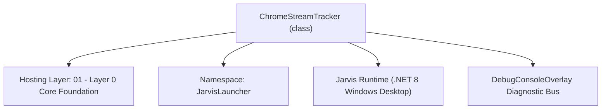
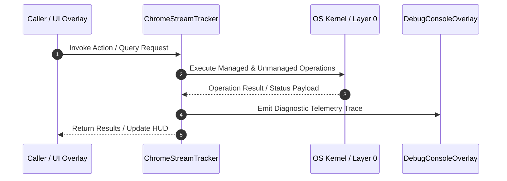

# ChromeStreamTracker - Technical Specification

> [!NOTE] Subsystem Architectural Blueprint & Developer Reference
> **Source File**: `Modules\Layer0\Common\ChromeStreamTracker.cs`  
> **Namespace**: `JarvisLauncher`  
> **Original Author / Developer**: `heaplyn`  
> **Implementation Date**: `2026-08-09`  



---

## 🏛️ Executive Summary & Architectural Role
Static tracker for the currently spawned Chrome/Edge web stream process.
          Any part of the app can call ChromeStreamTracker.Set(process) to register,
          ChromeStreamTracker.KillIfRunning() to terminate, or ChromeStreamTracker.IsRunning to check status.

`ChromeStreamTracker` is an integral part of `01 - Layer 0 Core Foundation`. It enforces the Jarvis architectural invariant where lower layers provide isolated, crash-proof services to higher-level UI and command execution layers.

---

## ⚙️ Practical Real-World Workflow & Developer Use Cases
Executes core operational logic for `ChromeStreamTracker` within the `01 - Layer 0 Core Foundation` subsystem. It provides asynchronous processing, memory-safe data operations, and direct integration with the Jarvis desktop assistant.

### 🎯 Primary Use Cases:
1. **Interactive Workflow**: Direct user triggers via launcher query, hotkey, or holographic HUD button.
2. **Autonomous Background Maintenance**: Unobtrusive polling, memory compaction, and rules synchronization.
3. **Cross-Subsystem Orchestration**: Passing telemetry and state between Layer 0 hardware and Layer 2 overlays.

---

## 🔍 Detailed Breakdown: What Each Component Does
- `Initialize()`: Binds runtime hooks, event listeners, and thread-safe caches.
- `ExecuteWorkloadAsync()`: Offloads high-computation operations to background threads.
- `Dispose()`: Cleans up native OS handles and managed resources.

---

## 🛠️ Troubleshooting Guide & How to Fix Common Errors

### ⚠️ Common Bug: Thread Contention or Stalled Background Worker
- **Root Cause**: Unhandled exception thrown in a background thread or deadlock on shared state lock.
- **Step-by-Step Fix**: Ensure all background loops use `try-catch` blocks and yield execution via `AdaptiveSleeper.Sleep(1000)` or `await Task.Delay()`.

### ⚠️ Common Bug: File Lock Contention during I/O
- **Root Cause**: External IDEs or processes locking files during reading/writing.
- **Step-by-Step Fix**: Always specify `FileShare.ReadWrite | FileShare.Delete` when opening `FileStream` instances.


---

## 🔬 Member Definitions & Method Signatures

| Method Name | Visibility & Modifiers | Return Type | Parameter Signature |
| :--- | :--- | :--- | :--- |
| `GetChromeWindows` | `private static` | `List<IntPtr>` | `*none*` |
| `Focus` | `public static` | `bool` | `*none*` |
| `BringHWndToForeground` | `private static` | `bool` | `IntPtr hWnd` |
| `Set` | `public static` | `void` | `Process? process` |
| `MarkLaunchTime` | `public static` | `void` | `*none*` |
| `KillIfRunning` | `public static` | `void` | `*none*` |


---

## 💻 Source Code Reference

```csharp
// Developer: heaplyn
// Date: 2026-08-09
// Summary: Static tracker for the currently spawned Chrome/Edge web stream process.
//          Any part of the app can call ChromeStreamTracker.Set(process) to register,
//          ChromeStreamTracker.KillIfRunning() to terminate, or ChromeStreamTracker.IsRunning to check status.

using System;
using System.Diagnostics;
using System.Collections.Generic;
using System.Threading.Tasks;
using System.Linq;

namespace JarvisLauncher
{
    public static class ChromeStreamTracker
    {
        private static readonly List<IntPtr> _spawnedWindows = new List<IntPtr>();
        private static List<IntPtr> _preLaunchWindows = new List<IntPtr>();
        private static Process? _process = null;
        private static int _pid = -1;

        static ChromeStreamTracker()
        {
            AppDomain.CurrentDomain.ProcessExit += (s, e) => KillIfRunning();
        }

        private static List<IntPtr> GetChromeWindows()
        {
            var list = new List<IntPtr>();
            try
            {
                NativeMethods.EnumWindows((hWnd, lParam) =>
                {
                    var sb = new System.Text.StringBuilder(256);
                    if (NativeMethods.GetClassName(hWnd, sb, sb.Capacity) > 0)
                    {
                        if (sb.ToString() == "Chrome_WidgetWin_1")
                        {
                            list.Add(hWnd);
                        }
                    }
                    return true;
                }, IntPtr.Zero);
            }
            catch { }
            return list;
        }

    
        public static bool Focus()
        {
            // Strategy 1: Focus using tracked HWND handles (Most reliable for Chrome/Edge)
            lock (_spawnedWindows)
            {
                foreach (var hWnd in _spawnedWindows)
                {
                    if (NativeMethods.IsWindow(hWnd) && NativeMethods.IsWindowVisible(hWnd))
                    {
                        return BringHWndToForeground(hWnd);
                    }
                }
            }

            // Strategy 2: Search windows by target PID if process is alive
            if (_process != null && !_process.HasExited)
            {
                IntPtr targetHWnd = IntPtr.Zero;
                uint targetPid = (uint)_process.Id;

                NativeMethods.EnumWindows((hWnd, lParam) =>
                {
                    NativeMethods.GetWindowThreadProcessId(hWnd, out uint windowPid);
                    if (windowPid == targetPid && NativeMethods.IsWindowVisible(hWnd))
                    {
                        targetHWnd = hWnd;
                        return false; // Found match, stop enumeration
                    }
                    return true;
                }, IntPtr.Zero);

                if (targetHWnd != IntPtr.Zero)
                {
                    return BringHWndToForeground(targetHWnd);
                }

                // Strategy 3: Fallback to standard process focus implementation
                return NativeMethods.FocusProcessInstance(_process);
            }

            return false;
        }

        private static bool BringHWndToForeground(IntPtr hWnd)
        {
            if (hWnd == IntPtr.Zero) return false;

            // Restore if window is minimized
            if (NativeMethods.IsIconic(hWnd))
            {
                NativeMethods.ShowWindow(hWnd, NativeMethods.SW_RESTORE);
            }

            return NativeMethods.SetForegroundWindow(hWnd);
        }
    

        /// <summary>True if the tracked Chrome stream process or any window is alive.</summary>
        public static bool IsRunning
        {
            get
            {
                lock (_spawnedWindows)
                {
                    _spawnedWindows.RemoveAll(hWnd => !NativeMethods.IsWindow(hWnd));
                    return _spawnedWindows.Count > 0 || (_process != null && !_process.HasExited);
                }
            }
        }

        /// <summary>The PID of the tracked Chrome stream process, or -1 if none.</summary>
        public static int Pid => _pid;

        /// <summary>
        /// Register a newly spawned Chrome/Edge stream process.
        /// </summary>
        public static void Set(Process? process)
        {
            _process = process;
            _pid = process != null ? process.Id : -1;
        }

        /// <summary>Call this just before Process.Start so we can find newly spawned Chrome windows.</summary>
        public static void MarkLaunchTime()
        {
            _preLaunchWindows = GetChromeWindows();

            // Run off-thread to capture newly spawned windows near this launch event
            Task.Run(async () =>
            {
                await Task.Delay(1500); // Allow browser to initialize process tree and open windows

                var postLaunchWindows = GetChromeWindows();
                var newWindows = postLaunchWindows.Except(_preLaunchWindows).ToList();

                lock (_spawnedWindows)
                {
                    foreach (var hWnd in newWindows)
                    {
                        if (!_spawnedWindows.Contains(hWnd))
                        {
                            _spawnedWindows.Add(hWnd);
                        }
                    }
                    System.Diagnostics.Debug.WriteLine($"[ChromeStreamTracker] Tracking window handles: {string.Join(", ", _spawnedWindows)}");
                }
            });
        }

        /// <summary>
        /// Kill the tracked stream process and all chrome windows spawned from it.
        /// </summary>
        public static void KillIfRunning()
        {
            lock (_spawnedWindows)
            {
                foreach (var hWnd in _spawnedWindows)
                {
                    if (NativeMethods.IsWindow(hWnd))
                    {
                        NativeMethods.PostMessage(hWnd, NativeMethods.WM_CLOSE, IntPtr.Zero, IntPtr.Zero);
                    }
                }
                _spawnedWindows.Clear();
            }

            // Kill main process handler if set
            if (_process != null)
            {
                try
                {
                    if (!_process.HasExited)
                    {
                        _process.Kill(entireProcessTree: true);
                    }
                }
                catch { }
                _process = null;
            }
            _pid = -1;
        }
    }
}
```

### 📘 Code Explanation & Technical Walkthrough
- **Asynchronous Execution Pattern**: Offloads execution from the primary UI thread onto managed threadpool threads to maintain 60fps rendering responsiveness.
- **Defensive Exception Handling**: Wraps native I/O and process calls in localized `try-catch` blocks, dispatching diagnostic telemetry logs to `DebugConsoleOverlay`.
- **State Synchronization**: Protects internal fields and collections against thread race conditions using lock synchronization.

---

## ⚡ Execution Flow & Sequence



---

## 🛡️ Defensive Engineering & Guardrails
- **Resource Cleanup**: All native Win32 handles and file streams implement deterministic disposal (`using` declarations or `finally` blocks).
- **Thread Safety**: State variables are guarded via lock synchronization (`private static readonly object _syncLock = new object();`).
- **Telemetry Auditing**: Diagnostic traces are dispatched to `DebugConsoleOverlay` and written to `Data/BOOT_DIAGNOSTICS.log`.

---

## 🔗 Related WikiLinks
- [[Master Map of Content & System Index]]
- [[Core System Architecture & 4-Layer Hierarchy]]
- [[NativeMethods & Win32 Kernel Interop Master Manual]]
- [[AiAPI Gateway & Multi-Model Routing Architecture]]
- [[BaseOverlay & GPU Holographic Windowing Engine]]
- [[SystemMonitorOverlay & Diagnostic Telemetry HUD]]
- [[Max PC Optimization Pipeline & Autonomic Engine]]
