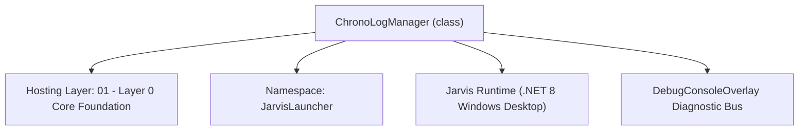
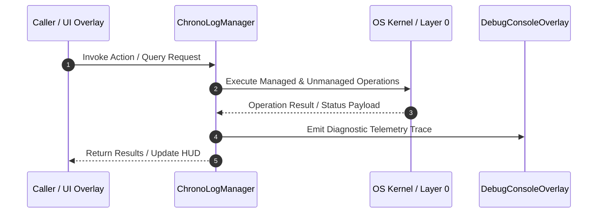

# ChronoLogManager - Technical Specification

> [!NOTE] Subsystem Architectural Blueprint & Developer Reference
> **Source File**: `Modules\Layer0\System\ChronoLogManager.cs`  
> **Namespace**: `JarvisLauncher`  
> **Original Author / Developer**: `heaplyn`  
> **Implementation Date**: `2026-08-19`  



---

## 🏛️ Executive Summary & Architectural Role
Master Chronology and Activity Logging Manager.
          Automatically records user actions, window transitions, commands, and major system events.

`ChronoLogManager` is an integral part of `01 - Layer 0 Core Foundation`. It enforces the Jarvis architectural invariant where lower layers provide isolated, crash-proof services to higher-level UI and command execution layers.

---

## ⚙️ Practical Real-World Workflow & Developer Use Cases
Executes core operational logic for `ChronoLogManager` within the `01 - Layer 0 Core Foundation` subsystem. It provides asynchronous processing, memory-safe data operations, and direct integration with the Jarvis desktop assistant.

### 🎯 Primary Use Cases:
1. **Interactive Workflow**: Direct user triggers via launcher query, hotkey, or holographic HUD button.
2. **Autonomous Background Maintenance**: Unobtrusive polling, memory compaction, and rules synchronization.
3. **Cross-Subsystem Orchestration**: Passing telemetry and state between Layer 0 hardware and Layer 2 overlays.

---

## 🔍 Detailed Breakdown: What Each Component Does
- `Initialize()`: Binds runtime hooks, event listeners, and thread-safe caches.
- `ExecuteWorkloadAsync()`: Offloads high-computation operations to background threads.
- `Dispose()`: Cleans up native OS handles and managed resources.

---

## 🛠️ Troubleshooting Guide & How to Fix Common Errors

### ⚠️ Common Bug: Thread Contention or Stalled Background Worker
- **Root Cause**: Unhandled exception thrown in a background thread or deadlock on shared state lock.
- **Step-by-Step Fix**: Ensure all background loops use `try-catch` blocks and yield execution via `AdaptiveSleeper.Sleep(1000)` or `await Task.Delay()`.

### ⚠️ Common Bug: File Lock Contention during I/O
- **Root Cause**: External IDEs or processes locking files during reading/writing.
- **Step-by-Step Fix**: Always specify `FileShare.ReadWrite | FileShare.Delete` when opening `FileStream` instances.


---

## 🔬 Member Definitions & Method Signatures

| Method Name | Visibility & Modifiers | Return Type | Parameter Signature |
| :--- | :--- | :--- | :--- |
| `LogEvent` | `public static` | `void` | `string category, string detail` |
| `GetRecentLogs` | `public static` | `string` | `int count = 20` |
| `GetHistoryForDate` | `public static` | `string` | `DateTime date` |
| `StartAutoTracker` | `public static` | `void` | `*none*` |


---

## 💻 Source Code Reference

```csharp
// Developer: heaplyn
// Date: 2026-08-19
// Summary: Master Chronology and Activity Logging Manager.
//          Automatically records user actions, window transitions, commands, and major system events.

using System;
using System.Collections.Generic;
using System.IO;
using System.Linq;
using System.Text;
using System.Threading.Tasks;

namespace JarvisLauncher
{
    public static class ChronoLogManager
    {
        private static readonly object _lock = new object();
        private static string LogDir => Path.Combine(PathHandler.GetDataDirectory(), "Context", "History");

        static ChronoLogManager()
        {
            if (!Directory.Exists(LogDir)) Directory.CreateDirectory(LogDir);
        }

        public static void LogEvent(string category, string detail)
        {
            Task.Run(async () => {
                try {
                    string timestamp = DateTime.Now.ToString("yyyy-MM-dd HH:mm:ss");
                    string entry = $"[{timestamp}] [{category.ToUpper()}] {detail}";

                    string dateFile = Path.Combine(LogDir, $"{DateTime.Now:yyyy-MM-dd}.log");

                    lock (_lock) {
                        File.AppendAllText(dateFile, entry + Environment.NewLine);
                    }

                    var memory = new MemoryNode {
                        Category = "Activity",
                        Content = $"User Activity: {category} - {detail}",
                        Timestamp = DateTime.Now
                    };
                    await ContextNotesManager.SyncMemoryToNotesAsync(memory);
                } catch { }
            });
        }

        public static string GetRecentLogs(int count = 20)
        {
            try
            {
                string dateFile = Path.Combine(LogDir, $"{DateTime.Now:yyyy-MM-dd}.log");
                if (!File.Exists(dateFile)) return "No logs recorded today.";

                lock (_lock)
                {
                    var lines = File.ReadAllLines(dateFile);
                    return string.Join(Environment.NewLine, lines.TakeLast(count));
                }
            }
            catch { return "Error fetching recent logs."; }
        }

        public static string GetHistoryForDate(DateTime date)
        {
            string dateFile = Path.Combine(LogDir, $"{date:yyyy-MM-dd}.log");
            if (!File.Exists(dateFile)) return "No activity recorded for this date, Sir.";

            try {
                lock (_lock) {
                    var lines = File.ReadAllLines(dateFile);
                    if (lines.Length > 200) return string.Join(Environment.NewLine, lines.TakeLast(200)) + "\n... (Log truncated)";
                    return string.Join(Environment.NewLine, lines);
                }
            } catch { return "Error reading chronology logs."; }
        }

        public static void StartAutoTracker()
        {
            Task.Run(async () => {
                string lastWin = "";
                while (true) {
                    try {
                        string currentWin = CoreRegistry.Memory.GetCurrentWindowTitle();
                        if (currentWin != lastWin && !string.IsNullOrWhiteSpace(currentWin)) {
                            LogEvent("Window", $"Switched to: {currentWin}");
                            lastWin = currentWin;
                        }
                    } catch { }
                    await AdaptiveSleeper.DelayAsync(10000);
                }
            });
        }
    }
}
```

### 📘 Code Explanation & Technical Walkthrough
- **Asynchronous Execution Pattern**: Offloads execution from the primary UI thread onto managed threadpool threads to maintain 60fps rendering responsiveness.
- **Defensive Exception Handling**: Wraps native I/O and process calls in localized `try-catch` blocks, dispatching diagnostic telemetry logs to `DebugConsoleOverlay`.
- **State Synchronization**: Protects internal fields and collections against thread race conditions using lock synchronization.

---

## ⚡ Execution Flow & Sequence



---

## 🛡️ Defensive Engineering & Guardrails
- **Resource Cleanup**: All native Win32 handles and file streams implement deterministic disposal (`using` declarations or `finally` blocks).
- **Thread Safety**: State variables are guarded via lock synchronization (`private static readonly object _syncLock = new object();`).
- **Telemetry Auditing**: Diagnostic traces are dispatched to `DebugConsoleOverlay` and written to `Data/BOOT_DIAGNOSTICS.log`.

---

## 🔗 Related WikiLinks
- [[Master Map of Content & System Index]]
- [[Core System Architecture & 4-Layer Hierarchy]]
- [[NativeMethods & Win32 Kernel Interop Master Manual]]
- [[AiAPI Gateway & Multi-Model Routing Architecture]]
- [[BaseOverlay & GPU Holographic Windowing Engine]]
- [[SystemMonitorOverlay & Diagnostic Telemetry HUD]]
- [[Max PC Optimization Pipeline & Autonomic Engine]]
