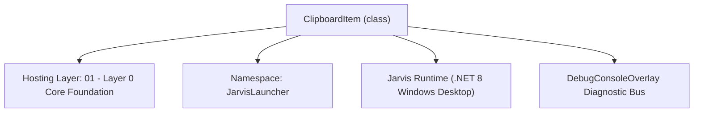
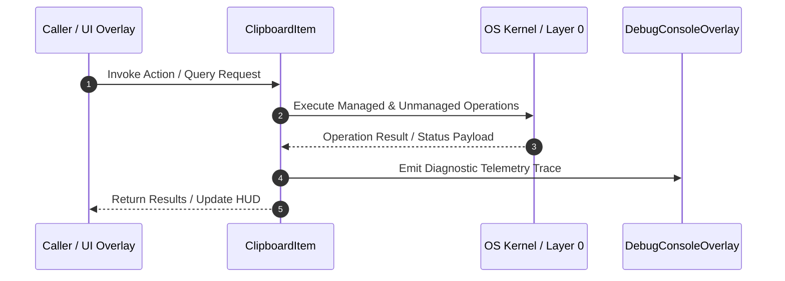

# ClipboardHistoryManager - Technical Specification

> [!NOTE] Subsystem Architectural Blueprint & Developer Reference
> **Source File**: `Modules\Layer0\Common\ClipboardHistoryManager.cs`  
> **Namespace**: `JarvisLauncher`  
> **Original Author / Developer**: `heaplyn`  
> **Implementation Date**: `2026-08-09`  



---

## 🏛️ Executive Summary & Architectural Role
Background listener and persistent manager for Clipboard History.

`ClipboardItem` is an integral part of `01 - Layer 0 Core Foundation`. It enforces the Jarvis architectural invariant where lower layers provide isolated, crash-proof services to higher-level UI and command execution layers.

---

## ⚙️ Practical Real-World Workflow & Developer Use Cases
Executes core operational logic for `ClipboardHistoryManager` within the `01 - Layer 0 Core Foundation` subsystem. It provides asynchronous processing, memory-safe data operations, and direct integration with the Jarvis desktop assistant.

### 🎯 Primary Use Cases:
1. **Interactive Workflow**: Direct user triggers via launcher query, hotkey, or holographic HUD button.
2. **Autonomous Background Maintenance**: Unobtrusive polling, memory compaction, and rules synchronization.
3. **Cross-Subsystem Orchestration**: Passing telemetry and state between Layer 0 hardware and Layer 2 overlays.

---

## 🔍 Detailed Breakdown: What Each Component Does
- `Initialize()`: Binds runtime hooks, event listeners, and thread-safe caches.
- `ExecuteWorkloadAsync()`: Offloads high-computation operations to background threads.
- `Dispose()`: Cleans up native OS handles and managed resources.

---

## 🛠️ Troubleshooting Guide & How to Fix Common Errors

### ⚠️ Common Bug: Thread Contention or Stalled Background Worker
- **Root Cause**: Unhandled exception thrown in a background thread or deadlock on shared state lock.
- **Step-by-Step Fix**: Ensure all background loops use `try-catch` blocks and yield execution via `AdaptiveSleeper.Sleep(1000)` or `await Task.Delay()`.

### ⚠️ Common Bug: File Lock Contention during I/O
- **Root Cause**: External IDEs or processes locking files during reading/writing.
- **Step-by-Step Fix**: Always specify `FileShare.ReadWrite | FileShare.Delete` when opening `FileStream` instances.


---

## 🔬 Member Definitions & Method Signatures

| Method Name | Visibility & Modifiers | Return Type | Parameter Signature |
| :--- | :--- | :--- | :--- |
| `Initialize` | `public static` | `void` | `*none*` |
| `MonitorClipboard` | `private static` | `void` | `object? sender, EventArgs e` |
| `AddHistoryItem` | `public static` | `void` | `string text` |
| `GetHistory` | `public static` | `List<ClipboardItem>` | `*none*` |
| `ClearHistory` | `public static` | `void` | `*none*` |
| `GetFilePath` | `private static` | `string` | `*none*` |
| `LoadHistory` | `private static` | `void` | `*none*` |
| `SaveHistory` | `private static` | `void` | `*none*` |


---

## 💻 Source Code Reference

```csharp
// Developer: heaplyn
// Date: 2026-08-09
// Summary: Background listener and persistent manager for Clipboard History.

using System;
using System.Collections.Generic;
using System.IO;
using System.Linq;
using System.Text.Json;
using System.Threading.Tasks;
using System.Windows;
using System.Windows.Threading;

namespace JarvisLauncher
{
    public class ClipboardItem
    {
        public string Content { get; set; } = string.Empty;
        public DateTime Timestamp { get; set; } = DateTime.Now;
    }

    public static class ClipboardHistoryManager
    {
        private static readonly List<ClipboardItem> _history = new List<ClipboardItem>();
        private static readonly DispatcherTimer _timer = new DispatcherTimer();
        private static string _lastText = string.Empty;

        public static void Initialize()
        {
            LoadHistory();
            _timer.Interval = TimeSpan.FromMilliseconds(1000);
            _timer.Tick += MonitorClipboard;
            _timer.Start();
        }

        private static void MonitorClipboard(object? sender, EventArgs e)
        {
            try
            {
                if (Clipboard.ContainsText())
                {
                    string text = Clipboard.GetText();
                    if (!string.IsNullOrWhiteSpace(text) && text != _lastText)
                    {
                        _lastText = text;
                        AddHistoryItem(text);
                    }
                }
            }
            catch { }
        }

        public static void AddHistoryItem(string text)
        {
            _history.RemoveAll(x => x.Content == text);
            _history.Insert(0, new ClipboardItem { Content = text, Timestamp = DateTime.Now });

            if (_history.Count > 50)
            {
                _history.RemoveAt(_history.Count - 1);
            }

            SaveHistory();
        }

        public static List<ClipboardItem> GetHistory()
        {
            return new List<ClipboardItem>(_history);
        }

        public static void ClearHistory()
        {
            _history.Clear();
            _lastText = string.Empty;
            SaveHistory();
        }

        private static string GetFilePath()
        {
            string dataDir = Path.Combine(AppDomain.CurrentDomain.BaseDirectory, "Data");
            if (!Directory.Exists(dataDir))
            {
                string devPath = Path.GetFullPath(Path.Combine(AppDomain.CurrentDomain.BaseDirectory, @"..\..\..\Data"));
                if (Directory.Exists(devPath))
                {
                    dataDir = devPath;
                }
                else
                {
                    Directory.CreateDirectory(dataDir);
                }
            }
            return Path.Combine(dataDir, "ClipboardHistory.json");
        }

        private static void LoadHistory()
        {
            try
            {
                string file = GetFilePath();
                if (File.Exists(file))
                {
                    string json = File.ReadAllText(file);
                    var items = JsonSerializer.Deserialize<List<ClipboardItem>>(json);
                    if (items != null)
                    {
                        _history.Clear();
                        _history.AddRange(items);
                        if (_history.Count > 0)
                        {
                            _lastText = _history[0].Content;
                        }
                    }
                }
            }
            catch { }
        }

        private static void SaveHistory()
        {
            try
            {
                string file = GetFilePath();
                string json = JsonSerializer.Serialize(_history, new JsonSerializerOptions { WriteIndented = true });
                File.WriteAllText(file, json);
            }
            catch { }
        }
    }
}
```

### 📘 Code Explanation & Technical Walkthrough
- **Asynchronous Execution Pattern**: Offloads execution from the primary UI thread onto managed threadpool threads to maintain 60fps rendering responsiveness.
- **Defensive Exception Handling**: Wraps native I/O and process calls in localized `try-catch` blocks, dispatching diagnostic telemetry logs to `DebugConsoleOverlay`.
- **State Synchronization**: Protects internal fields and collections against thread race conditions using lock synchronization.

---

## ⚡ Execution Flow & Sequence



---

## 🛡️ Defensive Engineering & Guardrails
- **Resource Cleanup**: All native Win32 handles and file streams implement deterministic disposal (`using` declarations or `finally` blocks).
- **Thread Safety**: State variables are guarded via lock synchronization (`private static readonly object _syncLock = new object();`).
- **Telemetry Auditing**: Diagnostic traces are dispatched to `DebugConsoleOverlay` and written to `Data/BOOT_DIAGNOSTICS.log`.

---

## 🔗 Related WikiLinks
- [[Master Map of Content & System Index]]
- [[Core System Architecture & 4-Layer Hierarchy]]
- [[NativeMethods & Win32 Kernel Interop Master Manual]]
- [[AiAPI Gateway & Multi-Model Routing Architecture]]
- [[BaseOverlay & GPU Holographic Windowing Engine]]
- [[SystemMonitorOverlay & Diagnostic Telemetry HUD]]
- [[Max PC Optimization Pipeline & Autonomic Engine]]
