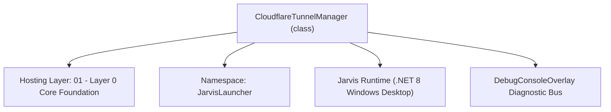
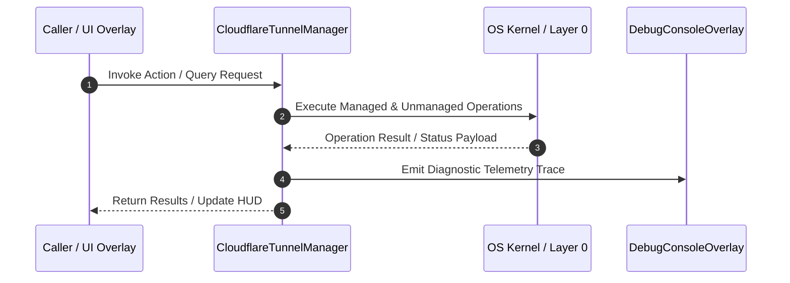

# CloudflareTunnelManager - Technical Specification

> [!NOTE] Subsystem Architectural Blueprint & Developer Reference
> **Source File**: `Modules\Layer0\Network\CloudflareTunnelManager.cs`  
> **Namespace**: `JarvisLauncher`  
> **Original Author / Developer**: `heaplyn`  
> **Implementation Date**: `2026-08-10`  



---

## 🏛️ Executive Summary & Architectural Role
Self-healing Cloudflare Tunnel manager that downloads cloudflared.exe automatically, manages background HTTPS tunnels, and exposes Jarvis Mobile Web App to the public web with secure SSL encryption.

`CloudflareTunnelManager` is an integral part of `01 - Layer 0 Core Foundation`. It enforces the Jarvis architectural invariant where lower layers provide isolated, crash-proof services to higher-level UI and command execution layers.

---

## ⚙️ Practical Real-World Workflow & Developer Use Cases
Executes core operational logic for `CloudflareTunnelManager` within the `01 - Layer 0 Core Foundation` subsystem. It provides asynchronous processing, memory-safe data operations, and direct integration with the Jarvis desktop assistant.

### 🎯 Primary Use Cases:
1. **Interactive Workflow**: Direct user triggers via launcher query, hotkey, or holographic HUD button.
2. **Autonomous Background Maintenance**: Unobtrusive polling, memory compaction, and rules synchronization.
3. **Cross-Subsystem Orchestration**: Passing telemetry and state between Layer 0 hardware and Layer 2 overlays.

---

## 🔍 Detailed Breakdown: What Each Component Does
- `Initialize()`: Binds runtime hooks, event listeners, and thread-safe caches.
- `ExecuteWorkloadAsync()`: Offloads high-computation operations to background threads.
- `Dispose()`: Cleans up native OS handles and managed resources.

---

## 🛠️ Troubleshooting Guide & How to Fix Common Errors

### ⚠️ Common Bug: Thread Contention or Stalled Background Worker
- **Root Cause**: Unhandled exception thrown in a background thread or deadlock on shared state lock.
- **Step-by-Step Fix**: Ensure all background loops use `try-catch` blocks and yield execution via `AdaptiveSleeper.Sleep(1000)` or `await Task.Delay()`.

### ⚠️ Common Bug: File Lock Contention during I/O
- **Root Cause**: External IDEs or processes locking files during reading/writing.
- **Step-by-Step Fix**: Always specify `FileShare.ReadWrite | FileShare.Delete` when opening `FileStream` instances.


---

## 🔬 Member Definitions & Method Signatures

| Method Name | Visibility & Modifiers | Return Type | Parameter Signature |
| :--- | :--- | :--- | :--- |
| `GetCts` | `private static` | `CancellationTokenSource` | `*none*` |
| `SaveTunnelToken` | `public static` | `void` | `string token, string? domainName = null` |
| `StopTunnel` | `public static` | `void` | `*none*` |


---

## 💻 Source Code Reference

```csharp
// Developer: heaplyn
// Date: 2026-08-10
// Summary: Self-healing Cloudflare Tunnel manager that downloads cloudflared.exe automatically, manages background HTTPS tunnels, and exposes Jarvis Mobile Web App to the public web with secure SSL encryption.

using System;
using System.Diagnostics;
using System.IO;
using System.Net.Http;
using System.Text.RegularExpressions;
using System.Threading;
using System.Threading.Tasks;

namespace JarvisLauncher
{
    public static class CloudflareTunnelManager
    {
        private static Process? _tunnelProcess;
        private static string? _publicUrl = null;
        public static string? PublicUrl => _publicUrl;
        public static bool IsRunning => _tunnelProcess != null && !_tunnelProcess.HasExited;

        public static async Task<string> StartTunnelAsync(int targetPort = -1)
{
    // SECURITY: refuse to expose the bridge to the internet unless it is locked down first.
    if (string.IsNullOrEmpty(SettingsManager.Current.BACKUP_PC_SECRET))
        return "❌ Refused: set BACKUP_PC_SECRET before starting a Cloudflare tunnel. The server must require a secret before it is exposed.";

    if (targetPort <= 0) targetPort = MobileBridgeServer.Port;
    StopTunnel();

    // Ensure MobileBridgeServer is active before launching tunnel
    MobileBridgeServer.Start(targetPort);

    // Kill any old orphaned cloudflared background processes
    try
    {
        foreach (var oldProc in Process.GetProcessesByName("cloudflared"))
        {
            try { oldProc.Kill(true); oldProc.Dispose(); } catch { }
        }
    }
    catch { }

    string toolsDir = Path.Combine(AppDomain.CurrentDomain.BaseDirectory, "Data", "Tools");
    if (!Directory.Exists(toolsDir)) Directory.CreateDirectory(toolsDir);

    string exePath = Path.Combine(toolsDir, "cloudflared.exe");

    // 1. Download cloudflared.exe if missing (Includes User-Agent header fix)
    if (!File.Exists(exePath))
    {
        TextOverlay.Show("⚡ Downloading Cloudflare Tunnel engine...", 3000);
        try
        {
            string downloadUrl = "https://github.com/cloudflare/cloudflared/releases/latest/download/cloudflared-windows-amd64.exe";
            using var client = new HttpClient();
            client.DefaultRequestHeaders.Add("User-Agent", "JarvisLauncher/1.0"); // Fix for GitHub HTTP 403
            byte[] data = await client.GetByteArrayAsync(downloadUrl);
            await File.WriteAllBytesAsync(exePath, data);
            TextOverlay.Show("✅ Cloudflare Tunnel engine ready!", 2000);
        }
        catch (Exception ex)
        {
            throw new Exception($"Failed downloading cloudflared.exe: {ex.Message}");
        }
    }

    string tokenPath = Path.Combine(toolsDir, "cloudflare_token.txt");
    string domainPath = Path.Combine(toolsDir, "cloudflare_domain.txt");

    bool hasValidToken = false;
    string arguments = $"tunnel --url http://127.0.0.1:{targetPort} --no-autoupdate";

    if (File.Exists(tokenPath))
    {
        string savedToken = File.ReadAllText(tokenPath).Trim();
        if (!string.IsNullOrEmpty(savedToken) && savedToken.StartsWith("eyJ") && savedToken.Length > 30)
        {
            arguments = $"tunnel run --token {savedToken}";
            hasValidToken = true;

            if (File.Exists(domainPath))
            {
                _publicUrl = File.ReadAllText(domainPath).Trim();
            }
        }
    }

    // Attempt to start the process with built arguments
    try
    {
        return await LaunchTunnelProcess(exePath, arguments, targetPort);
    }
    catch (Exception ex) when (hasValidToken)
    {
        // 🛑 FALLBACK LOGIC: If starting with the token timed out or failed, delete corrupted token & fallback
        ChatOverlay.LogConsoleAction("Cloudflare Error", $"Named tunnel failed: {ex.Message}. Deleting saved token and falling back to Quick Tunnel...");
        
        // Clean up bad token files
        try
        {
            if (File.Exists(tokenPath)) File.Delete(tokenPath);
            if (File.Exists(domainPath)) File.Delete(domainPath);
        }
        catch { }

        // Reset public URL and fallback to default Quick Tunnel mode
        _publicUrl = null;
        string fallbackArguments = $"tunnel --url http://127.0.0.1:{targetPort} --no-autoupdate";
        
        TextOverlay.Show("⚠️ Saved token failed. Falling back to free Quick Tunnel...", 3000);
        return await LaunchTunnelProcess(exePath, fallbackArguments, targetPort);
    }
}

// Extracted process launcher helper method to keep code DRY
private static async Task<string> LaunchTunnelProcess(string exePath, string arguments, int targetPort)
        {
            StopTunnel(); // Ensure clean state before launching process

            var psi = new ProcessStartInfo
            {
                FileName = exePath,
                Arguments = arguments,
                RedirectStandardError = true,
                RedirectStandardOutput = true,
                UseShellExecute = false,
                CreateNoWindow = true
            };

            _tunnelProcess = new Process { StartInfo = psi };
            var tcs = new TaskCompletionSource<string>(TaskCreationOptions.RunContinuationsAsynchronously);

            // Track output line by line to detect errors or success URLs
            Action<string?> checkLine = (line) =>
            {
                if (string.IsNullOrWhiteSpace(line)) return;

                // Log everything to your console for debugging
                ChatOverlay.LogConsoleAction("Cloudflare Log", line);

                // Check for Quick Tunnel or Named Tunnel URLs
                var match = Regex.Match(line, @"https://[a-zA-Z0-9\-]+\.(trycloudflare|cfargotunnel)\.com");
                if (match.Success)
                {
                    _publicUrl = match.Value;
                    tcs.TrySetResult(_publicUrl);
                    return;
                }

                // If cloudflared reports an internal error, fail fast instead of waiting 30 seconds
                if (line.Contains("error", StringComparison.OrdinalIgnoreCase) ||
                    line.Contains("failed", StringComparison.OrdinalIgnoreCase))
                {
                    // Ignore benign warnings, fail on actual boot errors
                    if (line.Contains("failed to request quick tunnel") || line.Contains("Cannot determine default configuration path"))
                    {
                        tcs.TrySetException(new Exception($"Cloudflare Engine Error: {line}"));
                    }
                }
            };

            _tunnelProcess.ErrorDataReceived += (s, e) => checkLine(e.Data);
            _tunnelProcess.OutputDataReceived += (s, e) => checkLine(e.Data);

            TextOverlay.Show("⏳ Connecting Cloudflare Tunnel...\nPlease wait up to 30 seconds.", 6000);

            try
            {
                _tunnelProcess.Start();
                _tunnelProcess.BeginErrorReadLine();
                _tunnelProcess.BeginOutputReadLine();
            }
            catch (Exception ex)
            {
                throw new Exception($"Failed to start cloudflared.exe process: {ex.Message}");
            }

            // If pre-loaded custom domain exists and using token, complete early
            if (!string.IsNullOrEmpty(_publicUrl) && arguments.Contains("--token"))
            {
                tcs.TrySetResult(_publicUrl);
            }

            // Wait for URL or 30-second timeout
            using var cts = GetCts();
            try
            {
                // Links cancellation token to Task completion
                using (cts.Token.Register(() => tcs.TrySetException(new TimeoutException("Timed out waiting for Cloudflare Tunnel URL. Check your firewall/network."))))
                {
                    string url = await tcs.Task;
                    TextOverlay.Show($"🌐 Cloudflare Tunnel Live:\n{url}", 6000);
                    return url;
                }
            }
            catch
            {
                // Force kill process on failure so it doesn't linger in the background
                StopTunnel();
                throw;
            }
        }

        private static CancellationTokenSource GetCts()
        {
            return new CancellationTokenSource(TimeSpan.FromSeconds(30));
        }

        public static void SaveTunnelToken(string token, string? domainName = null)
        {
            try
            {
                string toolsDir = Path.Combine(AppDomain.CurrentDomain.BaseDirectory, "Data", "Tools");
                if (!Directory.Exists(toolsDir)) Directory.CreateDirectory(toolsDir);

                File.WriteAllText(Path.Combine(toolsDir, "cloudflare_token.txt"), token.Trim());
                if (!string.IsNullOrEmpty(domainName))
                {
                    File.WriteAllText(Path.Combine(toolsDir, "cloudflare_domain.txt"), domainName.Trim());
                    _publicUrl = domainName.Trim();
                }
            }
            catch { }
        }

        public static void StopTunnel()
        {
            try
            {
                if (_tunnelProcess != null && !_tunnelProcess.HasExited)
                {
                    _tunnelProcess.Kill(true);
                    _tunnelProcess.Dispose();
                    _tunnelProcess = null;
                }
                _publicUrl = null;
            }
            catch { }
        }
    }
}
```

### 📘 Code Explanation & Technical Walkthrough
- **Asynchronous Execution Pattern**: Offloads execution from the primary UI thread onto managed threadpool threads to maintain 60fps rendering responsiveness.
- **Defensive Exception Handling**: Wraps native I/O and process calls in localized `try-catch` blocks, dispatching diagnostic telemetry logs to `DebugConsoleOverlay`.
- **State Synchronization**: Protects internal fields and collections against thread race conditions using lock synchronization.

---

## ⚡ Execution Flow & Sequence



---

## 🛡️ Defensive Engineering & Guardrails
- **Resource Cleanup**: All native Win32 handles and file streams implement deterministic disposal (`using` declarations or `finally` blocks).
- **Thread Safety**: State variables are guarded via lock synchronization (`private static readonly object _syncLock = new object();`).
- **Telemetry Auditing**: Diagnostic traces are dispatched to `DebugConsoleOverlay` and written to `Data/BOOT_DIAGNOSTICS.log`.

---

## 🔗 Related WikiLinks
- [[Master Map of Content & System Index]]
- [[Core System Architecture & 4-Layer Hierarchy]]
- [[NativeMethods & Win32 Kernel Interop Master Manual]]
- [[AiAPI Gateway & Multi-Model Routing Architecture]]
- [[BaseOverlay & GPU Holographic Windowing Engine]]
- [[SystemMonitorOverlay & Diagnostic Telemetry HUD]]
- [[Max PC Optimization Pipeline & Autonomic Engine]]
