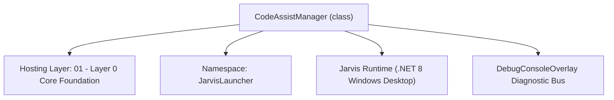
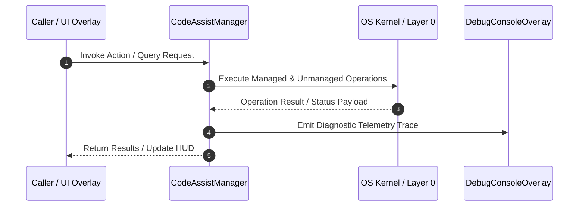

# CodeAssistManager - Technical Specification

> [!NOTE] Subsystem Architectural Blueprint & Developer Reference
> **Source File**: `Modules\Layer0\Common\CodeAssistManager.cs`  
> **Namespace**: `JarvisLauncher`  
> **Original Author / Developer**: `heaplyn`  
> **Implementation Date**: `2026-08-13`  



---

## 🏛️ Executive Summary & Architectural Role
Continuous Real-Time Code Assist & Vision Advisor Engine.
 Periodically captures screen layouts, reads active project files, and queries Gemini Vision AI for refactoring/layout assistance.

`CodeAssistManager` is an integral part of `01 - Layer 0 Core Foundation`. It enforces the Jarvis architectural invariant where lower layers provide isolated, crash-proof services to higher-level UI and command execution layers.

---

## ⚙️ Practical Real-World Workflow & Developer Use Cases
Executes core operational logic for `CodeAssistManager` within the `01 - Layer 0 Core Foundation` subsystem. It provides asynchronous processing, memory-safe data operations, and direct integration with the Jarvis desktop assistant.

### 🎯 Primary Use Cases:
1. **Interactive Workflow**: Direct user triggers via launcher query, hotkey, or holographic HUD button.
2. **Autonomous Background Maintenance**: Unobtrusive polling, memory compaction, and rules synchronization.
3. **Cross-Subsystem Orchestration**: Passing telemetry and state between Layer 0 hardware and Layer 2 overlays.

---

## 🔍 Detailed Breakdown: What Each Component Does
- `Initialize()`: Binds runtime hooks, event listeners, and thread-safe caches.
- `ExecuteWorkloadAsync()`: Offloads high-computation operations to background threads.
- `Dispose()`: Cleans up native OS handles and managed resources.

---

## 🛠️ Troubleshooting Guide & How to Fix Common Errors

### ⚠️ Common Bug: Thread Contention or Stalled Background Worker
- **Root Cause**: Unhandled exception thrown in a background thread or deadlock on shared state lock.
- **Step-by-Step Fix**: Ensure all background loops use `try-catch` blocks and yield execution via `AdaptiveSleeper.Sleep(1000)` or `await Task.Delay()`.

### ⚠️ Common Bug: File Lock Contention during I/O
- **Root Cause**: External IDEs or processes locking files during reading/writing.
- **Step-by-Step Fix**: Always specify `FileShare.ReadWrite | FileShare.Delete` when opening `FileStream` instances.


---

## 🔬 Member Definitions & Method Signatures

| Method Name | Visibility & Modifiers | Return Type | Parameter Signature |
| :--- | :--- | :--- | :--- |
| `Start` | `public static` | `void` | `*none*` |
| `Stop` | `public static` | `void` | `*none*` |
| `Toggle` | `public static` | `void` | `*none*` |
| `GetRecentSourceFilesContext` | `private static` | `string` | `*none*` |


---

## 💻 Source Code Reference

```csharp
// Developer: heaplyn
// Date: 2026-08-13
// Summary: Continuous Real-Time Code Assist & Vision Advisor Engine.
// Periodically captures screen layouts, reads active project files, and queries Gemini Vision AI for refactoring/layout assistance.

using System;
using System.Collections.Generic;
using System.IO;
using System.Linq;
using System.Text;
using System.Threading;
using System.Threading.Tasks;

namespace JarvisLauncher
{
    public static class CodeAssistManager
    {
        private static System.Threading.Timer? _assistTimer;
        private static readonly object _lock = new object();
        private static bool _isRunning = false;

        public static bool IsRunning
        {
            get => _isRunning;
            private set
            {
                _isRunning = value;
                OnStateChanged?.Invoke(value);
            }
        }

        public static string ActiveCodebasePath { get; set; } = AppDomain.CurrentDomain.BaseDirectory;
        public static string CurrentCodeAdvice { get; private set; } = "Code Assist is idle. Say 'turn on code assist' to start.";
        public static string LastAnalyzedFiles { get; private set; } = string.Empty;

        public static event Action<bool>? OnStateChanged;
        public static event Action<string>? OnAdviceUpdated;

        static CodeAssistManager()
        {
            // Auto-detect project folder
            string checkDir = AppDomain.CurrentDomain.BaseDirectory;
            for (int i = 0; i < 5; i++)
            {
                if (Directory.Exists(Path.Combine(checkDir, "Modules")) || File.Exists(Path.Combine(checkDir, "JarvisLauncher.csproj")))
                {
                    ActiveCodebasePath = checkDir;
                    break;
                }
                var parent = Directory.GetParent(checkDir);
                if (parent == null) break;
                checkDir = parent.FullName;
            }
        }

        public static void Start()
        {
            lock (_lock)
            {
                if (IsRunning) return;
                IsRunning = true;
                _assistTimer = new System.Threading.Timer(async _ => await CodeAssistTickAsync(), null, 0, 8000);
                DebugConsoleOverlay.Log("Code Assist", "Code Assist Engine STARTED (8s sampling loop)");
            }
        }

        public static void Stop()
        {
            lock (_lock)
            {
                if (!IsRunning) return;
                IsRunning = false;
                _assistTimer?.Dispose();
                _assistTimer = null;
                DebugConsoleOverlay.Log("Code Assist", "Code Assist Engine STOPPED");
            }
        }

        public static void Toggle()
        {
            if (IsRunning) Stop();
            else Start();
        }

        private static async Task CodeAssistTickAsync()
        {
            try
            {
                // 1. Capture current screen
                string screenshotPath = ScreenMonitorEngine.CapturePrimaryScreen();
                if (string.IsNullOrEmpty(screenshotPath) || !File.Exists(screenshotPath)) return;

                ScreenMonitorEngine.UpdateActiveWindowInfo();
                string activeWinTitle = ScreenMonitorEngine.ActiveWindowTitle;

                // 2. Fetch and read active / recently modified code files (limit to top 3 files)
                var sourceFilesContent = GetRecentSourceFilesContext();

                // 3. Assemble prompt
                var prompt = new StringBuilder();
                prompt.AppendLine("You are an expert real-time code assistant looking at the user's screen and code files.");
                prompt.AppendLine($"Active window on user's desktop: '{activeWinTitle}'");
                prompt.AppendLine("Below are the contents of the relevant open project files:");
                prompt.AppendLine("--------------------------------------------------");
                prompt.AppendLine(sourceFilesContent);
                prompt.AppendLine("--------------------------------------------------");
                prompt.AppendLine("Analyze the screen layout (UI alignments, formatting, console compilation errors) and code files.");
                prompt.AppendLine("Provide brief, clear, direct bullets on what the user should edit, refactor, or fix next. Keep recommendations under 4 bullets.");

                byte[] imageBytes = File.ReadAllBytes(screenshotPath);
                string base64Image = Convert.ToBase64String(imageBytes);

                // 4. Query Gemini Vision
                string advice = await AiAPI.AnalyzeImageBase64Async(prompt.ToString(), base64Image);
                CurrentCodeAdvice = advice;
                OnAdviceUpdated?.Invoke(advice);
            }
            catch (Exception ex)
            {
                System.Diagnostics.Debug.WriteLine($"Code Assist Tick Error: {ex.Message}");
            }
        }

        private static string GetRecentSourceFilesContext()
        {
            if (!Directory.Exists(ActiveCodebasePath)) return "No active codebase path found.";

            try
            {
                var files = Directory.GetFiles(ActiveCodebasePath, "*.cs", SearchOption.AllDirectories)
                    .Concat(Directory.GetFiles(ActiveCodebasePath, "*.json", SearchOption.AllDirectories))
                    .Concat(Directory.GetFiles(ActiveCodebasePath, "*.xaml", SearchOption.AllDirectories))
                    .Select(f => new FileInfo(f))
                    .Where(fi => !fi.FullName.Contains("bin") && !fi.FullName.Contains("obj") && !fi.FullName.Contains(".vs") && !fi.FullName.Contains(".git"))
                    .OrderByDescending(fi => fi.LastWriteTime)
                    .Take(3)
                    .ToList();

                if (files.Count == 0) return "No source files found in active workspace.";

                var sb = new StringBuilder();
                var fileNamesList = new List<string>();

                foreach (var file in files)
                {
                    fileNamesList.Add(file.Name);
                    sb.AppendLine($"File: {file.FullName}");
                    sb.AppendLine("``​`csharp");
                    string content = File.ReadAllText(file.FullName);
                    // Take last 120 lines of the file to save token budget
                    var lines = content.Split('\n');
                    if (lines.Length > 120)
                    {
                        sb.AppendLine("// ... (truncated starting lines) ...");
                        sb.AppendLine(string.Join("\n", lines.TakeLast(120)));
                    }
                    else
                    {
                        sb.AppendLine(content);
                    }
                    sb.AppendLine("``​`\n");
                }

                LastAnalyzedFiles = string.Join(", ", fileNamesList);
                return sb.ToString();
            }
            catch (Exception ex)
            {
                return $"Error reading source files: {ex.Message}";
            }
        }
    }
}
```

### 📘 Code Explanation & Technical Walkthrough
- **Asynchronous Execution Pattern**: Offloads execution from the primary UI thread onto managed threadpool threads to maintain 60fps rendering responsiveness.
- **Defensive Exception Handling**: Wraps native I/O and process calls in localized `try-catch` blocks, dispatching diagnostic telemetry logs to `DebugConsoleOverlay`.
- **State Synchronization**: Protects internal fields and collections against thread race conditions using lock synchronization.

---

## ⚡ Execution Flow & Sequence



---

## 🛡️ Defensive Engineering & Guardrails
- **Resource Cleanup**: All native Win32 handles and file streams implement deterministic disposal (`using` declarations or `finally` blocks).
- **Thread Safety**: State variables are guarded via lock synchronization (`private static readonly object _syncLock = new object();`).
- **Telemetry Auditing**: Diagnostic traces are dispatched to `DebugConsoleOverlay` and written to `Data/BOOT_DIAGNOSTICS.log`.

---

## 🔗 Related WikiLinks
- [[Master Map of Content & System Index]]
- [[Core System Architecture & 4-Layer Hierarchy]]
- [[NativeMethods & Win32 Kernel Interop Master Manual]]
- [[AiAPI Gateway & Multi-Model Routing Architecture]]
- [[BaseOverlay & GPU Holographic Windowing Engine]]
- [[SystemMonitorOverlay & Diagnostic Telemetry HUD]]
- [[Max PC Optimization Pipeline & Autonomic Engine]]
