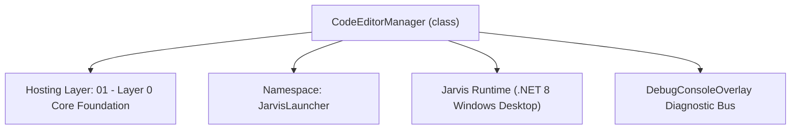
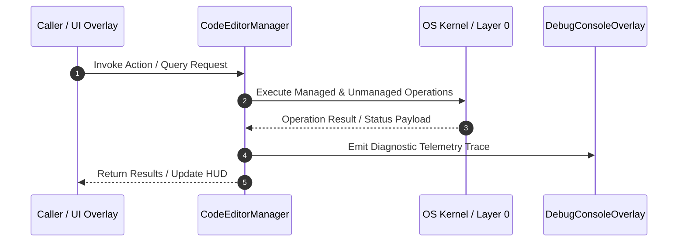

# CodeEditorManager - Technical Specification

> [!NOTE] Subsystem Architectural Blueprint & Developer Reference
> **Source File**: `Modules\Layer0\Common\CodeEditorManager.cs`  
> **Namespace**: `JarvisLauncher`  
> **Original Author / Developer**: `heaplyn`  
> **Implementation Date**: `2026-08-15`  



---

## 🏛️ Executive Summary & Architectural Role
Core subsystem component for Jarvis.

`CodeEditorManager` is an integral part of `01 - Layer 0 Core Foundation`. It enforces the Jarvis architectural invariant where lower layers provide isolated, crash-proof services to higher-level UI and command execution layers.

---

## ⚙️ Practical Real-World Workflow & Developer Use Cases
Executes core operational logic for `CodeEditorManager` within the `01 - Layer 0 Core Foundation` subsystem. It provides asynchronous processing, memory-safe data operations, and direct integration with the Jarvis desktop assistant.

### 🎯 Primary Use Cases:
1. **Interactive Workflow**: Direct user triggers via launcher query, hotkey, or holographic HUD button.
2. **Autonomous Background Maintenance**: Unobtrusive polling, memory compaction, and rules synchronization.
3. **Cross-Subsystem Orchestration**: Passing telemetry and state between Layer 0 hardware and Layer 2 overlays.

---

## 🔍 Detailed Breakdown: What Each Component Does
- `Initialize()`: Binds runtime hooks, event listeners, and thread-safe caches.
- `ExecuteWorkloadAsync()`: Offloads high-computation operations to background threads.
- `Dispose()`: Cleans up native OS handles and managed resources.

---

## 🛠️ Troubleshooting Guide & How to Fix Common Errors

### ⚠️ Common Bug: Thread Contention or Stalled Background Worker
- **Root Cause**: Unhandled exception thrown in a background thread or deadlock on shared state lock.
- **Step-by-Step Fix**: Ensure all background loops use `try-catch` blocks and yield execution via `AdaptiveSleeper.Sleep(1000)` or `await Task.Delay()`.

### ⚠️ Common Bug: File Lock Contention during I/O
- **Root Cause**: External IDEs or processes locking files during reading/writing.
- **Step-by-Step Fix**: Always specify `FileShare.ReadWrite | FileShare.Delete` when opening `FileStream` instances.


---

## 🔬 Member Definitions & Method Signatures

| Method Name | Visibility & Modifiers | Return Type | Parameter Signature |
| :--- | :--- | :--- | :--- |
| `OpenInVSCode` | `public static` | `bool` | `string filePath, int? line = null` |
| `OpenInVisualStudio` | `public static` | `bool` | `string filePath` |
| `OpenInCursor` | `public static` | `bool` | `string filePath` |
| `OpenInJetBrains` | `public static` | `bool` | `string ideName, string filePath` |
| `RunProcess` | `private static` | `bool` | `string fileName, string args` |
| `FindExecutable` | `private static` | `string?` | `string name` |
| `GetInstalledEditors` | `public static` | `List<string>` | `*none*` |
| `CanRun` | `private static` | `bool` | `string cmd` |


---

## 💻 Source Code Reference

```csharp
using System;
using System.Collections.Generic;
using System.Diagnostics;
using System.IO;
using System.Linq;
using Microsoft.Win32;

namespace JarvisLauncher
{
    public static class CodeEditorManager
    {
        public static bool OpenInVSCode(string filePath, int? line = null)
        {
            try
            {
                string args = line.HasValue ? $"--goto \"{filePath}:{line}\"" : $"\"{filePath}\"";
                return RunProcess("code", args) || RunProcess("code.cmd", args);
            }
            catch { return false; }
        }

        public static bool OpenInVisualStudio(string filePath)
        {
            try
            {
                // Find devenv.exe path or use environmental variable if in PATH
                return RunProcess("devenv.exe", $"\"{filePath}\"");
            }
            catch { return false; }
        }

        public static bool OpenInCursor(string filePath)
        {
            try
            {
                return RunProcess("cursor", $"\"{filePath}\"");
            }
            catch { return false; }
        }

        public static bool OpenInJetBrains(string ideName, string filePath)
        {
            // ideName can be idea, pycharm, webstorm, rider, etc.
            try
            {
                return RunProcess(ideName, $"\"{filePath}\"");
            }
            catch { return false; }
        }

        private static bool RunProcess(string fileName, string args)
        {
            try
            {
                var psi = new ProcessStartInfo
                {
                    FileName = fileName,
                    Arguments = args,
                    UseShellExecute = true,
                    CreateNoWindow = true
                };
                Process.Start(psi);
                return true;
            }
            catch
            {
                // If simple execution fails, try searching in common paths
                string? fullPath = FindExecutable(fileName);
                if (fullPath != null)
                {
                    Process.Start(new ProcessStartInfo(fullPath, args) { UseShellExecute = true });
                    return true;
                }
                return false;
            }
        }

        private static string? FindExecutable(string name)
        {
            // Check common locations if not in PATH
            string[] searchPaths = {
                Path.Combine(Environment.GetFolderPath(Environment.SpecialFolder.LocalApplicationData), "Programs", "Microsoft VS Code", "bin", name),
                Path.Combine(Environment.GetFolderPath(Environment.SpecialFolder.ProgramFiles), "Microsoft VS Code", "bin", name),
                Path.Combine(Environment.GetFolderPath(Environment.SpecialFolder.LocalApplicationData), "Programs", "cursor", name)
            };

            foreach (var p in searchPaths)
            {
                if (File.Exists(p)) return p;
            }
            return null;
        }

        public static List<string> GetInstalledEditors()
        {
            var list = new List<string>();
            if (FindExecutable("code") != null || CanRun("code")) list.Add("VS Code");
            if (FindExecutable("cursor") != null || CanRun("cursor")) list.Add("Cursor");
            if (CanRun("devenv.exe")) list.Add("Visual Studio");
            if (CanRun("rider64.exe")) list.Add("Rider");
            return list;
        }

        private static bool CanRun(string cmd)
        {
            try
            {
                var psi = new ProcessStartInfo("where", cmd) { RedirectStandardOutput = true, UseShellExecute = false, CreateNoWindow = true };
                using var p = Process.Start(psi);
                p?.WaitForExit();
                return p?.ExitCode == 0;
            }
            catch { return false; }
        }
    }
}
```

### 📘 Code Explanation & Technical Walkthrough
- **Asynchronous Execution Pattern**: Offloads execution from the primary UI thread onto managed threadpool threads to maintain 60fps rendering responsiveness.
- **Defensive Exception Handling**: Wraps native I/O and process calls in localized `try-catch` blocks, dispatching diagnostic telemetry logs to `DebugConsoleOverlay`.
- **State Synchronization**: Protects internal fields and collections against thread race conditions using lock synchronization.

---

## ⚡ Execution Flow & Sequence



---

## 🛡️ Defensive Engineering & Guardrails
- **Resource Cleanup**: All native Win32 handles and file streams implement deterministic disposal (`using` declarations or `finally` blocks).
- **Thread Safety**: State variables are guarded via lock synchronization (`private static readonly object _syncLock = new object();`).
- **Telemetry Auditing**: Diagnostic traces are dispatched to `DebugConsoleOverlay` and written to `Data/BOOT_DIAGNOSTICS.log`.

---

## 🔗 Related WikiLinks
- [[Master Map of Content & System Index]]
- [[Core System Architecture & 4-Layer Hierarchy]]
- [[NativeMethods & Win32 Kernel Interop Master Manual]]
- [[AiAPI Gateway & Multi-Model Routing Architecture]]
- [[BaseOverlay & GPU Holographic Windowing Engine]]
- [[SystemMonitorOverlay & Diagnostic Telemetry HUD]]
- [[Max PC Optimization Pipeline & Autonomic Engine]]
