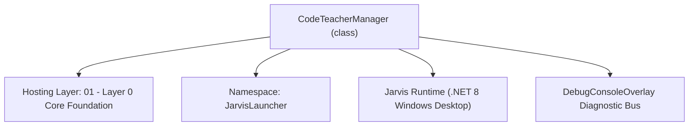
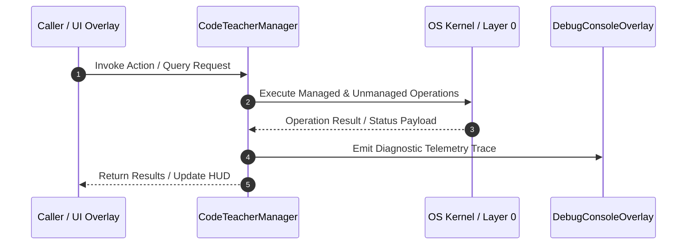

# CodeTeacherManager - Technical Specification

> [!NOTE] Subsystem Architectural Blueprint & Developer Reference
> **Source File**: `Modules\Layer0\Common\CodeTeacherManager.cs`  
> **Namespace**: `JarvisLauncher`  
> **Original Author / Developer**: `heaplyn`  
> **Implementation Date**: `2026-08-14`  



---

## 🏛️ Executive Summary & Architectural Role
AI-Powered, Language-Agnostic Code Teacher.
          Queries LLM router to dynamically analyze and explain bugs, deprecated features,
          or anti-patterns in any programming language. Persists code context into WorkspaceMemory.

`CodeTeacherManager` is an integral part of `01 - Layer 0 Core Foundation`. It enforces the Jarvis architectural invariant where lower layers provide isolated, crash-proof services to higher-level UI and command execution layers.

---

## ⚙️ Practical Real-World Workflow & Developer Use Cases
Executes core operational logic for `CodeTeacherManager` within the `01 - Layer 0 Core Foundation` subsystem. It provides asynchronous processing, memory-safe data operations, and direct integration with the Jarvis desktop assistant.

### 🎯 Primary Use Cases:
1. **Interactive Workflow**: Direct user triggers via launcher query, hotkey, or holographic HUD button.
2. **Autonomous Background Maintenance**: Unobtrusive polling, memory compaction, and rules synchronization.
3. **Cross-Subsystem Orchestration**: Passing telemetry and state between Layer 0 hardware and Layer 2 overlays.

---

## 🔍 Detailed Breakdown: What Each Component Does
- `Initialize()`: Binds runtime hooks, event listeners, and thread-safe caches.
- `ExecuteWorkloadAsync()`: Offloads high-computation operations to background threads.
- `Dispose()`: Cleans up native OS handles and managed resources.

---

## 🛠️ Troubleshooting Guide & How to Fix Common Errors

### ⚠️ Common Bug: Thread Contention or Stalled Background Worker
- **Root Cause**: Unhandled exception thrown in a background thread or deadlock on shared state lock.
- **Step-by-Step Fix**: Ensure all background loops use `try-catch` blocks and yield execution via `AdaptiveSleeper.Sleep(1000)` or `await Task.Delay()`.

### ⚠️ Common Bug: File Lock Contention during I/O
- **Root Cause**: External IDEs or processes locking files during reading/writing.
- **Step-by-Step Fix**: Always specify `FileShare.ReadWrite | FileShare.Delete` when opening `FileStream` instances.


---

## 🔬 Member Definitions & Method Signatures

| Method Name | Visibility & Modifiers | Return Type | Parameter Signature |
| :--- | :--- | :--- | :--- |


---

## 💻 Source Code Reference

```csharp
// Developer: heaplyn
// Date: 2026-08-14
// Summary: AI-Powered, Language-Agnostic Code Teacher.
//          Queries LLM router to dynamically analyze and explain bugs, deprecated features,
//          or anti-patterns in any programming language. Persists code context into WorkspaceMemory.

using System;
using System.IO;
using System.Threading.Tasks;

namespace JarvisLauncher
{
    public static class CodeTeacherManager
    {
        /// <summary>
        /// Reads a file from disk and queries AI to educational-check its contents.
        /// </summary>
        public static async Task<string> ScanFileAsync(string filePath)
        {
            if (!SettingsManager.Current.IS_TEACHER_MODE_ENABLED)
            {
                return "Teacher Mode is currently disabled in Settings.";
            }

            if (!File.Exists(filePath))
            {
                return $"Error: File '{filePath}' not found.";
            }

            try
            {
                string code = File.ReadAllText(filePath);
                string filename = Path.GetFileName(filePath);
                string extension = Path.GetExtension(filePath).ToLower();
                
                string language = extension switch
                {
                    ".cs" => "C#",
                    ".lua" => "Luau",
                    ".py" => "Python",
                    ".js" => "JavaScript",
                    ".ts" => "TypeScript",
                    ".html" => "HTML",
                    ".css" => "CSS",
                    ".cpp" => "C++",
                    ".c" => "C",
                    _ => "Generic/Unknown"
                };

                // Perform AI analysis
                string report = await ScanCodeAsync(code, filename, language);

                if (report.Trim().ToUpper() == "CLEAR")
                {
                    string cleanMsg = $"✅ Scan Complete: File '{filename}' looks clean! No issues found by AI Code Teacher.";
                    TextOverlay.Show(cleanMsg, 3000);
                    return cleanMsg;
                }

                // Update active workspace memory with this code context
                WorkspaceMemoryManager.UpdateActiveCode(filePath, code, language);

                // Show notification and return
                TextOverlay.Show($"🎓 Code Teacher found issues in {filename}!", 4000);
                ChatOverlay.LogConsoleAction("AI Code Teacher Scan", $"File: {filename}\nReport generated.");

                return report;
            }
            catch (Exception ex)
            {
                return $"Error scanning file: {ex.Message}";
            }
        }

        /// <summary>
        /// Queries the central LLM dispatcher to perform educational code analysis.
        /// </summary>
        public static async Task<string> ScanCodeAsync(string codeContent, string filename, string language)
        {
            if (string.IsNullOrWhiteSpace(codeContent)) return "CLEAR";

            try
            {
                string prompt = $"You are an expert programming teacher. Analyze the following {language} code snippet ({filename}) " +
                                $"for any bugs, syntax errors, deprecation, security flaws, performance bottlenecks, or architectural anti-patterns. " +
                                $"Be completely language agnostic.\n\n" +
                                $"CRITICAL RULES:\n" +
                                $"1. If the code is correct, efficient, and has no clear issues, respond with ONLY the word 'CLEAR'.\n" +
                                $"2. If there are issues, do NOT return 'CLEAR'. Instead, write a brief, high-impact educational tutorial/explanation showing the issue, explaining the 'better method', and showing how to rewrite it.\n\n" +
                                $"Here is the code:\n" +
                                $"``​`\n{codeContent}\n``​`";

                // Query the LLM router
                string response = await LlmRouter.AskAsync(prompt, null);
                return response;
            }
            catch (Exception ex)
            {
                return $"Error during AI analysis: {ex.Message}";
            }
        }
    }
}
```

### 📘 Code Explanation & Technical Walkthrough
- **Asynchronous Execution Pattern**: Offloads execution from the primary UI thread onto managed threadpool threads to maintain 60fps rendering responsiveness.
- **Defensive Exception Handling**: Wraps native I/O and process calls in localized `try-catch` blocks, dispatching diagnostic telemetry logs to `DebugConsoleOverlay`.
- **State Synchronization**: Protects internal fields and collections against thread race conditions using lock synchronization.

---

## ⚡ Execution Flow & Sequence



---

## 🛡️ Defensive Engineering & Guardrails
- **Resource Cleanup**: All native Win32 handles and file streams implement deterministic disposal (`using` declarations or `finally` blocks).
- **Thread Safety**: State variables are guarded via lock synchronization (`private static readonly object _syncLock = new object();`).
- **Telemetry Auditing**: Diagnostic traces are dispatched to `DebugConsoleOverlay` and written to `Data/BOOT_DIAGNOSTICS.log`.

---

## 🔗 Related WikiLinks
- [[Master Map of Content & System Index]]
- [[Core System Architecture & 4-Layer Hierarchy]]
- [[NativeMethods & Win32 Kernel Interop Master Manual]]
- [[AiAPI Gateway & Multi-Model Routing Architecture]]
- [[BaseOverlay & GPU Holographic Windowing Engine]]
- [[SystemMonitorOverlay & Diagnostic Telemetry HUD]]
- [[Max PC Optimization Pipeline & Autonomic Engine]]
