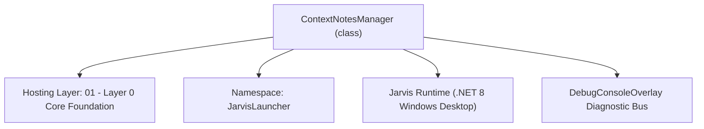
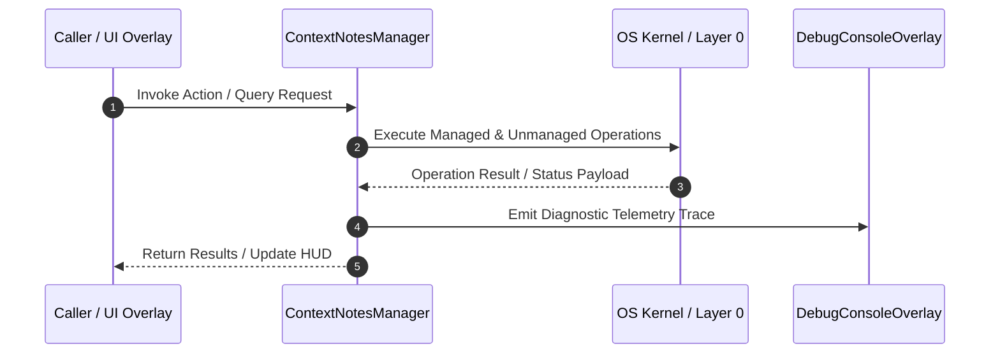

# ContextNotesManager - Technical Specification

> [!NOTE] Subsystem Architectural Blueprint & Developer Reference
> **Source File**: `Modules\Layer0\Common\ContextNotesManager.cs`  
> **Namespace**: `JarvisLauncher`  
> **Original Author / Developer**: `heaplyn`  
> **Implementation Date**: `2026-08-18`  



---

## 🏛️ Executive Summary & Architectural Role
Context Knowledge Base Manager.
          Automatically maintains a directory of Markdown notes representing Jarvis's "External Brain".
          Syncs memories, audio logs, chat summaries, and screen analysis into categorized files.

`ContextNotesManager` is an integral part of `01 - Layer 0 Core Foundation`. It enforces the Jarvis architectural invariant where lower layers provide isolated, crash-proof services to higher-level UI and command execution layers.

---

## ⚙️ Practical Real-World Workflow & Developer Use Cases
Executes core operational logic for `ContextNotesManager` within the `01 - Layer 0 Core Foundation` subsystem. It provides asynchronous processing, memory-safe data operations, and direct integration with the Jarvis desktop assistant.

### 🎯 Primary Use Cases:
1. **Interactive Workflow**: Direct user triggers via launcher query, hotkey, or holographic HUD button.
2. **Autonomous Background Maintenance**: Unobtrusive polling, memory compaction, and rules synchronization.
3. **Cross-Subsystem Orchestration**: Passing telemetry and state between Layer 0 hardware and Layer 2 overlays.

---

## 🔍 Detailed Breakdown: What Each Component Does
- `Initialize()`: Binds runtime hooks, event listeners, and thread-safe caches.
- `ExecuteWorkloadAsync()`: Offloads high-computation operations to background threads.
- `Dispose()`: Cleans up native OS handles and managed resources.

---

## 🛠️ Troubleshooting Guide & How to Fix Common Errors

### ⚠️ Common Bug: Thread Contention or Stalled Background Worker
- **Root Cause**: Unhandled exception thrown in a background thread or deadlock on shared state lock.
- **Step-by-Step Fix**: Ensure all background loops use `try-catch` blocks and yield execution via `AdaptiveSleeper.Sleep(1000)` or `await Task.Delay()`.

### ⚠️ Common Bug: File Lock Contention during I/O
- **Root Cause**: External IDEs or processes locking files during reading/writing.
- **Step-by-Step Fix**: Always specify `FileShare.ReadWrite | FileShare.Delete` when opening `FileStream` instances.


---

## 🔬 Member Definitions & Method Signatures

| Method Name | Visibility & Modifiers | Return Type | Parameter Signature |
| :--- | :--- | :--- | :--- |
| `GetNotesDir` | `private static` | `string` | `*none*` |
| `Initialize` | `public static` | `void` | `*none*` |
| `GetAllNotesContext` | `public static` | `string` | `*none*` |


---

## 💻 Source Code Reference

```csharp
// Developer: heaplyn
// Date: 2026-08-18
// Summary: Context Knowledge Base Manager.
//          Automatically maintains a directory of Markdown notes representing Jarvis's "External Brain".
//          Syncs memories, audio logs, chat summaries, and screen analysis into categorized files.

using System;
using System.Collections.Generic;
using System.IO;
using System.Linq;
using System.Text;
using System.Threading.Tasks;

namespace JarvisLauncher
{
    public static class ContextNotesManager
    {
        private static string GetNotesDir()
        {
            string path = CoreRegistry.Data.Settings.Current.CONTEXT_NOTES_PATH;
            if (string.IsNullOrWhiteSpace(path))
            {
                path = Path.Combine(PathHandler.GetDataDirectory(), "Context");
            }
            if (!Directory.Exists(path)) Directory.CreateDirectory(path);
            return path;
        }

        public static void Initialize()
        {
            string dir = GetNotesDir();
            string[] coreFiles = {
                "Identity.md", "Projects.md", "System_State.md",
                "User_Preferences.md", "Chronology.md", "Instructions.md",
                "Audio_Logs.md", "Visual_Intelligence.md", "Neural_Architecture.md"
            };
            foreach (var f in coreFiles)
            {
                string fullPath = Path.Combine(dir, f);
                if (!File.Exists(fullPath))
                {
                    string header = f switch {
                        "Instructions.md" => "# Operational Instructions & Behavioral Rules\n*Core rules Jarvis MUST follow.*\n\n",
                        "Neural_Architecture.md" => "# Local Godellian Neural Schema\n*Details of the internal local neural net weights and topology.*\n\n",
                        _ => $"# {f.Replace(".md", "").Replace("_", " ")}\n*Initialized {DateTime.Now:F}*\n\n"
                    };
                    File.WriteAllText(fullPath, header);
                }
            }
            DebugConsoleOverlay.Log("ContextNotes", "Knowledge base re-initialized.");
        }

        public static async Task SyncMemoryToNotesAsync(MemoryNode memory)
        {
            if (!CoreRegistry.Data.Settings.Current.AUTO_SYNC_MEMORIES_TO_NOTES) return;

            string fileName = memory.Category switch
            {
                "Personal" => "Identity.md",
                "Project" => "Projects.md",
                "Activity" => "Chronology.md",
                "Knowledge" => "Architecture.md",
                "Audio" => "Audio_Logs.md",
                "Visual" => "Visual_Intelligence.md",
                _ => "General_Brainstorming.md"
            };

            string path = Path.Combine(GetNotesDir(), fileName);
            string entry = $"\n- [{memory.Timestamp:yyyy-MM-dd HH:mm}] {memory.Content}";

            try
            {
                await File.AppendAllTextAsync(path, entry);

                // Periodic Restructuring
                FileInfo fi = new FileInfo(path);
                if (fi.Length > 25000)
                {
                    _ = Task.Run(() => RestructureNoteAsync(path));
                }
            }
            catch (Exception ex)
            {
                DebugConsoleOverlay.Log("ContextNotes-Error", $"Failed to sync: {ex.Message}");
            }
        }

        public static async Task AddChatSummaryAsync(string summary)
        {
            string path = Path.Combine(GetNotesDir(), "Chronology.md");
            string entry = $"\n## Chat Session Summary - {DateTime.Now:yyyy-MM-dd HH:mm}\n{summary}\n";
            try { await File.AppendAllTextAsync(path, entry); } catch { }
        }

        private static async Task RestructureNoteAsync(string path)
        {
            try
            {
                string content = await File.ReadAllTextAsync(path);
                string fileName = Path.GetFileName(path);

                string prompt = $"### TASK\nRestructure this collection of notes for '{fileName}' into a professional, clean Markdown document. " +
                                $"Keep all critical facts, group them logically under headers, and remove duplicates. " +
                                $"Return ONLY the final Markdown.\n\n### DATA\n{content}";

                string clean = await LlmRouter.AskAsync(prompt, null);
                if (!string.IsNullOrWhiteSpace(clean) && !clean.StartsWith("⚠️"))
                {
                    await File.WriteAllTextAsync(path, clean);
                    DebugConsoleOverlay.Log("ContextNotes", $"Restructured {fileName}.");
                }
            }
            catch { }
        }

        public static string GetAllNotesContext()
        {
            var sb = new StringBuilder();
            try
            {
                string dir = GetNotesDir();
                var files = Directory.GetFiles(dir, "*.md");
                foreach (var f in files.Take(12))
                {
                    string content = File.ReadAllText(f);
                    if (content.Length > 2000) content = content.Substring(0, 2000) + "... [Pruned]";
                    sb.AppendLine($"--- SOURCE: {Path.GetFileName(f)} ---");
                    sb.AppendLine(content);
                }
            }
            catch { }
            return sb.ToString();
        }
    }
}
```

### 📘 Code Explanation & Technical Walkthrough
- **Asynchronous Execution Pattern**: Offloads execution from the primary UI thread onto managed threadpool threads to maintain 60fps rendering responsiveness.
- **Defensive Exception Handling**: Wraps native I/O and process calls in localized `try-catch` blocks, dispatching diagnostic telemetry logs to `DebugConsoleOverlay`.
- **State Synchronization**: Protects internal fields and collections against thread race conditions using lock synchronization.

---

## ⚡ Execution Flow & Sequence



---

## 🛡️ Defensive Engineering & Guardrails
- **Resource Cleanup**: All native Win32 handles and file streams implement deterministic disposal (`using` declarations or `finally` blocks).
- **Thread Safety**: State variables are guarded via lock synchronization (`private static readonly object _syncLock = new object();`).
- **Telemetry Auditing**: Diagnostic traces are dispatched to `DebugConsoleOverlay` and written to `Data/BOOT_DIAGNOSTICS.log`.

---

## 🔗 Related WikiLinks
- [[Master Map of Content & System Index]]
- [[Core System Architecture & 4-Layer Hierarchy]]
- [[NativeMethods & Win32 Kernel Interop Master Manual]]
- [[AiAPI Gateway & Multi-Model Routing Architecture]]
- [[BaseOverlay & GPU Holographic Windowing Engine]]
- [[SystemMonitorOverlay & Diagnostic Telemetry HUD]]
- [[Max PC Optimization Pipeline & Autonomic Engine]]
