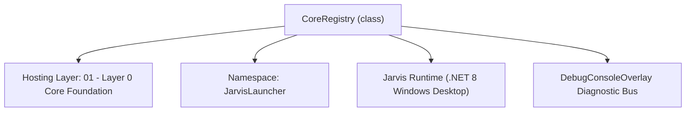
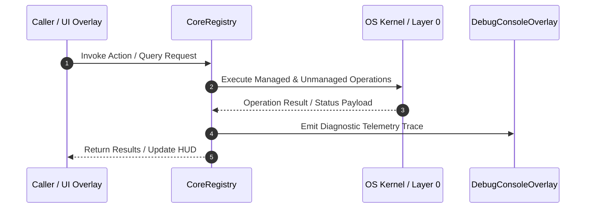

# CoreRegistry - Technical Specification

> [!NOTE] Subsystem Architectural Blueprint & Developer Reference
> **Source File**: `Modules\Layer0\Common\CoreRegistry.cs`  
> **Namespace**: `JarvisLauncher`  
> **Original Author / Developer**: `heaplyn`  
> **Implementation Date**: `2026-08-18`  



---

## 🏛️ Executive Summary & Architectural Role
Centralized service registry for modular components.
          Organized into a logical hierarchy for better maintainability.

`CoreRegistry` is an integral part of `01 - Layer 0 Core Foundation`. It enforces the Jarvis architectural invariant where lower layers provide isolated, crash-proof services to higher-level UI and command execution layers.

---

## ⚙️ Practical Real-World Workflow & Developer Use Cases
Executes core operational logic for `CoreRegistry` within the `01 - Layer 0 Core Foundation` subsystem. It provides asynchronous processing, memory-safe data operations, and direct integration with the Jarvis desktop assistant.

### 🎯 Primary Use Cases:
1. **Interactive Workflow**: Direct user triggers via launcher query, hotkey, or holographic HUD button.
2. **Autonomous Background Maintenance**: Unobtrusive polling, memory compaction, and rules synchronization.
3. **Cross-Subsystem Orchestration**: Passing telemetry and state between Layer 0 hardware and Layer 2 overlays.

---

## 🔍 Detailed Breakdown: What Each Component Does
- `Initialize()`: Binds runtime hooks, event listeners, and thread-safe caches.
- `ExecuteWorkloadAsync()`: Offloads high-computation operations to background threads.
- `Dispose()`: Cleans up native OS handles and managed resources.

---

## 🛠️ Troubleshooting Guide & How to Fix Common Errors

### ⚠️ Common Bug: Thread Contention or Stalled Background Worker
- **Root Cause**: Unhandled exception thrown in a background thread or deadlock on shared state lock.
- **Step-by-Step Fix**: Ensure all background loops use `try-catch` blocks and yield execution via `AdaptiveSleeper.Sleep(1000)` or `await Task.Delay()`.

### ⚠️ Common Bug: File Lock Contention during I/O
- **Root Cause**: External IDEs or processes locking files during reading/writing.
- **Step-by-Step Fix**: Always specify `FileShare.ReadWrite | FileShare.Delete` when opening `FileStream` instances.


---

## 🔬 Member Definitions & Method Signatures

| Method Name | Visibility & Modifiers | Return Type | Parameter Signature |
| :--- | :--- | :--- | :--- |
| `InitializeAll` | `public static` | `void` | `*none*` |
| `InitializeDeferred` | `public static` | `void` | `*none*` |


---

## 💻 Source Code Reference

```csharp
// Developer: heaplyn
// Date: 2026-08-18
// Summary: Centralized service registry for modular components.
//          Organized into a logical hierarchy for better maintainability.

using System;
using System.Threading.Tasks;

namespace JarvisLauncher
{
    public static class CoreRegistry
    {
        // --- DATA & CONFIGURATION ---
        public static class Data
        {
            public static ISettingsService Settings => _settings ??= new SettingsManager();
            public static IMemoryService Memory => _memory ??= new MemoryManager();
            public static IStorageCleanupService StorageCleanup => _storageCleanup ??= new StorageCleanupManager();
        }

        // --- ARTIFICIAL INTELLIGENCE ---
        public static class Intelligence
        {
            public static ILlmService Llm => _llm ??= new LlmService();
            public static IMathEngine Math => _math ??= new MathEngine();
            public static IProjectContextService ProjectContext => _projectContext ??= new ProjectContextManager();
        }

        // --- USER INTERACTION ---
        public static class Interaction
        {
            public static ITtsService Tts => _tts ??= new TtsManager();
            public static IVoiceActivationService Voice => _voice ??= new VoiceActivationManager();
            public static IAutonomousInterjectionService Autonomous => _autonomous ??= new AutonomousInterjectionManager();
        }

        // --- INFRASTRUCTURE ---
        public static class System
        {
            public static IAppScannerService Apps => _apps ??= new WindowsAppScanner();
            public static IWebOperationService Web => _web ??= new WebOperationManager();
        }

        // --- PRIVATE BACKING FIELDS ---
        private static ISettingsService? _settings;
        private static ITtsService? _tts;
        private static IMathEngine? _math;
        private static ILlmService? _llm;
        private static IMemoryService? _memory;
        private static IWebOperationService? _web;
        private static IAppScannerService? _apps;
        private static IAutonomousInterjectionService? _autonomous;
        private static IVoiceActivationService? _voice;
        private static IProjectContextService? _projectContext;
        private static IStorageCleanupService? _storageCleanup;

        public static void InitializeAll()
        {
            // Settings MUST load synchronously — the theme, scheduler, and everything else read it.
            // Nothing else runs here: the heavy initializers are deferred to InitializeDeferred()
            // which the app calls AFTER the HUD is visible, so they don't contend with window
            // construction (running them during boot cost ~1.9s of blocking time).
            Data.Settings.Load();
        }

        private static int _deferredStarted;

        /// <summary>
        /// Heavy, non-UI-critical initializers. Call AFTER the main window is shown so they run in
        /// the background without slowing the HUD's first paint. Idempotent.
        /// </summary>
        public static void InitializeDeferred()
        {
            if (global::System.Threading.Interlocked.CompareExchange(ref _deferredStarted, 1, 0) != 0) return;

            Task.Run(() => {
                var set = Data.Settings.Current;
                if (set == null) return;

                // SECURITY: autonomous interjection is gated by the opt-in flag
                try { if (set.IS_AUTONOMOUS_MODE_ENABLED) Interaction.Autonomous.Start(); } catch { }
                try { if (set.ENABLE_WAKE_WORD) Interaction.Voice.Start(); } catch { }
                try { if (set.AUTO_SYNC_WITH_BACKUP) BackupSyncManager.StartAutoSync(); } catch { }
                
                // Periodic screen perception (feeds the AI's [PERCEPTION CONTEXT])
                try { if (set.ENABLE_SCREEN_PERCEPTION && set.IS_AUTONOMOUS_MODE_ENABLED)
                        ScreenMonitorEngine.Start(set.SCREEN_PERCEPTION_INTERVAL_SEC); } catch { }
                        
                // Slow background filesystem index for AI file reference
                try { if (set.ENABLE_FILE_INDEXING) FileSystemIndexer.Start(); } catch { }
                
                // Ambient AI coding tutor
                try { if (set.IS_TEACHER_MODE_ENABLED) LiveCodingTutorEngine.Start(); } catch { }

                // Trim working set memory after initial boot completes
                try
                {
                    GC.Collect(2, GCCollectionMode.Aggressive, false, false);
                }
                catch { }
            });
        }

        // --- LEGACY REDIRECTS (To prevent immediate breakage) ---
        [Obsolete("Use Data.Settings")] public static ISettingsService Settings => Data.Settings;
        [Obsolete("Use Data.Memory")] public static IMemoryService Memory => Data.Memory;
        [Obsolete("Use Intelligence.Llm")] public static ILlmService Llm => Intelligence.Llm;
        [Obsolete("Use Intelligence.Math")] public static IMathEngine Math => Intelligence.Math;
        [Obsolete("Use Interaction.Tts")] public static ITtsService Tts => Interaction.Tts;
        [Obsolete("Use Interaction.Voice")] public static IVoiceActivationService Voice => Interaction.Voice;
        [Obsolete("Use Interaction.Autonomous")] public static IAutonomousInterjectionService Autonomous => Interaction.Autonomous;
        [Obsolete("Use System.Apps")] public static IAppScannerService Apps => System.Apps;
        [Obsolete("Use System.Web")] public static IWebOperationService Web => System.Web;
        [Obsolete("Use Intelligence.ProjectContext")] public static IProjectContextService ProjectContext => Intelligence.ProjectContext;
        [Obsolete("Use Data.StorageCleanup")] public static IStorageCleanupService StorageCleanup => Data.StorageCleanup;
    }
}
```

### 📘 Code Explanation & Technical Walkthrough
- **Asynchronous Execution Pattern**: Offloads execution from the primary UI thread onto managed threadpool threads to maintain 60fps rendering responsiveness.
- **Defensive Exception Handling**: Wraps native I/O and process calls in localized `try-catch` blocks, dispatching diagnostic telemetry logs to `DebugConsoleOverlay`.
- **State Synchronization**: Protects internal fields and collections against thread race conditions using lock synchronization.

---

## ⚡ Execution Flow & Sequence



---

## 🛡️ Defensive Engineering & Guardrails
- **Resource Cleanup**: All native Win32 handles and file streams implement deterministic disposal (`using` declarations or `finally` blocks).
- **Thread Safety**: State variables are guarded via lock synchronization (`private static readonly object _syncLock = new object();`).
- **Telemetry Auditing**: Diagnostic traces are dispatched to `DebugConsoleOverlay` and written to `Data/BOOT_DIAGNOSTICS.log`.

---

## 🔗 Related WikiLinks
- [[Master Map of Content & System Index]]
- [[Core System Architecture & 4-Layer Hierarchy]]
- [[NativeMethods & Win32 Kernel Interop Master Manual]]
- [[AiAPI Gateway & Multi-Model Routing Architecture]]
- [[BaseOverlay & GPU Holographic Windowing Engine]]
- [[SystemMonitorOverlay & Diagnostic Telemetry HUD]]
- [[Max PC Optimization Pipeline & Autonomic Engine]]
