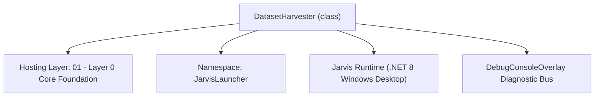
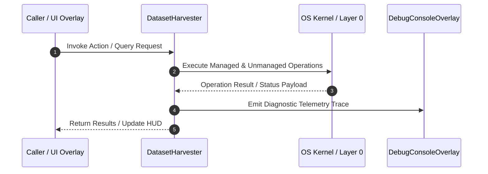

# DatasetHarvester - Technical Specification

> [!NOTE] Subsystem Architectural Blueprint & Developer Reference
> **Source File**: `Modules\Layer0\Common\DatasetHarvester.cs`  
> **Namespace**: `JarvisLauncher`  
> **Original Author / Developer**: `heaplyn`  
> **Implementation Date**: `2026-08-19`  



---

## 🏛️ Executive Summary & Architectural Role
Automated Dataset Harvesting Engine.
          Scrapes curated GitHub repositories and use AI to discover and download high-quality LLM datasets.

`DatasetHarvester` is an integral part of `01 - Layer 0 Core Foundation`. It enforces the Jarvis architectural invariant where lower layers provide isolated, crash-proof services to higher-level UI and command execution layers.

---

## ⚙️ Practical Real-World Workflow & Developer Use Cases
Executes core operational logic for `DatasetHarvester` within the `01 - Layer 0 Core Foundation` subsystem. It provides asynchronous processing, memory-safe data operations, and direct integration with the Jarvis desktop assistant.

### 🎯 Primary Use Cases:
1. **Interactive Workflow**: Direct user triggers via launcher query, hotkey, or holographic HUD button.
2. **Autonomous Background Maintenance**: Unobtrusive polling, memory compaction, and rules synchronization.
3. **Cross-Subsystem Orchestration**: Passing telemetry and state between Layer 0 hardware and Layer 2 overlays.

---

## 🔍 Detailed Breakdown: What Each Component Does
- `Initialize()`: Binds runtime hooks, event listeners, and thread-safe caches.
- `ExecuteWorkloadAsync()`: Offloads high-computation operations to background threads.
- `Dispose()`: Cleans up native OS handles and managed resources.

---

## 🛠️ Troubleshooting Guide & How to Fix Common Errors

### ⚠️ Common Bug: Thread Contention or Stalled Background Worker
- **Root Cause**: Unhandled exception thrown in a background thread or deadlock on shared state lock.
- **Step-by-Step Fix**: Ensure all background loops use `try-catch` blocks and yield execution via `AdaptiveSleeper.Sleep(1000)` or `await Task.Delay()`.

### ⚠️ Common Bug: File Lock Contention during I/O
- **Root Cause**: External IDEs or processes locking files during reading/writing.
- **Step-by-Step Fix**: Always specify `FileShare.ReadWrite | FileShare.Delete` when opening `FileStream` instances.


---

## 🔬 Member Definitions & Method Signatures

| Method Name | Visibility & Modifiers | Return Type | Parameter Signature |
| :--- | :--- | :--- | :--- |
| `ExtractRepoId` | `private static` | `string` | `string url` |
| `ParseSection` | `private static` | `List<string>` | `string text, string marker` |


---

## 💻 Source Code Reference

```csharp
// Developer: heaplyn
// Date: 2026-08-19
// Summary: Automated Dataset Harvesting Engine.
//          Scrapes curated GitHub repositories and use AI to discover and download high-quality LLM datasets.

using System;
using System.Collections.Generic;
using System.Linq;
using System.Text.RegularExpressions;
using System.Threading.Tasks;

namespace JarvisLauncher
{
    public static class DatasetHarvester
    {
        private const string PrimarySeedUrl = "https://github.com/mlabonne/llm-datasets";
        private static readonly List<string> _discoveredDatasets = new List<string>();
        private static bool _isProcessing = false;

        public static async Task RunAutomaticHarvestAsync()
        {
            if (_isProcessing) return;
            _isProcessing = true;

            try
            {
                DebugConsoleOverlay.Log("Dataset-Harvester", "Initiating autonomous dataset discovery...");

                // 1. Scrape Primary Seed
                var scrape = await WebScraperManager.ScrapePageAsync(PrimarySeedUrl);

                // 2. Extract Hugging Face links using Regex
                var hfLinks = scrape.Links
                    .Where(l => l.Href.Contains("huggingface.co/datasets/"))
                    .Select(l => ExtractRepoId(l.Href))
                    .Where(id => !string.IsNullOrEmpty(id))
                    .Distinct()
                    .ToList();

                DebugConsoleOverlay.Log("Dataset-Harvester", $"Found {hfLinks.Count} initial datasets on seed page.");

                // 3. Use AI to prioritize or suggest new search terms
                string prompt = "### DATASET HARVESTER\n" +
                                "Sir, I've found these datasets on GitHub:\n" +
                                $"{string.Join(", ", hfLinks.Take(20))}\n\n" +
                                "### TASK\n" +
                                "1. Identify the 3 most important ones for general LLM fine-tuning.\n" +
                                "2. Suggest 5 new 'search keywords' for Hugging Face to find more cutting-edge datasets.\n" +
                                "Format: [PRIORITY]: id1, id2... [SEARCH]: keyword1, keyword2...";

                string response = await LlmRouter.AskAsync(prompt);

                // 4. Parse AI Response
                var priorities = ParseSection(response, "[PRIORITY]:");
                var newKeywords = ParseSection(response, "[SEARCH]:");

                // 5. Download Priorities (limit to avoid disk blowup)
                foreach (var id in priorities.Take(2))
                {
                    if (!_discoveredDatasets.Contains(id))
                    {
                        DebugConsoleOverlay.Log("Dataset-Harvester", $"AI prioritized dataset: {id}. Triggering download.");
                        HuggingFaceManager.DownloadModelRepo(id, repoType: "dataset");
                        _discoveredDatasets.Add(id);
                    }
                }

                // 6. Perform Secondary Search based on AI suggestions
                foreach (var keyword in newKeywords.Take(3))
                {
                    DebugConsoleOverlay.Log("Dataset-Harvester", $"Performing secondary search for: '{keyword}'");
                    // We can reuse HuggingFaceManager.SearchModelsAsync but for datasets
                    // Actually SearchModelsAsync currently uses /api/models, we might need /api/datasets
                    await SearchAndDownloadDatasetsAsync(keyword);
                }
            }
            catch (Exception ex)
            {
                DebugConsoleOverlay.Log("Dataset-Harvester-Error", $"Harvest failed: {ex.Message}");
            }
            finally
            {
                _isProcessing = false;
            }
        }

        private static string ExtractRepoId(string url)
        {
            // Example: https://huggingface.co/datasets/mlabonne/FineTome-100k
            var match = Regex.Match(url, @"huggingface\.co/datasets/([^/\s?#]+/[^/\s?#]+)");
            return match.Success ? match.Groups[1].Value : string.Empty;
        }

        private static List<string> ParseSection(string text, string marker)
        {
            if (!text.Contains(marker)) return new List<string>();
            var part = text.Split(marker)[1].Split('\n')[0];
            return part.Split(',').Select(s => s.Trim()).Where(s => !string.IsNullOrEmpty(s)).ToList();
        }

        private static async Task SearchAndDownloadDatasetsAsync(string keyword)
        {
            try
            {
                // Similar to HuggingFaceManager.SearchModelsAsync but for datasets
                using var client = new System.Net.Http.HttpClient();
                client.DefaultRequestHeaders.Add("User-Agent", "JarvisLauncher/1.0");
                string url = $"https://huggingface.co/api/datasets?search={Uri.EscapeDataString(keyword)}&limit=5&sort=downloads&direction=-1";

                string json = await client.GetStringAsync(url);
                using var doc = System.Text.Json.JsonDocument.Parse(json);

                foreach (var item in doc.RootElement.EnumerateArray())
                {
                    string id = item.GetProperty("id").GetString() ?? "";
                    if (!string.IsNullOrEmpty(id) && !_discoveredDatasets.Contains(id))
                    {
                        DebugConsoleOverlay.Log("Dataset-Harvester", $"Discovered new dataset via '{keyword}': {id}");
                        // For auto-evolution, we might not want to download EVERY discovered thing automatically
                        // to save space, but the user asked to "download them".
                        // I'll limit to 1 from each search to be safe.
                        HuggingFaceManager.DownloadModelRepo(id, repoType: "dataset");
                        _discoveredDatasets.Add(id);
                        break;
                    }
                }
            }
            catch { }
        }
    }
}
```

### 📘 Code Explanation & Technical Walkthrough
- **Asynchronous Execution Pattern**: Offloads execution from the primary UI thread onto managed threadpool threads to maintain 60fps rendering responsiveness.
- **Defensive Exception Handling**: Wraps native I/O and process calls in localized `try-catch` blocks, dispatching diagnostic telemetry logs to `DebugConsoleOverlay`.
- **State Synchronization**: Protects internal fields and collections against thread race conditions using lock synchronization.

---

## ⚡ Execution Flow & Sequence



---

## 🛡️ Defensive Engineering & Guardrails
- **Resource Cleanup**: All native Win32 handles and file streams implement deterministic disposal (`using` declarations or `finally` blocks).
- **Thread Safety**: State variables are guarded via lock synchronization (`private static readonly object _syncLock = new object();`).
- **Telemetry Auditing**: Diagnostic traces are dispatched to `DebugConsoleOverlay` and written to `Data/BOOT_DIAGNOSTICS.log`.

---

## 🔗 Related WikiLinks
- [[Master Map of Content & System Index]]
- [[Core System Architecture & 4-Layer Hierarchy]]
- [[NativeMethods & Win32 Kernel Interop Master Manual]]
- [[AiAPI Gateway & Multi-Model Routing Architecture]]
- [[BaseOverlay & GPU Holographic Windowing Engine]]
- [[SystemMonitorOverlay & Diagnostic Telemetry HUD]]
- [[Max PC Optimization Pipeline & Autonomic Engine]]
