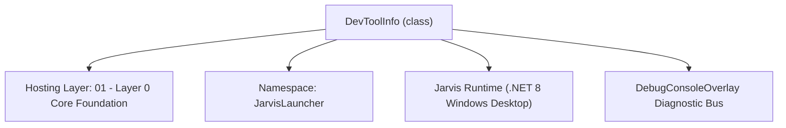
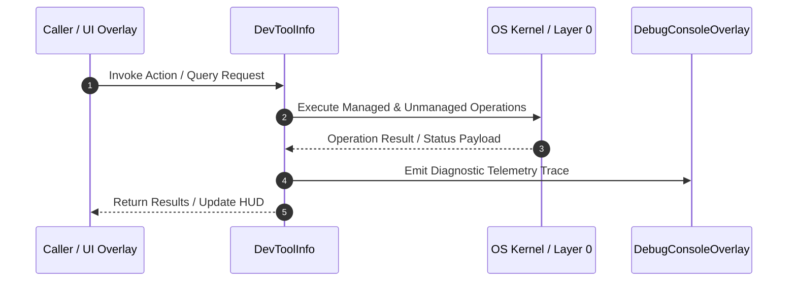

# DevSuiteManager - Technical Specification

> [!NOTE] Subsystem Architectural Blueprint & Developer Reference
> **Source File**: `Modules\Layer0\Common\DevSuiteManager.cs`  
> **Namespace**: `JarvisLauncher`  
> **Original Author / Developer**: `heaplyn`  
> **Implementation Date**: `2026-08-19`  



---

## 🏛️ Executive Summary & Architectural Role
Universal Developer & Offline Suite Manager.
          Orchestrates installation and verification of languages, package managers, and game engines.
          Primary engine: Windows Package Manager (winget).

`DevToolInfo` is an integral part of `01 - Layer 0 Core Foundation`. It enforces the Jarvis architectural invariant where lower layers provide isolated, crash-proof services to higher-level UI and command execution layers.

---

## ⚙️ Practical Real-World Workflow & Developer Use Cases
Executes core operational logic for `DevSuiteManager` within the `01 - Layer 0 Core Foundation` subsystem. It provides asynchronous processing, memory-safe data operations, and direct integration with the Jarvis desktop assistant.

### 🎯 Primary Use Cases:
1. **Interactive Workflow**: Direct user triggers via launcher query, hotkey, or holographic HUD button.
2. **Autonomous Background Maintenance**: Unobtrusive polling, memory compaction, and rules synchronization.
3. **Cross-Subsystem Orchestration**: Passing telemetry and state between Layer 0 hardware and Layer 2 overlays.

---

## 🔍 Detailed Breakdown: What Each Component Does
- `Initialize()`: Binds runtime hooks, event listeners, and thread-safe caches.
- `ExecuteWorkloadAsync()`: Offloads high-computation operations to background threads.
- `Dispose()`: Cleans up native OS handles and managed resources.

---

## 🛠️ Troubleshooting Guide & How to Fix Common Errors

### ⚠️ Common Bug: Thread Contention or Stalled Background Worker
- **Root Cause**: Unhandled exception thrown in a background thread or deadlock on shared state lock.
- **Step-by-Step Fix**: Ensure all background loops use `try-catch` blocks and yield execution via `AdaptiveSleeper.Sleep(1000)` or `await Task.Delay()`.

### ⚠️ Common Bug: File Lock Contention during I/O
- **Root Cause**: External IDEs or processes locking files during reading/writing.
- **Step-by-Step Fix**: Always specify `FileShare.ReadWrite | FileShare.Delete` when opening `FileStream` instances.


---

## 🔬 Member Definitions & Method Signatures

| Method Name | Visibility & Modifiers | Return Type | Parameter Signature |
| :--- | :--- | :--- | :--- |
| `InitializeToolList` | `private static` | `void` | `*none*` |
| `AddTool` | `private static` | `void` | `string id, string name, string cat, string desc, string winget` |
| `GetAllTools` | `public static` | `List<DevToolInfo>` | `*none*` |
| `InstallAllMissing` | `public static` | `void` | `*none*` |
| `InstallTool` | `public static` | `void` | `string wingetId` |
| `UninstallTool` | `public static` | `void` | `string wingetId` |


---

## 💻 Source Code Reference

```csharp
// Developer: heaplyn
// Date: 2026-08-19
// Summary: Universal Developer & Offline Suite Manager.
//          Orchestrates installation and verification of languages, package managers, and game engines.
//          Primary engine: Windows Package Manager (winget).

using System;
using System.Collections.Generic;
using System.Diagnostics;
using System.IO;
using System.Linq;
using System.Text;
using System.Threading.Tasks;

namespace JarvisLauncher
{
    public class DevToolInfo
    {
        public string Id { get; set; } = "";
        public string Name { get; set; } = "";
        public string Category { get; set; } = "";
        public string Description { get; set; } = "";
        public string WingetId { get; set; } = "";
        public bool IsInstalled { get; set; } = false;
        public string Version { get; set; } = "Unknown";
    }

    public static class DevSuiteManager
    {
        private static readonly List<DevToolInfo> _tools = new();

        static DevSuiteManager()
        {
            InitializeToolList();
        }

        private static void InitializeToolList()
        {
            // --- LANGUAGES ---
            AddTool("Python", "Python 3.12", "Language", "Python Programming Language", "Python.Python.3.12");
            AddTool("NodeJS", "Node.js (LTS)", "Language", "JavaScript Runtime", "OpenJS.NodeJS.LTS");
            AddTool("Rust", "Rust (rustup)", "Language", "Rust Programming Language", "Rustlang.Rustup");
            AddTool("Go", "Go Programming Language", "Language", "Go Programming Language", "Google.Go");
            AddTool("OpenJDK", "OpenJDK 21", "Language", "Java Development Kit", "RedHat.OpenJDK.21");
            AddTool("DotnetSDK", ".NET 8 SDK", "Language", "C#, F#, and VB.NET development", "Microsoft.DotNet.SDK.8");
            AddTool("CppBuildTools", "C++ Build Tools", "Language", "MSVC, CMake, and Windows SDK", "Microsoft.VisualStudio.2022.BuildTools");
            AddTool("LLVM", "LLVM / Clang", "Language", "C/C++ compiler and toolchain", "LLVM.LLVM");
            AddTool("Mingw", "MinGW-w64", "Language", "GCC for Windows", "msys2.mingw.w64");
            AddTool("NASM", "NASM Assembly", "Language", "Netwide Assembler", "NASM.NASM");

            // --- PACKAGE MANAGERS ---
            AddTool("Choco", "Chocolatey", "Package Manager", "The Windows Package Manager", "Chocolatey.Chocolatey");
            AddTool("Scoop", "Scoop", "Package Manager", "A command-line installer for Windows", "Scoop.Scoop");

            // --- GAME ENGINES ---
            AddTool("Unity", "Unity Hub", "Game Engine", "Unity Game Engine Management", "Unity.UnityHub");
            AddTool("Epic", "Epic Games Launcher", "Game Engine", "Epic Games & Unreal Engine", "EpicGames.EpicGamesLauncher");
            AddTool("Godot", "Godot Engine", "Game Engine", "Free, open-source 2D/3D engine", "GodotEngine.GodotEngine");
            AddTool("Roblox", "Roblox Studio", "Game Engine", "Creation tool for Roblox", "Roblox.RobloxStudio");
            AddTool("Lumberyard", "Open 3D Engine", "Game Engine", "Successor to Amazon Lumberyard", "Open3DEngine.O3DE");

            // --- IDEs & EDITORS ---
            AddTool("VSCode", "VS Code", "IDE", "Visual Studio Code", "Microsoft.VisualStudioCode");
            AddTool("VisualStudio", "Visual Studio Community", "IDE", "Full C# / C++ IDE", "Microsoft.VisualStudio.2022.Community");
            AddTool("SublimeText", "Sublime Text", "IDE", "Sophisticated text editor", "SublimeHQ.SublimeText.4");
            AddTool("JetBrainsToolbox", "JetBrains Toolbox", "IDE", "Manage IntelliJ, PyCharm, ReSharper", "JetBrains.Toolbox");
            AddTool("PyCharm", "PyCharm Community", "IDE", "Python IDE", "JetBrains.PyCharm.Community");
            AddTool("IntelliJ", "IntelliJ IDEA Community", "IDE", "Java/Kotlin IDE", "JetBrains.IntelliJIDEA.Community");
            AddTool("Vim", "Vim", "IDE", "The ubiquitous text editor", "vim.vim");

            // --- DATABASE & SQL ---
            AddTool("PostgreSQL", "PostgreSQL 16", "Database", "Relational database system", "PostgreSQL.PostgreSQL.16");
            AddTool("MySQL", "MySQL Community Server", "Database", "The world's most popular open source database", "Oracle.MySQL");
            AddTool("SQLite", "SQLite Tools", "Database", "Command-line shell for SQLite", "SQLite.SQLite");
            AddTool("MongoDB", "MongoDB Community", "Database", "NoSQL document database", "MongoDB.Server");
            AddTool("AzureDataStudio", "Azure Data Studio", "Database", "Data management tool for SQL Server", "Microsoft.AzureDataStudio");
            AddTool("HeidiSQL", "MySQL / MariaDB / SQL Server", "Database", "Lightweight SQL editor", "AnsgarBecker.HeidiSQL");
            AddTool("DBeaver", "DBeaver Community", "Database", "Universal database tool", "dbeaver.dbeaver");
            AddTool("Redis", "Redis for Windows", "Database", "In-memory data structure store", "Microsoft.OpenTech.Redis");

            // --- BROWSERS ---
            AddTool("Chrome", "Google Chrome", "Browser", "Fast, secure, and free browser", "Google.Chrome");
            AddTool("Firefox", "Mozilla Firefox", "Browser", "Privacy-focused browser", "Mozilla.Firefox");
            AddTool("Brave", "Brave Browser", "Browser", "Privacy-focused ad-blocking browser", "Brave.Brave");

            // --- SYSTEM & VIRTUALIZATION ---
            AddTool("VirtualBox", "Oracle VirtualBox", "Virtualization", "X86 and AMD64/Intel64 virtualization", "Oracle.VirtualBox");
            AddTool("VMwarePlayer", "VMware Workstation Player", "Virtualization", "Local desktop virtualization", "VMware.WorkstationPlayer");
            AddTool("Putty", "PuTTY", "Utility", "SSH and telnet client", "PuTTY.PuTTY");
            AddTool("WinSCP", "WinSCP", "Utility", "SFTP and FTP client", "WinSCP.WinSCP");
            AddTool("Steam", "Steam", "Gaming", "Digital distribution platform by Valve", "Valve.Steam");
            AddTool("EpicGames", "Epic Games Launcher", "Gaming", "Epic Games store and Unreal Engine", "EpicGames.EpicGamesLauncher");
            AddTool("Zoom", "Zoom", "Chat", "Video conferencing and meetings", "Zoom.Zoom");
            AddTool("Teams", "Microsoft Teams", "Chat", "Collaboration and communication", "Microsoft.Teams");
            AddTool("PowerShell7", "PowerShell 7", "Tool", "Cross-platform shell and scripting", "Microsoft.PowerShell");
            AddTool("Python3", "Python 3.12", "Language", "Latest Python 3 environment", "Python.Python.3.12");
        }

        private static void AddTool(string id, string name, string cat, string desc, string winget)
        {
            _tools.Add(new DevToolInfo { Id = id, Name = name, Category = cat, Description = desc, WingetId = winget });
        }

        public static List<DevToolInfo> GetAllTools() => _tools;

        public static async Task RefreshInstallationStatusAsync()
        {
            try
            {
                // Bulk check via one winget command to avoid massive lag
                var psi = new ProcessStartInfo
                {
                    FileName = "winget",
                    Arguments = "list",
                    RedirectStandardOutput = true,
                    UseShellExecute = false,
                    CreateNoWindow = true
                };
                using var proc = Process.Start(psi);
                if (proc == null) return;
                string output = await proc.StandardOutput.ReadToEndAsync();
                await proc.WaitForExitAsync();

                foreach (var tool in _tools)
                {
                    tool.IsInstalled = output.Contains(tool.WingetId, StringComparison.OrdinalIgnoreCase);
                }
            }
            catch
            {
                // Fallback to slower individual checks if bulk fails
                foreach (var tool in _tools)
                {
                    tool.IsInstalled = await CheckIfInstalledAsync(tool.WingetId);
                }
            }
        }

        public static void InstallAllMissing()
        {
            var missing = _tools.Where(t => !t.IsInstalled).ToList();
            if (!missing.Any()) { TextOverlay.Show("All tools in suite are already installed!", 3000); return; }

            TextOverlay.Show($"📥 Batch-installing {missing.Count} tools in background...", 5000);

            var sb = new StringBuilder();
            sb.AppendLine("@echo off");
            sb.AppendLine("echo [SYSTEM] Starting massive batch installation of developer tools...");
            foreach (var tool in missing)
            {
                sb.AppendLine($"echo [INSTALL] {tool.Name} ({tool.WingetId})...");
                sb.AppendLine($"winget install --id {tool.WingetId} --silent --accept-source-agreements --accept-package-agreements");
            }
            sb.AppendLine("echo [COMPLETE] All requested tools have been queued for installation.");
            sb.AppendLine("pause");

            string tempBat = Path.Combine(Path.GetTempPath(), "jarvis_batch_install.bat");
            File.WriteAllText(tempBat, sb.ToString());

            Process.Start(new ProcessStartInfo
            {
                FileName = "cmd.exe",
                Arguments = $"/c \"{tempBat}\"",
                CreateNoWindow = false,
                UseShellExecute = true
            });
        }

        public static async Task<bool> CheckIfInstalledAsync(string wingetId)
        {
            try
            {
                var psi = new ProcessStartInfo
                {
                    FileName = "winget",
                    Arguments = $"list --id {wingetId}",
                    RedirectStandardOutput = true,
                    UseShellExecute = false,
                    CreateNoWindow = true
                };
                using var proc = Process.Start(psi);
                if (proc == null) return false;
                string output = await proc.StandardOutput.ReadToEndAsync();
                await proc.WaitForExitAsync();
                return output.Contains(wingetId);
            }
            catch { return false; }
        }

        public static void InstallTool(string wingetId)
        {
            TextOverlay.Show($"📥 Initiating installation of {wingetId}...", 4000);
            Process.Start("cmd.exe", $"/c start cmd /k \"echo Installing {wingetId} via Winget... & winget install --id {wingetId} --silent --accept-source-agreements --accept-package-agreements & echo Installation triggered! & pause\"");
        }

        public static void UninstallTool(string wingetId)
        {
            TextOverlay.Show($"🗑️ Initiating uninstallation of {wingetId}...", 4000);
            Process.Start("cmd.exe", $"/c start cmd /k \"echo Uninstalling {wingetId}... & winget uninstall --id {wingetId} & echo Uninstall triggered! & pause\"");
        }

        public static async Task<string> RunGenericCommandAsync(string cmd)
        {
            try
            {
                var psi = new ProcessStartInfo
                {
                    FileName = "powershell.exe",
                    Arguments = $"-NoProfile -Command \"{cmd}\"",
                    RedirectStandardOutput = true,
                    RedirectStandardError = true,
                    UseShellExecute = false,
                    CreateNoWindow = true
                };
                using var proc = Process.Start(psi);
                if (proc == null) return "Failed to start process.";
                string outStr = await proc.StandardOutput.ReadToEndAsync();
                string errStr = await proc.StandardError.ReadToEndAsync();
                await proc.WaitForExitAsync();
                return string.IsNullOrWhiteSpace(outStr) ? errStr : outStr;
            }
            catch (Exception ex) { return $"Error: {ex.Message}"; }
        }
    }
}
```

### 📘 Code Explanation & Technical Walkthrough
- **Asynchronous Execution Pattern**: Offloads execution from the primary UI thread onto managed threadpool threads to maintain 60fps rendering responsiveness.
- **Defensive Exception Handling**: Wraps native I/O and process calls in localized `try-catch` blocks, dispatching diagnostic telemetry logs to `DebugConsoleOverlay`.
- **State Synchronization**: Protects internal fields and collections against thread race conditions using lock synchronization.

---

## ⚡ Execution Flow & Sequence



---

## 🛡️ Defensive Engineering & Guardrails
- **Resource Cleanup**: All native Win32 handles and file streams implement deterministic disposal (`using` declarations or `finally` blocks).
- **Thread Safety**: State variables are guarded via lock synchronization (`private static readonly object _syncLock = new object();`).
- **Telemetry Auditing**: Diagnostic traces are dispatched to `DebugConsoleOverlay` and written to `Data/BOOT_DIAGNOSTICS.log`.

---

## 🔗 Related WikiLinks
- [[Master Map of Content & System Index]]
- [[Core System Architecture & 4-Layer Hierarchy]]
- [[NativeMethods & Win32 Kernel Interop Master Manual]]
- [[AiAPI Gateway & Multi-Model Routing Architecture]]
- [[BaseOverlay & GPU Holographic Windowing Engine]]
- [[SystemMonitorOverlay & Diagnostic Telemetry HUD]]
- [[Max PC Optimization Pipeline & Autonomic Engine]]
