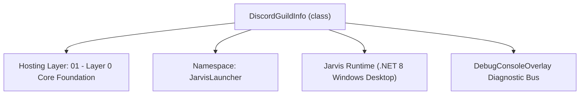
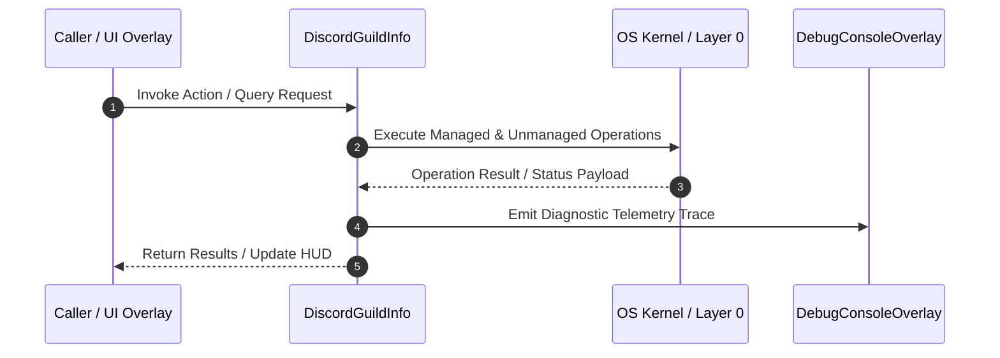

# DiscordScraperManager - Technical Specification

> [!NOTE] Subsystem Architectural Blueprint & Developer Reference
> **Source File**: `Modules\Layer0\WebScraping\DiscordScraperManager.cs`  
> **Namespace**: `JarvisLauncher`  
> **Original Author / Developer**: `copilot`  
> **Implementation Date**: `2026-08-12`  



---

## 🏛️ Executive Summary & Architectural Role
Discord server reader using the official Discord Bot API (Bot token only).
 NOTE: Requires a real bot application registered at discord.com/developers, invited to your own
 server with "Read Message History" permission. Automating a personal user account ("self-botting")
 violates Discord's Terms of Service and is intentionally NOT supported here.

`DiscordGuildInfo` is an integral part of `01 - Layer 0 Core Foundation`. It enforces the Jarvis architectural invariant where lower layers provide isolated, crash-proof services to higher-level UI and command execution layers.

---

## ⚙️ Practical Real-World Workflow & Developer Use Cases
Executes core operational logic for `DiscordScraperManager` within the `01 - Layer 0 Core Foundation` subsystem. It provides asynchronous processing, memory-safe data operations, and direct integration with the Jarvis desktop assistant.

### 🎯 Primary Use Cases:
1. **Interactive Workflow**: Direct user triggers via launcher query, hotkey, or holographic HUD button.
2. **Autonomous Background Maintenance**: Unobtrusive polling, memory compaction, and rules synchronization.
3. **Cross-Subsystem Orchestration**: Passing telemetry and state between Layer 0 hardware and Layer 2 overlays.

---

## 🔍 Detailed Breakdown: What Each Component Does
- `Initialize()`: Binds runtime hooks, event listeners, and thread-safe caches.
- `ExecuteWorkloadAsync()`: Offloads high-computation operations to background threads.
- `Dispose()`: Cleans up native OS handles and managed resources.

---

## 🛠️ Troubleshooting Guide & How to Fix Common Errors

### ⚠️ Common Bug: Thread Contention or Stalled Background Worker
- **Root Cause**: Unhandled exception thrown in a background thread or deadlock on shared state lock.
- **Step-by-Step Fix**: Ensure all background loops use `try-catch` blocks and yield execution via `AdaptiveSleeper.Sleep(1000)` or `await Task.Delay()`.

### ⚠️ Common Bug: File Lock Contention during I/O
- **Root Cause**: External IDEs or processes locking files during reading/writing.
- **Step-by-Step Fix**: Always specify `FileShare.ReadWrite | FileShare.Delete` when opening `FileStream` instances.


---

## 🔬 Member Definitions & Method Signatures

| Method Name | Visibility & Modifiers | Return Type | Parameter Signature |
| :--- | :--- | :--- | :--- |
| `SaveBotToken` | `public static` | `void` | `string token` |
| `BuildRequest` | `private static` | `HttpRequestMessage` | `string path` |


---

## 💻 Source Code Reference

```csharp
// Developer: copilot
// Date: 2026-08-12
// Summary: Discord server reader using the official Discord Bot API (Bot token only).
// NOTE: Requires a real bot application registered at discord.com/developers, invited to your own
// server with "Read Message History" permission. Automating a personal user account ("self-botting")
// violates Discord's Terms of Service and is intentionally NOT supported here.

using System;
using System.Collections.Generic;
using System.Net.Http;
using System.Net.Http.Headers;
using System.Text.Json;
using System.Text;
using System.IO;
using System.Threading.Tasks;
using NetCord;

namespace JarvisLauncher
{
    public class DiscordGuildInfo
    {
        public string Id { get; set; } = string.Empty;
        public string Name { get; set; } = string.Empty;
    }

    public class DiscordChannelInfo
    {
        public string Id { get; set; } = string.Empty;
        public string Name { get; set; } = string.Empty;
        public int Type { get; set; }
    }

    public class DiscordMessageInfo
    {
        public string Author { get; set; } = string.Empty;
        public string Content { get; set; } = string.Empty;
        public string Timestamp { get; set; } = string.Empty;
    }

    public static class DiscordScraperManager
    {
        private const string ApiBase = "https://discord.com/api/v10";
        private static readonly HttpClient _client = new HttpClient();

        public static bool HasToken => !string.IsNullOrWhiteSpace(SettingsManager.Current.DISCORD_BOT_TOKEN);

        public static void SaveBotToken(string token)
        {
            SettingsManager.Current.DISCORD_BOT_TOKEN = token.Trim();
            SettingsManager.Save();
        }

        private static HttpRequestMessage BuildRequest(string path)
        {
            var req = new HttpRequestMessage(HttpMethod.Get, $"{ApiBase}{path}");
            req.Headers.Authorization = new AuthenticationHeaderValue("Bot", SettingsManager.Current.DISCORD_BOT_TOKEN.Trim());
            req.Headers.Accept.Add(new MediaTypeWithQualityHeaderValue("application/json"));
            return req;
        }

        private static async Task<JsonElement> SendAsync(string path)
        {
            if (!HasToken) throw new InvalidOperationException("No Discord bot token configured. Use 'discord token <token>' first.");

            using var resp = await _client.SendAsync(BuildRequest(path));
            string body = await resp.Content.ReadAsStringAsync();

            if (!resp.IsSuccessStatusCode)
                throw new Exception($"Discord API error {(int)resp.StatusCode}: {body}");

            return JsonDocument.Parse(body).RootElement.Clone();
        }

        public static async Task<List<DiscordGuildInfo>> GetGuildsAsync()
        {
            var root = await SendAsync("/users/@me/guilds");
            var guilds = new List<DiscordGuildInfo>();
            foreach (var g in root.EnumerateArray())
            {
                guilds.Add(new DiscordGuildInfo
                {
                    Id = g.GetProperty("id").GetString() ?? "",
                    Name = g.GetProperty("name").GetString() ?? ""
                });
            }
            return guilds;
        }

        public static async Task<List<DiscordChannelInfo>> GetChannelsAsync(string guildId)
        {
            var root = await SendAsync($"/guilds/{guildId}/channels");
            var channels = new List<DiscordChannelInfo>();
            foreach (var c in root.EnumerateArray())
            {
                int type = c.TryGetProperty("type", out var t) ? t.GetInt32() : -1;
                // Type 0 = GUILD_TEXT, 5 = GUILD_ANNOUNCEMENT
                if (type != 0 && type != 5) continue;

                channels.Add(new DiscordChannelInfo
                {
                    Id = c.GetProperty("id").GetString() ?? "",
                    Name = c.TryGetProperty("name", out var n) ? n.GetString() ?? "" : "",
                    Type = type
                });
            }
            return channels;
        }

        public static async Task<List<DiscordMessageInfo>> GetRecentMessagesAsync(string channelId, int limit = 25)
        {
            limit = Math.Clamp(limit, 1, 100);
            var root = await SendAsync($"/channels/{channelId}/messages?limit={limit}");
            var messages = new List<DiscordMessageInfo>();

            foreach (var m in root.EnumerateArray())
            {
                string author = m.TryGetProperty("author", out var a) && a.TryGetProperty("username", out var u) ? u.GetString() ?? "Unknown" : "Unknown";
                string content = m.TryGetProperty("content", out var c) ? c.GetString() ?? "" : "";
                string timestamp = m.TryGetProperty("timestamp", out var ts) ? ts.GetString() ?? "" : "";
                messages.Add(new DiscordMessageInfo { Author = author, Content = content, Timestamp = timestamp });
            }

            messages.Reverse(); // Discord returns newest-first; show chronological order
            return messages;
        }

        public static async Task<List<DiscordChannelInfo>> GetDMsAsync()
        {
            var root = await SendAsync("/users/@me/channels");
            var channels = new List<DiscordChannelInfo>();
            foreach (var c in root.EnumerateArray())
            {
                // Type 1 = DM, 3 = GROUP_DM
                int type = c.TryGetProperty("type", out var t) ? t.GetInt32() : -1;
                string recipientsName = "";

                if (c.TryGetProperty("recipients", out var recs) && recs.ValueKind == JsonValueKind.Array)
                {
                    var names = new List<string>();
                    foreach (var r in recs.EnumerateArray())
                    {
                        if (r.TryGetProperty("username", out var u))
                        {
                            names.Add(u.GetString() ?? "");
                        }
                    }
                    recipientsName = string.Join(", ", names);
                }

                channels.Add(new DiscordChannelInfo
                {
                    Id = c.GetProperty("id").GetString() ?? "",
                    Name = string.IsNullOrEmpty(recipientsName) ? "DM Channel" : recipientsName,
                    Type = type
                });
            }
            return channels;
        }

        public static async Task<string> ExportChannelMessagesToFileAsync(string channelId, string channelName, int limit = 100)
        {
            var messages = await GetRecentMessagesAsync(channelId, limit);
            string downloadDir = SettingsManager.Current.DOWNLOAD_DIRECTORY;
            if (string.IsNullOrEmpty(downloadDir))
            {
                downloadDir = Path.Combine(Environment.GetFolderPath(Environment.SpecialFolder.UserProfile), "Downloads");
            }
            Directory.CreateDirectory(downloadDir);

            string safeName = string.Join("_", channelName.Split(Path.GetInvalidFileNameChars()));
            string filePath = Path.Combine(downloadDir, $"Discord_{safeName}_{DateTime.Now:yyyyMMdd_HHmmss}.md");

            var sb = new StringBuilder();
            sb.AppendLine($"# Discord Chat Logs: {channelName}");
            sb.AppendLine($"Exported At: {DateTime.Now:yyyy-MM-dd HH:mm:ss}");
            sb.AppendLine($"Channel ID: {channelId}");
            sb.AppendLine($"Message Count: {messages.Count}");
            sb.AppendLine();
            sb.AppendLine("---");
            sb.AppendLine();

            foreach (var msg in messages)
            {
                string cleanTime = msg.Timestamp;
                if (DateTime.TryParse(msg.Timestamp, out var dt))
                {
                    cleanTime = dt.ToString("yyyy-MM-dd HH:mm:ss");
                }
                sb.AppendLine($"**[{cleanTime}] {msg.Author}:** {msg.Content}");
                sb.AppendLine();
            }

            await File.WriteAllTextAsync(filePath, sb.ToString());
            return filePath;
        }
    }
}
```

### 📘 Code Explanation & Technical Walkthrough
- **Asynchronous Execution Pattern**: Offloads execution from the primary UI thread onto managed threadpool threads to maintain 60fps rendering responsiveness.
- **Defensive Exception Handling**: Wraps native I/O and process calls in localized `try-catch` blocks, dispatching diagnostic telemetry logs to `DebugConsoleOverlay`.
- **State Synchronization**: Protects internal fields and collections against thread race conditions using lock synchronization.

---

## ⚡ Execution Flow & Sequence



---

## 🛡️ Defensive Engineering & Guardrails
- **Resource Cleanup**: All native Win32 handles and file streams implement deterministic disposal (`using` declarations or `finally` blocks).
- **Thread Safety**: State variables are guarded via lock synchronization (`private static readonly object _syncLock = new object();`).
- **Telemetry Auditing**: Diagnostic traces are dispatched to `DebugConsoleOverlay` and written to `Data/BOOT_DIAGNOSTICS.log`.

---

## 🔗 Related WikiLinks
- [[Master Map of Content & System Index]]
- [[Core System Architecture & 4-Layer Hierarchy]]
- [[NativeMethods & Win32 Kernel Interop Master Manual]]
- [[AiAPI Gateway & Multi-Model Routing Architecture]]
- [[BaseOverlay & GPU Holographic Windowing Engine]]
- [[SystemMonitorOverlay & Diagnostic Telemetry HUD]]
- [[Max PC Optimization Pipeline & Autonomic Engine]]
