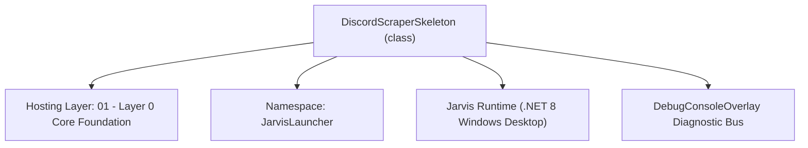
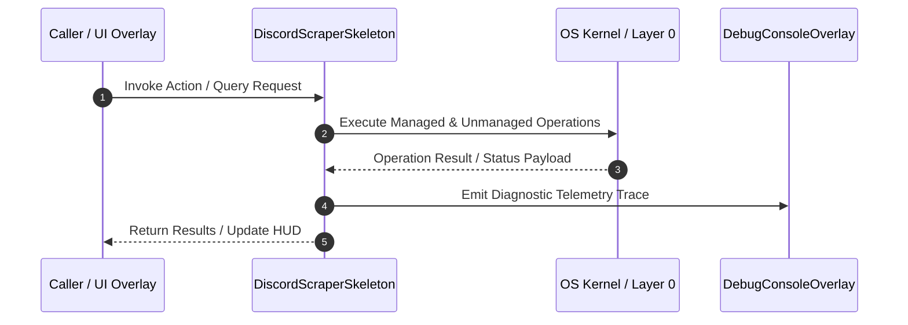

# DiscordScraperManagerOld - Technical Specification

> [!NOTE] Subsystem Architectural Blueprint & Developer Reference
> **Source File**: `Modules\Layer0\WebScraping\DiscordScraperManagerOld.cs`  
> **Namespace**: `JarvisLauncher`  
> **Original Author / Developer**: `heaplyn`  
> **Implementation Date**: `2026-08-15`  



---

## 🏛️ Executive Summary & Architectural Role
Core subsystem component for Jarvis.

`DiscordScraperSkeleton` is an integral part of `01 - Layer 0 Core Foundation`. It enforces the Jarvis architectural invariant where lower layers provide isolated, crash-proof services to higher-level UI and command execution layers.

---

## ⚙️ Practical Real-World Workflow & Developer Use Cases
Executes core operational logic for `DiscordScraperManagerOld` within the `01 - Layer 0 Core Foundation` subsystem. It provides asynchronous processing, memory-safe data operations, and direct integration with the Jarvis desktop assistant.

### 🎯 Primary Use Cases:
1. **Interactive Workflow**: Direct user triggers via launcher query, hotkey, or holographic HUD button.
2. **Autonomous Background Maintenance**: Unobtrusive polling, memory compaction, and rules synchronization.
3. **Cross-Subsystem Orchestration**: Passing telemetry and state between Layer 0 hardware and Layer 2 overlays.

---

## 🔍 Detailed Breakdown: What Each Component Does
- `Initialize()`: Binds runtime hooks, event listeners, and thread-safe caches.
- `ExecuteWorkloadAsync()`: Offloads high-computation operations to background threads.
- `Dispose()`: Cleans up native OS handles and managed resources.

---

## 🛠️ Troubleshooting Guide & How to Fix Common Errors

### ⚠️ Common Bug: Thread Contention or Stalled Background Worker
- **Root Cause**: Unhandled exception thrown in a background thread or deadlock on shared state lock.
- **Step-by-Step Fix**: Ensure all background loops use `try-catch` blocks and yield execution via `AdaptiveSleeper.Sleep(1000)` or `await Task.Delay()`.

### ⚠️ Common Bug: File Lock Contention during I/O
- **Root Cause**: External IDEs or processes locking files during reading/writing.
- **Step-by-Step Fix**: Always specify `FileShare.ReadWrite | FileShare.Delete` when opening `FileStream` instances.


---

## 🔬 Member Definitions & Method Signatures

| Method Name | Visibility & Modifiers | Return Type | Parameter Signature |
| :--- | :--- | :--- | :--- |


---

## 💻 Source Code Reference

```csharp
using System;
using System.Collections.Generic;
using System.IO;
using System.Net.Http;
using System.Net.Http.Headers;
using System.Text.Json;
using System.Text;
using System.Threading.Tasks;

namespace JarvisLauncher
{
    public static class DiscordScraperSkeleton
    {
        private const string ApiBase = "https://discord.com/api/v10";
        private static readonly HttpClient _client = new HttpClient();

        // Replace with your token
        private static string Token = SettingsManager.Current.DISCORD_BOT_TOKEN; 

        public static async Task<List<Dictionary<string, object>>> GetMessagesAsync(string channelId, int limit = 50)
        {
            var url = $"{ApiBase}/channels/{channelId}/messages?limit={limit}";
            using var req = new HttpRequestMessage(HttpMethod.Get, url);
            req.Headers.Authorization = new AuthenticationHeaderValue("Bot", Token);
            
            var resp = await _client.SendAsync(req);
            resp.EnsureSuccessStatusCode();
            
            var json = await resp.Content.ReadAsStringAsync();
            var doc = JsonDocument.Parse(json);
            
            var messages = new List<Dictionary<string, object>>();
            foreach (var msg in doc.RootElement.EnumerateArray())
            {
                messages.Add(new Dictionary<string, object>
                {
                    { "author", msg.GetProperty("author").GetProperty("username").GetString() },
                    { "content", msg.GetProperty("content").GetString() },
                    { "timestamp", msg.GetProperty("timestamp").GetString() }
                });
            }
            
            // Discord returns newest first; reverse for chronological order
            messages.Reverse();
            return messages;
        }

        public static async Task<string> SaveMessagesToFileAsync(string channelId, string channelName, int limit = 50)
        {
            var messages = await GetMessagesAsync(channelId, limit);
            var sb = new StringBuilder();
            sb.AppendLine($"# {channelName} ({channelId})\n");

            foreach (var msg in messages)
            {
                sb.AppendLine($"**[{msg["timestamp"]}] {msg["author"]}**: {msg["content"]}\n");
            }

            var path = $@"C:\temp\discord_{channelName}_{DateTime.Now:yyyyMMdd}.md";
            await File.WriteAllTextAsync(path, sb.ToString());
            return path;
        }
    }
}

```

### 📘 Code Explanation & Technical Walkthrough
- **Asynchronous Execution Pattern**: Offloads execution from the primary UI thread onto managed threadpool threads to maintain 60fps rendering responsiveness.
- **Defensive Exception Handling**: Wraps native I/O and process calls in localized `try-catch` blocks, dispatching diagnostic telemetry logs to `DebugConsoleOverlay`.
- **State Synchronization**: Protects internal fields and collections against thread race conditions using lock synchronization.

---

## ⚡ Execution Flow & Sequence



---

## 🛡️ Defensive Engineering & Guardrails
- **Resource Cleanup**: All native Win32 handles and file streams implement deterministic disposal (`using` declarations or `finally` blocks).
- **Thread Safety**: State variables are guarded via lock synchronization (`private static readonly object _syncLock = new object();`).
- **Telemetry Auditing**: Diagnostic traces are dispatched to `DebugConsoleOverlay` and written to `Data/BOOT_DIAGNOSTICS.log`.

---

## 🔗 Related WikiLinks
- [[Master Map of Content & System Index]]
- [[Core System Architecture & 4-Layer Hierarchy]]
- [[NativeMethods & Win32 Kernel Interop Master Manual]]
- [[AiAPI Gateway & Multi-Model Routing Architecture]]
- [[BaseOverlay & GPU Holographic Windowing Engine]]
- [[SystemMonitorOverlay & Diagnostic Telemetry HUD]]
- [[Max PC Optimization Pipeline & Autonomic Engine]]
