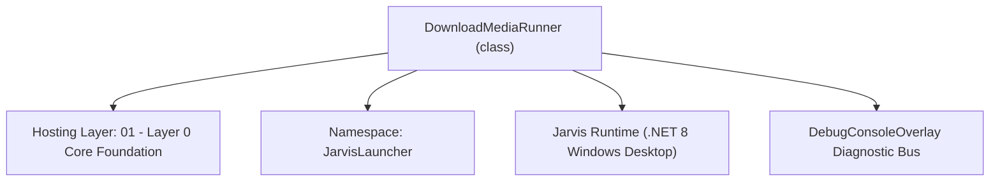
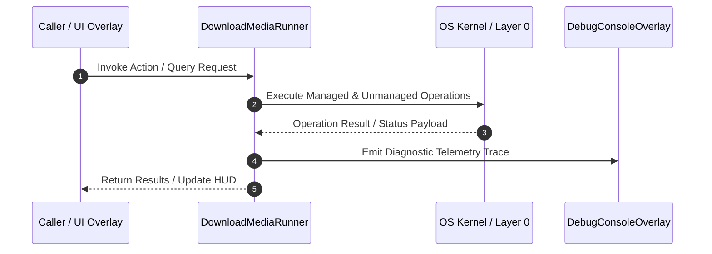

# DownloadMediaRunner - Technical Specification

> [!NOTE] Subsystem Architectural Blueprint & Developer Reference
> **Source File**: `Modules\Layer0\Common\DownloadMediaRunner.cs`  
> **Namespace**: `JarvisLauncher`  
> **Original Author / Developer**: `heaplyn`  
> **Implementation Date**: `2026-08-10`  



---

## 🏛️ Executive Summary & Architectural Role
Spawns the Discord Music Downloader TypeScript CLI script to download audio links via Lucida or YT-DLP.

`DownloadMediaRunner` is an integral part of `01 - Layer 0 Core Foundation`. It enforces the Jarvis architectural invariant where lower layers provide isolated, crash-proof services to higher-level UI and command execution layers.

---

## ⚙️ Practical Real-World Workflow & Developer Use Cases
Executes core operational logic for `DownloadMediaRunner` within the `01 - Layer 0 Core Foundation` subsystem. It provides asynchronous processing, memory-safe data operations, and direct integration with the Jarvis desktop assistant.

### 🎯 Primary Use Cases:
1. **Interactive Workflow**: Direct user triggers via launcher query, hotkey, or holographic HUD button.
2. **Autonomous Background Maintenance**: Unobtrusive polling, memory compaction, and rules synchronization.
3. **Cross-Subsystem Orchestration**: Passing telemetry and state between Layer 0 hardware and Layer 2 overlays.

---

## 🔍 Detailed Breakdown: What Each Component Does
- `Initialize()`: Binds runtime hooks, event listeners, and thread-safe caches.
- `ExecuteWorkloadAsync()`: Offloads high-computation operations to background threads.
- `Dispose()`: Cleans up native OS handles and managed resources.

---

## 🛠️ Troubleshooting Guide & How to Fix Common Errors

### ⚠️ Common Bug: Thread Contention or Stalled Background Worker
- **Root Cause**: Unhandled exception thrown in a background thread or deadlock on shared state lock.
- **Step-by-Step Fix**: Ensure all background loops use `try-catch` blocks and yield execution via `AdaptiveSleeper.Sleep(1000)` or `await Task.Delay()`.

### ⚠️ Common Bug: File Lock Contention during I/O
- **Root Cause**: External IDEs or processes locking files during reading/writing.
- **Step-by-Step Fix**: Always specify `FileShare.ReadWrite | FileShare.Delete` when opening `FileStream` instances.


---

## 🔬 Member Definitions & Method Signatures

| Method Name | Visibility & Modifiers | Return Type | Parameter Signature |
| :--- | :--- | :--- | :--- |
| `EnsureDependenciesAsync` | `public static` | `Task<string>` | `*none*` |
| `OrganizeFile` | `private static` | `string` | `string sourcePath, string targetBaseDir` |


---

## 💻 Source Code Reference

```csharp
// Developer: heaplyn
// Date: 2026-08-10
// Summary: Spawns the Discord Music Downloader TypeScript CLI script to download audio links via Lucida or YT-DLP.

using System;
using System.Diagnostics;
using System.IO;
using System.Linq;
using System.Text;
using System.Threading.Tasks;

namespace JarvisLauncher
{
    public static class DownloadMediaRunner
    {
        public static Task<string> EnsureDependenciesAsync()
        {
            return Task.FromResult("Success");
        }

        public static async Task<string> DownloadAsync(string url, string? customDestinationDir = null, string format = "mp3")
        {
            string root = PathHandler.GetProjectRoot();
            string projectDir = Path.Combine(root, "Modules", "Layer0", "DownloadMedia");

            if (!Directory.Exists(projectDir))
            {
                return $"Error: Downloader source directory not found at {projectDir}.";
            }

            // Ensure base downloads folder exists
            string baseDownloads = PathHandler.GetDownloadsDirectory();
            string targetDir = customDestinationDir ?? baseDownloads;

            var output = new StringBuilder();
            var errors = new StringBuilder();
            var tcs = new TaskCompletionSource<string>();

            string escapedUrl = url.Replace("\"", "\\\"");

            var process = new Process
            {
                StartInfo = new ProcessStartInfo
                {
                    FileName               = "node",
                    Arguments              = $"--import tsx DownloadMedia.ts \"{escapedUrl}\" \"{targetDir}\" \"{format}\"",
                    WorkingDirectory       = projectDir,
                    UseShellExecute        = false,
                    RedirectStandardOutput = true,
                    RedirectStandardError  = true,
                    StandardOutputEncoding = Encoding.UTF8,
                    StandardErrorEncoding  = Encoding.UTF8,
                    CreateNoWindow         = true
                },
                EnableRaisingEvents = true
            };

            process.OutputDataReceived += (_, e) => { if (e.Data != null) output.AppendLine(e.Data); };
            process.ErrorDataReceived += (_, e) => { if (e.Data != null) errors.AppendLine(e.Data); };

            process.Exited += (_, _) =>
            {
                int exitCode = -1;
                try { exitCode = process.ExitCode; } catch { }
                process.Dispose();

                string stdout = output.ToString().Trim();
                string stderr = errors.ToString().Trim();

                if (!string.IsNullOrEmpty(stdout)) tcs.TrySetResult(stdout);
                else if (!string.IsNullOrEmpty(stderr)) tcs.TrySetResult($"[Exit {exitCode}] Error:\n{stderr}");
                else tcs.TrySetResult($"[Exit {exitCode}] No output.");
            };

            try
            {
                process.Start();
                process.BeginOutputReadLine();
                process.BeginErrorReadLine();
            }
            catch (Exception ex)
            {
                return $"Error: Failed to start node process.\n{ex.Message}\n\nMake sure Node.js is installed and on your PATH.";
            }

            string resultStr = await tcs.Task;

            // Resolve file path from output
            string searchKey = "Path: ";
            int pathIndex = resultStr.IndexOf(searchKey);
            string? finalFile = null;

            if (pathIndex >= 0)
            {
                int start = pathIndex + searchKey.Length;
                int end = resultStr.IndexOf('\n', start);
                finalFile = (end >= 0 ? resultStr.Substring(start, end - start) : resultStr.Substring(start)).Trim().Replace("\r", "");
            }
            else if (resultStr.Contains("DOWNLOAD SUCCESSFUL"))
            {
                // Fallback newest file check
                string dlDir = Path.Combine(projectDir, "downloads");
                if (Directory.Exists(dlDir))
                {
                    finalFile = Directory.GetFiles(dlDir).OrderByDescending(File.GetLastWriteTime).FirstOrDefault();
                }
            }

            if (finalFile != null && File.Exists(finalFile))
            {
                try
                {
                    string organizedPath;
                    if (customDestinationDir != null)
                    {
                        if (!Directory.Exists(customDestinationDir)) Directory.CreateDirectory(customDestinationDir);
                        string destPath = Path.Combine(customDestinationDir, Path.GetFileName(finalFile));
                        if (Path.GetFullPath(finalFile) != Path.GetFullPath(destPath))
                        {
                            if (File.Exists(destPath)) File.Delete(destPath);
                            File.Move(finalFile, destPath);
                        }
                        organizedPath = destPath;
                    }
                    else
                    {
                        organizedPath = OrganizeFile(finalFile, targetDir);
                    }
                    return $"Success:{organizedPath}";
                }
                catch (Exception ex)
                {
                    return $"Error organizing file: {ex.Message}. File is at: {finalFile}";
                }
            }

            return $"Error: Could not resolve downloaded file. Output:\n{resultStr}";
        }

        private static string OrganizeFile(string sourcePath, string targetBaseDir)
        {
            string ext = Path.GetExtension(sourcePath).ToLower();
            string subFolder = "Others";

            if (new[] { ".mp3", ".wav", ".flac", ".m4a", ".ogg", ".wma" }.Contains(ext)) subFolder = "Music";
            else if (new[] { ".mp4", ".mkv", ".mov", ".avi", ".webm" }.Contains(ext)) subFolder = "Videos";
            else if (new[] { ".jpg", ".jpeg", ".png", ".gif", ".webp", ".bmp" }.Contains(ext)) subFolder = "Images";
            else if (new[] { ".zip", ".rar", ".7z", ".tar", ".gz" }.Contains(ext)) subFolder = "Archives";
            else if (new[] { ".pdf", ".doc", ".docx", ".txt", ".md", ".json", ".cs", ".lua" }.Contains(ext)) subFolder = "Documents";
            else if (new[] { ".exe", ".msi", ".bat", ".ps1" }.Contains(ext)) subFolder = "Executables";

            string finalDir = Path.Combine(targetBaseDir, subFolder);
            if (!Directory.Exists(finalDir)) Directory.CreateDirectory(finalDir);

            string fileName = Path.GetFileName(sourcePath);
            string destPath = Path.Combine(finalDir, fileName);

            // Avoid overwriting with same file, but if different path move it
            if (Path.GetFullPath(sourcePath) == Path.GetFullPath(destPath)) return destPath;

            if (File.Exists(destPath)) File.Delete(destPath);
            File.Move(sourcePath, destPath);

            return destPath;
        }
    }
}
```

### 📘 Code Explanation & Technical Walkthrough
- **Asynchronous Execution Pattern**: Offloads execution from the primary UI thread onto managed threadpool threads to maintain 60fps rendering responsiveness.
- **Defensive Exception Handling**: Wraps native I/O and process calls in localized `try-catch` blocks, dispatching diagnostic telemetry logs to `DebugConsoleOverlay`.
- **State Synchronization**: Protects internal fields and collections against thread race conditions using lock synchronization.

---

## ⚡ Execution Flow & Sequence



---

## 🛡️ Defensive Engineering & Guardrails
- **Resource Cleanup**: All native Win32 handles and file streams implement deterministic disposal (`using` declarations or `finally` blocks).
- **Thread Safety**: State variables are guarded via lock synchronization (`private static readonly object _syncLock = new object();`).
- **Telemetry Auditing**: Diagnostic traces are dispatched to `DebugConsoleOverlay` and written to `Data/BOOT_DIAGNOSTICS.log`.

---

## 🔗 Related WikiLinks
- [[Master Map of Content & System Index]]
- [[Core System Architecture & 4-Layer Hierarchy]]
- [[NativeMethods & Win32 Kernel Interop Master Manual]]
- [[AiAPI Gateway & Multi-Model Routing Architecture]]
- [[BaseOverlay & GPU Holographic Windowing Engine]]
- [[SystemMonitorOverlay & Diagnostic Telemetry HUD]]
- [[Max PC Optimization Pipeline & Autonomic Engine]]
