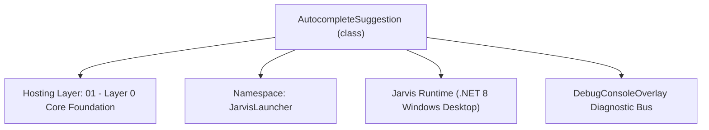
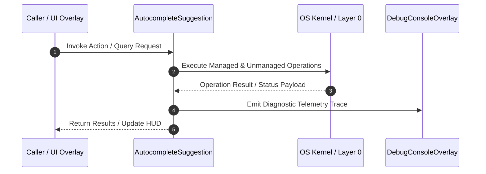

# EditorIntelligenceManager - Technical Specification

> [!NOTE] Subsystem Architectural Blueprint & Developer Reference
> **Source File**: `Modules\Layer0\Common\EditorIntelligenceManager.cs`  
> **Namespace**: `JarvisLauncher`  
> **Original Author / Developer**: `heaplyn`  
> **Implementation Date**: `2026-08-17`  



---

## 🏛️ Executive Summary & Architectural Role
Advanced Editor Intelligence Manager.
          Enhanced Assembly (NASM) support with struct/directive highlighting.
          Added support for C++, SQL, Lua, and more.

`AutocompleteSuggestion` is an integral part of `01 - Layer 0 Core Foundation`. It enforces the Jarvis architectural invariant where lower layers provide isolated, crash-proof services to higher-level UI and command execution layers.

---

## ⚙️ Practical Real-World Workflow & Developer Use Cases
Executes core operational logic for `EditorIntelligenceManager` within the `01 - Layer 0 Core Foundation` subsystem. It provides asynchronous processing, memory-safe data operations, and direct integration with the Jarvis desktop assistant.

### 🎯 Primary Use Cases:
1. **Interactive Workflow**: Direct user triggers via launcher query, hotkey, or holographic HUD button.
2. **Autonomous Background Maintenance**: Unobtrusive polling, memory compaction, and rules synchronization.
3. **Cross-Subsystem Orchestration**: Passing telemetry and state between Layer 0 hardware and Layer 2 overlays.

---

## 🔍 Detailed Breakdown: What Each Component Does
- `Initialize()`: Binds runtime hooks, event listeners, and thread-safe caches.
- `ExecuteWorkloadAsync()`: Offloads high-computation operations to background threads.
- `Dispose()`: Cleans up native OS handles and managed resources.

---

## 🛠️ Troubleshooting Guide & How to Fix Common Errors

### ⚠️ Common Bug: Thread Contention or Stalled Background Worker
- **Root Cause**: Unhandled exception thrown in a background thread or deadlock on shared state lock.
- **Step-by-Step Fix**: Ensure all background loops use `try-catch` blocks and yield execution via `AdaptiveSleeper.Sleep(1000)` or `await Task.Delay()`.

### ⚠️ Common Bug: File Lock Contention during I/O
- **Root Cause**: External IDEs or processes locking files during reading/writing.
- **Step-by-Step Fix**: Always specify `FileShare.ReadWrite | FileShare.Delete` when opening `FileStream` instances.


---

## 🔬 Member Definitions & Method Signatures

| Method Name | Visibility & Modifiers | Return Type | Parameter Signature |
| :--- | :--- | :--- | :--- |
| `GetSuggestions` | `public static` | `List<AutocompleteSuggestion>` | `string currentLinePrefix, string extension, string fullText` |
| `ExtractLocalSymbols` | `public static` | `List<AutocompleteSuggestion>` | `string text, string extension` |


---

## 💻 Source Code Reference

```csharp
// Developer: heaplyn
// Date: 2026-08-17
// Summary: Advanced Editor Intelligence Manager.
//          Enhanced Assembly (NASM) support with struct/directive highlighting.
//          Added support for C++, SQL, Lua, and more.

using System;
using System.Collections.Generic;
using System.IO;
using System.Linq;
using System.Text.RegularExpressions;
using System.Threading.Tasks;

namespace JarvisLauncher
{
    public class AutocompleteSuggestion
    {
        public string Text { get; set; } = string.Empty;
        public string Description { get; set; } = string.Empty;
        public string Icon { get; set; } = "📄";
        public double Score { get; set; } = 0;
    }

    public class SyntaxRule
    {
        public string Pattern { get; set; } = string.Empty;
        public string ColorHex { get; set; } = "#FFFFFF";
        public bool IsBold { get; set; } = false;
        public string Category { get; set; } = "General";
    }

    public static class EditorIntelligenceManager
    {
        public static Dictionary<string, List<SyntaxRule>> SyntaxHighlightingRules = new Dictionary<string, List<SyntaxRule>>(StringComparer.OrdinalIgnoreCase)
        {
            { ".cs", new List<SyntaxRule> {
                new SyntaxRule { Pattern = @"\b(public|private|protected|internal|static|void|string|int|bool|var|if|else|foreach|while|return|class|namespace|using|async|await|task|override|virtual|new|get|set|value|delegate|event)\b", ColorHex = "#569CD6", IsBold = true },
                new SyntaxRule { Pattern = @"\b(Console|Task|List|Dictionary|Enumerable|DateTime|Guid|Thread|Regex|HttpClient|JsonSerializer|File|Directory|Path|Math|Exception)\b", ColorHex = "#4EC9B0" },
                new SyntaxRule { Pattern = @"//.*", ColorHex = "#6A9955" },
                new SyntaxRule { Pattern = @"""[^""\\]*(?:\\.[^""\\]*)*""", ColorHex = "#D69D85" },
                new SyntaxRule { Pattern = @"\b\d+\b", ColorHex = "#B5CEA8" }
            }},
            { ".cpp", new List<SyntaxRule> {
                new SyntaxRule { Pattern = @"\b(int|double|float|char|bool|void|class|struct|union|enum|public|private|protected|static|virtual|override|final|inline|constexpr|namespace|using|template|auto|new|delete|try|catch|throw|if|else|for|while|do|switch|case|default|break|continue|return|this|nullptr|true|false)\b", ColorHex = "#569CD6", IsBold = true },
                new SyntaxRule { Pattern = @"\b(std|vector|string|map|set|list|iostream|fstream|printf|scanf|cout|cin|endl)\b", ColorHex = "#4EC9B0" },
                new SyntaxRule { Pattern = @"//.*|/\*[\s\S]*?\*/", ColorHex = "#6A9955" },
                new SyntaxRule { Pattern = @"#\s*(include|define|if|ifdef|ifndef|else|endif|pragma)", ColorHex = "#9B9B9B" },
                new SyntaxRule { Pattern = @"""[^""\\]*(?:\\.[^""\\]*)*""|'[^'\\ ]*(?:\\.[^'\\ ]*)*'", ColorHex = "#D69D85" },
                new SyntaxRule { Pattern = @"\b\d+(\.\d+)?f?\b", ColorHex = "#B5CEA8" }
            }},
            { ".h", new List<SyntaxRule> {
                new SyntaxRule { Pattern = @"\b(class|struct|public|private|protected|static|virtual|void|int|float|double|char|bool|namespace)\b", ColorHex = "#569CD6", IsBold = true },
                new SyntaxRule { Pattern = @"//.*|/\*[\s\S]*?\*/", ColorHex = "#6A9955" },
                new SyntaxRule { Pattern = @"#\s*(include|define|ifndef|endif|pragma)", ColorHex = "#9B9B9B" }
            }},
            { ".asm", new List<SyntaxRule> {
                // Instructions
                new SyntaxRule { Pattern = @"\b(mov|add|sub|inc|dec|mul|div|jmp|je|jne|jg|jl|jge|jle|cmp|push|pop|call|ret|int|syscall|nop|lea|xor|and|or|not|shl|shr)\b", ColorHex = "#569CD6", IsBold = true },
                // Directives
                new SyntaxRule { Pattern = @"\b(equ|resb|resw|resd|resq|db|dw|dd|dq|bits|section|global|extern|align|times|org|struc|endstruc|struct)\b", ColorHex = "#D8A0DF" },
                // Registers
                new SyntaxRule { Pattern = @"\b(eax|ebx|ecx|edx|esi|edi|esp|ebp|rax|rbx|rcx|rdx|rsi|rdi|rsp|rbp|ax|bx|cx|dx|si|di|sp|bp|al|ah|bl|bh|cl|ch|dl|dh|r\d+[dbw]?|xmm\d+|ymm\d+|zmm\d+|cs|ds|es|fs|gs|ss)\b", ColorHex = "#9CDCFE" },
                // Comments
                new SyntaxRule { Pattern = @";.*", ColorHex = "#6A9955" },
                // Struct members / labels starting with dot (e.g. .Type)
                new SyntaxRule { Pattern = @"(?<=\s|^)\.\w+", ColorHex = "#4EC9B0" },
                // Strings
                new SyntaxRule { Pattern = @"'[^']*'|""[^""]*""", ColorHex = "#D69D85" },
                // Numbers
                new SyntaxRule { Pattern = @"\b(0x[0-9a-fA-F]+|[0-9]+h?)\b", ColorHex = "#B5CEA8" }
            }},
            { ".lua", new List<SyntaxRule> {
                new SyntaxRule { Pattern = @"\b(and|break|do|else|elseif|end|false|for|function|if|in|local|nil|not|or|repeat|return|then|true|until|while)\b", ColorHex = "#569CD6", IsBold = true },
                new SyntaxRule { Pattern = @"\b(print|math|string|table|require)\b", ColorHex = "#4EC9B0" },
                new SyntaxRule { Pattern = @"--.*|--\[\[[\s\S]*?\]\]", ColorHex = "#6A9955" },
                new SyntaxRule { Pattern = @"""[^""]*""|'[^']*'|\[\[[\s\S]*?\]\]", ColorHex = "#D69D85" }
            }},
            { ".sql", new List<SyntaxRule> {
                new SyntaxRule { Pattern = @"\b(SELECT|FROM|WHERE|INSERT|INTO|UPDATE|DELETE|CREATE|TABLE|DROP|ALTER|JOIN|ON|GROUP|BY|ORDER|VALUES|AND|OR|NOT|AS|PRIMARY|KEY)\b", ColorHex = "#569CD6", IsBold = true },
                new SyntaxRule { Pattern = @"\b(int|varchar|nvarchar|text|date|datetime|bit|decimal)\b", ColorHex = "#4EC9B0" },
                new SyntaxRule { Pattern = @"--.*|/\*[\s\S]*?\*/", ColorHex = "#6A9955" },
                new SyntaxRule { Pattern = @"'[^']*'", ColorHex = "#D69D85" }
            }}
        };

        private static readonly Dictionary<string, string[]> LanguageKeywords = new Dictionary<string, string[]>(StringComparer.OrdinalIgnoreCase)
        {
            { ".cs", new[] { "public", "private", "protected", "internal", "static", "void", "string", "int", "bool", "var", "if", "else", "foreach", "while", "return", "class", "namespace", "using", "async", "await", "task" } },
            { ".cpp", new[] { "int", "double", "float", "char", "bool", "void", "class", "struct", "public", "private", "protected", "static", "virtual", "return", "if", "else", "for", "while" } },
            { ".lua", new[] { "and", "break", "do", "else", "elseif", "end", "false", "for", "function", "if", "in", "local", "nil", "not", "or", "repeat", "return", "then", "true", "until", "while" } },
            { ".sql", new[] { "SELECT", "FROM", "WHERE", "INSERT", "UPDATE", "DELETE", "CREATE", "DROP", "TABLE", "JOIN", "VALUES" } },
            { ".asm", new[] { "mov", "add", "sub", "inc", "dec", "jmp", "je", "jne", "cmp", "push", "pop", "call", "ret", "equ", "resb", "resw", "resd", "resq", "bits", "section", "struc", "endstruc" } }
        };

        public static List<AutocompleteSuggestion> GetSuggestions(string currentLinePrefix, string extension, string fullText)
        {
            var results = new List<AutocompleteSuggestion>();
            string lastWord = Regex.Match(currentLinePrefix, @"\b\w*$").Value;
            if (string.IsNullOrEmpty(lastWord)) return results;

            if (LanguageKeywords.TryGetValue(extension, out var keywords))
            {
                foreach (var kw in keywords.Where(k => k.StartsWith(lastWord, StringComparison.OrdinalIgnoreCase)))
                {
                    results.Add(new AutocompleteSuggestion { Text = kw, Description = "Keyword", Icon = "🔑", Score = 1.0 });
                }
            }

            var localSymbols = ExtractLocalSymbols(fullText, extension);
            foreach (var s in localSymbols.Where(s => s.Text.StartsWith(lastWord, StringComparison.OrdinalIgnoreCase)))
            {
                if (results.Any(r => r.Text == s.Text)) continue;
                s.Score = 0.8;
                results.Add(s);
            }

            return results.OrderByDescending(r => r.Score).Take(15).ToList();
        }

        public static async Task<string> GetAiExplanationAsync(string symbol, string codeContext, string extension)
        {
            try
            {
                string prompt = $"### TASK\nBriefly explain what the symbol '{symbol}' does in the context of this {extension} code. " +
                               "If it looks like a variable, describe its likely purpose. If it's a keyword, explain its function.\n\n" +
                               "### CONTEXT\n" + codeContext.TakeLast(1000) + "\n\n" +
                               "### RULES\n1. Be extremely concise (10 words max).\n2. No preamble.";

                return await LlmRouter.AskAsync(prompt);
            }
            catch { return "No explanation available."; }
        }

        public static List<AutocompleteSuggestion> ExtractLocalSymbols(string text, string extension)
        {
            var symbols = new HashSet<string>();
            var matches = Regex.Matches(text, @"\b[a-zA-Z_][a-zA-Z0-9_]{3,}\b");
            foreach (Match m in matches) symbols.Add(m.Value);
            return symbols.Select(s => new AutocompleteSuggestion { Text = s, Description = "Local Symbol", Icon = "💎" }).ToList();
        }
    }
}
```

### 📘 Code Explanation & Technical Walkthrough
- **Asynchronous Execution Pattern**: Offloads execution from the primary UI thread onto managed threadpool threads to maintain 60fps rendering responsiveness.
- **Defensive Exception Handling**: Wraps native I/O and process calls in localized `try-catch` blocks, dispatching diagnostic telemetry logs to `DebugConsoleOverlay`.
- **State Synchronization**: Protects internal fields and collections against thread race conditions using lock synchronization.

---

## ⚡ Execution Flow & Sequence



---

## 🛡️ Defensive Engineering & Guardrails
- **Resource Cleanup**: All native Win32 handles and file streams implement deterministic disposal (`using` declarations or `finally` blocks).
- **Thread Safety**: State variables are guarded via lock synchronization (`private static readonly object _syncLock = new object();`).
- **Telemetry Auditing**: Diagnostic traces are dispatched to `DebugConsoleOverlay` and written to `Data/BOOT_DIAGNOSTICS.log`.

---

## 🔗 Related WikiLinks
- [[Master Map of Content & System Index]]
- [[Core System Architecture & 4-Layer Hierarchy]]
- [[NativeMethods & Win32 Kernel Interop Master Manual]]
- [[AiAPI Gateway & Multi-Model Routing Architecture]]
- [[BaseOverlay & GPU Holographic Windowing Engine]]
- [[SystemMonitorOverlay & Diagnostic Telemetry HUD]]
- [[Max PC Optimization Pipeline & Autonomic Engine]]
