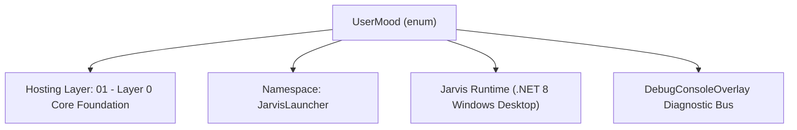
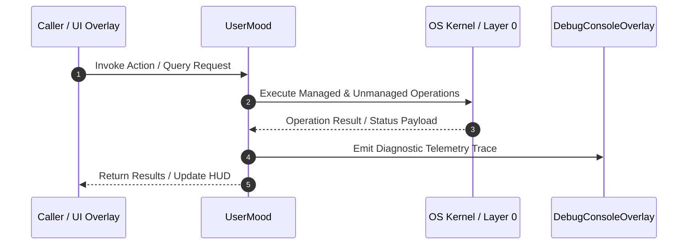

# EmotionalContextManager - Technical Specification

> [!NOTE] Subsystem Architectural Blueprint & Developer Reference
> **Source File**: `Modules\Layer0\Common\EmotionalContextManager.cs`  
> **Namespace**: `JarvisLauncher`  
> **Original Author / Developer**: `heaplyn`  
> **Implementation Date**: `2026-08-15`  



---

## 🏛️ Executive Summary & Architectural Role
User Sentiment & Emotional Intelligence Engine.
          Tracks the user's emotional state over the current session.
          Allows Jarvis to "Understand" when to dial down the sass and be more supportive.

`UserMood` is an integral part of `01 - Layer 0 Core Foundation`. It enforces the Jarvis architectural invariant where lower layers provide isolated, crash-proof services to higher-level UI and command execution layers.

---

## ⚙️ Practical Real-World Workflow & Developer Use Cases
Executes core operational logic for `EmotionalContextManager` within the `01 - Layer 0 Core Foundation` subsystem. It provides asynchronous processing, memory-safe data operations, and direct integration with the Jarvis desktop assistant.

### 🎯 Primary Use Cases:
1. **Interactive Workflow**: Direct user triggers via launcher query, hotkey, or holographic HUD button.
2. **Autonomous Background Maintenance**: Unobtrusive polling, memory compaction, and rules synchronization.
3. **Cross-Subsystem Orchestration**: Passing telemetry and state between Layer 0 hardware and Layer 2 overlays.

---

## 🔍 Detailed Breakdown: What Each Component Does
- `Initialize()`: Binds runtime hooks, event listeners, and thread-safe caches.
- `ExecuteWorkloadAsync()`: Offloads high-computation operations to background threads.
- `Dispose()`: Cleans up native OS handles and managed resources.

---

## 🛠️ Troubleshooting Guide & How to Fix Common Errors

### ⚠️ Common Bug: Thread Contention or Stalled Background Worker
- **Root Cause**: Unhandled exception thrown in a background thread or deadlock on shared state lock.
- **Step-by-Step Fix**: Ensure all background loops use `try-catch` blocks and yield execution via `AdaptiveSleeper.Sleep(1000)` or `await Task.Delay()`.

### ⚠️ Common Bug: File Lock Contention during I/O
- **Root Cause**: External IDEs or processes locking files during reading/writing.
- **Step-by-Step Fix**: Always specify `FileShare.ReadWrite | FileShare.Delete` when opening `FileStream` instances.


---

## 🔬 Member Definitions & Method Signatures

| Method Name | Visibility & Modifiers | Return Type | Parameter Signature |
| :--- | :--- | :--- | :--- |
| `Start` | `public static` | `void` | `*none*` |
| `GetEmotionalDirective` | `public static` | `string` | `*none*` |


---

## 💻 Source Code Reference

```csharp
// Developer: heaplyn
// Date: 2026-08-15
// Summary: User Sentiment & Emotional Intelligence Engine.
//          Tracks the user's emotional state over the current session.
//          Allows Jarvis to "Understand" when to dial down the sass and be more supportive.

using System;
using System.Collections.Generic;
using System.Linq;
using System.Threading.Tasks;

namespace JarvisLauncher
{
    public enum UserMood { Neutral, Focused, Stressed, Frustrated, Happy, Bored }

    public static class EmotionalContextManager
    {
        public static UserMood CurrentMood { get; private set; } = UserMood.Neutral;
        private static double _sentimentScore = 0; // -1 to 1

        public static void Start()
        {
            // Sync with sound detection for frustration cues
            EnvironmentalAudioAnalyzer.OnSoundDetected += (cat, conf) =>
            {
                if (cat == "Sigh" || cat == "Frustrated_Noise") CurrentMood = UserMood.Stressed;
                else if (cat == "Success_Cheer") CurrentMood = UserMood.Happy;
            };
        }

        public static async Task AnalyzeSentimentAsync(string userText)
        {
            string prompt = $"Analyze the emotional 'vibe' of this user input. Return ONLY one word: NEUTRAL, FOCUSED, STRESSED, FRUSTRATED, HAPPY, BORED.\n\nINPUT: \"{userText}\"";

            try
            {
                string moodStr = await LlmRouter.AskAsync(prompt, null);
                if (Enum.TryParse<UserMood>(moodStr.Trim(), true, out var mood))
                {
                    CurrentMood = mood;
                }
            }
            catch { }
        }

        public static string GetEmotionalDirective()
        {
            return CurrentMood switch
            {
                UserMood.Stressed => "DIRECTIVE: User is stressed. Minimize sass. Be concise and highly helpful. Offer technical support.",
                UserMood.Frustrated => "DIRECTIVE: User is frustrated. Stop jokes. Focus purely on resolving the issue immediately.",
                UserMood.Focused => "DIRECTIVE: User is in flow. Do not interrupt unless necessary. Stay in the background.",
                UserMood.Happy => "DIRECTIVE: User is in a good mood. Sass is encouraged. Celebrate successes with them.",
                UserMood.Bored => "DIRECTIVE: User is idle/bored. Engage them with a witty thought or system insight.",
                _ => "DIRECTIVE: Maintain standard witty Jarvis persona."
            };
        }
    }
}

```

### 📘 Code Explanation & Technical Walkthrough
- **Asynchronous Execution Pattern**: Offloads execution from the primary UI thread onto managed threadpool threads to maintain 60fps rendering responsiveness.
- **Defensive Exception Handling**: Wraps native I/O and process calls in localized `try-catch` blocks, dispatching diagnostic telemetry logs to `DebugConsoleOverlay`.
- **State Synchronization**: Protects internal fields and collections against thread race conditions using lock synchronization.

---

## ⚡ Execution Flow & Sequence



---

## 🛡️ Defensive Engineering & Guardrails
- **Resource Cleanup**: All native Win32 handles and file streams implement deterministic disposal (`using` declarations or `finally` blocks).
- **Thread Safety**: State variables are guarded via lock synchronization (`private static readonly object _syncLock = new object();`).
- **Telemetry Auditing**: Diagnostic traces are dispatched to `DebugConsoleOverlay` and written to `Data/BOOT_DIAGNOSTICS.log`.

---

## 🔗 Related WikiLinks
- [[Master Map of Content & System Index]]
- [[Core System Architecture & 4-Layer Hierarchy]]
- [[NativeMethods & Win32 Kernel Interop Master Manual]]
- [[AiAPI Gateway & Multi-Model Routing Architecture]]
- [[BaseOverlay & GPU Holographic Windowing Engine]]
- [[SystemMonitorOverlay & Diagnostic Telemetry HUD]]
- [[Max PC Optimization Pipeline & Autonomic Engine]]
