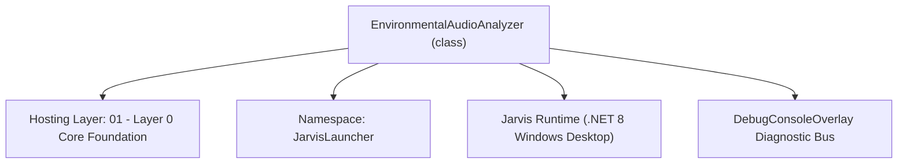
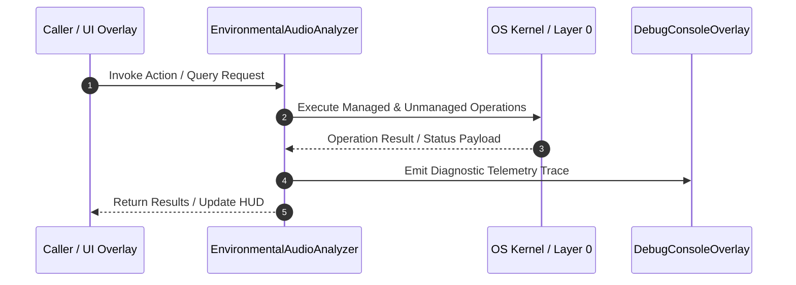

# EnvironmentalAudioAnalyzer - Technical Specification

> [!NOTE] Subsystem Architectural Blueprint & Developer Reference
> **Source File**: `Modules\Layer0\Audio\EnvironmentalAudioAnalyzer.cs`  
> **Namespace**: `JarvisLauncher`  
> **Original Author / Developer**: `heaplyn`  
> **Implementation Date**: `2026-08-15`  



---

## 🏛️ Executive Summary & Architectural Role
Live Environmental Audio Analyzer.
          Analyzes background sounds in real-time using vector categorization.
          Fires events when significant non-voice sounds are detected.
          Buffer processing runs on a dedicated background thread via ConcurrentQueue
          so the audio capture callback thread is never stalled by FFT/MFCC work.

`EnvironmentalAudioAnalyzer` is an integral part of `01 - Layer 0 Core Foundation`. It enforces the Jarvis architectural invariant where lower layers provide isolated, crash-proof services to higher-level UI and command execution layers.

---

## ⚙️ Practical Real-World Workflow & Developer Use Cases
Executes core operational logic for `EnvironmentalAudioAnalyzer` within the `01 - Layer 0 Core Foundation` subsystem. It provides asynchronous processing, memory-safe data operations, and direct integration with the Jarvis desktop assistant.

### 🎯 Primary Use Cases:
1. **Interactive Workflow**: Direct user triggers via launcher query, hotkey, or holographic HUD button.
2. **Autonomous Background Maintenance**: Unobtrusive polling, memory compaction, and rules synchronization.
3. **Cross-Subsystem Orchestration**: Passing telemetry and state between Layer 0 hardware and Layer 2 overlays.

---

## 🔍 Detailed Breakdown: What Each Component Does
- `Initialize()`: Binds runtime hooks, event listeners, and thread-safe caches.
- `ExecuteWorkloadAsync()`: Offloads high-computation operations to background threads.
- `Dispose()`: Cleans up native OS handles and managed resources.

---

## 🛠️ Troubleshooting Guide & How to Fix Common Errors

### ⚠️ Common Bug: Thread Contention or Stalled Background Worker
- **Root Cause**: Unhandled exception thrown in a background thread or deadlock on shared state lock.
- **Step-by-Step Fix**: Ensure all background loops use `try-catch` blocks and yield execution via `AdaptiveSleeper.Sleep(1000)` or `await Task.Delay()`.

### ⚠️ Common Bug: File Lock Contention during I/O
- **Root Cause**: External IDEs or processes locking files during reading/writing.
- **Step-by-Step Fix**: Always specify `FileShare.ReadWrite | FileShare.Delete` when opening `FileStream` instances.


---

## 🔬 Member Definitions & Method Signatures

| Method Name | Visibility & Modifiers | Return Type | Parameter Signature |
| :--- | :--- | :--- | :--- |
| `ProcessBuffer` | `public static` | `void` | `byte[] buffer, int length` |
| `DrainLoop` | `private static` | `void` | `*none*` |
| `ProcessBufferInternal` | `private static` | `void` | `byte[] buffer, int length` |
| `LearnCurrentSound` | `public static` | `void` | `string categoryName, byte[] buffer, int length` |


---

## 💻 Source Code Reference

```csharp
// Developer: heaplyn
// Date: 2026-08-15
// Summary: Live Environmental Audio Analyzer.
//          Analyzes background sounds in real-time using vector categorization.
//          Fires events when significant non-voice sounds are detected.
//          Buffer processing runs on a dedicated background thread via ConcurrentQueue
//          so the audio capture callback thread is never stalled by FFT/MFCC work.

using System;
using System.Collections.Concurrent;
using System.Collections.Generic;
using System.Linq;
using System.Threading;
using System.Threading.Tasks;

namespace JarvisLauncher
{
    public static class EnvironmentalAudioAnalyzer
    {
        public static event Action<string, double>? OnSoundDetected;

        private static DateTime _lastDetectionTime = DateTime.MinValue;
        private const int DetectionCooldownMs = 1500;

        // Thread-safe queue: capture callback enqueues, background worker drains
        private static readonly ConcurrentQueue<(byte[] buffer, int length)> _queue = new();
        private static readonly SemaphoreSlim _signal = new(0);

        static EnvironmentalAudioAnalyzer()
        {
            // Single long-running background worker — never competes with UI or capture thread
            Task.Factory.StartNew(DrainLoop, TaskCreationOptions.LongRunning);
        }

        /// <summary>Called from the audio capture callback. Enqueues the buffer and signals the worker.</summary>
        public static void ProcessBuffer(byte[] buffer, int length)
        {
            // Copy the buffer because NAudio reuses it after the callback returns
            var copy = new byte[length];
            Buffer.BlockCopy(buffer, 0, copy, 0, length);
            _queue.Enqueue((copy, length));
            _signal.Release();
        }

        private static void DrainLoop()
        {
            while (true)
            {
                _signal.Wait(); // Block until work is available
                while (_queue.TryDequeue(out var item))
                {
                    try { ProcessBufferInternal(item.buffer, item.length); }
                    catch { /* Never crash the drain loop */ }
                }
            }
        }

        private static void ProcessBufferInternal(byte[] buffer, int length)
        {
            if (((TtsManager)CoreRegistry.Tts).IsSpeakingOrEchoingInternal) return;

            // Extract samples
            int sampleCount = length / 2;
            float[] samples = new float[sampleCount];
            for (int i = 0; i < sampleCount; i++)
            {
                short sample16 = BitConverter.ToInt16(buffer, i * 2);
                samples[i] = sample16 / 32768.0f;
            }

            var features = AudioFeatureExtractor.ExtractFromPcmSamples(samples, 16000);

            // Gate: Only analyze sounds with significant energy
            if (features.RMS_ENERGY > 0.08)
            {
                if ((DateTime.Now - _lastDetectionTime).TotalMilliseconds < DetectionCooldownMs) return;

                var (category, confidence) = SoundVectorManager.ClassifyVector(features.MFCC_COEFFICIENTS);

                if (category != "Ambient" && category != "Unknown")
                {
                    _lastDetectionTime = DateTime.Now;
                    DebugConsoleOverlay.Log("Sound-Analyzer", $"Detected: {category} ({confidence:P0})");
                    OnSoundDetected?.Invoke(category, confidence);

                    // Log to chronology for history understanding
                    ChronoLogManager.LogEvent("Sound", $"Detected {category} (Conf: {confidence:P0})");

                    // Ingest into predictive stream
                    PredictiveStreamManager.IngestEvent("SOUND", $"{category} ({confidence:P0})");
                }
            }
        }

        public static void LearnCurrentSound(string categoryName, byte[] buffer, int length)
        {
            int sampleCount = length / 2;
            float[] samples = new float[sampleCount];
            for (int i = 0; i < sampleCount; i++)
            {
                short sample16 = BitConverter.ToInt16(buffer, i * 2);
                samples[i] = sample16 / 32768.0f;
            }

            var features = AudioFeatureExtractor.ExtractFromPcmSamples(samples, 16000);
            SoundVectorManager.AddFingerprint(categoryName, features.MFCC_COEFFICIENTS);
            DebugConsoleOverlay.Log("Sound-Trainer", $"Learned new fingerprint for: {categoryName}");
        }
    }
}
```

### 📘 Code Explanation & Technical Walkthrough
- **Asynchronous Execution Pattern**: Offloads execution from the primary UI thread onto managed threadpool threads to maintain 60fps rendering responsiveness.
- **Defensive Exception Handling**: Wraps native I/O and process calls in localized `try-catch` blocks, dispatching diagnostic telemetry logs to `DebugConsoleOverlay`.
- **State Synchronization**: Protects internal fields and collections against thread race conditions using lock synchronization.

---

## ⚡ Execution Flow & Sequence



---

## 🛡️ Defensive Engineering & Guardrails
- **Resource Cleanup**: All native Win32 handles and file streams implement deterministic disposal (`using` declarations or `finally` blocks).
- **Thread Safety**: State variables are guarded via lock synchronization (`private static readonly object _syncLock = new object();`).
- **Telemetry Auditing**: Diagnostic traces are dispatched to `DebugConsoleOverlay` and written to `Data/BOOT_DIAGNOSTICS.log`.

---

## 🔗 Related WikiLinks
- [[Master Map of Content & System Index]]
- [[Core System Architecture & 4-Layer Hierarchy]]
- [[NativeMethods & Win32 Kernel Interop Master Manual]]
- [[AiAPI Gateway & Multi-Model Routing Architecture]]
- [[BaseOverlay & GPU Holographic Windowing Engine]]
- [[SystemMonitorOverlay & Diagnostic Telemetry HUD]]
- [[Max PC Optimization Pipeline & Autonomic Engine]]
