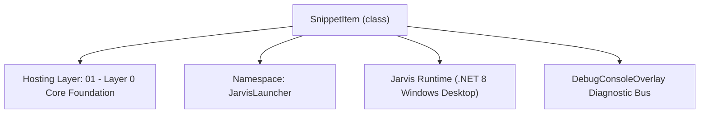
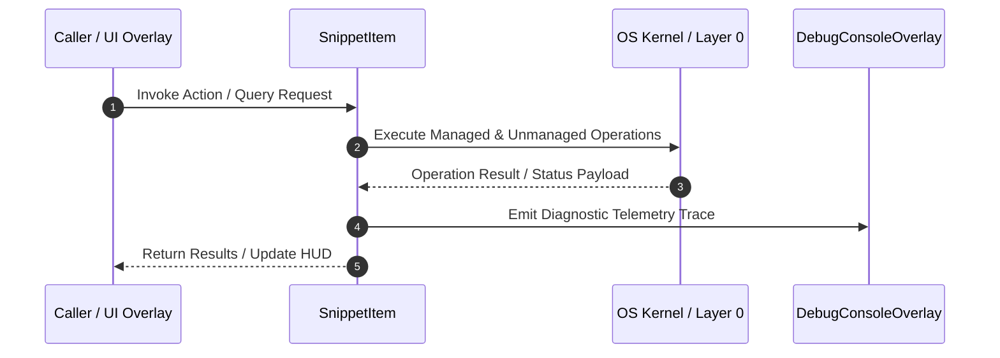

# ExtraFeaturesManager - Technical Specification

> [!NOTE] Subsystem Architectural Blueprint & Developer Reference
> **Source File**: `Modules\Layer0\Common\ExtraFeaturesManager.cs`  
> **Namespace**: `JarvisLauncher`  
> **Original Author / Developer**: `heaplyn`  
> **Implementation Date**: `2026-08-09`  



---

## 🏛️ Executive Summary & Architectural Role
Manages text snippets, application shortcuts, and system monitor overlay data structures.

`SnippetItem` is an integral part of `01 - Layer 0 Core Foundation`. It enforces the Jarvis architectural invariant where lower layers provide isolated, crash-proof services to higher-level UI and command execution layers.

---

## ⚙️ Practical Real-World Workflow & Developer Use Cases
Executes core operational logic for `ExtraFeaturesManager` within the `01 - Layer 0 Core Foundation` subsystem. It provides asynchronous processing, memory-safe data operations, and direct integration with the Jarvis desktop assistant.

### 🎯 Primary Use Cases:
1. **Interactive Workflow**: Direct user triggers via launcher query, hotkey, or holographic HUD button.
2. **Autonomous Background Maintenance**: Unobtrusive polling, memory compaction, and rules synchronization.
3. **Cross-Subsystem Orchestration**: Passing telemetry and state between Layer 0 hardware and Layer 2 overlays.

---

## 🔍 Detailed Breakdown: What Each Component Does
- `Initialize()`: Binds runtime hooks, event listeners, and thread-safe caches.
- `ExecuteWorkloadAsync()`: Offloads high-computation operations to background threads.
- `Dispose()`: Cleans up native OS handles and managed resources.

---

## 🛠️ Troubleshooting Guide & How to Fix Common Errors

### ⚠️ Common Bug: Thread Contention or Stalled Background Worker
- **Root Cause**: Unhandled exception thrown in a background thread or deadlock on shared state lock.
- **Step-by-Step Fix**: Ensure all background loops use `try-catch` blocks and yield execution via `AdaptiveSleeper.Sleep(1000)` or `await Task.Delay()`.

### ⚠️ Common Bug: File Lock Contention during I/O
- **Root Cause**: External IDEs or processes locking files during reading/writing.
- **Step-by-Step Fix**: Always specify `FileShare.ReadWrite | FileShare.Delete` when opening `FileStream` instances.


---

## 🔬 Member Definitions & Method Signatures

| Method Name | Visibility & Modifiers | Return Type | Parameter Signature |
| :--- | :--- | :--- | :--- |
| `GetFilePath` | `private static` | `string` | `string fileName` |
| `LoadSnippets` | `public static` | `List<SnippetItem>` | `*none*` |
| `SaveSnippets` | `public static` | `void` | `List<SnippetItem> items` |
| `AddSnippet` | `public static` | `void` | `string name, string content` |
| `DeleteSnippet` | `public static` | `void` | `string name` |
| `LoadAppShortcuts` | `public static` | `List<AppShortcutItem>` | `*none*` |
| `SaveAppShortcuts` | `public static` | `void` | `List<AppShortcutItem> items` |
| `AddAppShortcut` | `public static` | `void` | `string name, string targetPath` |
| `GetDefaultApps` | `private static` | `List<AppShortcutItem>` | `*none*` |


---

## 💻 Source Code Reference

```csharp
// Developer: heaplyn
// Date: 2026-08-09
// Summary: Manages text snippets, application shortcuts, and system monitor overlay data structures.

using System;
using System.Collections.Generic;
using System.IO;
using System.Text.Json;

namespace JarvisLauncher
{
    public class SnippetItem
    {
        public string Name { get; set; } = string.Empty;
        public string Content { get; set; } = string.Empty;
        public DateTime CreatedAt { get; set; } = DateTime.Now;
    }

    public class AppShortcutItem
    {
        public string Name { get; set; } = string.Empty;
        public string TargetPath { get; set; } = string.Empty;
        public string IconEmoji { get; set; } = "🚀";
    }

    public static class ExtraFeaturesManager
    {
        private static string GetFilePath(string fileName)
        {
            string dataDir = Path.Combine(AppDomain.CurrentDomain.BaseDirectory, "Data");
            if (!Directory.Exists(dataDir))
            {
                string devPath = Path.GetFullPath(Path.Combine(AppDomain.CurrentDomain.BaseDirectory, @"..\..\..\Data"));
                if (Directory.Exists(devPath))
                {
                    dataDir = devPath;
                }
                else
                {
                    Directory.CreateDirectory(dataDir);
                }
            }
            return Path.Combine(dataDir, fileName);
        }

        // --- SNIPPETS ---
        public static List<SnippetItem> LoadSnippets()
        {
            try
            {
                string path = GetFilePath("Snippets.json");
                if (File.Exists(path))
                {
                    string json = File.ReadAllText(path);
                    return JsonSerializer.Deserialize<List<SnippetItem>>(json) ?? new List<SnippetItem>();
                }
            }
            catch { }
            return new List<SnippetItem>();
        }

        public static void SaveSnippets(List<SnippetItem> items)
        {
            try
            {
                string path = GetFilePath("Snippets.json");
                string json = JsonSerializer.Serialize(items, new JsonSerializerOptions { WriteIndented = true });
                File.WriteAllText(path, json);
            }
            catch { }
        }

        public static void AddSnippet(string name, string content)
        {
            var snippets = LoadSnippets();
            snippets.RemoveAll(s => s.Name.Equals(name, StringComparison.OrdinalIgnoreCase));
            snippets.Add(new SnippetItem { Name = name, Content = content, CreatedAt = DateTime.Now });
            SaveSnippets(snippets);
            TextOverlay.Show($"✂️ Snippet '{name}' saved!", 2500);
        }

        public static void DeleteSnippet(string name)
        {
            var snippets = LoadSnippets();
            int removed = snippets.RemoveAll(s => s.Name.Equals(name, StringComparison.OrdinalIgnoreCase));
            if (removed > 0)
            {
                SaveSnippets(snippets);
                TextOverlay.Show($"🗑️ Snippet '{name}' deleted!", 2500);
            }
        }

        // --- APP SHORTCUTS ---
        public static List<AppShortcutItem> LoadAppShortcuts()
        {
            try
            {
                string path = GetFilePath("AppShortcuts.json");
                if (File.Exists(path))
                {
                    string json = File.ReadAllText(path);
                    return JsonSerializer.Deserialize<List<AppShortcutItem>>(json) ?? GetDefaultApps();
                }
            }
            catch { }
            return GetDefaultApps();
        }

        public static void SaveAppShortcuts(List<AppShortcutItem> items)
        {
            try
            {
                string path = GetFilePath("AppShortcuts.json");
                string json = JsonSerializer.Serialize(items, new JsonSerializerOptions { WriteIndented = true });
                File.WriteAllText(path, json);
            }
            catch { }
        }

        public static void AddAppShortcut(string name, string targetPath)
        {
            var apps = LoadAppShortcuts();
            apps.RemoveAll(a => a.Name.Equals(name, StringComparison.OrdinalIgnoreCase));
            apps.Add(new AppShortcutItem { Name = name, TargetPath = targetPath, IconEmoji = "🚀" });
            SaveAppShortcuts(apps);
            TextOverlay.Show($"📱 App shortcut '{name}' registered!", 2500);
        }

        private static List<AppShortcutItem> GetDefaultApps()
        {
            return new List<AppShortcutItem>
            {
                new AppShortcutItem { Name = "notepad", TargetPath = "notepad.exe", IconEmoji = "📝" },
                new AppShortcutItem { Name = "calc", TargetPath = "calc.exe", IconEmoji = "🧮" },
                new AppShortcutItem { Name = "cmd", TargetPath = "cmd.exe", IconEmoji = "💻" },
                new AppShortcutItem { Name = "explorer", TargetPath = "explorer.exe", IconEmoji = "📁" },
                new AppShortcutItem { Name = "chrome", TargetPath = "chrome.exe", IconEmoji = "🌐" }
            };
        }
    }
}
```

### 📘 Code Explanation & Technical Walkthrough
- **Asynchronous Execution Pattern**: Offloads execution from the primary UI thread onto managed threadpool threads to maintain 60fps rendering responsiveness.
- **Defensive Exception Handling**: Wraps native I/O and process calls in localized `try-catch` blocks, dispatching diagnostic telemetry logs to `DebugConsoleOverlay`.
- **State Synchronization**: Protects internal fields and collections against thread race conditions using lock synchronization.

---

## ⚡ Execution Flow & Sequence



---

## 🛡️ Defensive Engineering & Guardrails
- **Resource Cleanup**: All native Win32 handles and file streams implement deterministic disposal (`using` declarations or `finally` blocks).
- **Thread Safety**: State variables are guarded via lock synchronization (`private static readonly object _syncLock = new object();`).
- **Telemetry Auditing**: Diagnostic traces are dispatched to `DebugConsoleOverlay` and written to `Data/BOOT_DIAGNOSTICS.log`.

---

## 🔗 Related WikiLinks
- [[Master Map of Content & System Index]]
- [[Core System Architecture & 4-Layer Hierarchy]]
- [[NativeMethods & Win32 Kernel Interop Master Manual]]
- [[AiAPI Gateway & Multi-Model Routing Architecture]]
- [[BaseOverlay & GPU Holographic Windowing Engine]]
- [[SystemMonitorOverlay & Diagnostic Telemetry HUD]]
- [[Max PC Optimization Pipeline & Autonomic Engine]]
