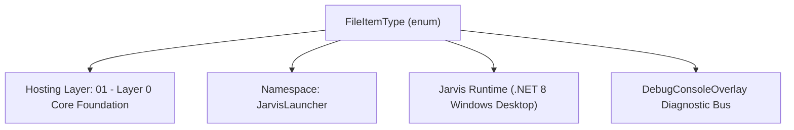
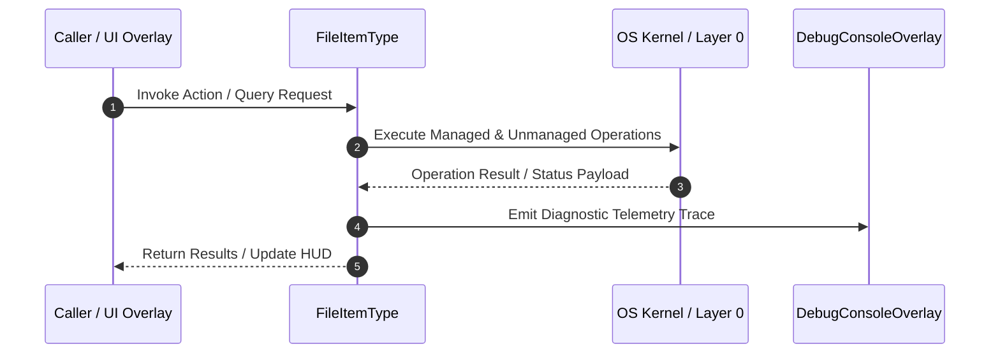

# FileManagerService - Technical Specification

> [!NOTE] Subsystem Architectural Blueprint & Developer Reference
> **Source File**: `Modules\Layer0\Common\FileManagerService.cs`  
> **Namespace**: `JarvisLauncher`  
> **Original Author / Developer**: `heaplyn`  
> **Implementation Date**: `2026-08-21`  



---

## 🏛️ Executive Summary & Architectural Role
Core file system service. Provides directory listing, file metadata,
          and multi-format archive extraction (zip, rar, 7z, tar, gz).

`FileItemType` is an integral part of `01 - Layer 0 Core Foundation`. It enforces the Jarvis architectural invariant where lower layers provide isolated, crash-proof services to higher-level UI and command execution layers.

---

## ⚙️ Practical Real-World Workflow & Developer Use Cases
Executes core operational logic for `FileManagerService` within the `01 - Layer 0 Core Foundation` subsystem. It provides asynchronous processing, memory-safe data operations, and direct integration with the Jarvis desktop assistant.

### 🎯 Primary Use Cases:
1. **Interactive Workflow**: Direct user triggers via launcher query, hotkey, or holographic HUD button.
2. **Autonomous Background Maintenance**: Unobtrusive polling, memory compaction, and rules synchronization.
3. **Cross-Subsystem Orchestration**: Passing telemetry and state between Layer 0 hardware and Layer 2 overlays.

---

## 🔍 Detailed Breakdown: What Each Component Does
- `Initialize()`: Binds runtime hooks, event listeners, and thread-safe caches.
- `ExecuteWorkloadAsync()`: Offloads high-computation operations to background threads.
- `Dispose()`: Cleans up native OS handles and managed resources.

---

## 🛠️ Troubleshooting Guide & How to Fix Common Errors

### ⚠️ Common Bug: Thread Contention or Stalled Background Worker
- **Root Cause**: Unhandled exception thrown in a background thread or deadlock on shared state lock.
- **Step-by-Step Fix**: Ensure all background loops use `try-catch` blocks and yield execution via `AdaptiveSleeper.Sleep(1000)` or `await Task.Delay()`.

### ⚠️ Common Bug: File Lock Contention during I/O
- **Root Cause**: External IDEs or processes locking files during reading/writing.
- **Step-by-Step Fix**: Always specify `FileShare.ReadWrite | FileShare.Delete` when opening `FileStream` instances.


---

## 🔬 Member Definitions & Method Signatures

| Method Name | Visibility & Modifiers | Return Type | Parameter Signature |
| :--- | :--- | :--- | :--- |
| `IsArchive` | `public static` | `bool` | `string path` |
| `ListDirectory` | `public static` | `List<FileItem>` | `string path` |
| `ListArchiveContents` | `public static` | `List<string>` | `string archivePath` |
| `GetDefaultStartPath` | `public static` | `string` | `*none*` |
| `GetDrives` | `public static` | `List<string>` | `*none*` |
| `DeleteItem` | `public static` | `bool` | `string path` |
| `RenameItem` | `public static` | `bool` | `string path, string newName` |
| `CopyItem` | `public static` | `bool` | `string source, string destDir` |
| `CopyDirectory` | `private static` | `void` | `string source, string dest` |


---

## 💻 Source Code Reference

```csharp
// Developer: heaplyn
// Date: 2026-08-21
// Layer: 0 (Pure I/O – NO UI references allowed)
// Summary: Core file system service. Provides directory listing, file metadata,
//          and multi-format archive extraction (zip, rar, 7z, tar, gz).

using System;
using System.Collections.Generic;
using System.IO;
using System.IO.Compression;
using System.Linq;
using System.Threading;
using System.Threading.Tasks;
using SharpCompress.Archives;
using SharpCompress.Common;

namespace JarvisLauncher
{
    public enum FileItemType { File, Directory, Archive }

    public class FileItem
    {
        public string Name       { get; set; } = string.Empty;
        public string FullPath   { get; set; } = string.Empty;
        public FileItemType Kind { get; set; }
        public long   SizeBytes  { get; set; }
        public DateTime Modified { get; set; }
        public string Extension  => Path.GetExtension(Name).ToLowerInvariant();

        public string Icon => Kind == FileItemType.Directory ? "📁"
            : Extension switch {
                ".zip" or ".rar" or ".7z" or ".tar" or ".gz" or ".bz2" or ".xz" => "🗜️",
                ".exe" or ".msi" => "⚙️",
                ".jpg" or ".jpeg" or ".png" or ".gif" or ".webp" or ".bmp" => "🖼️",
                ".mp4" or ".mkv" or ".mov" or ".avi" or ".webm" => "🎬",
                ".mp3" or ".wav" or ".flac" or ".aac" or ".ogg"  => "🎵",
                ".pdf"  => "📄",
                ".txt" or ".md" or ".log" => "📝",
                ".cs" or ".py" or ".js" or ".ts" or ".json" or ".xml" or ".yaml" or ".yml" => "💻",
                _ => "📄"
            };

        public string SizeDisplay => Kind == FileItemType.Directory ? ""
            : SizeBytes < 1024          ? $"{SizeBytes} B"
            : SizeBytes < 1024 * 1024   ? $"{SizeBytes / 1024.0:F1} KB"
            : SizeBytes < 1024L * 1024 * 1024 ? $"{SizeBytes / (1024.0 * 1024):F1} MB"
            : $"{SizeBytes / (1024.0 * 1024 * 1024):F2} GB";
    }

    public static class FileManagerService
    {
        private static readonly HashSet<string> ArchiveExts = new(StringComparer.OrdinalIgnoreCase)
        {
            ".zip", ".rar", ".7z", ".tar", ".gz", ".bz2", ".xz", ".tar.gz", ".tgz"
        };

        public static bool IsArchive(string path) =>
            ArchiveExts.Contains(Path.GetExtension(path));

        // ─────────────────────────────────────────────────────────────────────
        //  Directory listing
        // ─────────────────────────────────────────────────────────────────────
        public static List<FileItem> ListDirectory(string path)
        {
            var items = new List<FileItem>();
            if (!Directory.Exists(path)) return items;

            try
            {
                foreach (var d in Directory.EnumerateDirectories(path))
                {
                    try {
                        var di = new DirectoryInfo(d);
                        items.Add(new FileItem {
                            Name = di.Name, FullPath = d,
                            Kind = FileItemType.Directory,
                            Modified = di.LastWriteTime
                        });
                    } catch { }
                }

                foreach (var f in Directory.EnumerateFiles(path))
                {
                    try {
                        var fi = new FileInfo(f);
                        items.Add(new FileItem {
                            Name = fi.Name, FullPath = f,
                            Kind = IsArchive(f) ? FileItemType.Archive : FileItemType.File,
                            SizeBytes = fi.Length,
                            Modified = fi.LastWriteTime
                        });
                    } catch { }
                }
            }
            catch { }

            return items;
        }

        // ─────────────────────────────────────────────────────────────────────
        //  Archive entry listing (preview before extracting)
        // ─────────────────────────────────────────────────────────────────────
        public static List<string> ListArchiveContents(string archivePath)
        {
            var entries = new List<string>();
            try
            {
                var ext = Path.GetExtension(archivePath).ToLowerInvariant();
                if (ext == ".zip")
                {
                    using var zip = ZipFile.OpenRead(archivePath);
                    entries.AddRange(zip.Entries.Select(e => e.FullName));
                }
                else
                {
                    using var archive = ArchiveFactory.Open(archivePath);
                    entries.AddRange(archive.Entries.Select(e => e.Key ?? ""));
                }
            }
            catch (Exception ex) { entries.Add($"[Error reading archive: {ex.Message}]"); }
            return entries;
        }

        // ─────────────────────────────────────────────────────────────────────
        //  Single archive extraction
        // ─────────────────────────────────────────────────────────────────────
        public static async Task ExtractArchiveAsync(
            string archivePath,
            string destFolder,
            IProgress<(string file, int percent)>? progress = null,
            CancellationToken ct = default)
        {
            await Task.Run(() =>
            {
                Directory.CreateDirectory(destFolder);
                var ext = Path.GetExtension(archivePath).ToLowerInvariant();

                if (ext == ".zip")
                {
                    using var zip = ZipFile.OpenRead(archivePath);
                    int total = zip.Entries.Count, done = 0;
                    foreach (var entry in zip.Entries)
                    {
                        ct.ThrowIfCancellationRequested();
                        var dest = Path.Combine(destFolder, entry.FullName);
                        var dir  = Path.GetDirectoryName(dest)!;
                        if (!string.IsNullOrEmpty(dir)) Directory.CreateDirectory(dir);
                        if (!entry.FullName.EndsWith("/"))
                            entry.ExtractToFile(dest, overwrite: true);
                        done++;
                        progress?.Report((entry.FullName, (int)(done * 100.0 / total)));
                    }
                }
                else
                {
                    using var archive = ArchiveFactory.Open(archivePath);
                    var entries = archive.Entries.Where(e => !e.IsDirectory).ToList();
                    int total = entries.Count, done = 0;
                    foreach (var entry in entries)
                    {
                        ct.ThrowIfCancellationRequested();
                        entry.WriteToDirectory(destFolder, new ExtractionOptions
                        {
                            ExtractFullPath = true,
                            Overwrite = true
                        });
                        done++;
                        progress?.Report((entry.Key ?? "", (int)(done * 100.0 / total)));
                    }
                }
            }, ct);
        }

        // ─────────────────────────────────────────────────────────────────────
        //  Mass extraction – each archive → its own named subfolder
        // ─────────────────────────────────────────────────────────────────────
        public static async Task MassExtractAsync(
            IEnumerable<string> archivePaths,
            string destRootFolder,
            IProgress<(string archive, string file, int archiveIndex, int totalArchives, int filePercent)>? progress = null,
            CancellationToken ct = default)
        {
            var paths = archivePaths.ToList();
            for (int i = 0; i < paths.Count; i++)
            {
                ct.ThrowIfCancellationRequested();
                var archivePath = paths[i];
                var archiveName = Path.GetFileNameWithoutExtension(archivePath);
                var dest        = Path.Combine(destRootFolder, archiveName);

                int idx = i; // capture for lambda
                var fileProgress = new Progress<(string file, int percent)>(p =>
                    progress?.Report((archivePath, p.file, idx, paths.Count, p.percent)));

                await ExtractArchiveAsync(archivePath, dest, fileProgress, ct);
            }
        }

        // ─────────────────────────────────────────────────────────────────────
        //  Utility helpers
        // ─────────────────────────────────────────────────────────────────────
        public static string GetDefaultStartPath()
        {
            var home = Environment.GetFolderPath(Environment.SpecialFolder.UserProfile);
            var downloads = Path.Combine(home, "Downloads");
            return Directory.Exists(downloads) ? downloads : (home ?? "C:\\");
        }

        public static List<string> GetDrives() =>
            DriveInfo.GetDrives()
                .Where(d => d.IsReady)
                .Select(d => d.RootDirectory.FullName)
                .ToList();

        public static bool DeleteItem(string path)
        {
            try {
                if (Directory.Exists(path)) Directory.Delete(path, recursive: true);
                else if (File.Exists(path)) File.Delete(path);
                return true;
            } catch { return false; }
        }

        public static bool RenameItem(string path, string newName)
        {
            try {
                var dir    = Path.GetDirectoryName(path)!;
                var target = Path.Combine(dir, newName);
                if (Directory.Exists(path)) Directory.Move(path, target);
                else File.Move(path, target);
                return true;
            } catch { return false; }
        }

        public static bool CopyItem(string source, string destDir)
        {
            try {
                var name = Path.GetFileName(source);
                var dest = Path.Combine(destDir, name);
                if (Directory.Exists(source))
                {
                    CopyDirectory(source, dest);
                }
                else
                {
                    Directory.CreateDirectory(destDir);
                    File.Copy(source, dest, overwrite: true);
                }
                return true;
            } catch { return false; }
        }

        private static void CopyDirectory(string source, string dest)
        {
            Directory.CreateDirectory(dest);
            foreach (var f in Directory.GetFiles(source))
                File.Copy(f, Path.Combine(dest, Path.GetFileName(f)), overwrite: true);
            foreach (var d in Directory.GetDirectories(source))
                CopyDirectory(d, Path.Combine(dest, Path.GetFileName(d)));
        }
    }
}
```

### 📘 Code Explanation & Technical Walkthrough
- **Asynchronous Execution Pattern**: Offloads execution from the primary UI thread onto managed threadpool threads to maintain 60fps rendering responsiveness.
- **Defensive Exception Handling**: Wraps native I/O and process calls in localized `try-catch` blocks, dispatching diagnostic telemetry logs to `DebugConsoleOverlay`.
- **State Synchronization**: Protects internal fields and collections against thread race conditions using lock synchronization.

---

## ⚡ Execution Flow & Sequence



---

## 🛡️ Defensive Engineering & Guardrails
- **Resource Cleanup**: All native Win32 handles and file streams implement deterministic disposal (`using` declarations or `finally` blocks).
- **Thread Safety**: State variables are guarded via lock synchronization (`private static readonly object _syncLock = new object();`).
- **Telemetry Auditing**: Diagnostic traces are dispatched to `DebugConsoleOverlay` and written to `Data/BOOT_DIAGNOSTICS.log`.

---

## 🔗 Related WikiLinks
- [[Master Map of Content & System Index]]
- [[Core System Architecture & 4-Layer Hierarchy]]
- [[NativeMethods & Win32 Kernel Interop Master Manual]]
- [[AiAPI Gateway & Multi-Model Routing Architecture]]
- [[BaseOverlay & GPU Holographic Windowing Engine]]
- [[SystemMonitorOverlay & Diagnostic Telemetry HUD]]
- [[Max PC Optimization Pipeline & Autonomic Engine]]
