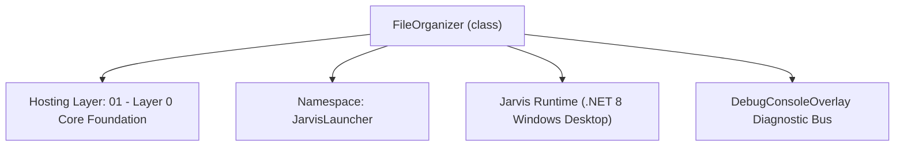
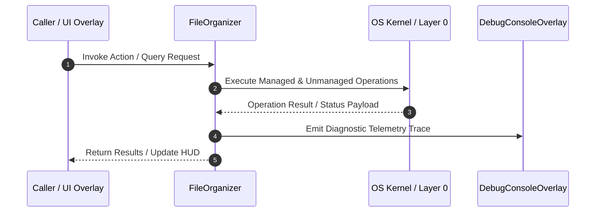

# FileOrganizer - Technical Specification

> [!NOTE] Subsystem Architectural Blueprint & Developer Reference
> **Source File**: `Modules\Layer0\Common\FileOrganizer.cs`  
> **Namespace**: `JarvisLauncher`  
> **Original Author / Developer**: `copilot`  
> **Implementation Date**: `2026-08-13`  



---

## 🏛️ Executive Summary & Architectural Role
High-performance file organization algorithms, including MD5 hashing duplicate checks, extension grouping, date archiving, and size audits.

`FileOrganizer` is an integral part of `01 - Layer 0 Core Foundation`. It enforces the Jarvis architectural invariant where lower layers provide isolated, crash-proof services to higher-level UI and command execution layers.

---

## ⚙️ Practical Real-World Workflow & Developer Use Cases
Executes core operational logic for `FileOrganizer` within the `01 - Layer 0 Core Foundation` subsystem. It provides asynchronous processing, memory-safe data operations, and direct integration with the Jarvis desktop assistant.

### 🎯 Primary Use Cases:
1. **Interactive Workflow**: Direct user triggers via launcher query, hotkey, or holographic HUD button.
2. **Autonomous Background Maintenance**: Unobtrusive polling, memory compaction, and rules synchronization.
3. **Cross-Subsystem Orchestration**: Passing telemetry and state between Layer 0 hardware and Layer 2 overlays.

---

## 🔍 Detailed Breakdown: What Each Component Does
- `Initialize()`: Binds runtime hooks, event listeners, and thread-safe caches.
- `ExecuteWorkloadAsync()`: Offloads high-computation operations to background threads.
- `Dispose()`: Cleans up native OS handles and managed resources.

---

## 🛠️ Troubleshooting Guide & How to Fix Common Errors

### ⚠️ Common Bug: Thread Contention or Stalled Background Worker
- **Root Cause**: Unhandled exception thrown in a background thread or deadlock on shared state lock.
- **Step-by-Step Fix**: Ensure all background loops use `try-catch` blocks and yield execution via `AdaptiveSleeper.Sleep(1000)` or `await Task.Delay()`.

### ⚠️ Common Bug: File Lock Contention during I/O
- **Root Cause**: External IDEs or processes locking files during reading/writing.
- **Step-by-Step Fix**: Always specify `FileShare.ReadWrite | FileShare.Delete` when opening `FileStream` instances.


---

## 🔬 Member Definitions & Method Signatures

| Method Name | Visibility & Modifiers | Return Type | Parameter Signature |
| :--- | :--- | :--- | :--- |
| `CategorizeByExtension` | `public static` | `List<string>` | `string targetDir, bool dryRun` |
| `OrganizeByDate` | `public static` | `List<string>` | `string targetDir, bool dryRun` |
| `FindDuplicates` | `public static` | `List<string>` | `string targetDir, bool purge, out List<string> purgeLog` |
| `AuditLargeFiles` | `public static` | `List<string>` | `string targetDir, long minSizeBytes` |
| `PurgeEmptyDirectories` | `public static` | `List<string>` | `string targetDir, bool dryRun` |
| `PurgeEmptyDirsRecursive` | `private static` | `void` | `string currentDir, bool dryRun, List<string> log` |
| `LevenshteinDistance` | `private static` | `int` | `string s, string t` |
| `FindFuzzyDuplicates` | `public static` | `List<string>` | `string targetDir, bool purge, out List<string> purgeLog` |
| `CleanJunkFiles` | `public static` | `List<string>` | `string targetDir, bool execute` |
| `FindStaleFiles` | `public static` | `List<string>` | `string targetDir, int daysThreshold, bool execute` |
| `FormatSize` | `private static` | `string` | `long bytes` |


---

## 💻 Source Code Reference

```csharp
// Developer: copilot
// Date: 2026-08-13
// Summary: High-performance file organization algorithms, including MD5 hashing duplicate checks, extension grouping, date archiving, and size audits.

using System;
using System.Collections.Generic;
using System.IO;
using System.Linq;
using System.Security.Cryptography;

namespace JarvisLauncher
{
    public static class FileOrganizer
    {
        // 1. EXTENSION CLUSTERING ALGORITHM
        public static List<string> CategorizeByExtension(string targetDir, bool dryRun)
        {
            var log = new List<string>();
            if (!Directory.Exists(targetDir))
            {
                log.Add($"⚠️ Directory does not exist: {targetDir}");
                return log;
            }

            var categoryMapping = new Dictionary<string, string[]>(StringComparer.OrdinalIgnoreCase)
            {
                { "Images", new[] { ".jpg", ".jpeg", ".png", ".gif", ".bmp", ".webp", ".ico", ".tiff" } },
                { "Documents", new[] { ".pdf", ".doc", ".docx", ".xls", ".xlsx", ".ppt", ".pptx", ".txt", ".csv", ".rtf", ".md" } },
                { "Video", new[] { ".mp4", ".mkv", ".avi", ".mov", ".wmv", ".flv", ".webm" } },
                { "Audio", new[] { ".mp3", ".wav", ".wma", ".ogg", ".m4a", ".flac" } },
                { "Archives", new[] { ".zip", ".rar", ".7z", ".tar", ".gz" } },
                { "Code", new[] { ".cs", ".py", ".js", ".html", ".css", ".json", ".xml", ".cpp", ".h", ".lua", ".sh", ".bat", ".ps1" } },
                { "Executables", new[] { ".exe", ".msi" } }
            };

            var files = Directory.GetFiles(targetDir);
            foreach (var file in files)
            {
                string ext = Path.GetExtension(file);
                if (string.IsNullOrEmpty(ext)) continue;

                string folderName = "Other";
                foreach (var category in categoryMapping)
                {
                    if (category.Value.Contains(ext))
                    {
                        folderName = category.Key;
                        break;
                    }
                }

                string destFolder = Path.Combine(targetDir, folderName);
                string destFile = Path.Combine(destFolder, Path.GetFileName(file));

                log.Add($"[Clustering] Move \"{Path.GetFileName(file)}\" ➔ \\{folderName}\\");

                if (!dryRun)
                {
                    try
                    {
                        if (!Directory.Exists(destFolder)) Directory.CreateDirectory(destFolder);
                        if (File.Exists(destFile))
                        {
                            string newName = Path.GetFileNameWithoutExtension(file) + "_" + Guid.NewGuid().ToString().Substring(0, 5) + ext;
                            destFile = Path.Combine(destFolder, newName);
                        }
                        File.Move(file, destFile);
                    }
                    catch (Exception ex)
                    {
                        log.Add($"  ❌ Error moving {Path.GetFileName(file)}: {ex.Message}");
                    }
                }
            }

            if (log.Count == 0) log.Add("No files to categorize.");
            return log;
        }

        // 2. DATE-BASED ARCHIVING ALGORITHM
        public static List<string> OrganizeByDate(string targetDir, bool dryRun)
        {
            var log = new List<string>();
            if (!Directory.Exists(targetDir))
            {
                log.Add($"⚠️ Directory does not exist: {targetDir}");
                return log;
            }

            var files = Directory.GetFiles(targetDir);
            foreach (var file in files)
            {
                var creationTime = File.GetLastWriteTime(file);
                string folderName = creationTime.ToString("yyyy-MM");
                string destFolder = Path.Combine(targetDir, folderName);
                string destFile = Path.Combine(destFolder, Path.GetFileName(file));

                log.Add($"[Date-Archive] Move \"{Path.GetFileName(file)}\" ➔ \\{folderName}\\");

                if (!dryRun)
                {
                    try
                    {
                        if (!Directory.Exists(destFolder)) Directory.CreateDirectory(destFolder);
                        if (File.Exists(destFile))
                        {
                            string ext = Path.GetExtension(file);
                            string newName = Path.GetFileNameWithoutExtension(file) + "_" + Guid.NewGuid().ToString().Substring(0, 5) + ext;
                            destFile = Path.Combine(destFolder, newName);
                        }
                        File.Move(file, destFile);
                    }
                    catch (Exception ex)
                    {
                        log.Add($"  ❌ Error moving {Path.GetFileName(file)}: {ex.Message}");
                    }
                }
            }

            if (log.Count == 0) log.Add("No files to organize by date.");
            return log;
        }

        // 3. DUPLICATE FINDER ALGORITHM (MD5 Hash comparison)
        public static List<string> FindDuplicates(string targetDir, bool purge, out List<string> purgeLog)
        {
            purgeLog = new List<string>();
            var log = new List<string>();
            if (!Directory.Exists(targetDir))
            {
                log.Add($"⚠️ Directory does not exist: {targetDir}");
                return log;
            }

            var files = Directory.GetFiles(targetDir, "*.*", SearchOption.AllDirectories);
            
            // Fast grouping: group by file size first before hashing
            var fileGroupsBySize = files
                .Select(f => new FileInfo(f))
                .GroupBy(f => f.Length)
                .Where(g => g.Count() > 1);

            var hashDict = new Dictionary<string, List<string>>();

            using (var md5 = MD5.Create())
            {
                foreach (var sizeGroup in fileGroupsBySize)
                {
                    foreach (var fileInfo in sizeGroup)
                    {
                        try
                        {
                            using (var stream = File.OpenRead(fileInfo.FullName))
                            {
                                byte[] hashBytes = md5.ComputeHash(stream);
                                string hashStr = BitConverter.ToString(hashBytes).Replace("-", "");

                                if (!hashDict.ContainsKey(hashStr))
                                {
                                    hashDict[hashStr] = new List<string>();
                                }
                                hashDict[hashStr].Add(fileInfo.FullName);
                            }
                        }
                        catch { }
                    }
                }
            }

            var duplicateGroups = hashDict.Values.Where(g => g.Count > 1).ToList();

            if (duplicateGroups.Count == 0)
            {
                log.Add("No duplicate files detected.");
                return log;
            }

            int count = 1;
            foreach (var group in duplicateGroups)
            {
                log.Add($"Group #{count++} (Identical MD5 Hash):");
                log.Add($"  Keep: {group[0]}");
                
                for (int i = 1; i < group.Count; i++)
                {
                    log.Add($"  Duplicate: {group[i]}");
                    
                    if (purge)
                    {
                        try
                        {
                            File.Delete(group[i]);
                            purgeLog.Add($"🗑️ Deleted duplicate: {Path.GetFileName(group[i])} from {Path.GetDirectoryName(group[i])}");
                        }
                        catch (Exception ex)
                        {
                            purgeLog.Add($"  ❌ Failed to delete duplicate: {Path.GetFileName(group[i])} - {ex.Message}");
                        }
                    }
                }
                log.Add(string.Empty);
            }

            return log;
        }

        // 4. LARGE FILES AUDIT ALGORITHM
        public static List<string> AuditLargeFiles(string targetDir, long minSizeBytes)
        {
            var log = new List<string>();
            if (!Directory.Exists(targetDir))
            {
                log.Add($"⚠️ Directory does not exist: {targetDir}");
                return log;
            }

            var files = Directory.GetFiles(targetDir, "*.*", SearchOption.AllDirectories)
                .Select(f => new FileInfo(f))
                .Where(f => f.Length >= minSizeBytes)
                .OrderByDescending(f => f.Length)
                .ToList();

            if (files.Count == 0)
            {
                log.Add($"No files found larger than {FormatSize(minSizeBytes)}.");
                return log;
            }

            log.Add($"Large files audit for '{targetDir}' (Threshold: {FormatSize(minSizeBytes)}):");
            log.Add(string.Empty);
            foreach (var f in files)
            {
                log.Add($"{FormatSize(f.Length),-10} - {f.Name} (Path: {f.FullName})");
            }

            return log;
        }

        // 5. PURGE EMPTY DIRECTORIES
        public static List<string> PurgeEmptyDirectories(string targetDir, bool dryRun)
        {
            var log = new List<string>();
            if (!Directory.Exists(targetDir))
            {
                log.Add($"⚠️ Directory does not exist: {targetDir}");
                return log;
            }

            PurgeEmptyDirsRecursive(targetDir, dryRun, log);

            if (log.Count == 0)
            {
                log.Add("No empty folders detected.");
            }
            return log;
        }

        private static void PurgeEmptyDirsRecursive(string currentDir, bool dryRun, List<string> log)
        {
            try
            {
                foreach (var subDir in Directory.GetDirectories(currentDir))
                {
                    PurgeEmptyDirsRecursive(subDir, dryRun, log);
                }

                // Reload after subdirectories are cleaned
                if (Directory.GetDirectories(currentDir).Length == 0 && Directory.GetFiles(currentDir).Length == 0)
                {
                    log.Add($"🗑️ Empty Folder: \\{Path.GetRelativePath(currentDir, currentDir)}\\ (Full Path: {currentDir})");
                    if (!dryRun)
                    {
                        Directory.Delete(currentDir);
                    }
                }
            }
            catch (Exception ex)
            {
                log.Add($"  ❌ Error inspecting folder {currentDir}: {ex.Message}");
            }
        }

        private static int LevenshteinDistance(string s, string t)
        {
            if (string.IsNullOrEmpty(s)) return string.IsNullOrEmpty(t) ? 0 : t.Length;
            if (string.IsNullOrEmpty(t)) return s.Length;

            int n = s.Length;
            int m = t.Length;
            int[,] d = new int[n + 1, m + 1];

            for (int i = 0; i <= n; d[i, 0] = i++) ;
            for (int j = 0; j <= m; d[0, j] = j++) ;

            for (int i = 1; i <= n; i++)
            {
                for (int j = 1; j <= m; j++)
                {
                    int cost = (t[j - 1] == s[i - 1]) ? 0 : 1;
                    d[i, j] = Math.Min(
                        Math.Min(d[i - 1, j] + 1, d[i, j - 1] + 1),
                        d[i - 1, j - 1] + cost);
                }
            }
            return d[n, m];
        }

        // 6. FUZZY DUPLICATE FILENAME DETECTOR (Levenshtein Distance + Copy Pattern matching)
        public static List<string> FindFuzzyDuplicates(string targetDir, bool purge, out List<string> purgeLog)
        {
            purgeLog = new List<string>();
            var log = new List<string>();
            if (!Directory.Exists(targetDir))
            {
                log.Add($"⚠️ Directory does not exist: {targetDir}");
                return log;
            }

            var files = Directory.GetFiles(targetDir, "*.*", SearchOption.AllDirectories)
                .Select(f => new FileInfo(f))
                .ToList();

            var similarGroups = new List<List<FileInfo>>();
            var processed = new HashSet<string>(StringComparer.OrdinalIgnoreCase);

            for (int i = 0; i < files.Count; i++)
            {
                var fileA = files[i];
                if (processed.Contains(fileA.FullName)) continue;

                var currentGroup = new List<FileInfo> { fileA };
                string nameA = Path.GetFileNameWithoutExtension(fileA.Name).ToLower();
                string extA = fileA.Extension.ToLower();

                for (int j = i + 1; j < files.Count; j++)
                {
                    var fileB = files[j];
                    if (processed.Contains(fileB.FullName)) continue;

                    string nameB = Path.GetFileNameWithoutExtension(fileB.Name).ToLower();
                    string extB = fileB.Extension.ToLower();

                    if (extA != extB) continue;

                    // Algorithm A: Check Levenshtein distance for close titles
                    bool isSimilar = false;
                    if (Math.Abs(nameA.Length - nameB.Length) <= 4)
                    {
                        int distance = LevenshteinDistance(nameA, nameB);
                        if (distance > 0 && distance <= 3) isSimilar = true;
                    }

                    // Algorithm B: Check Copy Patterns e.g. "File (1)", "File - Copy"
                    if (!isSimilar)
                    {
                        if (nameB.StartsWith(nameA) && (nameB.Contains("(1)") || nameB.Contains("copy") || nameB.Contains("- copy")))
                        {
                            isSimilar = true;
                        }
                        else if (nameA.StartsWith(nameB) && (nameA.Contains("(1)") || nameA.Contains("copy") || nameA.Contains("- copy")))
                        {
                            isSimilar = true;
                        }
                    }

                    if (isSimilar)
                    {
                        currentGroup.Add(fileB);
                    }
                }

                if (currentGroup.Count > 1)
                {
                    similarGroups.Add(currentGroup);
                    foreach (var f in currentGroup) processed.Add(f.FullName);
                }
            }

            if (similarGroups.Count == 0)
            {
                log.Add("No fuzzy duplicate names detected.");
                return log;
            }

            int count = 1;
            foreach (var group in similarGroups)
            {
                var sorted = group.OrderBy(f => f.CreationTimeUtc).ToList();
                log.Add($"Group #{count++} (Fuzzy/Similar Filenames):");
                log.Add($"  Keep (Oldest/Original): {sorted[0].FullName} ({FormatSize(sorted[0].Length)})");

                for (int i = 1; i < sorted.Count; i++)
                {
                    log.Add($"  Similar Item: {sorted[i].FullName} ({FormatSize(sorted[i].Length)})");

                    if (purge)
                    {
                        try
                        {
                            File.Delete(sorted[i].FullName);
                            purgeLog.Add($"🗑️ Deleted fuzzy duplicate: {sorted[i].Name} from {sorted[i].DirectoryName}");
                        }
                        catch (Exception ex)
                        {
                            purgeLog.Add($"  ❌ Failed to delete similar item: {sorted[i].Name} - {ex.Message}");
                        }
                    }
                }
                log.Add(string.Empty);
            }

            return log;
        }

        // 7. JUNK / TEMP FILES PURGE ALGORITHM
        public static List<string> CleanJunkFiles(string targetDir, bool execute)
        {
            var log = new List<string>();
            if (!Directory.Exists(targetDir))
            {
                log.Add($"⚠️ Directory does not exist: {targetDir}");
                return log;
            }

            var junkExtensions = new HashSet<string>(StringComparer.OrdinalIgnoreCase)
            {
                ".tmp", ".log", ".bak", ".old", ".part", ".crdownload", ".chk", ".temp", ".db"
            };
            var junkNames = new HashSet<string>(StringComparer.OrdinalIgnoreCase)
            {
                "thumbs.db", "desktop.ini", ".ds_store"
            };

            var files = Directory.GetFiles(targetDir, "*.*", SearchOption.AllDirectories);
            var toDelete = new List<string>();

            foreach (var file in files)
            {
                string name = Path.GetFileName(file);
                string ext = Path.GetExtension(file);

                bool isJunk = junkExtensions.Contains(ext) || junkNames.Contains(name);

                if (isJunk)
                {
                    toDelete.Add(file);
                }
            }

            if (toDelete.Count == 0)
            {
                log.Add("No system junk or temp files found.");
                return log;
            }

            log.Add($"Found {toDelete.Count} system junk / temporary files:");
            log.Add(string.Empty);

            long totalSaved = 0;
            foreach (var file in toDelete)
            {
                long size = 0;
                try { size = new FileInfo(file).Length; } catch { }
                totalSaved += size;

                log.Add($"[Junk] {Path.GetFileName(file)} ({FormatSize(size)}) - Path: {file}");

                if (execute)
                {
                    try
                    {
                        File.Delete(file);
                    }
                    catch (Exception ex)
                    {
                        log.Add($"  ❌ Error deleting junk file {Path.GetFileName(file)}: {ex.Message}");
                    }
                }
            }

            log.Add(string.Empty);
            log.Add(execute ? $"✅ Purged {toDelete.Count} junk files. Saved {FormatSize(totalSaved)} of space." 
                            : $"🔍 [Preview] Executing would purge {toDelete.Count} files and save {FormatSize(totalSaved)} of space.");

            return log;
        }

        // 8. STALE FILES (RECENCY DECAY) DETECTOR
        public static List<string> FindStaleFiles(string targetDir, int daysThreshold, bool execute)
        {
            var log = new List<string>();
            if (!Directory.Exists(targetDir))
            {
                log.Add($"⚠️ Directory does not exist: {targetDir}");
                return log;
            }

            var thresholdDate = DateTime.Now.AddDays(-daysThreshold);
            var files = Directory.GetFiles(targetDir, "*.*", SearchOption.AllDirectories)
                .Select(f => new FileInfo(f))
                .Where(f => f.LastWriteTime < thresholdDate && f.LastAccessTime < thresholdDate)
                .OrderBy(f => f.LastWriteTime)
                .ToList();

            if (files.Count == 0)
            {
                log.Add($"No stale files found that haven't been accessed or modified in the last {daysThreshold} days.");
                return log;
            }

            log.Add($"Found {files.Count} stale files older than {daysThreshold} days (unused since {thresholdDate:yyyy-MM-dd}):");
            log.Add(string.Empty);

            long totalSaved = 0;
            foreach (var f in files)
            {
                totalSaved += f.Length;
                log.Add($"[Stale - { (DateTime.Now - f.LastWriteTime).Days } days old] {f.Name} ({FormatSize(f.Length)}) - Last Modified: {f.LastWriteTime:yyyy-MM-dd}");

                if (execute)
                {
                    try
                    {
                        File.Delete(f.FullName);
                    }
                    catch (Exception ex)
                    {
                        log.Add($"  ❌ Error deleting stale file {f.Name}: {ex.Message}");
                    }
                }
            }

            log.Add(string.Empty);
            log.Add(execute ? $"✅ Purged {files.Count} stale files. Saved {FormatSize(totalSaved)} of space."
                            : $"🔍 [Preview] Executing would purge {files.Count} stale files and save {FormatSize(totalSaved)} of space.");

            return log;
        }

        private static string FormatSize(long bytes)
        {
            string[] Suffix = { "B", "KB", "MB", "GB", "TB" };
            int i;
            double dblS = bytes;
            for (i = 0; i < Suffix.Length && bytes >= 1024; i++, bytes /= 1024)
            {
                dblS = bytes / 1024.0;
            }
            return $"{dblS:0.##} {Suffix[i]}";
        }
    }
}
```

### 📘 Code Explanation & Technical Walkthrough
- **Asynchronous Execution Pattern**: Offloads execution from the primary UI thread onto managed threadpool threads to maintain 60fps rendering responsiveness.
- **Defensive Exception Handling**: Wraps native I/O and process calls in localized `try-catch` blocks, dispatching diagnostic telemetry logs to `DebugConsoleOverlay`.
- **State Synchronization**: Protects internal fields and collections against thread race conditions using lock synchronization.

---

## ⚡ Execution Flow & Sequence



---

## 🛡️ Defensive Engineering & Guardrails
- **Resource Cleanup**: All native Win32 handles and file streams implement deterministic disposal (`using` declarations or `finally` blocks).
- **Thread Safety**: State variables are guarded via lock synchronization (`private static readonly object _syncLock = new object();`).
- **Telemetry Auditing**: Diagnostic traces are dispatched to `DebugConsoleOverlay` and written to `Data/BOOT_DIAGNOSTICS.log`.

---

## 🔗 Related WikiLinks
- [[Master Map of Content & System Index]]
- [[Core System Architecture & 4-Layer Hierarchy]]
- [[NativeMethods & Win32 Kernel Interop Master Manual]]
- [[AiAPI Gateway & Multi-Model Routing Architecture]]
- [[BaseOverlay & GPU Holographic Windowing Engine]]
- [[SystemMonitorOverlay & Diagnostic Telemetry HUD]]
- [[Max PC Optimization Pipeline & Autonomic Engine]]
