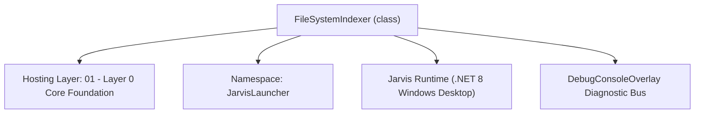
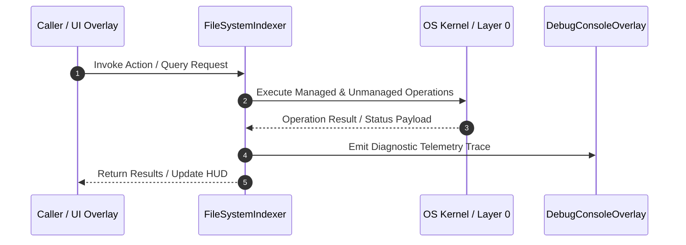

# FileSystemIndexer - Technical Specification

> [!NOTE] Subsystem Architectural Blueprint & Developer Reference
> **Source File**: `Modules\Layer0\System\FileSystemIndexer.cs`  
> **Namespace**: `JarvisLauncher`  
> **Original Author / Developer**: `heaplyn`  
> **Implementation Date**: `2026-09-02`  



---

## 🏛️ Executive Summary & Architectural Role
Slow, low-impact background filesystem indexer. Walks the user's drives one directory at
          a time with an adaptive delay between each (scaled up under load), building a searchable
          path index the AI can reference. Read-only. Skips OS/junk dirs. Persists to disk so it
          resumes across runs. Gated behind ENABLE_FILE_INDEXING.

`FileSystemIndexer` is an integral part of `01 - Layer 0 Core Foundation`. It enforces the Jarvis architectural invariant where lower layers provide isolated, crash-proof services to higher-level UI and command execution layers.

---

## ⚙️ Practical Real-World Workflow & Developer Use Cases
Executes core operational logic for `FileSystemIndexer` within the `01 - Layer 0 Core Foundation` subsystem. It provides asynchronous processing, memory-safe data operations, and direct integration with the Jarvis desktop assistant.

### 🎯 Primary Use Cases:
1. **Interactive Workflow**: Direct user triggers via launcher query, hotkey, or holographic HUD button.
2. **Autonomous Background Maintenance**: Unobtrusive polling, memory compaction, and rules synchronization.
3. **Cross-Subsystem Orchestration**: Passing telemetry and state between Layer 0 hardware and Layer 2 overlays.

---

## 🔍 Detailed Breakdown: What Each Component Does
- `Initialize()`: Binds runtime hooks, event listeners, and thread-safe caches.
- `ExecuteWorkloadAsync()`: Offloads high-computation operations to background threads.
- `Dispose()`: Cleans up native OS handles and managed resources.

---

## 🛠️ Troubleshooting Guide & How to Fix Common Errors

### ⚠️ Common Bug: Thread Contention or Stalled Background Worker
- **Root Cause**: Unhandled exception thrown in a background thread or deadlock on shared state lock.
- **Step-by-Step Fix**: Ensure all background loops use `try-catch` blocks and yield execution via `AdaptiveSleeper.Sleep(1000)` or `await Task.Delay()`.

### ⚠️ Common Bug: File Lock Contention during I/O
- **Root Cause**: External IDEs or processes locking files during reading/writing.
- **Step-by-Step Fix**: Always specify `FileShare.ReadWrite | FileShare.Delete` when opening `FileStream` instances.


---

## 🔬 Member Definitions & Method Signatures

| Method Name | Visibility & Modifiers | Return Type | Parameter Signature |
| :--- | :--- | :--- | :--- |
| `Start` | `public static` | `void` | `*none*` |
| `Search` | `public static` | `List<string>` | `string query, int max = 8` |
| `GetRoots` | `private static` | `IEnumerable<string>` | `*none*` |
| `ShouldSkip` | `private static` | `bool` | `string dir` |
| `LoadIndex` | `private static` | `void` | `*none*` |
| `SaveIndex` | `private static` | `void` | `*none*` |


---

## 💻 Source Code Reference

```csharp
// Developer: heaplyn
// Date: 2026-09-02
// Summary: Slow, low-impact background filesystem indexer. Walks the user's drives one directory at
//          a time with an adaptive delay between each (scaled up under load), building a searchable
//          path index the AI can reference. Read-only. Skips OS/junk dirs. Persists to disk so it
//          resumes across runs. Gated behind ENABLE_FILE_INDEXING.

using System;
using System.Collections.Generic;
using System.IO;
using System.Linq;
using System.Threading;
using System.Threading.Tasks;

namespace JarvisLauncher
{
    public static class FileSystemIndexer
    {
        private static readonly HashSet<string> _index = new(StringComparer.OrdinalIgnoreCase);
        private static readonly object _lock = new();
        private static int _started;

        private static string IndexFile =>
            Path.Combine(AppDomain.CurrentDomain.BaseDirectory, "Data", "FileIndex.txt");

        public static int Count { get { lock (_lock) return _index.Count; } }
        public static bool IsScanning { get; private set; }

        // Directory names to skip entirely (OS internals, caches, VCS, huge dependency trees).
        private static readonly string[] SkipNames =
        {
            "windows", "$recycle.bin", "system volume information", "program files",
            "program files (x86)", "programdata", "node_modules", ".git", "obj", "bin",
            "appdata", "$windows.~ws", "$windows.~bt", "recovery", ".vs", ".gradle", ".nuget"
        };

        public static void Start()
        {
            if (Interlocked.CompareExchange(ref _started, 1, 0) != 0) return;
            _ = Task.Run(ScanLoopAsync);
        }

        public static List<string> Search(string query, int max = 8)
        {
            if (string.IsNullOrWhiteSpace(query)) return new List<string>();
            lock (_lock)
                return _index.Where(p => p.Contains(query, StringComparison.OrdinalIgnoreCase)).Take(max).ToList();
        }

        private static async Task ScanLoopAsync()
        {
            LoadIndex();
            try
            {
                while (true)
                {
                    if (!CoreRegistry.Data.Settings.Current.ENABLE_FILE_INDEXING)
                    {
                        await AdaptiveSleeper.DelayAsync(30000);   // idle-check while disabled
                        continue;
                    }

                    IsScanning = true;
                    var roots = GetRoots();
                    var stack = new Stack<string>(roots);
                    int sinceSave = 0;

                    while (stack.Count > 0)
                    {
                        if (!CoreRegistry.Data.Settings.Current.ENABLE_FILE_INDEXING) break;
                        string dir = stack.Pop();

                        try
                        {
                            foreach (var f in Directory.EnumerateFiles(dir))
                            { lock (_lock) _index.Add(f); }

                            foreach (var sub in Directory.EnumerateDirectories(dir))
                                if (!ShouldSkip(sub)) stack.Push(sub);
                        }
                        catch { /* access denied / transient — skip */ }

                        // Slow but sure: adaptive delay per directory (backs off under load).
                        int baseMs = Math.Max(20, CoreRegistry.Data.Settings.Current.FILE_INDEX_DELAY_MS);
                        await AdaptiveSleeper.DelayAsync(baseMs, default, maxMultiplier: 8);

                        if (++sinceSave >= 400) { SaveIndex(); sinceSave = 0; }
                    }

                    IsScanning = false;
                    SaveIndex();
                    try { DebugConsoleOverlay.Log("File-Index", $"Full pass complete — {Count} files indexed."); } catch { }

                    // Re-scan periodically to pick up new files (adaptive; hours between passes).
                    await AdaptiveSleeper.DelayAsync(1000 * 60 * 30, default, maxMultiplier: 2, maxCapMs: 1000 * 60 * 60);
                }
            }
            catch { IsScanning = false; }
        }

        private static IEnumerable<string> GetRoots()
        {
            // Prefer the user's home first (most relevant), then other fixed drives.
            var roots = new List<string>();
            try { roots.Add(Environment.GetFolderPath(Environment.SpecialFolder.UserProfile)); } catch { }
            try
            {
                foreach (var d in DriveInfo.GetDrives())
                    if (d.IsReady && d.DriveType == DriveType.Fixed && !roots.Contains(d.RootDirectory.FullName))
                        roots.Add(d.RootDirectory.FullName);
            }
            catch { }
            return roots.Where(Directory.Exists);
        }

        private static bool ShouldSkip(string dir)
        {
            try
            {
                string name = Path.GetFileName(dir.TrimEnd(Path.DirectorySeparatorChar)).ToLowerInvariant();
                if (name.StartsWith(".")) return true;
                return SkipNames.Contains(name);
            }
            catch { return true; }
        }

        private static void LoadIndex()
        {
            try
            {
                if (File.Exists(IndexFile))
                    lock (_lock)
                        foreach (var line in File.ReadLines(IndexFile))
                            if (!string.IsNullOrWhiteSpace(line)) _index.Add(line);
            }
            catch { }
        }

        private static void SaveIndex()
        {
            try
            {
                Directory.CreateDirectory(Path.GetDirectoryName(IndexFile)!);
                string[] snapshot;
                lock (_lock) snapshot = _index.ToArray();
                File.WriteAllLines(IndexFile, snapshot);
            }
            catch { }
        }
    }
}
```

### 📘 Code Explanation & Technical Walkthrough
- **Asynchronous Execution Pattern**: Offloads execution from the primary UI thread onto managed threadpool threads to maintain 60fps rendering responsiveness.
- **Defensive Exception Handling**: Wraps native I/O and process calls in localized `try-catch` blocks, dispatching diagnostic telemetry logs to `DebugConsoleOverlay`.
- **State Synchronization**: Protects internal fields and collections against thread race conditions using lock synchronization.

---

## ⚡ Execution Flow & Sequence



---

## 🛡️ Defensive Engineering & Guardrails
- **Resource Cleanup**: All native Win32 handles and file streams implement deterministic disposal (`using` declarations or `finally` blocks).
- **Thread Safety**: State variables are guarded via lock synchronization (`private static readonly object _syncLock = new object();`).
- **Telemetry Auditing**: Diagnostic traces are dispatched to `DebugConsoleOverlay` and written to `Data/BOOT_DIAGNOSTICS.log`.

---

## 🔗 Related WikiLinks
- [[Master Map of Content & System Index]]
- [[Core System Architecture & 4-Layer Hierarchy]]
- [[NativeMethods & Win32 Kernel Interop Master Manual]]
- [[AiAPI Gateway & Multi-Model Routing Architecture]]
- [[BaseOverlay & GPU Holographic Windowing Engine]]
- [[SystemMonitorOverlay & Diagnostic Telemetry HUD]]
- [[Max PC Optimization Pipeline & Autonomic Engine]]
