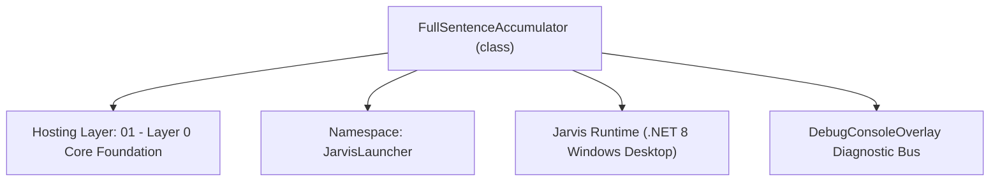
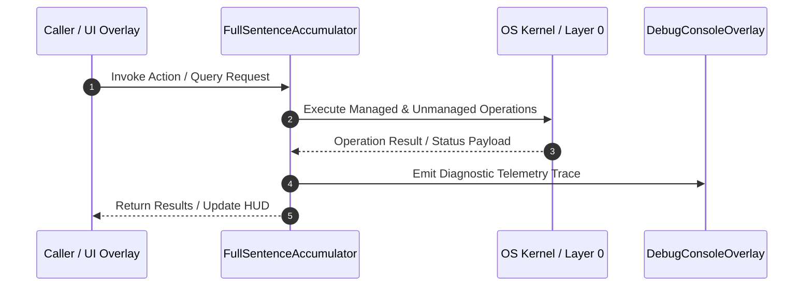

# FullSentenceAccumulator - Technical Specification

> [!NOTE] Subsystem Architectural Blueprint & Developer Reference
> **Source File**: `Modules\Layer0\Common\FullSentenceAccumulator.cs`  
> **Namespace**: `JarvisLauncher`  
> **Original Author / Developer**: `heaplyn`  
> **Implementation Date**: `2026-08-13`  



---

## 🏛️ Executive Summary & Architectural Role
Full-Sentence Speech Accumulator & Silence Detector Engine.
 Buffers streaming voice tokens until the user completely finishes speaking, then executes the statement.

`FullSentenceAccumulator` is an integral part of `01 - Layer 0 Core Foundation`. It enforces the Jarvis architectural invariant where lower layers provide isolated, crash-proof services to higher-level UI and command execution layers.

---

## ⚙️ Practical Real-World Workflow & Developer Use Cases
Executes core operational logic for `FullSentenceAccumulator` within the `01 - Layer 0 Core Foundation` subsystem. It provides asynchronous processing, memory-safe data operations, and direct integration with the Jarvis desktop assistant.

### 🎯 Primary Use Cases:
1. **Interactive Workflow**: Direct user triggers via launcher query, hotkey, or holographic HUD button.
2. **Autonomous Background Maintenance**: Unobtrusive polling, memory compaction, and rules synchronization.
3. **Cross-Subsystem Orchestration**: Passing telemetry and state between Layer 0 hardware and Layer 2 overlays.

---

## 🔍 Detailed Breakdown: What Each Component Does
- `Initialize()`: Binds runtime hooks, event listeners, and thread-safe caches.
- `ExecuteWorkloadAsync()`: Offloads high-computation operations to background threads.
- `Dispose()`: Cleans up native OS handles and managed resources.

---

## 🛠️ Troubleshooting Guide & How to Fix Common Errors

### ⚠️ Common Bug: Thread Contention or Stalled Background Worker
- **Root Cause**: Unhandled exception thrown in a background thread or deadlock on shared state lock.
- **Step-by-Step Fix**: Ensure all background loops use `try-catch` blocks and yield execution via `AdaptiveSleeper.Sleep(1000)` or `await Task.Delay()`.

### ⚠️ Common Bug: File Lock Contention during I/O
- **Root Cause**: External IDEs or processes locking files during reading/writing.
- **Step-by-Step Fix**: Always specify `FileShare.ReadWrite | FileShare.Delete` when opening `FileStream` instances.


---

## 🔬 Member Definitions & Method Signatures

| Method Name | Visibility & Modifiers | Return Type | Parameter Signature |
| :--- | :--- | :--- | :--- |
| `AppendSpeechToken` | `public static` | `void` | `string token` |
| `OnSilenceTimerElapsed` | `private static` | `void` | `object? state` |
| `FlushNow` | `public static` | `void` | `*none*` |
| `Reset` | `public static` | `void` | `*none*` |


---

## 💻 Source Code Reference

```csharp
// Developer: heaplyn
// Date: 2026-08-13
// Summary: Full-Sentence Speech Accumulator & Silence Detector Engine.
// Buffers streaming voice tokens until the user completely finishes speaking, then executes the statement.

using System;
using System.Text;
using System.Threading;
using System.Threading.Tasks;
using System.Windows;

namespace JarvisLauncher
{
    public static class FullSentenceAccumulator
    {
        public static event Action<string>? OnFullSentenceCompleted;

        private static readonly StringBuilder _sentenceBuffer = new();
        private static System.Threading.Timer? _silenceTimer;
        private static readonly object _lock = new();
        private static DateTime _lastSpeechTime = DateTime.MinValue;

        // 3.0 seconds (3000ms) of audio silence required for regular speech to ensure user is fully finished.
        private static int SilencePauseMs => Math.Max(1000, SettingsManager.Current.VOICE_CHUNKING_SILENCE_MS > 0 ? SettingsManager.Current.VOICE_CHUNKING_SILENCE_MS : 3000);

        static FullSentenceAccumulator()
        {
            _silenceTimer = new System.Threading.Timer(OnSilenceTimerElapsed, null, Timeout.Infinite, Timeout.Infinite);
        }

        /// <summary>
        /// Appends a new voice token into the full-sentence buffer and resets silence timer.
        /// </summary>
        public static void AppendSpeechToken(string token)
        {
            if (string.IsNullOrWhiteSpace(token)) return;

            // Acoustic Echo Suppression
            if (((TtsManager)CoreRegistry.Interaction.Tts).IsSpeakingOrEchoingInternal) return;

            lock (_lock)
            {
                string cleanToken = token.Trim();

                // Avoid duplicate consecutive tokens
                string currentStr = _sentenceBuffer.ToString().Trim();
                if (!currentStr.EndsWith(cleanToken, StringComparison.OrdinalIgnoreCase))
                {
                    if (_sentenceBuffer.Length > 0) _sentenceBuffer.Append(" ");
                    _sentenceBuffer.Append(cleanToken);
                }

                _lastSpeechTime = DateTime.Now;

                string fullTextSoFar = _sentenceBuffer.ToString().Trim();
                DebugConsoleOverlay.Log("Sentence Accumulator", $"Listening... \"{fullTextSoFar}\"");

                // Dynamic Silence Gate: If sentence contains a recognized action command keyword,
                // trigger query processing after 1.5 seconds of silence instead of waiting full 6 seconds.
                int activeSilenceMs = SilencePauseMs;
                string lowerText = fullTextSoFar.ToLower();
                if (lowerText.Contains("open") || lowerText.Contains("weather") || lowerText.Contains("shutdown") ||
                    lowerText.Contains("lock") || lowerText.Contains("mcp") || lowerText.Contains("google") ||
                    lowerText.Contains("search") || lowerText.Contains("convert") || lowerText.Contains("code assist") ||
                    lowerText.Contains("turn on") || lowerText.Contains("turn off") || lowerText.Contains("exit") ||
                    lowerText.Contains("voicemode"))
                {
                    activeSilenceMs = 1500;
                }

                // Reset silence countdown timer (waits until user finishes speaking completely)
                _silenceTimer?.Change(activeSilenceMs, Timeout.Infinite);
            }
        }

        private static void OnSilenceTimerElapsed(object? state)
        {
            string completedSentence = string.Empty;

            lock (_lock)
            {
                if (_sentenceBuffer.Length == 0) return;

                completedSentence = _sentenceBuffer.ToString().Trim();
                _sentenceBuffer.Clear();
            }

            if (!string.IsNullOrWhiteSpace(completedSentence))
            {
                System.Diagnostics.Debug.WriteLine($"✅ User Finished Speaking ({completedSentence.Length} chars): \"{completedSentence}\"");

                Application.Current.Dispatcher.Invoke(() =>
                {
                    OnFullSentenceCompleted?.Invoke(completedSentence);
                });
            }
        }

        /// <summary>
        /// Forces immediate submission of the accumulated sentence without waiting for silence timer.
        /// </summary>
        public static void FlushNow()
        {
            OnSilenceTimerElapsed(null);
        }

        /// <summary>
        /// Clears current buffered speech.
        /// </summary>
        public static void Reset()
        {
            lock (_lock)
            {
                _sentenceBuffer.Clear();
                _silenceTimer?.Change(Timeout.Infinite, Timeout.Infinite);
            }
        }
    }
}
```

### 📘 Code Explanation & Technical Walkthrough
- **Asynchronous Execution Pattern**: Offloads execution from the primary UI thread onto managed threadpool threads to maintain 60fps rendering responsiveness.
- **Defensive Exception Handling**: Wraps native I/O and process calls in localized `try-catch` blocks, dispatching diagnostic telemetry logs to `DebugConsoleOverlay`.
- **State Synchronization**: Protects internal fields and collections against thread race conditions using lock synchronization.

---

## ⚡ Execution Flow & Sequence



---

## 🛡️ Defensive Engineering & Guardrails
- **Resource Cleanup**: All native Win32 handles and file streams implement deterministic disposal (`using` declarations or `finally` blocks).
- **Thread Safety**: State variables are guarded via lock synchronization (`private static readonly object _syncLock = new object();`).
- **Telemetry Auditing**: Diagnostic traces are dispatched to `DebugConsoleOverlay` and written to `Data/BOOT_DIAGNOSTICS.log`.

---

## 🔗 Related WikiLinks
- [[Master Map of Content & System Index]]
- [[Core System Architecture & 4-Layer Hierarchy]]
- [[NativeMethods & Win32 Kernel Interop Master Manual]]
- [[AiAPI Gateway & Multi-Model Routing Architecture]]
- [[BaseOverlay & GPU Holographic Windowing Engine]]
- [[SystemMonitorOverlay & Diagnostic Telemetry HUD]]
- [[Max PC Optimization Pipeline & Autonomic Engine]]
