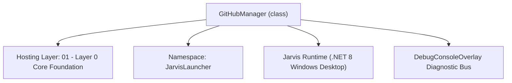
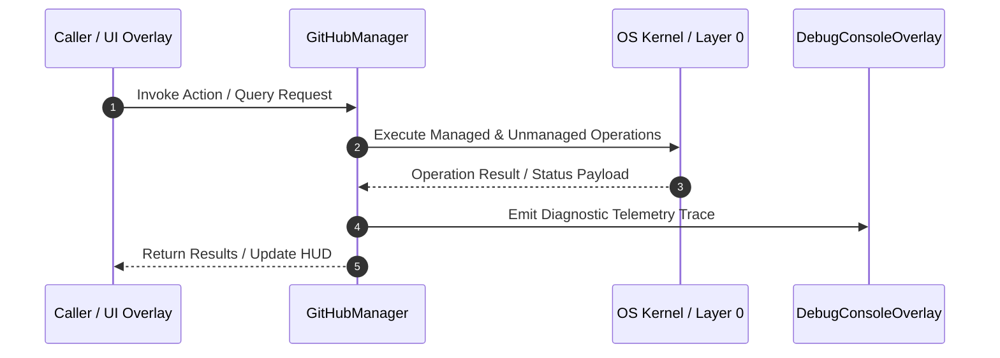

# GitHubManager - Technical Specification

> [!NOTE] Subsystem Architectural Blueprint & Developer Reference
> **Source File**: `Modules\Layer0\Common\GitHubManager.cs`  
> **Namespace**: `JarvisLauncher`  
> **Original Author / Developer**: `heaplyn`  
> **Implementation Date**: `2026-08-15`  



---

## 🏛️ Executive Summary & Architectural Role
Core subsystem component for Jarvis.

`GitHubManager` is an integral part of `01 - Layer 0 Core Foundation`. It enforces the Jarvis architectural invariant where lower layers provide isolated, crash-proof services to higher-level UI and command execution layers.

---

## ⚙️ Practical Real-World Workflow & Developer Use Cases
Executes core operational logic for `GitHubManager` within the `01 - Layer 0 Core Foundation` subsystem. It provides asynchronous processing, memory-safe data operations, and direct integration with the Jarvis desktop assistant.

### 🎯 Primary Use Cases:
1. **Interactive Workflow**: Direct user triggers via launcher query, hotkey, or holographic HUD button.
2. **Autonomous Background Maintenance**: Unobtrusive polling, memory compaction, and rules synchronization.
3. **Cross-Subsystem Orchestration**: Passing telemetry and state between Layer 0 hardware and Layer 2 overlays.

---

## 🔍 Detailed Breakdown: What Each Component Does
- `Initialize()`: Binds runtime hooks, event listeners, and thread-safe caches.
- `ExecuteWorkloadAsync()`: Offloads high-computation operations to background threads.
- `Dispose()`: Cleans up native OS handles and managed resources.

---

## 🛠️ Troubleshooting Guide & How to Fix Common Errors

### ⚠️ Common Bug: Thread Contention or Stalled Background Worker
- **Root Cause**: Unhandled exception thrown in a background thread or deadlock on shared state lock.
- **Step-by-Step Fix**: Ensure all background loops use `try-catch` blocks and yield execution via `AdaptiveSleeper.Sleep(1000)` or `await Task.Delay()`.

### ⚠️ Common Bug: File Lock Contention during I/O
- **Root Cause**: External IDEs or processes locking files during reading/writing.
- **Step-by-Step Fix**: Always specify `FileShare.ReadWrite | FileShare.Delete` when opening `FileStream` instances.


---

## 🔬 Member Definitions & Method Signatures

| Method Name | Visibility & Modifiers | Return Type | Parameter Signature |
| :--- | :--- | :--- | :--- |


---

## 💻 Source Code Reference

```csharp
using System;
using System.Collections.Generic;
using System.Net.Http;
using System.Text;
using System.Text.Json;
using System.Threading.Tasks;

namespace JarvisLauncher
{
    public static class GitHubManager
    {
        private static readonly HttpClient _client = new HttpClient();

        static GitHubManager()
        {
            _client.DefaultRequestHeaders.Add("User-Agent", "Jarvis-PC-Assistant");
        }

        public static async Task<string> GetRepoInfoAsync(string ownerRepo)
        {
            try
            {
                string url = $"https://api.github.com/repos/{ownerRepo}";
                string json = await _client.GetStringAsync(url);
                using var doc = JsonDocument.Parse(json);
                var root = doc.RootElement;

                var sb = new StringBuilder();
                sb.AppendLine($"GitHub Repository: {ownerRepo}");
                sb.AppendLine($"Description: {root.GetProperty("description").GetString() ?? "No description"}");
                sb.AppendLine($"Stars: {root.GetProperty("stargazers_count").GetInt32()}");
                sb.AppendLine($"Language: {root.GetProperty("language").GetString() ?? "Unknown"}");
                sb.AppendLine($"URL: {root.GetProperty("html_url").GetString() ?? ""}");
                return sb.ToString();
            }
            catch (Exception ex)
            {
                return $"Error fetching GitHub repo info: {ex.Message}";
            }
        }

        public static async Task<string> ListRepoContentsAsync(string ownerRepo, string path = "")
        {
            try
            {
                string url = $"https://api.github.com/repos/{ownerRepo}/contents/{path}";
                string json = await _client.GetStringAsync(url);
                using var doc = JsonDocument.Parse(json);
                var root = doc.RootElement;

                var sb = new StringBuilder();
                sb.AppendLine($"Contents of {ownerRepo}/{path}:");
                foreach (var item in root.EnumerateArray())
                {
                    string type = (item.TryGetProperty("type", out var typeProp) && typeProp.GetString() == "dir") ? "[DIR]" : "[FILE]";
                    string name = item.TryGetProperty("name", out var nameProp) ? (nameProp.GetString() ?? "unknown") : "unknown";
                    sb.AppendLine($"{type} {name}");
                }
                return sb.ToString();
            }
            catch (Exception ex)
            {
                return $"Error listing GitHub contents: {ex.Message}";
            }
        }

        public static async Task<string> ReadGitHubFileAsync(string ownerRepo, string filePath)
        {
            try
            {
                // We use raw.githubusercontent.com for easier text retrieval
                string url = $"https://raw.githubusercontent.com/{ownerRepo}/main/{filePath}";

                // Try main branch first, then master if it fails
                var response = await _client.GetAsync(url);
                if (!response.IsSuccessStatusCode)
                {
                    url = $"https://raw.githubusercontent.com/{ownerRepo}/master/{filePath}";
                    response = await _client.GetAsync(url);
                }

                if (response.IsSuccessStatusCode)
                {
                    string content = await response.Content.ReadAsStringAsync();
                    return content.Length > 5000 ? content.Substring(0, 5000) + "\n... (truncated)" : content;
                }

                return $"Error reading GitHub file: {response.StatusCode}";
            }
            catch (Exception ex)
            {
                return $"Error reading GitHub file: {ex.Message}";
            }
        }
    }
}
```

### 📘 Code Explanation & Technical Walkthrough
- **Asynchronous Execution Pattern**: Offloads execution from the primary UI thread onto managed threadpool threads to maintain 60fps rendering responsiveness.
- **Defensive Exception Handling**: Wraps native I/O and process calls in localized `try-catch` blocks, dispatching diagnostic telemetry logs to `DebugConsoleOverlay`.
- **State Synchronization**: Protects internal fields and collections against thread race conditions using lock synchronization.

---

## ⚡ Execution Flow & Sequence



---

## 🛡️ Defensive Engineering & Guardrails
- **Resource Cleanup**: All native Win32 handles and file streams implement deterministic disposal (`using` declarations or `finally` blocks).
- **Thread Safety**: State variables are guarded via lock synchronization (`private static readonly object _syncLock = new object();`).
- **Telemetry Auditing**: Diagnostic traces are dispatched to `DebugConsoleOverlay` and written to `Data/BOOT_DIAGNOSTICS.log`.

---

## 🔗 Related WikiLinks
- [[Master Map of Content & System Index]]
- [[Core System Architecture & 4-Layer Hierarchy]]
- [[NativeMethods & Win32 Kernel Interop Master Manual]]
- [[AiAPI Gateway & Multi-Model Routing Architecture]]
- [[BaseOverlay & GPU Holographic Windowing Engine]]
- [[SystemMonitorOverlay & Diagnostic Telemetry HUD]]
- [[Max PC Optimization Pipeline & Autonomic Engine]]
