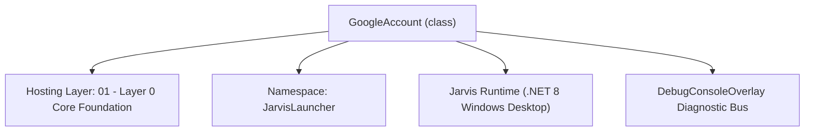
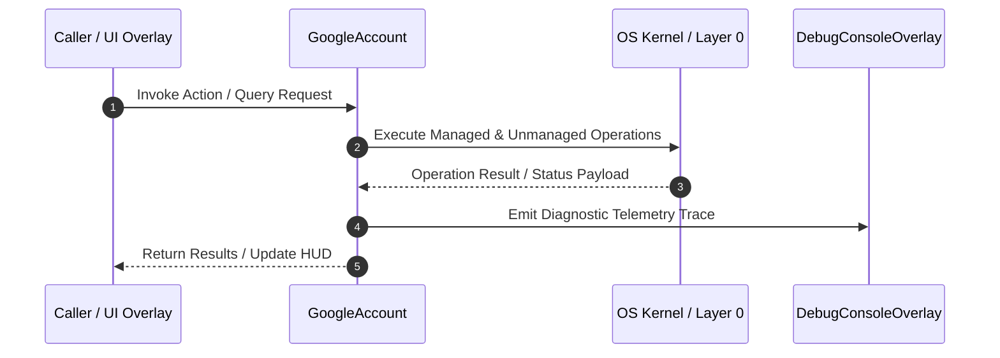

# GoogleAccountManager - Technical Specification

> [!NOTE] Subsystem Architectural Blueprint & Developer Reference
> **Source File**: `Modules\Layer0\Common\GoogleAccountManager.cs`  
> **Namespace**: `JarvisLauncher`  
> **Original Author / Developer**: `heaplyn`  
> **Implementation Date**: `2026-09-01`  



---

## 🏛️ Executive Summary & Architectural Role
Multi-account store for connected Google accounts. Add several accounts, switch the
          active one, remove them. The ACTIVE account's tokens are mirrored into the legacy
          GOOGLE_OAUTH_* settings so all existing code (Gmail, Gemini-via-OAuth, GCloud) keeps
          working unchanged. Persisted as JSON in GOOGLE_ACCOUNTS_JSON.

`GoogleAccount` is an integral part of `01 - Layer 0 Core Foundation`. It enforces the Jarvis architectural invariant where lower layers provide isolated, crash-proof services to higher-level UI and command execution layers.

---

## ⚙️ Practical Real-World Workflow & Developer Use Cases
Executes core operational logic for `GoogleAccountManager` within the `01 - Layer 0 Core Foundation` subsystem. It provides asynchronous processing, memory-safe data operations, and direct integration with the Jarvis desktop assistant.

### 🎯 Primary Use Cases:
1. **Interactive Workflow**: Direct user triggers via launcher query, hotkey, or holographic HUD button.
2. **Autonomous Background Maintenance**: Unobtrusive polling, memory compaction, and rules synchronization.
3. **Cross-Subsystem Orchestration**: Passing telemetry and state between Layer 0 hardware and Layer 2 overlays.

---

## 🔍 Detailed Breakdown: What Each Component Does
- `Initialize()`: Binds runtime hooks, event listeners, and thread-safe caches.
- `ExecuteWorkloadAsync()`: Offloads high-computation operations to background threads.
- `Dispose()`: Cleans up native OS handles and managed resources.

---

## 🛠️ Troubleshooting Guide & How to Fix Common Errors

### ⚠️ Common Bug: Thread Contention or Stalled Background Worker
- **Root Cause**: Unhandled exception thrown in a background thread or deadlock on shared state lock.
- **Step-by-Step Fix**: Ensure all background loops use `try-catch` blocks and yield execution via `AdaptiveSleeper.Sleep(1000)` or `await Task.Delay()`.

### ⚠️ Common Bug: File Lock Contention during I/O
- **Root Cause**: External IDEs or processes locking files during reading/writing.
- **Step-by-Step Fix**: Always specify `FileShare.ReadWrite | FileShare.Delete` when opening `FileStream` instances.


---

## 🔬 Member Definitions & Method Signatures

| Method Name | Visibility & Modifiers | Return Type | Parameter Signature |
| :--- | :--- | :--- | :--- |
| `EnsureLoaded` | `private static` | `void` | `*none*` |
| `UpsertAndActivate` | `public static` | `void` | `GoogleAccount acc` |
| `Activate` | `public static` | `bool` | `string email` |
| `UpdateActiveTokens` | `public static` | `void` | `string accessToken, string? refreshToken = null` |
| `Remove` | `public static` | `void` | `string email` |
| `Persist` | `private static` | `void` | `*none*` |


---

## 💻 Source Code Reference

```csharp
// Developer: heaplyn
// Date: 2026-09-01
// Summary: Multi-account store for connected Google accounts. Add several accounts, switch the
//          active one, remove them. The ACTIVE account's tokens are mirrored into the legacy
//          GOOGLE_OAUTH_* settings so all existing code (Gmail, Gemini-via-OAuth, GCloud) keeps
//          working unchanged. Persisted as JSON in GOOGLE_ACCOUNTS_JSON.

using System;
using System.Collections.Generic;
using System.Linq;
using System.Text.Json;

namespace JarvisLauncher
{
    public class GoogleAccount
    {
        public string Email { get; set; } = "";
        public string AccessToken { get; set; } = "";
        public string RefreshToken { get; set; } = "";
        public DateTime AddedUtc { get; set; } = DateTime.UtcNow;
    }

    public static class GoogleAccountManager
    {
        private static List<GoogleAccount>? _accounts;

        private static List<GoogleAccount> Accounts
        {
            get
            {
                if (_accounts == null) EnsureLoaded();
                return _accounts!;
            }
        }

        public static IReadOnlyList<GoogleAccount> All => Accounts;
        public static string ActiveEmail => CoreRegistry.Data.Settings.Current.GOOGLE_OAUTH_USER_EMAIL;

        private static void EnsureLoaded()
        {
            var s = CoreRegistry.Data.Settings.Current;
            try
            {
                _accounts = string.IsNullOrWhiteSpace(s.GOOGLE_ACCOUNTS_JSON)
                    ? new List<GoogleAccount>()
                    : JsonSerializer.Deserialize<List<GoogleAccount>>(s.GOOGLE_ACCOUNTS_JSON) ?? new List<GoogleAccount>();
            }
            catch { _accounts = new List<GoogleAccount>(); }

            // Seed from legacy single-account fields if the list is empty but a login exists.
            if (_accounts.Count == 0 && !string.IsNullOrWhiteSpace(s.GOOGLE_OAUTH_USER_EMAIL) &&
                !string.IsNullOrWhiteSpace(s.GOOGLE_OAUTH_ACCESS_TOKEN))
            {
                _accounts.Add(new GoogleAccount
                {
                    Email = s.GOOGLE_OAUTH_USER_EMAIL,
                    AccessToken = s.GOOGLE_OAUTH_ACCESS_TOKEN,
                    RefreshToken = s.GOOGLE_OAUTH_REFRESH_TOKEN
                });
                Persist();
            }
        }

        /// <summary>Add or update an account (by email) and make it active.</summary>
        public static void UpsertAndActivate(GoogleAccount acc)
        {
            if (string.IsNullOrWhiteSpace(acc.Email)) return;
            var existing = Accounts.FirstOrDefault(a => a.Email.Equals(acc.Email, StringComparison.OrdinalIgnoreCase));
            if (existing != null)
            {
                existing.AccessToken = acc.AccessToken;
                if (!string.IsNullOrWhiteSpace(acc.RefreshToken)) existing.RefreshToken = acc.RefreshToken;
            }
            else Accounts.Add(acc);

            Activate(acc.Email);
            Persist();
        }

        /// <summary>Switch the active account; mirrors its tokens into the legacy settings fields.</summary>
        public static bool Activate(string email)
        {
            var a = Accounts.FirstOrDefault(x => x.Email.Equals(email, StringComparison.OrdinalIgnoreCase));
            if (a == null) return false;
            var s = CoreRegistry.Data.Settings.Current;
            s.GOOGLE_OAUTH_USER_EMAIL = a.Email;
            s.GOOGLE_OAUTH_ACCESS_TOKEN = a.AccessToken;
            s.GOOGLE_OAUTH_REFRESH_TOKEN = a.RefreshToken;
            CoreRegistry.Data.Settings.Save();
            return true;
        }

        /// <summary>Called after a token refresh to keep the stored account current.</summary>
        public static void UpdateActiveTokens(string accessToken, string? refreshToken = null)
        {
            var a = Accounts.FirstOrDefault(x => x.Email.Equals(ActiveEmail, StringComparison.OrdinalIgnoreCase));
            if (a == null) return;
            a.AccessToken = accessToken;
            if (!string.IsNullOrWhiteSpace(refreshToken)) a.RefreshToken = refreshToken!;
            Persist();
        }

        public static void Remove(string email)
        {
            Accounts.RemoveAll(a => a.Email.Equals(email, StringComparison.OrdinalIgnoreCase));
            if (ActiveEmail.Equals(email, StringComparison.OrdinalIgnoreCase))
            {
                if (Accounts.Count > 0) Activate(Accounts[0].Email);
                else OAuth2Manager.SignOutGoogle();
            }
            Persist();
        }

        private static void Persist()
        {
            try
            {
                CoreRegistry.Data.Settings.Current.GOOGLE_ACCOUNTS_JSON = JsonSerializer.Serialize(_accounts);
                CoreRegistry.Data.Settings.Save();
            }
            catch { }
        }
    }
}
```

### 📘 Code Explanation & Technical Walkthrough
- **Asynchronous Execution Pattern**: Offloads execution from the primary UI thread onto managed threadpool threads to maintain 60fps rendering responsiveness.
- **Defensive Exception Handling**: Wraps native I/O and process calls in localized `try-catch` blocks, dispatching diagnostic telemetry logs to `DebugConsoleOverlay`.
- **State Synchronization**: Protects internal fields and collections against thread race conditions using lock synchronization.

---

## ⚡ Execution Flow & Sequence



---

## 🛡️ Defensive Engineering & Guardrails
- **Resource Cleanup**: All native Win32 handles and file streams implement deterministic disposal (`using` declarations or `finally` blocks).
- **Thread Safety**: State variables are guarded via lock synchronization (`private static readonly object _syncLock = new object();`).
- **Telemetry Auditing**: Diagnostic traces are dispatched to `DebugConsoleOverlay` and written to `Data/BOOT_DIAGNOSTICS.log`.

---

## 🔗 Related WikiLinks
- [[Master Map of Content & System Index]]
- [[Core System Architecture & 4-Layer Hierarchy]]
- [[NativeMethods & Win32 Kernel Interop Master Manual]]
- [[AiAPI Gateway & Multi-Model Routing Architecture]]
- [[BaseOverlay & GPU Holographic Windowing Engine]]
- [[SystemMonitorOverlay & Diagnostic Telemetry HUD]]
- [[Max PC Optimization Pipeline & Autonomic Engine]]
