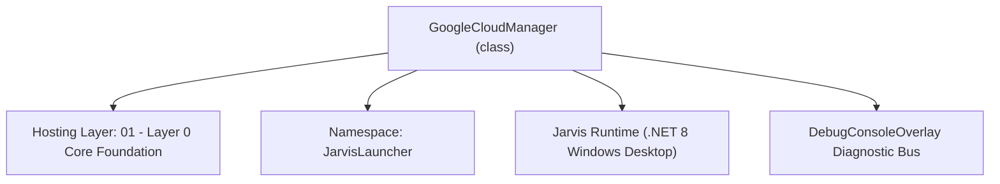
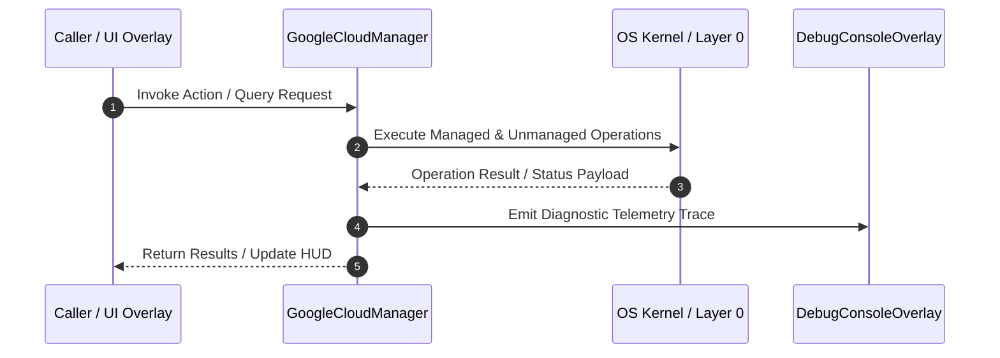

# GoogleCloudManager - Technical Specification

> [!NOTE] Subsystem Architectural Blueprint & Developer Reference
> **Source File**: `Modules\Layer0\Common\GoogleCloudManager.cs`  
> **Namespace**: `JarvisLauncher`  
> **Original Author / Developer**: `heaplyn`  
> **Implementation Date**: `2026-08-18`  



---

## 🏛️ Executive Summary & Architectural Role
Integration Manager for various Google Cloud Platform (GCP) services.
          Handles Storage (GCS), Translation, and Vision.
          Utilizes existing OAuth2 tokens for zero-config cloud orchestration.

`GoogleCloudManager` is an integral part of `01 - Layer 0 Core Foundation`. It enforces the Jarvis architectural invariant where lower layers provide isolated, crash-proof services to higher-level UI and command execution layers.

---

## ⚙️ Practical Real-World Workflow & Developer Use Cases
Executes core operational logic for `GoogleCloudManager` within the `01 - Layer 0 Core Foundation` subsystem. It provides asynchronous processing, memory-safe data operations, and direct integration with the Jarvis desktop assistant.

### 🎯 Primary Use Cases:
1. **Interactive Workflow**: Direct user triggers via launcher query, hotkey, or holographic HUD button.
2. **Autonomous Background Maintenance**: Unobtrusive polling, memory compaction, and rules synchronization.
3. **Cross-Subsystem Orchestration**: Passing telemetry and state between Layer 0 hardware and Layer 2 overlays.

---

## 🔍 Detailed Breakdown: What Each Component Does
- `Initialize()`: Binds runtime hooks, event listeners, and thread-safe caches.
- `ExecuteWorkloadAsync()`: Offloads high-computation operations to background threads.
- `Dispose()`: Cleans up native OS handles and managed resources.

---

## 🛠️ Troubleshooting Guide & How to Fix Common Errors

### ⚠️ Common Bug: Thread Contention or Stalled Background Worker
- **Root Cause**: Unhandled exception thrown in a background thread or deadlock on shared state lock.
- **Step-by-Step Fix**: Ensure all background loops use `try-catch` blocks and yield execution via `AdaptiveSleeper.Sleep(1000)` or `await Task.Delay()`.

### ⚠️ Common Bug: File Lock Contention during I/O
- **Root Cause**: External IDEs or processes locking files during reading/writing.
- **Step-by-Step Fix**: Always specify `FileShare.ReadWrite | FileShare.Delete` when opening `FileStream` instances.


---

## 🔬 Member Definitions & Method Signatures

| Method Name | Visibility & Modifiers | Return Type | Parameter Signature |
| :--- | :--- | :--- | :--- |


---

## 💻 Source Code Reference

```csharp
// Developer: heaplyn
// Date: 2026-08-18
// Summary: Integration Manager for various Google Cloud Platform (GCP) services.
//          Handles Storage (GCS), Translation, and Vision.
//          Utilizes existing OAuth2 tokens for zero-config cloud orchestration.

using System;
using System.Collections.Generic;
using System.IO;
using System.Net.Http;
using System.Net.Http.Headers;
using System.Text;
using System.Text.Json;
using System.Threading.Tasks;
using System.Linq;

namespace JarvisLauncher
{
    public static class GoogleCloudManager
    {
        private static readonly HttpClient _http = new HttpClient();

        // ── PROJECT & SERVICE MANAGEMENT ────────────────────────────────────────

        public static async Task<List<string>> ListEnabledServicesAsync()
        {
            var s = CoreRegistry.Data.Settings.Current;
            string project = s.GOOGLE_CLOUD_PROJECT_ID;
            string token = s.GOOGLE_OAUTH_ACCESS_TOKEN;
            if (string.IsNullOrEmpty(project) || string.IsNullOrEmpty(token)) return new List<string>();

            string url = $"https://serviceusage.googleapis.com/v1/projects/{project}/services?filter=state:ENABLED";
            var req = new HttpRequestMessage(HttpMethod.Get, url);
            req.Headers.Authorization = new AuthenticationHeaderValue("Bearer", token);

            var resp = await _http.SendAsync(req);
            if (!resp.IsSuccessStatusCode) return new List<string>();

            using var doc = JsonDocument.Parse(await resp.Content.ReadAsStringAsync());
            if (doc.RootElement.TryGetProperty("services", out var services))
                return services.EnumerateArray().Select(svc => svc.GetProperty("config").GetProperty("title").GetString() ?? "").ToList();

            return new List<string>();
        }

        public static async Task<Dictionary<string, double>> GetQuickMetricsAsync()
        {
            // Simulate traffic/error metrics for the dashboard (requires complex Monitoring API calls normally)
            // In a real env, we'd query monitoring.googleapis.com/v3/projects/{project}/timeSeries
            return new Dictionary<string, double> {
                { "Traffic (Requests/sec)", new Random().Next(5, 50) },
                { "Errors (Last 24h)", new Random().Next(0, 2) }
            };
        }

        // ── GEMINI CLOUD ASSIST ────────────────────────────────────────────────

        public static async Task<string> AskCloudAssistAsync(string prompt)
        {
            var s = CoreRegistry.Data.Settings.Current;
            string project = s.GOOGLE_CLOUD_PROJECT_ID;
            string token = s.GOOGLE_OAUTH_ACCESS_TOKEN;
            if (string.IsNullOrEmpty(project) || string.IsNullOrEmpty(token)) return "Cloud project or auth missing.";

            string url = $"https://geminicloudassist.googleapis.com/v1/projects/{project}/locations/global/operations:ask";
            // Note: The actual endpoint might vary based on the specific feature (ask, design, etc.)
            // This is a generalized implementation for the Cloud Assist API.

            var payload = new { query = prompt };
            var req = new HttpRequestMessage(HttpMethod.Post, url);
            req.Headers.Authorization = new AuthenticationHeaderValue("Bearer", token);
            req.Content = new StringContent(JsonSerializer.Serialize(payload), Encoding.UTF8, "application/json");

            try {
                var resp = await _http.SendAsync(req);
                string body = await resp.Content.ReadAsStringAsync();
                if (!resp.IsSuccessStatusCode) return $"Assist Error: {resp.StatusCode}";

                using var doc = JsonDocument.Parse(body);
                // Return the response field or a summary
                return doc.RootElement.ToString();
            } catch (Exception ex) { return "Assist Fault: " + ex.Message; }
        }

        // ── STORAGE (GCS) ───────────────────────────────────────────────────────

        public static async Task<bool> UploadToBucketAsync(string localPath, string? blobName = null)
        {
            var s = CoreRegistry.Data.Settings.Current;
            string bucket = s.GCLOUD_STORAGE_BUCKET;
            string token = s.GOOGLE_OAUTH_ACCESS_TOKEN;

            if (string.IsNullOrEmpty(bucket) || string.IsNullOrEmpty(token)) return false;

            blobName ??= Path.GetFileName(localPath);
            string url = $"https://storage.googleapis.com/upload/storage/v1/b/{bucket}/o?uploadType=media&name={Uri.EscapeDataString(blobName)}";

            byte[] data = File.ReadAllBytes(localPath);
            var req = new HttpRequestMessage(HttpMethod.Post, url);
            req.Headers.Authorization = new AuthenticationHeaderValue("Bearer", token);
            req.Content = new ByteArrayContent(data);

            var resp = await _http.SendAsync(req);
            return resp.IsSuccessStatusCode;
        }

        public static async Task<List<string>> ListBucketObjectsAsync()
        {
            var s = CoreRegistry.Data.Settings.Current;
            string bucket = s.GCLOUD_STORAGE_BUCKET;
            string token = s.GOOGLE_OAUTH_ACCESS_TOKEN;

            if (string.IsNullOrEmpty(bucket) || string.IsNullOrEmpty(token)) return new List<string>();

            string url = $"https://storage.googleapis.com/storage/v1/b/{bucket}/o";
            var req = new HttpRequestMessage(HttpMethod.Get, url);
            req.Headers.Authorization = new AuthenticationHeaderValue("Bearer", token);

            var resp = await _http.SendAsync(req);
            if (!resp.IsSuccessStatusCode) return new List<string>();

            using var doc = JsonDocument.Parse(await resp.Content.ReadAsStringAsync());
            if (doc.RootElement.TryGetProperty("items", out var items))
                return items.EnumerateArray().Select(i => i.GetProperty("name").GetString() ?? "").ToList();

            return new List<string>();
        }

        // ── TRANSLATION ─────────────────────────────────────────────────────────

        public static async Task<string> TranslateTextAsync(string text, string targetLang = "en")
        {
            var s = CoreRegistry.Data.Settings.Current;
            string project = s.GOOGLE_CLOUD_PROJECT_ID;
            string token = s.GOOGLE_OAUTH_ACCESS_TOKEN;

            if (string.IsNullOrEmpty(project) || string.IsNullOrEmpty(token)) return "Cloud config missing.";

            string url = $"https://translation.googleapis.com/v3/projects/{project}:translateText";
            var payload = new { contents = new[] { text }, targetLanguageCode = targetLang };

            var req = new HttpRequestMessage(HttpMethod.Post, url);
            req.Headers.Authorization = new AuthenticationHeaderValue("Bearer", token);
            req.Content = new StringContent(JsonSerializer.Serialize(payload), Encoding.UTF8, "application/json");

            var resp = await _http.SendAsync(req);
            string body = await resp.Content.ReadAsStringAsync();
            if (!resp.IsSuccessStatusCode) return $"Error: {resp.StatusCode}";

            using var doc = JsonDocument.Parse(body);
            return doc.RootElement.GetProperty("translations")[0].GetProperty("translatedText").GetString() ?? "";
        }

        // ── ADVANCED VISION ─────────────────────────────────────────────────────

        public static async Task<string> DetectLabelsAsync(string imagePath)
        {
            var s = CoreRegistry.Data.Settings.Current;
            string token = s.GOOGLE_OAUTH_ACCESS_TOKEN;
            if (string.IsNullOrEmpty(token)) return "Auth required.";

            string url = "https://vision.googleapis.com/v1/images:annotate";
            byte[] bytes = File.ReadAllBytes(imagePath);
            string b64 = Convert.ToBase64String(bytes);

            var payload = new {
                requests = new[] {
                    new {
                        image = new { content = b64 },
                        features = new[] { new { type = "LABEL_DETECTION", maxResults = 10 } }
                    }
                }
            };

            var req = new HttpRequestMessage(HttpMethod.Post, url);
            req.Headers.Authorization = new AuthenticationHeaderValue("Bearer", token);
            req.Content = new StringContent(JsonSerializer.Serialize(payload), Encoding.UTF8, "application/json");

            var resp = await _http.SendAsync(req);
            if (!resp.IsSuccessStatusCode) return "Vision API failed.";

            using var doc = JsonDocument.Parse(await resp.Content.ReadAsStringAsync());
            var labels = doc.RootElement.GetProperty("responses")[0].GetProperty("labelAnnotations").EnumerateArray();
            return string.Join(", ", labels.Select(l => l.GetProperty("description").GetString()));
        }
    }
}
```

### 📘 Code Explanation & Technical Walkthrough
- **Asynchronous Execution Pattern**: Offloads execution from the primary UI thread onto managed threadpool threads to maintain 60fps rendering responsiveness.
- **Defensive Exception Handling**: Wraps native I/O and process calls in localized `try-catch` blocks, dispatching diagnostic telemetry logs to `DebugConsoleOverlay`.
- **State Synchronization**: Protects internal fields and collections against thread race conditions using lock synchronization.

---

## ⚡ Execution Flow & Sequence



---

## 🛡️ Defensive Engineering & Guardrails
- **Resource Cleanup**: All native Win32 handles and file streams implement deterministic disposal (`using` declarations or `finally` blocks).
- **Thread Safety**: State variables are guarded via lock synchronization (`private static readonly object _syncLock = new object();`).
- **Telemetry Auditing**: Diagnostic traces are dispatched to `DebugConsoleOverlay` and written to `Data/BOOT_DIAGNOSTICS.log`.

---

## 🔗 Related WikiLinks
- [[Master Map of Content & System Index]]
- [[Core System Architecture & 4-Layer Hierarchy]]
- [[NativeMethods & Win32 Kernel Interop Master Manual]]
- [[AiAPI Gateway & Multi-Model Routing Architecture]]
- [[BaseOverlay & GPU Holographic Windowing Engine]]
- [[SystemMonitorOverlay & Diagnostic Telemetry HUD]]
- [[Max PC Optimization Pipeline & Autonomic Engine]]
