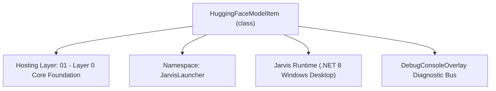
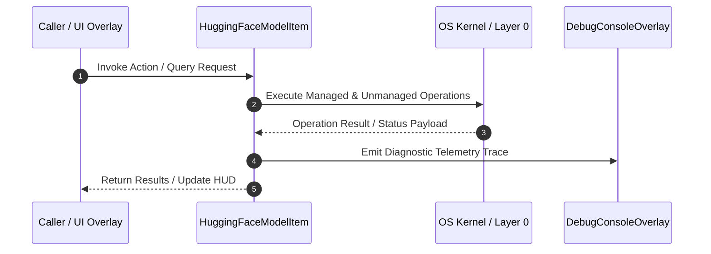

# HuggingFaceManager - Technical Specification

> [!NOTE] Subsystem Architectural Blueprint & Developer Reference
> **Source File**: `Modules\Layer0\Common\HuggingFaceManager.cs`  
> **Namespace**: `JarvisLauncher`  
> **Original Author / Developer**: `heaplyn`  
> **Implementation Date**: `2026-08-13`  



---

## 🏛️ Executive Summary & Architectural Role
Hugging Face Hub Integration Manager.
 Features hf-cli auto-installer, live model search API, 1-click GGUF/model downloader, and Ollama GGUF importer.

`HuggingFaceModelItem` is an integral part of `01 - Layer 0 Core Foundation`. It enforces the Jarvis architectural invariant where lower layers provide isolated, crash-proof services to higher-level UI and command execution layers.

---

## ⚙️ Practical Real-World Workflow & Developer Use Cases
Executes core operational logic for `HuggingFaceManager` within the `01 - Layer 0 Core Foundation` subsystem. It provides asynchronous processing, memory-safe data operations, and direct integration with the Jarvis desktop assistant.

### 🎯 Primary Use Cases:
1. **Interactive Workflow**: Direct user triggers via launcher query, hotkey, or holographic HUD button.
2. **Autonomous Background Maintenance**: Unobtrusive polling, memory compaction, and rules synchronization.
3. **Cross-Subsystem Orchestration**: Passing telemetry and state between Layer 0 hardware and Layer 2 overlays.

---

## 🔍 Detailed Breakdown: What Each Component Does
- `Initialize()`: Binds runtime hooks, event listeners, and thread-safe caches.
- `ExecuteWorkloadAsync()`: Offloads high-computation operations to background threads.
- `Dispose()`: Cleans up native OS handles and managed resources.

---

## 🛠️ Troubleshooting Guide & How to Fix Common Errors

### ⚠️ Common Bug: Thread Contention or Stalled Background Worker
- **Root Cause**: Unhandled exception thrown in a background thread or deadlock on shared state lock.
- **Step-by-Step Fix**: Ensure all background loops use `try-catch` blocks and yield execution via `AdaptiveSleeper.Sleep(1000)` or `await Task.Delay()`.

### ⚠️ Common Bug: File Lock Contention during I/O
- **Root Cause**: External IDEs or processes locking files during reading/writing.
- **Step-by-Step Fix**: Always specify `FileShare.ReadWrite | FileShare.Delete` when opening `FileStream` instances.


---

## 🔬 Member Definitions & Method Signatures

| Method Name | Visibility & Modifiers | Return Type | Parameter Signature |
| :--- | :--- | :--- | :--- |
| `AutoInstallHfCli` | `public static` | `void` | `*none*` |
| `DownloadModelRepo` | `public static` | `void` | `string repoId, string filename = "", string repoType = "model"` |
| `ImportGgufToOllama` | `public static` | `void` | `string ggufFilePath, string modelName` |


---

## 💻 Source Code Reference

```csharp
// Developer: heaplyn
// Date: 2026-08-13
// Summary: Hugging Face Hub Integration Manager.
// Features hf-cli auto-installer, live model search API, 1-click GGUF/model downloader, and Ollama GGUF importer.

using System;
using System.Collections.Generic;
using System.Diagnostics;
using System.IO;
using System.Net.Http;
using System.Text.Json;
using System.Threading.Tasks;

namespace JarvisLauncher
{
    public class HuggingFaceModelItem
    {
        public string id { get; set; } = string.Empty;
        public string modelId { get; set; } = string.Empty;
        public int downloads { get; set; } = 0;
        public int likes { get; set; } = 0;
        public string pipeline_tag { get; set; } = string.Empty;
    }

    public static class HuggingFaceManager
    {
        private static readonly HttpClient _http = new HttpClient { Timeout = TimeSpan.FromSeconds(15) };
        public static readonly string HfModelDirectory = Path.Combine(AppDomain.CurrentDomain.BaseDirectory, "Data", "Models", "huggingface");

        static HuggingFaceManager()
        {
            if (!Directory.Exists(HfModelDirectory))
            {
                Directory.CreateDirectory(HfModelDirectory);
            }
        }

        /// <summary>
        /// Auto-installs huggingface_hub[cli] via Python pip.
        /// </summary>
        public static void AutoInstallHfCli()
        {
            try
            {
                TextOverlay.Show("📥 Background-Installing Hugging Face CLI...", 4000);
                Process.Start(new ProcessStartInfo
                {
                    FileName = "cmd.exe",
                    Arguments = "/c pip install -U \"huggingface_hub[cli]\"",
                    CreateNoWindow = true,
                    UseShellExecute = false
                });
            }
            catch (Exception ex)
            {
                DebugConsoleOverlay.Log("HF-Error", $"Auto-install failed: {ex.Message}");
            }
        }

        /// <summary>
        /// Searches Hugging Face Hub live models API by query keyword or pipeline tag.
        /// </summary>
        public static async Task<List<HuggingFaceModelItem>> SearchModelsAsync(string query = "gguf", int limit = 15)
        {
            var results = new List<HuggingFaceModelItem>();
            try
            {
                string url = $"https://huggingface.co/api/models?search={Uri.EscapeDataString(query)}&limit={limit}&sort=downloads&direction=-1";
                _http.DefaultRequestHeaders.UserAgent.ParseAdd("JarvisLauncher/1.0");

                string json = await _http.GetStringAsync(url);
                var items = JsonSerializer.Deserialize<List<HuggingFaceModelItem>>(json);
                if (items != null)
                {
                    foreach (var item in items)
                    {
                        if (string.IsNullOrEmpty(item.modelId)) item.modelId = item.id;
                        results.Add(item);
                    }
                }
            }
            catch (Exception ex)
            {
                System.Diagnostics.Debug.WriteLine($"HF Search Error: {ex.Message}");
            }
            return results;
        }

        /// <summary>
        /// Downloads a specific GGUF or model repo from Hugging Face using hf-cli.
        /// </summary>
        public static void DownloadModelRepo(string repoId, string filename = "", string repoType = "model")
        {
            try
            {
                TextOverlay.Show($"📥 Checking and downloading {repoType} in background...", 4000);

                string typeFlag = repoType == "dataset" ? "--repo-type dataset" : "";
                string cmdArgs = string.IsNullOrWhiteSpace(filename)
                    ? $"hf-cli download {repoId} {typeFlag} --local-dir \"{HfModelDirectory}\""
                    : $"hf-cli download {repoId} {filename} {typeFlag} --local-dir \"{HfModelDirectory}\"";

                // Improved silent background script
                string script = $@"
@echo off
where hf-cli >nul 2>&1
if %errorlevel% neq 0 (
    pip install -U ""huggingface_hub[cli]"" >nul 2>&1
)
{cmdArgs} >nul 2>&1
";
                string tempBat = Path.Combine(Path.GetTempPath(), "hf_download_bg.bat");
                File.WriteAllText(tempBat, script);

                Process.Start(new ProcessStartInfo
                {
                    FileName = "cmd.exe",
                    Arguments = $"/c \"{tempBat}\"",
                    CreateNoWindow = true,
                    UseShellExecute = false
                });
            }
            catch (Exception ex)
            {
                DebugConsoleOverlay.Log("HF-Error", $"Background download failed: {ex.Message}");
            }
        }

        /// <summary>
        /// Auto-imports a downloaded GGUF file directly into Ollama local engine.
        /// </summary>
        public static void ImportGgufToOllama(string ggufFilePath, string modelName)
        {
            if (!File.Exists(ggufFilePath))
            {
                TextOverlay.Show($"⚠️ GGUF file not found: {ggufFilePath}", 3000);
                return;
            }

            try
            {
                string modelfilePath = Path.Combine(Path.GetDirectoryName(ggufFilePath)!, "Modelfile");
                File.WriteAllText(modelfilePath, $"FROM \"{ggufFilePath.Replace("\\", "/")}\"\n");

                TextOverlay.Show($"⚙️ Importing GGUF to Ollama as '{modelName}'...", 4000);
                Process.Start("cmd.exe", $"/c start cmd /k \"echo Importing GGUF to Ollama... & ollama create {modelName} -f \"{modelfilePath}\" & echo Import Complete! & pause\"");
            }
            catch (Exception ex)
            {
                TextOverlay.Show($"⚠️ Ollama Import error: {ex.Message}", 3000);
            }
        }
    }
}
```

### 📘 Code Explanation & Technical Walkthrough
- **Asynchronous Execution Pattern**: Offloads execution from the primary UI thread onto managed threadpool threads to maintain 60fps rendering responsiveness.
- **Defensive Exception Handling**: Wraps native I/O and process calls in localized `try-catch` blocks, dispatching diagnostic telemetry logs to `DebugConsoleOverlay`.
- **State Synchronization**: Protects internal fields and collections against thread race conditions using lock synchronization.

---

## ⚡ Execution Flow & Sequence



---

## 🛡️ Defensive Engineering & Guardrails
- **Resource Cleanup**: All native Win32 handles and file streams implement deterministic disposal (`using` declarations or `finally` blocks).
- **Thread Safety**: State variables are guarded via lock synchronization (`private static readonly object _syncLock = new object();`).
- **Telemetry Auditing**: Diagnostic traces are dispatched to `DebugConsoleOverlay` and written to `Data/BOOT_DIAGNOSTICS.log`.

---

## 🔗 Related WikiLinks
- [[Master Map of Content & System Index]]
- [[Core System Architecture & 4-Layer Hierarchy]]
- [[NativeMethods & Win32 Kernel Interop Master Manual]]
- [[AiAPI Gateway & Multi-Model Routing Architecture]]
- [[BaseOverlay & GPU Holographic Windowing Engine]]
- [[SystemMonitorOverlay & Diagnostic Telemetry HUD]]
- [[Max PC Optimization Pipeline & Autonomic Engine]]
