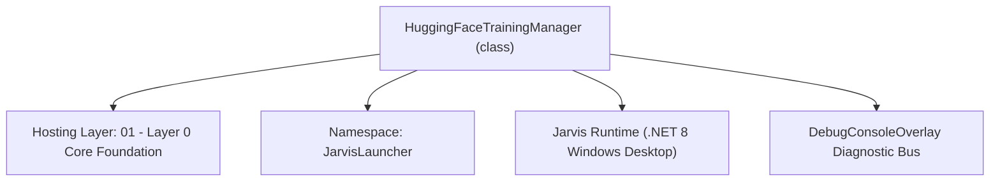
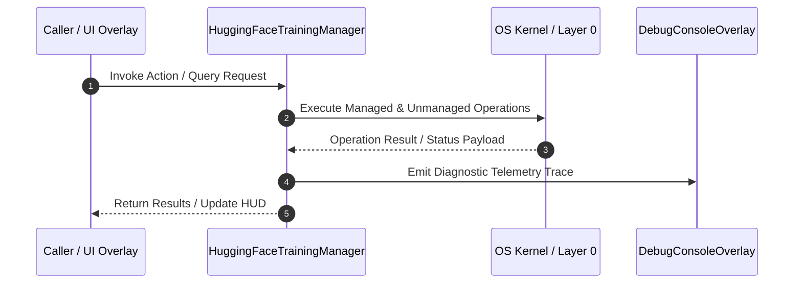

# HuggingFaceTrainingManager - Technical Specification

> [!NOTE] Subsystem Architectural Blueprint & Developer Reference
> **Source File**: `Modules\Layer0\Common\HuggingFaceTrainingManager.cs`  
> **Namespace**: `JarvisLauncher`  
> **Original Author / Developer**: `heaplyn`  
> **Implementation Date**: `2026-08-15`  



---

## 🏛️ Executive Summary & Architectural Role
Autonomous Hugging Face Dataset & Training Manager.
          Collects user-AI interaction logs, cleans them, and uploads them to a private HF dataset.
          This enables constant "Self-Learning" by building a fine-tuning dataset in the cloud.

`HuggingFaceTrainingManager` is an integral part of `01 - Layer 0 Core Foundation`. It enforces the Jarvis architectural invariant where lower layers provide isolated, crash-proof services to higher-level UI and command execution layers.

---

## ⚙️ Practical Real-World Workflow & Developer Use Cases
Executes core operational logic for `HuggingFaceTrainingManager` within the `01 - Layer 0 Core Foundation` subsystem. It provides asynchronous processing, memory-safe data operations, and direct integration with the Jarvis desktop assistant.

### 🎯 Primary Use Cases:
1. **Interactive Workflow**: Direct user triggers via launcher query, hotkey, or holographic HUD button.
2. **Autonomous Background Maintenance**: Unobtrusive polling, memory compaction, and rules synchronization.
3. **Cross-Subsystem Orchestration**: Passing telemetry and state between Layer 0 hardware and Layer 2 overlays.

---

## 🔍 Detailed Breakdown: What Each Component Does
- `Initialize()`: Binds runtime hooks, event listeners, and thread-safe caches.
- `ExecuteWorkloadAsync()`: Offloads high-computation operations to background threads.
- `Dispose()`: Cleans up native OS handles and managed resources.

---

## 🛠️ Troubleshooting Guide & How to Fix Common Errors

### ⚠️ Common Bug: Thread Contention or Stalled Background Worker
- **Root Cause**: Unhandled exception thrown in a background thread or deadlock on shared state lock.
- **Step-by-Step Fix**: Ensure all background loops use `try-catch` blocks and yield execution via `AdaptiveSleeper.Sleep(1000)` or `await Task.Delay()`.

### ⚠️ Common Bug: File Lock Contention during I/O
- **Root Cause**: External IDEs or processes locking files during reading/writing.
- **Step-by-Step Fix**: Always specify `FileShare.ReadWrite | FileShare.Delete` when opening `FileStream` instances.


---

## 🔬 Member Definitions & Method Signatures

| Method Name | Visibility & Modifiers | Return Type | Parameter Signature |
| :--- | :--- | :--- | :--- |
| `Start` | `public static` | `void` | `*none*` |


---

## 💻 Source Code Reference

```csharp
// Developer: heaplyn
// Date: 2026-08-15
// Summary: Autonomous Hugging Face Dataset & Training Manager.
//          Collects user-AI interaction logs, cleans them, and uploads them to a private HF dataset.
//          This enables constant "Self-Learning" by building a fine-tuning dataset in the cloud.

using System;
using System.Collections.Generic;
using System.IO;
using System.Linq;
using System.Net.Http;
using System.Net.Http.Headers;
using System.Text;
using System.Text.Json;
using System.Threading.Tasks;

namespace JarvisLauncher
{
    public static class HuggingFaceTrainingManager
    {
        private static bool IsRunning = false;
        private static readonly HttpClient _httpClient = new HttpClient();

        public static void Start()
        {
            if (IsRunning) return;
            if (string.IsNullOrEmpty(SettingsManager.Current.HUGGINGFACE_API_KEY)) return;

            IsRunning = true;
            Task.Run(async () =>
            {
                while (IsRunning)
                {
                    if (SettingsManager.Current.ENABLE_HF_AUTO_TRAINING)
                    {
                        try
                        {
                            await ProcessTrainingCycleAsync();
                        }
                        catch (Exception ex)
                        {
                            DebugConsoleOverlay.Log("HF-Training-Error", ex.Message);
                        }
                    }

                    // Run every 4 hours to avoid rate limits
                    await AdaptiveSleeper.DelayAsync(TimeSpan.FromHours(4));
                }
            });

            DebugConsoleOverlay.Log("HF-Training", "Hugging Face Auto-Training Engine active.");
        }

        private static async Task ProcessTrainingCycleAsync()
        {
            string logDir = Path.Combine(AppDomain.CurrentDomain.BaseDirectory, "Data", "Conversations");
            if (!Directory.Exists(logDir)) return;

            var files = Directory.GetFiles(logDir, "*.txt");
            if (files.Length == 0) return;

            var trainingData = new List<object>();

            foreach (var file in files)
            {
                try
                {
                    string content = await File.ReadAllTextAsync(file);
                    // Basic parsing of the custom chat log format
                    var turns = content.Split("==========================================================================", StringSplitOptions.RemoveEmptyEntries);

                    foreach (var turn in turns)
                    {
                        int uIdx = turn.IndexOf("USER: ");
                        int jIdx = turn.IndexOf("JARVIS: ");

                        if (uIdx >= 0 && jIdx > uIdx)
                        {
                            string user = turn.Substring(uIdx + 6, jIdx - (uIdx + 6)).Trim();
                            string jarvis = turn.Substring(jIdx + 8).Trim();

                            if (!string.IsNullOrEmpty(user) && !string.IsNullOrEmpty(jarvis))
                            {
                                trainingData.Add(new { instruction = user, response = jarvis });
                            }
                        }
                    }
                }
                catch { }
            }

            if (trainingData.Count == 0) return;

            // Upload to Hugging Face
            await UploadDatasetAsync(trainingData);
        }

        private static async Task UploadDatasetAsync(List<object> data)
        {
            string apiKey = SettingsManager.Current.HUGGINGFACE_API_KEY;
            string datasetId = SettingsManager.Current.HF_TRAINING_DATASET_ID;

            if (string.IsNullOrEmpty(apiKey) || string.IsNullOrEmpty(datasetId)) return;

            DebugConsoleOverlay.Log("HF-Training", $"Uploading {data.Count} samples to dataset '{datasetId}'...");

            string json = JsonSerializer.Serialize(data, new JsonSerializerOptions { WriteIndented = true });
            byte[] bytes = Encoding.UTF8.GetBytes(json);

            // Using HF API to upload/update a file in the dataset
            // Endpoint: https://huggingface.co/api/datasets/{repo_id}/upload/{path}
            string fileName = $"train_{DateTime.Now:yyyyMMdd}.json";
            string url = $"https://huggingface.co/api/datasets/{datasetId}/upload/main/{fileName}";

            using var request = new HttpRequestMessage(HttpMethod.Post, url);
            request.Headers.Authorization = new AuthenticationHeaderValue("Bearer", apiKey);

            using var content = new MultipartFormDataContent();
            var fileContent = new ByteArrayContent(bytes);
            fileContent.Headers.ContentType = MediaTypeHeaderValue.Parse("application/json");
            content.Add(fileContent, "file", fileName);

            request.Content = content;

            var response = await _httpClient.SendAsync(request);
            if (response.IsSuccessStatusCode)
            {
                DebugConsoleOverlay.Log("HF-Training", $"Successfully synced training data to cloud.");
            }
            else
            {
                string err = await response.Content.ReadAsStringAsync();
                DebugConsoleOverlay.Log("HF-Training-Error", $"Upload failed: {response.StatusCode} - {err}");
            }
        }
    }
}
```

### 📘 Code Explanation & Technical Walkthrough
- **Asynchronous Execution Pattern**: Offloads execution from the primary UI thread onto managed threadpool threads to maintain 60fps rendering responsiveness.
- **Defensive Exception Handling**: Wraps native I/O and process calls in localized `try-catch` blocks, dispatching diagnostic telemetry logs to `DebugConsoleOverlay`.
- **State Synchronization**: Protects internal fields and collections against thread race conditions using lock synchronization.

---

## ⚡ Execution Flow & Sequence



---

## 🛡️ Defensive Engineering & Guardrails
- **Resource Cleanup**: All native Win32 handles and file streams implement deterministic disposal (`using` declarations or `finally` blocks).
- **Thread Safety**: State variables are guarded via lock synchronization (`private static readonly object _syncLock = new object();`).
- **Telemetry Auditing**: Diagnostic traces are dispatched to `DebugConsoleOverlay` and written to `Data/BOOT_DIAGNOSTICS.log`.

---

## 🔗 Related WikiLinks
- [[Master Map of Content & System Index]]
- [[Core System Architecture & 4-Layer Hierarchy]]
- [[NativeMethods & Win32 Kernel Interop Master Manual]]
- [[AiAPI Gateway & Multi-Model Routing Architecture]]
- [[BaseOverlay & GPU Holographic Windowing Engine]]
- [[SystemMonitorOverlay & Diagnostic Telemetry HUD]]
- [[Max PC Optimization Pipeline & Autonomic Engine]]
