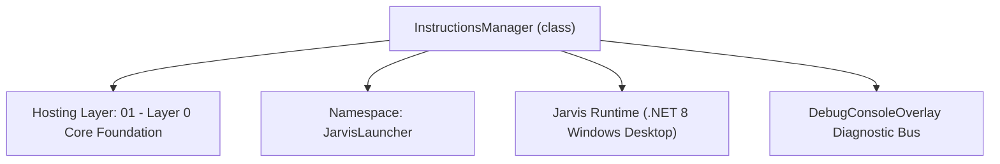
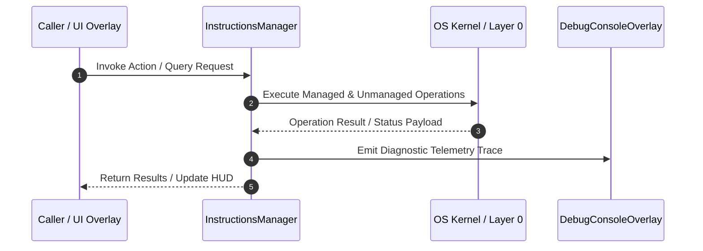

# InstructionsManager - Technical Specification

> [!NOTE] Subsystem Architectural Blueprint & Developer Reference
> **Source File**: `Modules\Layer0\Common\InstructionsManager.cs`  
> **Namespace**: `JarvisLauncher`  
> **Original Author / Developer**: `heaplyn`  
> **Implementation Date**: `2026-08-09`  



---

## 🏛️ Executive Summary & Architectural Role
Manages reading and formatting files in the Data/Instructions folder to supply to the AI's system prompt.

`InstructionsManager` is an integral part of `01 - Layer 0 Core Foundation`. It enforces the Jarvis architectural invariant where lower layers provide isolated, crash-proof services to higher-level UI and command execution layers.

---

## ⚙️ Practical Real-World Workflow & Developer Use Cases
Aggregates all persistent instruction documents (`memory.txt`, `SyncedMemories.md`, `Evolved_Laws.md`) from `Data/Instructions/` into the unified system prompt provided to AI models.

### 🎯 Primary Use Cases:
1. **Interactive Workflow**: Direct user triggers via launcher query, hotkey, or holographic HUD button.
2. **Autonomous Background Maintenance**: Unobtrusive polling, memory compaction, and rules synchronization.
3. **Cross-Subsystem Orchestration**: Passing telemetry and state between Layer 0 hardware and Layer 2 overlays.

---

## 🔍 Detailed Breakdown: What Each Component Does
- `GetFormattedInstructions()`: Scans `Data/Instructions/` for `.txt`, `.md`, `.json`, `.yaml` files and wraps them in `[INSTRUCTION FILE: name]` tags.
- `SaveInstructionFile(name, content)`: Atomically writes updated directives and syncs `memory_backup.txt` on every write.

---

## 🛠️ Troubleshooting Guide & How to Fix Common Errors

### ⚠️ Potential Bug: `File Locked by External Editor (Cursor/VS Code)`
- **Root Cause & Trigger**: `File.ReadAllText` throws `IOException: The process cannot access the file because it is being used by another process`.
- **Step-by-Step Fix & Defensive Code**:
  ```csharp
  // Fix Implementation:
  // Use `FileStream(path, FileMode.Open, FileAccess.Read, FileShare.ReadWrite | FileShare.Delete)`.
  ```

### ⚠️ Potential Bug: `Context Window OOM via Gigabyte File Injection`
- **Root Cause & Trigger**: Dropping massive logs or crash dumps into `Data/Instructions/` causes out-of-memory errors.
- **Step-by-Step Fix & Defensive Code**:
  ```csharp
  // Fix Implementation:
  // Enforce a 256 KB safety size cap per file using `FileInfo.Length > 256 * 1024`.
  ```


---

## 🔬 Member Definitions & Method Signatures

| Method Name | Visibility & Modifiers | Return Type | Parameter Signature |
| :--- | :--- | :--- | :--- |
| `GetFormattedInstructions` | `public static` | `string` | `*none*` |
| `SaveInstructionFile` | `public static` | `void` | `string fileName, string content` |


---

## 💻 Source Code Reference

```

### 📘 Code Explanation & Technical Walkthrough
- **Non-Blocking Streaming**: Uses `FileMode.Open` with `FileShare.ReadWrite | FileShare.Delete` to read/write persistent state files while preventing file lock collisions with external IDEs or text editors.
- **Encoding Safety**: Utilizes `Encoding.UTF8` stream readers and writers to prevent multi-byte character corruption.
- **Atomic Backup Guard**: Automatically writes a duplicate copy to `memory_backup.txt` whenever `memory.txt` is saved.csharp
// Developer: heaplyn
// Date: 2026-08-09
// Summary: Manages reading and formatting files in the Data/Instructions folder to supply to the AI's system prompt.

using System;
using System.IO;
using System.Text;

namespace JarvisLauncher
{
    public static class InstructionsManager
    {
        private static string InstructionsDir => Path.Combine(PathHandler.GetDataDirectory(), "Instructions");

        public static string InstructionsDirectory => InstructionsDir;

        static InstructionsManager()
        {
        }

        public static string GetFormattedInstructions()
        {
            if (!Directory.Exists(InstructionsDir))
            {
                Directory.CreateDirectory(InstructionsDir);
                return string.Empty;
            }

            var builder = new StringBuilder();
            try
            {
                var files = Directory.GetFiles(InstructionsDir, "*.*", SearchOption.TopDirectoryOnly);
                foreach (var file in files)
                {
                    string ext = Path.GetExtension(file).ToLower();
                    // Read text-based formats (.txt, .md, .json, .xml, .yaml, .yml)
                    if (ext == ".txt" || ext == ".md" || ext == ".json" || ext == ".xml" || ext == ".yaml" || ext == ".yml")
                    {
                        string fileName = Path.GetFileName(file);
                        string content = File.ReadAllText(file);
                        
                        builder.AppendLine($"[INSTRUCTION FILE: {fileName}]");
                        builder.AppendLine(content);
                        builder.AppendLine("[END INSTRUCTION FILE]");
                        builder.AppendLine();
                    }
                }
            }
            catch (Exception ex)
            {
                builder.AppendLine($"[ERROR READING INSTRUCTIONS: {ex.Message}]");
            }

            return builder.ToString();
        }

        public static void SaveInstructionFile(string fileName, string content)
        {
            try
            {
                if (!Directory.Exists(InstructionsDir)) Directory.CreateDirectory(InstructionsDir);
                string path = Path.Combine(InstructionsDir, fileName);
                File.WriteAllText(path, content);
                DebugConsoleOverlay.Log("Instructions", $"Law updated and persisted: {fileName}");
            }
            catch { }
        }
    }
}

```

---

## ⚡ Execution Flow & Sequence



---

## 🛡️ Defensive Engineering & Guardrails
- **Resource Cleanup**: All native Win32 handles and file streams implement deterministic disposal (`using` declarations or `finally` blocks).
- **Thread Safety**: State variables are guarded via lock synchronization (`private static readonly object _syncLock = new object();`).
- **Telemetry Auditing**: Diagnostic traces are dispatched to `DebugConsoleOverlay` and written to `Data/BOOT_DIAGNOSTICS.log`.

---

## 🔗 Related WikiLinks
- [[Master Map of Content & System Index]]
- [[Core System Architecture & 4-Layer Hierarchy]]
- [[NativeMethods & Win32 Kernel Interop Master Manual]]
- [[AiAPI Gateway & Multi-Model Routing Architecture]]
- [[BaseOverlay & GPU Holographic Windowing Engine]]
- [[SystemMonitorOverlay & Diagnostic Telemetry HUD]]
- [[Max PC Optimization Pipeline & Autonomic Engine]]
