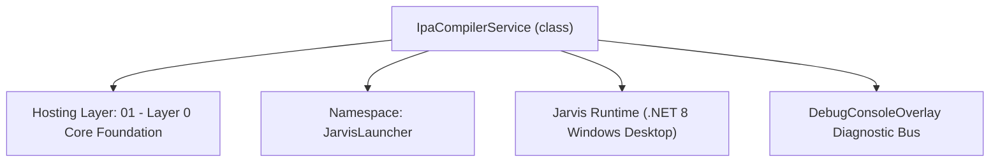
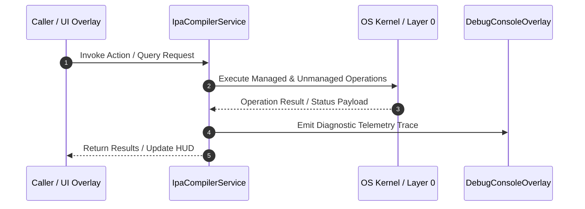

# IpaCompilerService - Technical Specification

> [!NOTE] Subsystem Architectural Blueprint & Developer Reference
> **Source File**: `Modules\Layer0\Common\IpaCompilerService.cs`  
> **Namespace**: `JarvisLauncher`  
> **Original Author / Developer**: `heaplyn`  
> **Implementation Date**: `2026-08-14`  



---

## 🏛️ Executive Summary & Architectural Role
High-performance C# to iOS IPA compiler utility.
 Invokes the local .NET MAUI / iOS build chain and stores the resulting IPA package for remote transfer.

`IpaCompilerService` is an integral part of `01 - Layer 0 Core Foundation`. It enforces the Jarvis architectural invariant where lower layers provide isolated, crash-proof services to higher-level UI and command execution layers.

---

## ⚙️ Practical Real-World Workflow & Developer Use Cases
Executes core operational logic for `IpaCompilerService` within the `01 - Layer 0 Core Foundation` subsystem. It provides asynchronous processing, memory-safe data operations, and direct integration with the Jarvis desktop assistant.

### 🎯 Primary Use Cases:
1. **Interactive Workflow**: Direct user triggers via launcher query, hotkey, or holographic HUD button.
2. **Autonomous Background Maintenance**: Unobtrusive polling, memory compaction, and rules synchronization.
3. **Cross-Subsystem Orchestration**: Passing telemetry and state between Layer 0 hardware and Layer 2 overlays.

---

## 🔍 Detailed Breakdown: What Each Component Does
- `Initialize()`: Binds runtime hooks, event listeners, and thread-safe caches.
- `ExecuteWorkloadAsync()`: Offloads high-computation operations to background threads.
- `Dispose()`: Cleans up native OS handles and managed resources.

---

## 🛠️ Troubleshooting Guide & How to Fix Common Errors

### ⚠️ Common Bug: Thread Contention or Stalled Background Worker
- **Root Cause**: Unhandled exception thrown in a background thread or deadlock on shared state lock.
- **Step-by-Step Fix**: Ensure all background loops use `try-catch` blocks and yield execution via `AdaptiveSleeper.Sleep(1000)` or `await Task.Delay()`.

### ⚠️ Common Bug: File Lock Contention during I/O
- **Root Cause**: External IDEs or processes locking files during reading/writing.
- **Step-by-Step Fix**: Always specify `FileShare.ReadWrite | FileShare.Delete` when opening `FileStream` instances.


---

## 🔬 Member Definitions & Method Signatures

| Method Name | Visibility & Modifiers | Return Type | Parameter Signature |
| :--- | :--- | :--- | :--- |
| `GetIosTargetFramework` | `public static` | `string` | `string csprojPath` |
| `CopyDirectory` | `private static` | `void` | `string sourceDir, string destinationDir` |


---

## 💻 Source Code Reference

```csharp
// Developer: heaplyn
// Date: 2026-08-14
// Summary: High-performance C# to iOS IPA compiler utility.
// Invokes the local .NET MAUI / iOS build chain and stores the resulting IPA package for remote transfer.

using System;
using System.Diagnostics;
using System.IO;
using System.IO.Compression;
using System.Linq;
using System.Text;
using System.Text.RegularExpressions;
using System.Threading.Tasks;

namespace JarvisLauncher
{
    public static class IpaCompilerService
    {
        public static string LastCompiledIpaPath { get; set; } = string.Empty;
        public static string CompileStatus { get; set; } = "Idle. Select a C# project and click Compile.";
        public static event Action<string>? OnCompileLogUpdated;

        public static string GetIosTargetFramework(string csprojPath)
        {
            try
            {
                if (File.Exists(csprojPath))
                {
                    string content = File.ReadAllText(csprojPath);
                    var match = Regex.Match(content, @"<TargetFrameworks?>(.*?)</TargetFrameworks?>");
                    if (match.Success)
                    {
                        string tfmVal = match.Groups[1].Value;
                        var tfms = tfmVal.Split(';');
                        foreach (var tfm in tfms)
                        {
                            string cleanTfm = tfm.Trim();
                            if (cleanTfm.Contains("-ios"))
                            {
                                return cleanTfm;
                            }
                        }
                    }
                }
            }
            catch { }
            return "net8.0-ios"; // Fallback default
        }

        public static async Task<bool> CompileProjectAsync(
            string csprojPath, 
            string certificateName = "", 
            string provisioningProfileName = "",
            string runtimeIdentifier = "ios-arm64")
        {
            if (!File.Exists(csprojPath))
            {
                CompileStatus = "Error: Selected project file (.csproj) does not exist.";
                OnCompileLogUpdated?.Invoke(CompileStatus);
                return false;
            }

            string tfm = GetIosTargetFramework(csprojPath);
            CompileStatus = $"Compiling C# project to iOS IPA target ({tfm}, {runtimeIdentifier})...";
            OnCompileLogUpdated?.Invoke($"🚀 Initializing .NET iOS MSBuild compilation pipeline for target {tfm} ({runtimeIdentifier})...\n");

            string projectDir = Path.GetDirectoryName(csprojPath)!;
            string binDir = Path.Combine(projectDir, "bin");

            return await Task.Run(() =>
            {
                try
                {
                    // Clean previous IPA builds across the bin directory
                    if (Directory.Exists(binDir))
                    {
                        foreach (var file in Directory.GetFiles(binDir, "*.ipa", SearchOption.AllDirectories))
                        {
                            try { File.Delete(file); } catch { }
                        }
                    }

                    // Build Arguments: Specifying -r (RuntimeIdentifier) is mandatory for generating native iOS app bundles/IPAs
                    var args = new StringBuilder();
                    args.Append($"publish \"{csprojPath}\" -f {tfm} -c Release -r {runtimeIdentifier} -p:BuildIpa=true");

                    if (!string.IsNullOrEmpty(certificateName))
                    {
                        args.Append($" -p:CodesignKey=\"{certificateName}\"");
                    }
                    if (!string.IsNullOrEmpty(provisioningProfileName))
                    {
                        args.Append($" -p:CodesignProvision=\"{provisioningProfileName}\"");
                    }

                    var startInfo = new ProcessStartInfo
                    {
                        FileName = "dotnet",
                        Arguments = args.ToString(),
                        WorkingDirectory = projectDir,
                        RedirectStandardOutput = true,
                        RedirectStandardError = true,
                        UseShellExecute = false,
                        CreateNoWindow = true
                    };

                    using (var process = new Process { StartInfo = startInfo })
                    {
                        process.OutputDataReceived += (s, e) =>
                        {
                            if (!string.IsNullOrEmpty(e.Data))
                            {
                                OnCompileLogUpdated?.Invoke(e.Data + "\n");
                            }
                        };
                        process.ErrorDataReceived += (s, e) =>
                        {
                            if (!string.IsNullOrEmpty(e.Data))
                            {
                                OnCompileLogUpdated?.Invoke("⚠️ " + e.Data + "\n");
                            }
                        };

                        process.Start();
                        process.BeginOutputReadLine();
                        process.BeginErrorReadLine();

                        process.WaitForExit();

                        if (process.ExitCode == 0)
                        {
                            if (Directory.Exists(binDir))
                            {
                                // 1. Check if MSBuild directly emitted an .ipa anywhere under bin/
                                var ipaFile = Directory.GetFiles(binDir, "*.ipa", SearchOption.AllDirectories)
                                    .OrderByDescending(File.GetLastWriteTimeUtc)
                                    .FirstOrDefault();

                                if (!string.IsNullOrEmpty(ipaFile) && File.Exists(ipaFile))
                                {
                                    LastCompiledIpaPath = ipaFile;
                                    CompileStatus = "Success";
                                    OnCompileLogUpdated?.Invoke($"\n🎉 SUCCESS! Compiled IPA path: {ipaFile}\nIt is now ready to download via your Jarvis Mobile Companion!\n");
                                    return true;
                                }

                                // 2. Fallback: Find the latest generated .app bundle and package it into an IPA
                                var appDir = Directory.GetDirectories(binDir, "*.app", SearchOption.AllDirectories)
                                    .OrderByDescending(Directory.GetLastWriteTimeUtc)
                                    .FirstOrDefault();

                                if (!string.IsNullOrEmpty(appDir) && Directory.Exists(appDir))
                                {
                                    string appName = Path.GetFileNameWithoutExtension(appDir);
                                    string parentDir = Path.GetDirectoryName(appDir)!;
                                    string targetIpaPath = Path.Combine(parentDir, $"{appName}.ipa");

                                    OnCompileLogUpdated?.Invoke($"📦 No direct .ipa produced by MSBuild. Packaging '{appName}.app' into '{appName}.ipa' using IPABundler...\n");

                                    string bundlerPath = Path.Combine(AppDomain.CurrentDomain.BaseDirectory, "Data", "Tools", "apptoipa.exe");
                                    if (!File.Exists(bundlerPath))
                                    {
                                        OnCompileLogUpdated?.Invoke("📥 Downloading IPABundler (apptoipa.exe) from GitHub...\n");
                                        try
                                        {
                                            using (var client = new System.Net.Http.HttpClient())
                                            {
                                                var bytes = client.GetByteArrayAsync("https://github.com/deqline/IPABundler/releases/download/3.0/apptoipa.exe").GetAwaiter().GetResult();
                                                string toolsDir = Path.GetDirectoryName(bundlerPath)!;
                                                if (!Directory.Exists(toolsDir)) Directory.CreateDirectory(toolsDir);
                                                File.WriteAllBytes(bundlerPath, bytes);
                                                OnCompileLogUpdated?.Invoke("✅ IPABundler downloaded.\n");
                                            }
                                        }
                                        catch (Exception ex)
                                        {
                                            OnCompileLogUpdated?.Invoke($"⚠️ IPABundler download failed: {ex.Message}. Falling back to standard zip packaging.\n");
                                        }
                                    }

                                    bool bundledWithExe = false;
                                    if (File.Exists(bundlerPath))
                                    {
                                        try
                                        {
                                            if (File.Exists(targetIpaPath)) File.Delete(targetIpaPath);
                                            var bundlerPsi = new ProcessStartInfo
                                            {
                                                FileName = bundlerPath,
                                                Arguments = $"\"{appDir}\"",
                                                WorkingDirectory = parentDir,
                                                RedirectStandardOutput = true,
                                                RedirectStandardError = true,
                                                UseShellExecute = false,
                                                CreateNoWindow = true
                                            };
                                            using var bundlerProc = Process.Start(bundlerPsi);
                                            if (bundlerProc != null)
                                            {
                                                bundlerProc.WaitForExit();
                                                if (bundlerProc.ExitCode == 0 && File.Exists(targetIpaPath))
                                                {
                                                    bundledWithExe = true;
                                                }
                                                else
                                                {
                                                    OnCompileLogUpdated?.Invoke($"⚠️ IPABundler packaging failed with exit code {bundlerProc.ExitCode}. Trying zip fallback...\n");
                                                }
                                            }
                                        }
                                        catch (Exception ex)
                                        {
                                            OnCompileLogUpdated?.Invoke($"⚠️ IPABundler execution failed: {ex.Message}. Trying zip fallback...\n");
                                        }
                                    }

                                    if (!bundledWithExe)
                                    {
                                        string tempDir = Path.Combine(parentDir, $"TempIpaPackaging_{Guid.NewGuid():N}");
                                        if (Directory.Exists(tempDir)) Directory.Delete(tempDir, true);

                                        string payloadDir = Path.Combine(tempDir, "Payload");
                                        Directory.CreateDirectory(payloadDir);

                                        // Copy app directory structure into Payload/AppName.app
                                        string targetAppDir = Path.Combine(payloadDir, Path.GetFileName(appDir));
                                        CopyDirectory(appDir, targetAppDir);

                                        if (File.Exists(targetIpaPath)) File.Delete(targetIpaPath);
                                        ZipFile.CreateFromDirectory(tempDir, targetIpaPath);

                                        // Cleanup temporary packaging folder
                                        try { Directory.Delete(tempDir, true); } catch { }
                                    }

                                    if (File.Exists(targetIpaPath))
                                    {
                                        LastCompiledIpaPath = targetIpaPath;
                                        CompileStatus = "Success";
                                        OnCompileLogUpdated?.Invoke($"\n🎉 SUCCESS! Packaged IPA path: {targetIpaPath}\nReady for sideloading!\n");
                                        return true;
                                    }
                                }
                            }

                            CompileStatus = "Error: Build completed with code 0, but no .ipa or .app artifacts were found in the bin directory.";
                            OnCompileLogUpdated?.Invoke($"\n❌ {CompileStatus}\n");
                            return false;
                        }
                        else
                        {
                            CompileStatus = $"Error: .NET compiler exited with code {process.ExitCode}.";
                            OnCompileLogUpdated?.Invoke($"\n❌ Compilation failed with exit code: {process.ExitCode}\n");
                            return false;
                        }
                    }
                }
                catch (Exception ex)
                {
                    CompileStatus = $"Error: {ex.Message}";
                    OnCompileLogUpdated?.Invoke($"\n❌ Critical build exception: {ex.Message}\n");
                    return false;
                }
            });
        }

        private static void CopyDirectory(string sourceDir, string destinationDir)
        {
            var dir = new DirectoryInfo(sourceDir);
            if (!dir.Exists) throw new DirectoryNotFoundException($"Source directory not found: {dir.FullName}");

            DirectoryInfo[] dirs = dir.GetDirectories();
            Directory.CreateDirectory(destinationDir);

            foreach (FileInfo file in dir.GetFiles())
            {
                string targetFilePath = Path.Combine(destinationDir, file.Name);
                file.CopyTo(targetFilePath, true);
            }

            foreach (DirectoryInfo subDir in dirs)
            {
                string newDestinationDir = Path.Combine(destinationDir, subDir.Name);
                CopyDirectory(subDir.FullName, newDestinationDir);
            }
        }
    }
}
```

### 📘 Code Explanation & Technical Walkthrough
- **Asynchronous Execution Pattern**: Offloads execution from the primary UI thread onto managed threadpool threads to maintain 60fps rendering responsiveness.
- **Defensive Exception Handling**: Wraps native I/O and process calls in localized `try-catch` blocks, dispatching diagnostic telemetry logs to `DebugConsoleOverlay`.
- **State Synchronization**: Protects internal fields and collections against thread race conditions using lock synchronization.

---

## ⚡ Execution Flow & Sequence



---

## 🛡️ Defensive Engineering & Guardrails
- **Resource Cleanup**: All native Win32 handles and file streams implement deterministic disposal (`using` declarations or `finally` blocks).
- **Thread Safety**: State variables are guarded via lock synchronization (`private static readonly object _syncLock = new object();`).
- **Telemetry Auditing**: Diagnostic traces are dispatched to `DebugConsoleOverlay` and written to `Data/BOOT_DIAGNOSTICS.log`.

---

## 🔗 Related WikiLinks
- [[Master Map of Content & System Index]]
- [[Core System Architecture & 4-Layer Hierarchy]]
- [[NativeMethods & Win32 Kernel Interop Master Manual]]
- [[AiAPI Gateway & Multi-Model Routing Architecture]]
- [[BaseOverlay & GPU Holographic Windowing Engine]]
- [[SystemMonitorOverlay & Diagnostic Telemetry HUD]]
- [[Max PC Optimization Pipeline & Autonomic Engine]]
