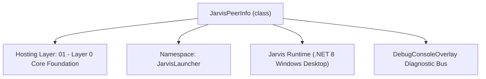
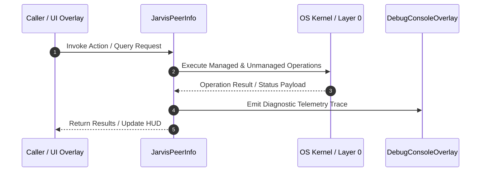

# JarvisP2PClient - Technical Specification

> [!NOTE] Subsystem Architectural Blueprint & Developer Reference
> **Source File**: `Modules\Layer0\Common\JarvisP2PClient.cs`  
> **Namespace**: `JarvisLauncher`  
> **Original Author / Developer**: `heaplyn`  
> **Implementation Date**: `2026-08-10`  



---

## 🏛️ Executive Summary & Architectural Role
Manages outbound P2P connections to peer Jarvis PCs for offloading LLM inference.
          Supports multiple registered peers, auto-selects lowest-load peer, persists peer list.

`JarvisPeerInfo` is an integral part of `01 - Layer 0 Core Foundation`. It enforces the Jarvis architectural invariant where lower layers provide isolated, crash-proof services to higher-level UI and command execution layers.

---

## ⚙️ Practical Real-World Workflow & Developer Use Cases
Executes core operational logic for `JarvisP2PClient` within the `01 - Layer 0 Core Foundation` subsystem. It provides asynchronous processing, memory-safe data operations, and direct integration with the Jarvis desktop assistant.

### 🎯 Primary Use Cases:
1. **Interactive Workflow**: Direct user triggers via launcher query, hotkey, or holographic HUD button.
2. **Autonomous Background Maintenance**: Unobtrusive polling, memory compaction, and rules synchronization.
3. **Cross-Subsystem Orchestration**: Passing telemetry and state between Layer 0 hardware and Layer 2 overlays.

---

## 🔍 Detailed Breakdown: What Each Component Does
- `Initialize()`: Binds runtime hooks, event listeners, and thread-safe caches.
- `ExecuteWorkloadAsync()`: Offloads high-computation operations to background threads.
- `Dispose()`: Cleans up native OS handles and managed resources.

---

## 🛠️ Troubleshooting Guide & How to Fix Common Errors

### ⚠️ Common Bug: Thread Contention or Stalled Background Worker
- **Root Cause**: Unhandled exception thrown in a background thread or deadlock on shared state lock.
- **Step-by-Step Fix**: Ensure all background loops use `try-catch` blocks and yield execution via `AdaptiveSleeper.Sleep(1000)` or `await Task.Delay()`.

### ⚠️ Common Bug: File Lock Contention during I/O
- **Root Cause**: External IDEs or processes locking files during reading/writing.
- **Step-by-Step Fix**: Always specify `FileShare.ReadWrite | FileShare.Delete` when opening `FileStream` instances.


---

## 🔬 Member Definitions & Method Signatures

| Method Name | Visibility & Modifiers | Return Type | Parameter Signature |
| :--- | :--- | :--- | :--- |
| `LoadPeers` | `public static` | `void` | `*none*` |
| `SavePeers` | `public static` | `void` | `*none*` |
| `AddPeer` | `public static` | `JarvisPeerInfo` | `string url, string secret = "", string nickname = ""` |
| `RemovePeer` | `public static` | `void` | `string url` |
| `BuildRequest` | `private static` | `HttpRequestMessage` | `HttpMethod method, string url, string secret, string? jsonBody = null` |


---

## 💻 Source Code Reference

```csharp
// Developer: heaplyn
// Date: 2026-08-10
// Summary: Manages outbound P2P connections to peer Jarvis PCs for offloading LLM inference.
//          Supports multiple registered peers, auto-selects lowest-load peer, persists peer list.

using System;
using System.Collections.Generic;
using System.IO;
using System.Linq;
using System.Net.Http;
using System.Text;
using System.Text.Json;
using System.Threading.Tasks;

namespace JarvisLauncher
{
    public class JarvisPeerInfo
    {
        public string Url { get; set; } = "";
        public string Secret { get; set; } = "";
        public string Nickname { get; set; } = "";
        // Runtime status (not persisted)
        public string PcName { get; set; } = "Unknown";
        public List<string> Backends { get; set; } = new();
        public List<string> Models { get; set; } = new();
        public double CpuLoad { get; set; } = 0;
        public double RamFreeGb { get; set; } = 0;
        public long LatencyMs { get; set; } = 9999;
        public bool IsOnline { get; set; } = false;
        public DateTime LastChecked { get; set; } = DateTime.MinValue;
    }

    public static class JarvisP2PClient
    {
        private static readonly HttpClient _http = new HttpClient { Timeout = TimeSpan.FromSeconds(15) };
        private static List<JarvisPeerInfo> _peers = new();
        private static string PeersPath => Path.Combine(AppDomain.CurrentDomain.BaseDirectory, "Data", "p2p_peers.json");

        static JarvisP2PClient()
        {
            LoadPeers();
        }

        public static IReadOnlyList<JarvisPeerInfo> Peers => _peers.AsReadOnly();

        public static void LoadPeers()
        {
            try
            {
                if (File.Exists(PeersPath))
                {
                    string json = File.ReadAllText(PeersPath);
                    _peers = JsonSerializer.Deserialize<List<JarvisPeerInfo>>(json) ?? new();
                }
            }
            catch { _peers = new(); }
        }

        public static void SavePeers()
        {
            try
            {
                Directory.CreateDirectory(Path.GetDirectoryName(PeersPath)!);
                string json = JsonSerializer.Serialize(_peers, new JsonSerializerOptions { WriteIndented = true });
                File.WriteAllText(PeersPath, json);
            }
            catch { }
        }

        public static JarvisPeerInfo AddPeer(string url, string secret = "", string nickname = "")
        {
            url = url.TrimEnd('/');
            var existing = _peers.FirstOrDefault(p => p.Url.Equals(url, StringComparison.OrdinalIgnoreCase));
            if (existing != null)
            {
                existing.Secret = secret;
                existing.Nickname = string.IsNullOrEmpty(nickname) ? existing.Nickname : nickname;
                SavePeers();
                return existing;
            }

            var peer = new JarvisPeerInfo
            {
                Url = url,
                Secret = secret,
                Nickname = string.IsNullOrEmpty(nickname) ? url : nickname
            };
            _peers.Add(peer);
            SavePeers();
            return peer;
        }

        public static void RemovePeer(string url)
        {
            url = url.TrimEnd('/');
            _peers.RemoveAll(p => p.Url.Equals(url, StringComparison.OrdinalIgnoreCase));
            SavePeers();
        }

        public static async Task<bool> ProbePeerAsync(JarvisPeerInfo peer)
        {
            try
            {
                var sw = System.Diagnostics.Stopwatch.StartNew();
                var req = BuildRequest(HttpMethod.Get, $"{peer.Url}/p2p/health", peer.Secret);
                var resp = await _http.SendAsync(req);
                sw.Stop();

                if (resp.IsSuccessStatusCode)
                {
                    peer.LatencyMs = sw.ElapsedMilliseconds;
                    peer.IsOnline = true;
                    peer.LastChecked = DateTime.Now;

                    try
                    {
                        var infoReq = BuildRequest(HttpMethod.Get, $"{peer.Url}/p2p/info", peer.Secret);
                        var infoResp = await _http.SendAsync(infoReq);
                        if (infoResp.IsSuccessStatusCode)
                        {
                            string infoJson = await infoResp.Content.ReadAsStringAsync();
                            using var doc = JsonDocument.Parse(infoJson);
                            var root = doc.RootElement;
                            peer.PcName = root.TryGetProperty("pc_name", out var pcn) ? pcn.GetString() ?? "Unknown" : "Unknown";
                            peer.CpuLoad = root.TryGetProperty("cpu_load", out var cpu) ? cpu.GetDouble() : 0;
                            peer.RamFreeGb = root.TryGetProperty("ram_free_gb", out var ram) ? ram.GetDouble() : 0;
                            peer.Backends = root.TryGetProperty("backends", out var be)
                                ? be.EnumerateArray().Select(x => x.GetString() ?? "").ToList() : new();
                            peer.Models = root.TryGetProperty("models", out var mo)
                                ? mo.EnumerateArray().Select(x => x.GetString() ?? "").ToList() : new();
                        }
                    }
                    catch { }

                    return true;
                }
            }
            catch { }

            peer.IsOnline = false;
            peer.LastChecked = DateTime.Now;
            return false;
        }

        public static async Task ProbeAllPeersAsync()
        {
            var tasks = _peers.Select(p => ProbePeerAsync(p));
            await Task.WhenAll(tasks);
        }

        public static async Task<string> AskBestPeerAsync(string prompt, List<ChatTurn>? history = null, string model = "auto")
        {
            await ProbeAllPeersAsync();

            var online = _peers
                .Where(p => p.IsOnline)
                .OrderBy(p => p.CpuLoad * 0.7 + (p.LatencyMs / 100.0) * 0.3)
                .ToList();

            if (online.Count == 0)
                throw new Exception("No P2P peers are online. Add a peer via 'llm' settings.");

            foreach (var peer in online)
            {
                try { return await AskPeerAsync(peer, prompt, history, model); }
                catch (Exception ex)
                {
                    ChatOverlay.LogConsoleAction("P2P Peer Failed", $"{peer.Nickname}: {ex.Message}");
                    peer.IsOnline = false;
                }
            }

            throw new Exception("All P2P peers failed to respond.");
        }

        public static async Task<string> AskPeerAsync(JarvisPeerInfo peer, string prompt, List<ChatTurn>? history = null, string model = "auto")
        {
            var historyArr = history?.Select(h => new { role = h.Role, text = h.Text }).ToArray()
                             ?? Array.Empty<object>();
            var payload = JsonSerializer.Serialize(new { prompt, model, secret = peer.Secret, history = historyArr });
            var req = BuildRequest(HttpMethod.Post, $"{peer.Url}/p2p/ask", peer.Secret, payload);

            var sw = System.Diagnostics.Stopwatch.StartNew();
            var resp = await _http.SendAsync(req);
            sw.Stop();
            peer.LatencyMs = sw.ElapsedMilliseconds;

            string body = await resp.Content.ReadAsStringAsync();
            if (!resp.IsSuccessStatusCode)
                throw new Exception($"Peer returned {(int)resp.StatusCode}: {body}");

            using var doc = JsonDocument.Parse(body);
            var root = doc.RootElement;
            string response = root.TryGetProperty("response", out var r) ? r.GetString() ?? "" : body;
            string modelUsed = root.TryGetProperty("model_used", out var mu) ? mu.GetString() ?? "?" : "?";
            ChatOverlay.LogConsoleAction("P2P Response", $"From {peer.PcName} via {modelUsed} in {sw.ElapsedMilliseconds}ms");
            return response;
        }

        private static HttpRequestMessage BuildRequest(HttpMethod method, string url, string secret, string? jsonBody = null)
        {
            var req = new HttpRequestMessage(method, url);
            if (!string.IsNullOrEmpty(secret))
                req.Headers.Add("X-Jarvis-Secret", secret);
            if (jsonBody != null)
                req.Content = new StringContent(jsonBody, Encoding.UTF8, "application/json");
            return req;
        }
    }
}
```

### 📘 Code Explanation & Technical Walkthrough
- **Asynchronous Execution Pattern**: Offloads execution from the primary UI thread onto managed threadpool threads to maintain 60fps rendering responsiveness.
- **Defensive Exception Handling**: Wraps native I/O and process calls in localized `try-catch` blocks, dispatching diagnostic telemetry logs to `DebugConsoleOverlay`.
- **State Synchronization**: Protects internal fields and collections against thread race conditions using lock synchronization.

---

## ⚡ Execution Flow & Sequence



---

## 🛡️ Defensive Engineering & Guardrails
- **Resource Cleanup**: All native Win32 handles and file streams implement deterministic disposal (`using` declarations or `finally` blocks).
- **Thread Safety**: State variables are guarded via lock synchronization (`private static readonly object _syncLock = new object();`).
- **Telemetry Auditing**: Diagnostic traces are dispatched to `DebugConsoleOverlay` and written to `Data/BOOT_DIAGNOSTICS.log`.

---

## 🔗 Related WikiLinks
- [[Master Map of Content & System Index]]
- [[Core System Architecture & 4-Layer Hierarchy]]
- [[NativeMethods & Win32 Kernel Interop Master Manual]]
- [[AiAPI Gateway & Multi-Model Routing Architecture]]
- [[BaseOverlay & GPU Holographic Windowing Engine]]
- [[SystemMonitorOverlay & Diagnostic Telemetry HUD]]
- [[Max PC Optimization Pipeline & Autonomic Engine]]
