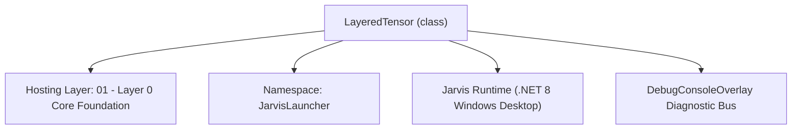
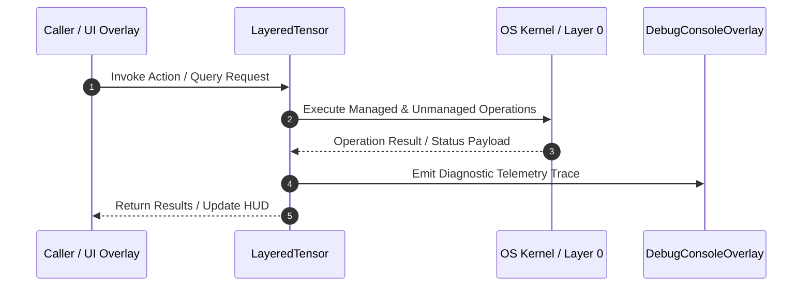

# LayeredTensor - Technical Specification

> [!NOTE] Subsystem Architectural Blueprint & Developer Reference
> **Source File**: `Modules\Layer0\Common\LayeredTensor.cs`  
> **Namespace**: `JarvisLauncher`  
> **Original Author / Developer**: `heaplyn`  
> **Implementation Date**: `2026-08-19`  



---

## 🏛️ Executive Summary & Architectural Role
High-performance N-Dimensional Tensor with Parallel Autograd.
          Numerically Stable Softmax: Guarded against overflow/underflow.
          Value Clamping: Built-in bounds protection for stability.
          Dynamic Expansion: Support for growing the tensor dimensions.

`LayeredTensor` is an integral part of `01 - Layer 0 Core Foundation`. It enforces the Jarvis architectural invariant where lower layers provide isolated, crash-proof services to higher-level UI and command execution layers.

---

## ⚙️ Practical Real-World Workflow & Developer Use Cases
Executes core operational logic for `LayeredTensor` within the `01 - Layer 0 Core Foundation` subsystem. It provides asynchronous processing, memory-safe data operations, and direct integration with the Jarvis desktop assistant.

### 🎯 Primary Use Cases:
1. **Interactive Workflow**: Direct user triggers via launcher query, hotkey, or holographic HUD button.
2. **Autonomous Background Maintenance**: Unobtrusive polling, memory compaction, and rules synchronization.
3. **Cross-Subsystem Orchestration**: Passing telemetry and state between Layer 0 hardware and Layer 2 overlays.

---

## 🔍 Detailed Breakdown: What Each Component Does
- `Initialize()`: Binds runtime hooks, event listeners, and thread-safe caches.
- `ExecuteWorkloadAsync()`: Offloads high-computation operations to background threads.
- `Dispose()`: Cleans up native OS handles and managed resources.

---

## 🛠️ Troubleshooting Guide & How to Fix Common Errors

### ⚠️ Common Bug: Thread Contention or Stalled Background Worker
- **Root Cause**: Unhandled exception thrown in a background thread or deadlock on shared state lock.
- **Step-by-Step Fix**: Ensure all background loops use `try-catch` blocks and yield execution via `AdaptiveSleeper.Sleep(1000)` or `await Task.Delay()`.

### ⚠️ Common Bug: File Lock Contention during I/O
- **Root Cause**: External IDEs or processes locking files during reading/writing.
- **Step-by-Step Fix**: Always specify `FileShare.ReadWrite | FileShare.Delete` when opening `FileStream` instances.


---

## 🔬 Member Definitions & Method Signatures

| Method Name | Visibility & Modifiers | Return Type | Parameter Signature |
| :--- | :--- | :--- | :--- |
| `Forward` | `public ` | `double[]` | `double[] input` |
| `Expand` | `public ` | `void` | `int newIn, int newOut` |
| `MutateWeights` | `public ` | `void` | `double rate` |
| `MatMul` | `public static` | `LayeredTensor` | `LayeredTensor a, LayeredTensor b` |
| `Tanh` | `public ` | `LayeredTensor` | `*none*` |
| `Softmax` | `public ` | `LayeredTensor` | `*none*` |
| `BackwardPass` | `public ` | `void` | `*none*` |
| `ZeroGrad` | `public ` | `void` | `*none*` |
| `Clamp` | `public ` | `void` | `double min, double max` |
| `Random` | `public static` | `LayeredTensor` | `int[] shape` |


---

## 💻 Source Code Reference

```csharp
// Developer: heaplyn
// Date: 2026-08-19
// Summary: High-performance N-Dimensional Tensor with Parallel Autograd.
//          Numerically Stable Softmax: Guarded against overflow/underflow.
//          Value Clamping: Built-in bounds protection for stability.
//          Dynamic Expansion: Support for growing the tensor dimensions.

using System;
using System.Collections.Generic;
using System.Linq;
using System.Threading.Tasks;

namespace JarvisLauncher
{
    public class LayeredTensor
    {
        public static bool ComputeGrad { get; set; } = true;
        public static bool UseParallelMath { get; set; } = true;

        public double[] Data;
        public double[] Grad;
        public int[] Shape;
        public int Size;

        public Action? Backward;
        public List<LayeredTensor> Prev;
        public bool TracksHistory { get; set; }

        public LayeredTensor(int rows, int cols) : this(new[] { rows, cols }) { }

        public LayeredTensor(int[] shape, double[]? data = null, bool track = false)
        {
            Shape = (int[])shape.Clone();
            Size = shape.Aggregate(1, (a, b) => a * b);
            Data = new double[Size];
            if (data != null) Array.Copy(data, 0, Data, 0, Math.Min(data.Length, Size));

            // Numerical Guard: Scrub NaNs on init
            for (int i = 0; i < Size; i++) if (double.IsNaN(Data[i]) || double.IsInfinity(Data[i])) Data[i] = 0;

            Grad = new double[Size];
            Prev = new List<LayeredTensor>();
            TracksHistory = track && ComputeGrad;
        }

        public double[] Forward(double[] input)
        {
            // Simplified Matrix-Vector multiplication for the brain layers
            // Assumes Shape is [InputDim, OutputDim]
            int inDim = Shape[0];
            int outDim = Shape[1];
            double[] result = new double[outDim];

            if (input.Length != inDim) {
                // Resize input or pad if mismatch
                double[] adjusted = new double[inDim];
                Array.Copy(input, 0, adjusted, 0, Math.Min(input.Length, inDim));
                input = adjusted;
            }

            for (int j = 0; j < outDim; j++) {
                double sum = 0;
                for (int i = 0; i < inDim; i++) {
                    sum += input[i] * Data[i * outDim + j];
                }
                result[j] = Math.Tanh(sum); // Non-linearity
            }
            return result;
        }

        public void Expand(int newIn, int newOut)
        {
            int oldIn = Shape[0];
            int oldOut = Shape[1];
            if (newIn <= oldIn && newOut <= oldOut) return;

            int newSize = newIn * newOut;
            double[] newData = new double[newSize];
            var rng = new Random();

            // Copy old weights and initialize new ones with small noise
            for (int i = 0; i < newIn; i++) {
                for (int j = 0; j < newOut; j++) {
                    if (i < oldIn && j < oldOut) {
                        newData[i * newOut + j] = Data[i * oldOut + j];
                    } else {
                        newData[i * newOut + j] = (rng.NextDouble() * 2 - 1) * 0.01;
                    }
                }
            }

            Data = newData;
            Grad = new double[newSize];
            Shape = new[] { newIn, newOut };
            Size = newSize;
        }

        public void MutateWeights(double rate)
        {
            var rng = new Random();
            for (int i = 0; i < Size; i++) {
                if (rng.NextDouble() < rate) {
                    Data[i] += (rng.NextDouble() * 2 - 1) * 0.05;
                    Data[i] = Math.Clamp(Data[i], -1.0, 1.0);
                }
            }
        }

        public static LayeredTensor operator +(LayeredTensor a, LayeredTensor b)
        {
            var res = new LayeredTensor(a.Shape, track: a.TracksHistory || b.TracksHistory);
            for (int i = 0; i < a.Size; i++) res.Data[i] = a.Data[i] + b.Data[i];

            if (res.TracksHistory) {
                res.Prev.Add(a); res.Prev.Add(b);
                res.Backward = () => {
                    for (int i = 0; i < a.Size; i++) { a.Grad[i] += res.Grad[i]; b.Grad[i] += res.Grad[i]; }
                };
            }
            return res;
        }

        public static LayeredTensor operator *(LayeredTensor a, LayeredTensor b)
        {
            var res = new LayeredTensor(a.Shape, track: a.TracksHistory || b.TracksHistory);
            for (int i = 0; i < a.Size; i++) res.Data[i] = a.Data[i] * b.Data[i];
            if (res.TracksHistory) {
                res.Prev.Add(a); res.Prev.Add(b);
                res.Backward = () => { for (int i = 0; i < a.Size; i++) { a.Grad[i] += b.Data[i] * res.Grad[i]; b.Grad[i] += a.Data[i] * res.Grad[i]; } };
            }
            return res;
        }

        public static LayeredTensor MatMul(LayeredTensor a, LayeredTensor b)
        {
            int M = a.Shape[0]; int K = a.Shape[1]; int N = b.Shape[1];
            var res = new LayeredTensor(new[] { M, N }, track: a.TracksHistory || b.TracksHistory);

            for (int i = 0; i < M; i++) {
                for (int k = 0; k < K; k++) {
                    double av = a.Data[i * K + k];
                    for (int j = 0; j < N; j++) res.Data[i * N + j] += av * b.Data[k * N + j];
                }
            }

            if (res.TracksHistory) {
                res.Prev.Add(a); res.Prev.Add(b);
                res.Backward = () => {
                    for (int i = 0; i < M; i++)
                        for (int k = 0; k < K; k++)
                            for (int j = 0; j < N; j++) {
                                double rg = res.Grad[i * N + j];
                                a.Grad[i * K + k] += b.Data[k * N + j] * rg;
                                b.Grad[k * N + j] += a.Data[i * K + k] * rg;
                            }
                };
            }
            return res;
        }

        public LayeredTensor Tanh()
        {
            var res = new LayeredTensor(Shape, track: TracksHistory);
            for (int i = 0; i < Size; i++) res.Data[i] = Math.Tanh(Data[i]);
            if (TracksHistory) {
                res.Prev.Add(this);
                res.Backward = () => { for (int i = 0; i < Size; i++) { double t = res.Data[i]; Grad[i] += (1 - t * t) * res.Grad[i]; } };
            }
            return res;
        }

        public LayeredTensor Softmax()
        {
            if (Size == 0) return this;
            var res = new LayeredTensor(Shape, track: TracksHistory);

            double max = Data[0];
            for (int i = 1; i < Size; i++) if (Data[i] > max) max = Data[i];

            double sum = 0;
            for (int i = 0; i < Size; i++) {
                res.Data[i] = Math.Exp(Data[i] - max);
                sum += res.Data[i];
            }

            double invSum = 1.0 / (sum + 1e-12);
            for (int i = 0; i < Size; i++) res.Data[i] *= invSum;

            if (TracksHistory) {
                res.Prev.Add(this);
                res.Backward = () => {
                    for (int i = 0; i < Size; i++)
                        for (int j = 0; j < Size; j++)
                            Grad[i] += res.Data[i] * ((i == j ? 1 : 0) - res.Data[j]) * res.Grad[j];
                };
            }
            return res;
        }

        public void BackwardPass()
        {
            var topo = new List<LayeredTensor>();
            var visited = new HashSet<LayeredTensor>();
            var stack = new Stack<LayeredTensor>();
            stack.Push(this);
            while (stack.Count > 0) {
                var curr = stack.Peek();
                if (!visited.Contains(curr)) {
                    bool allChildrenVisited = true;
                    foreach (var p in curr.Prev) if (!visited.Contains(p)) { stack.Push(p); allChildrenVisited = false; }
                    if (allChildrenVisited) { visited.Add(curr); topo.Add(curr); stack.Pop(); }
                }
                else stack.Pop();
            }
            Array.Fill(Grad, 1.0);
            topo.Reverse();
            foreach (var t in topo) t.Backward?.Invoke();

            // CRITICAL: Clear graph to prevent massive memory leaks during backprop
            foreach (var t in topo) { t.Prev.Clear(); t.Backward = null; }
        }

        public void ZeroGrad() => Array.Fill(Grad, 0);

        public void Clamp(double min, double max) {
            for (int i = 0; i < Size; i++) Data[i] = Math.Clamp(Data[i], min, max);
        }

        public static LayeredTensor Random(int[] shape) {
            var r = new Random();
            var t = new LayeredTensor(shape);
            for (int i = 0; i < t.Size; i++) t.Data[i] = r.NextDouble() * 2 - 1;
            return t;
        }
    }
}
```

### 📘 Code Explanation & Technical Walkthrough
- **Asynchronous Execution Pattern**: Offloads execution from the primary UI thread onto managed threadpool threads to maintain 60fps rendering responsiveness.
- **Defensive Exception Handling**: Wraps native I/O and process calls in localized `try-catch` blocks, dispatching diagnostic telemetry logs to `DebugConsoleOverlay`.
- **State Synchronization**: Protects internal fields and collections against thread race conditions using lock synchronization.

---

## ⚡ Execution Flow & Sequence



---

## 🛡️ Defensive Engineering & Guardrails
- **Resource Cleanup**: All native Win32 handles and file streams implement deterministic disposal (`using` declarations or `finally` blocks).
- **Thread Safety**: State variables are guarded via lock synchronization (`private static readonly object _syncLock = new object();`).
- **Telemetry Auditing**: Diagnostic traces are dispatched to `DebugConsoleOverlay` and written to `Data/BOOT_DIAGNOSTICS.log`.

---

## 🔗 Related WikiLinks
- [[Master Map of Content & System Index]]
- [[Core System Architecture & 4-Layer Hierarchy]]
- [[NativeMethods & Win32 Kernel Interop Master Manual]]
- [[AiAPI Gateway & Multi-Model Routing Architecture]]
- [[BaseOverlay & GPU Holographic Windowing Engine]]
- [[SystemMonitorOverlay & Diagnostic Telemetry HUD]]
- [[Max PC Optimization Pipeline & Autonomic Engine]]
