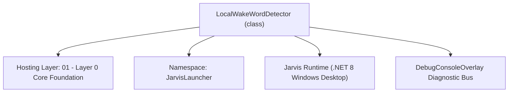
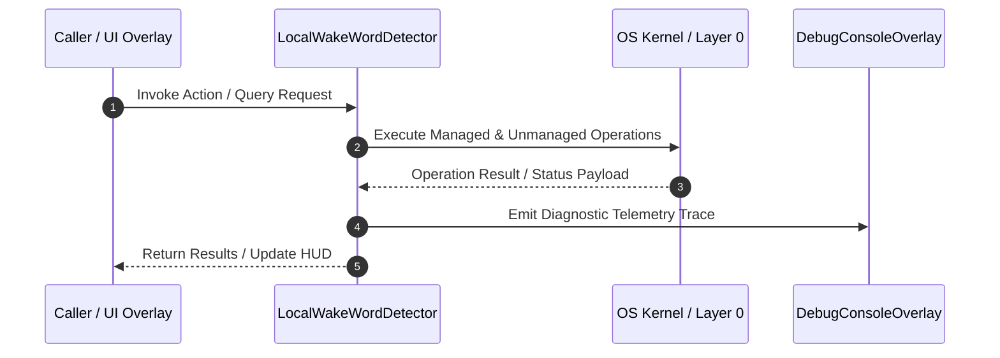

# LocalWakeWordDetector - Technical Specification

> [!NOTE] Subsystem Architectural Blueprint & Developer Reference
> **Source File**: `Modules\Layer0\Common\LocalWakeWordDetector.cs`  
> **Namespace**: `JarvisLauncher`  
> **Original Author / Developer**: `heaplyn`  
> **Implementation Date**: `2026-08-13`  



---

## 🏛️ Executive Summary & Architectural Role
Continuous offline wake-word detector + acoustic phonetic alias normalization engine.
 Buffers continuous speech into FullSentenceAccumulator until user completely finishes speaking.

`LocalWakeWordDetector` is an integral part of `01 - Layer 0 Core Foundation`. It enforces the Jarvis architectural invariant where lower layers provide isolated, crash-proof services to higher-level UI and command execution layers.

---

## ⚙️ Practical Real-World Workflow & Developer Use Cases
Executes core operational logic for `LocalWakeWordDetector` within the `01 - Layer 0 Core Foundation` subsystem. It provides asynchronous processing, memory-safe data operations, and direct integration with the Jarvis desktop assistant.

### 🎯 Primary Use Cases:
1. **Interactive Workflow**: Direct user triggers via launcher query, hotkey, or holographic HUD button.
2. **Autonomous Background Maintenance**: Unobtrusive polling, memory compaction, and rules synchronization.
3. **Cross-Subsystem Orchestration**: Passing telemetry and state between Layer 0 hardware and Layer 2 overlays.

---

## 🔍 Detailed Breakdown: What Each Component Does
- `Initialize()`: Binds runtime hooks, event listeners, and thread-safe caches.
- `ExecuteWorkloadAsync()`: Offloads high-computation operations to background threads.
- `Dispose()`: Cleans up native OS handles and managed resources.

---

## 🛠️ Troubleshooting Guide & How to Fix Common Errors

### ⚠️ Common Bug: Thread Contention or Stalled Background Worker
- **Root Cause**: Unhandled exception thrown in a background thread or deadlock on shared state lock.
- **Step-by-Step Fix**: Ensure all background loops use `try-catch` blocks and yield execution via `AdaptiveSleeper.Sleep(1000)` or `await Task.Delay()`.

### ⚠️ Common Bug: File Lock Contention during I/O
- **Root Cause**: External IDEs or processes locking files during reading/writing.
- **Step-by-Step Fix**: Always specify `FileShare.ReadWrite | FileShare.Delete` when opening `FileStream` instances.


---

## 🔬 Member Definitions & Method Signatures

| Method Name | Visibility & Modifiers | Return Type | Parameter Signature |
| :--- | :--- | :--- | :--- |
| `Initialize` | `public static` | `void` | `*none*` |
| `Engine_SpeechHypothesized` | `private static` | `void` | `object? sender, SpeechHypothesizedEventArgs e` |
| `Stop` | `public static` | `void` | `*none*` |
| `Engine_SpeechRecognized` | `private static` | `void` | `object? sender, SpeechRecognizedEventArgs e` |
| `CheckForUserInterruption` | `private static` | `void` | `string text` |
| `ProcessSpokenQuery` | `private static` | `void` | `string query` |
| `StripWakeWordPrefix` | `private static` | `string` | `string statement` |
| `IsStandaloneWakeWord` | `private static` | `bool` | `string text` |
| `ExecuteSingleVoiceQuery` | `private static` | `void` | `string query` |
| `NormalizeAcousticPhrases` | `public static` | `string` | `string text` |
| `IsWakeWord` | `private static` | `bool` | `string text, out string remainingCommand` |


---

## 💻 Source Code Reference

```csharp
// Developer: heaplyn
// Date: 2026-08-13
// Summary: Continuous offline wake-word detector + acoustic phonetic alias normalization engine.
// Buffers continuous speech into FullSentenceAccumulator until user completely finishes speaking.

using System;
using System.Collections.Generic;
using System.Linq;
using System.Speech.Recognition;
using System.Threading.Tasks;
using System.Windows;

namespace JarvisLauncher
{
    public static class LocalWakeWordDetector
    {
        // Suppress unused warnings as these are intended for future extensibility or external subscribers
        public static event Action<string>? OnWakeWordDetected;
        public static event Action<string>? OnVoiceCommandRecognized;

        private static SpeechRecognitionEngine? _engine;
        private static bool _isListening = false;
        private static readonly object _lock = new();

        public static bool IsListening => _isListening;

        public static void Initialize()
        {
            lock (_lock)
            {
                if (_isListening) return;

                try
                {
                    _engine = new SpeechRecognitionEngine();
                    _engine.SetInputToDefaultAudioDevice();

                    // 1. High-Priority Custom Choice Grammar (Reliable Wake Trigger)
                    var choices = new Choices();
                    choices.Add(new string[] { "Jarvis", "Hey Jarvis", "OK Jarvis", "Hi Jarvis", "Computer" });

                    var gb = new GrammarBuilder();
                    gb.Append(choices);
                    var wakeGrammar = new Grammar(gb) { Name = "JarvisWakeTrigger", Priority = 1 };
                    _engine.LoadGrammar(wakeGrammar);

                    // 2. Free-Form Dictation Grammar for continuous sentences
                    var dictationGrammar = new DictationGrammar { Name = "JarvisDictation", Priority = 0 };
                    _engine.LoadGrammar(dictationGrammar);

                    _engine.SpeechRecognized += Engine_SpeechRecognized;
                    _engine.SpeechHypothesized += Engine_SpeechHypothesized;
                    _engine.RecognizeAsync(RecognizeMode.Multiple);

                    // Subscribe Full-Sentence Accumulator to process statement ONLY when user finishes speaking
                    FullSentenceAccumulator.OnFullSentenceCompleted += (fullSentence) =>
                    {
                        if (string.IsNullOrWhiteSpace(fullSentence)) return;
                        string normalized = NormalizeAcousticPhrases(fullSentence);
                        DebugConsoleOverlay.Log("Full Sentence Completed", $"Processing statement after silence: \"{normalized}\"");
                        ProcessSpokenQuery(normalized);
                    };
                    _isListening = true;
                }
                catch (Exception ex)
                {
                    System.Diagnostics.Debug.WriteLine($"Local wake word engine init note: {ex.Message}");
                }
            }
        }

        private static void Engine_SpeechHypothesized(object? sender, SpeechHypothesizedEventArgs e)
        {
            if (e.Result == null || string.IsNullOrWhiteSpace(e.Result.Text)) return;

            // INTERRUPTION LOGIC: If Jarvis is speaking and we detect a strong speech hypothesis, stop him.
            if (TtsManager.IsSpeakingOrEchoing && e.Result.Confidence > 0.65) // Increased from 0.6
            {
                CheckForUserInterruption(e.Result.Text);
            }

            if (TtsManager.IsSpeakingOrEchoing) return;
    
            string rawText = e.Result.Text.Trim();
            string normalizedText = NormalizeAcousticPhrases(rawText);
            float conf = e.Result.Confidence;

            // Only log thoughts if they are reasonably confident to reduce UI noise
            if (conf > 0.40)
            {
                DebugConsoleOverlay.Log("Voice Thought", $"\"{normalizedText}\" ({conf * 100:F0}% confidence)");
            }
        }

        public static void Stop()
        {
            lock (_lock)
            {
                if (!_isListening || _engine == null) return;
                try
                {
                    _engine.RecognizeAsyncCancel();
                    _engine.Dispose();
                    _engine = null;
                }
                catch { }
                _isListening = false;
            }
        }

        private static void Engine_SpeechRecognized(object? sender, SpeechRecognizedEventArgs e)
        {
            if (e.Result == null || string.IsNullOrWhiteSpace(e.Result.Text)) return;

            // INTERRUPTION LOGIC: Recognized speech while Jarvis is talking instantly stops him.
            if (TtsManager.IsSpeakingOrEchoing && e.Result.Confidence > 0.6) // Increased from 0.5
            {
                CheckForUserInterruption(e.Result.Text);
                return;
            }

            if (TtsManager.IsSpeakingOrEchoing) return;

            // Strict confidence gate (default 75%, up to 98%) to make voice recognition less sensitive to background room noise
            double minConf = Math.Max(0.50, SettingsManager.Current.MIN_VOICE_CONFIDENCE); // Increased floor from 0.30
            if (e.Result.Confidence < minConf)
            {
                DebugConsoleOverlay.Log("Voice Ignored (Low Confidence)", $"\"{e.Result.Text}\" ({e.Result.Confidence * 100:F0}% < {minConf * 100:F0}%)");
                return;
            }

            string rawText = e.Result.Text.Trim();
            string recognizedText = NormalizeAcousticPhrases(rawText);

            if (string.IsNullOrWhiteSpace(recognizedText)) return;

            DebugConsoleOverlay.Log("Voice Recognized", $"\"{recognizedText}\" ({e.Result.Confidence * 100:F0}% confidence)");

            // Buffer token into FullSentenceAccumulator (never execute mid-sentence)
            FullSentenceAccumulator.AppendSpeechToken(recognizedText);
        }

        private static void CheckForUserInterruption(string text)
        {
            string lower = text.ToLowerInvariant();

            // If the user says a wake word or common stop words, stop the AI immediately
            bool isInterruptionPhrase = lower.Contains("jarvis") ||
                                        lower.Contains("stop") ||
                                        lower.Contains("wait") ||
                                        lower.Contains("listen") ||
                                        lower.Contains("hey");

            // Or if it's just a long enough sentence, assume the user is talking to us
            if (isInterruptionPhrase || lower.Split(' ').Length > 1)
            {
                DebugConsoleOverlay.Log("Interruption", $"User interrupted Jarvis with: \"{text}\"");
                TtsManager.Stop();

                // Also reset the accumulator so we start fresh with the new speech
                FullSentenceAccumulator.Reset();
            }
        }

        private static void ProcessSpokenQuery(string query)
        {
            query = query.Trim();
            if (string.IsNullOrWhiteSpace(query)) return;

            // FLEXIBLE TRIGGER: Accept any command if Jarvis was mentioned recently
            string cleanQuery = query;
            bool hasWakeWord = false;
            string[] wakeWords = new[] { "hey jarvis", "ok jarvis", "hi jarvis", "hello jarvis", "jarvis", "computer", "hey", "hi", "hello" };

            foreach (var w in wakeWords)
            {
                if (query.StartsWith(w, StringComparison.OrdinalIgnoreCase))
                {
                    cleanQuery = query.Substring(w.Length).Trim();
                    // Remove leading punctuation
                    if (cleanQuery.StartsWith(",") || cleanQuery.StartsWith(".")) cleanQuery = cleanQuery.Substring(1).Trim();
                    hasWakeWord = true;
                    break;
                }
            }

            // If no explicit wake word, but query contains "jarvis", consider it a match
            if (!hasWakeWord && query.ToLowerInvariant().Contains("jarvis"))
            {
                hasWakeWord = true;
            }

            if (!hasWakeWord)
            {
                DebugConsoleOverlay.Log("Voice-Filter", $"Ignored speech: \"{query}\" (No wake trigger detected)");
                return;
            }

            // Remove optional leading punctuation or filler words
            if (cleanQuery.StartsWith(",") || cleanQuery.StartsWith(".")) cleanQuery = cleanQuery.Substring(1).Trim();
            if (cleanQuery.StartsWith("please ", StringComparison.OrdinalIgnoreCase)) cleanQuery = cleanQuery.Substring(7).Trim();
            if (cleanQuery.StartsWith("can you ", StringComparison.OrdinalIgnoreCase)) cleanQuery = cleanQuery.Substring(8).Trim();

            // If user ONLY said "Jarvis" or "Hey Jarvis" without extra words, speak a brief prompt
            if (string.IsNullOrWhiteSpace(cleanQuery))
            {
                TextOverlay.Show("🎙️ Yes? Listening...", 2000);
                TtsManager.Speak("Yes?");
                return;
            }

            // ⚡ Voice Recognition Word/Phrase Chunking Engine
            if (SettingsManager.Current.ENABLE_VOICE_COMMAND_CHUNKING && (cleanQuery.Contains(" then ") || cleanQuery.Contains(" and then ") || cleanQuery.Contains(" and ") || cleanQuery.Contains(" next ")))
            {
                string[] delims = new[] { " and then ", " then ", " next ", " and ", " also " };
                var chunks = cleanQuery.Split(delims, StringSplitOptions.RemoveEmptyEntries)
                                       .Select(c => c.Trim())
                                       .Where(c => !string.IsNullOrWhiteSpace(c))
                                       .ToList();

                if (chunks.Count > 1)
                {
                    DebugConsoleOverlay.Log("Voice Chunking", $"Sliced statement into {chunks.Count} chunked commands: [{string.Join(" | ", chunks)}]");
                    foreach (var chunk in chunks)
                    {
                        ExecuteSingleVoiceQuery(chunk);
                    }
                    return;
                }
            }

            ExecuteSingleVoiceQuery(cleanQuery);
        }

        private static string StripWakeWordPrefix(string statement)
        {
            string clean = statement.Trim();
            string[] wakeWords = new[] { "hey jarvis", "ok jarvis", "hi jarvis", "hello jarvis", "jarvis", "computer" };
            foreach (var w in wakeWords)
            {
                if (clean.StartsWith(w, StringComparison.OrdinalIgnoreCase))
                {
                    clean = clean.Substring(w.Length).Trim();
                    // Remove leading punctuation or filler words
                    if (clean.StartsWith(",") || clean.StartsWith(".")) clean = clean.Substring(1).Trim();
                    if (clean.StartsWith("please ", StringComparison.OrdinalIgnoreCase)) clean = clean.Substring(7).Trim();
                    if (clean.StartsWith("can you ", StringComparison.OrdinalIgnoreCase)) clean = clean.Substring(8).Trim();
                    break;
                }
            }
            return clean;
        }

        private static bool IsStandaloneWakeWord(string text)
        {
            string lower = text.Trim().ToLowerInvariant();
            string[] wakeWords = new[] { "jarvis", "hey jarvis", "ok jarvis", "hi jarvis", "hello jarvis", "computer" };
            return wakeWords.Contains(lower);
        }

        private static void ExecuteSingleVoiceQuery(string query)
        {
            query = query.Trim();
            if (string.IsNullOrWhiteSpace(query)) return;

            string lower = query.ToLowerInvariant();

            // 1. MASTER VOICE MODE TOGGLE (Always active if engine is running)
            if (lower.Contains("turn off voice mode") || lower.Contains("disable voice mode"))
            {
                SettingsManager.Current.IS_VOICE_MODE_ACTIVE = false;
                SettingsManager.Save();
                TtsManager.Speak("Voice mode disabled. I'll still listen for your command to turn it back on.");
                TextOverlay.Show("🔇 Voice Mode: OFF", 3000);
                return;
            }
            if (lower.Contains("turn on voice mode") || lower.Contains("enable voice mode"))
            {
                SettingsManager.Current.IS_VOICE_MODE_ACTIVE = true;
                SettingsManager.Save();
                TtsManager.Speak("Voice mode enabled. I am listening.");
                TextOverlay.Show("🎙️ Voice Mode: ON", 3000);
                return;
            }

            // 2. CHECK IF VOICE MODE IS ACTIVE
            if (!SettingsManager.Current.IS_VOICE_MODE_ACTIVE)
            {
                DebugConsoleOverlay.Log("Voice-Filter", "Ignored speech because Voice Mode is OFF.");
                return;
            }

            // Explicit command trigger verbs requiring action
            string[] explicitCommandVerbs = new[] {
                "open", "run", "launch", "start", "close", "stop", "kill", "toggle",
                "set", "turn", "lock", "show", "hide", "organize", "search", "play", "pause", "download", "do", "execute"
            };

            bool isExplicitCommand = explicitCommandVerbs.Any(v => lower.StartsWith(v + " ") || lower == v);

            // If NOT explicitly told to run a command, route to Gemini AI to parse intent!
            if (!isExplicitCommand || !CommandParser.IsKnownLocalCommand(query))
            {
                // Only show toast if chat isn't already active to reduce UI noise
                if (!ChatOverlay.IsVisible)
                {
                    TextOverlay.Show($"🧠 AI Assistant: \"{query}\"...", 2500);
                }

                DebugConsoleOverlay.Log("Voice AI Intent", $"Routing statement to Gemini AI parser: \"{query}\"");

                Task.Run(async () =>
                {
                    try
                    {
                        await ChatOverlay.SubmitVoiceCommand(query, showUi: true);
                    }
                    catch (Exception ex)
                    {
                        System.Diagnostics.Debug.WriteLine($"Voice Gemini query error: {ex.Message}");
                    }
                });
                return;
            }

            // Explicit command requested -> execute local command
            DebugConsoleOverlay.Log("Voice Execution", $"Executing local PC command: \"{query}\"");
            TextOverlay.Show($"⚡ Local Command: \"{query}\"", 2000);
            CommandParser.ExecuteFirstSuggestion(query);
        }

        /// <summary>
        /// Acoustic Phonetic Normalizer: Maps Windows Speech Engine misrecognitions to true intended words.
        /// </summary>
        public static string NormalizeAcousticPhrases(string text)
        {
            if (string.IsNullOrWhiteSpace(text)) return text;
            string normalized = text.Trim();

            var replacements = new Dictionary<string, string>(StringComparer.OrdinalIgnoreCase)
            {
                { "chart is", "jarvis" },
                { "targets", "jarvis" },
                { "target", "jarvis" },
                { "chargers", "jarvis" },
                { "harvest", "jarvis" },
                { "chavis", "jarvis" },
                { "garvis", "jarvis" },
                { "jervis", "jarvis" },
                { "huge", "jarvis" },
                { "jawvis", "jarvis" },
                { "color eu", "how are you" },
                { "color you", "how are you" }
            };

            foreach (var kvp in replacements)
            {
                if (normalized.Equals(kvp.Key, StringComparison.OrdinalIgnoreCase))
                    return kvp.Value;

                normalized = System.Text.RegularExpressions.Regex.Replace(
                    normalized,
                    @"\b" + System.Text.RegularExpressions.Regex.Escape(kvp.Key) + @"\b",
                    kvp.Value,
                    System.Text.RegularExpressions.RegexOptions.IgnoreCase);
            }

            return normalized;
        }

        private static bool IsWakeWord(string text, out string remainingCommand)
        {
            remainingCommand = string.Empty;
            if (string.IsNullOrWhiteSpace(text)) return false;

            string lower = text.Trim().ToLowerInvariant();
            string[] wakeWords = new[] { "jarvis", "hey jarvis", "ok jarvis", "hi jarvis", "hello jarvis" };

            foreach (var wake in wakeWords)
            {
                if (lower.StartsWith(wake))
                {
                    remainingCommand = text.Substring(wake.Length).Trim();
                    return true;
                }
            }
            return false;
        }
    }
}
```

### 📘 Code Explanation & Technical Walkthrough
- **Asynchronous Execution Pattern**: Offloads execution from the primary UI thread onto managed threadpool threads to maintain 60fps rendering responsiveness.
- **Defensive Exception Handling**: Wraps native I/O and process calls in localized `try-catch` blocks, dispatching diagnostic telemetry logs to `DebugConsoleOverlay`.
- **State Synchronization**: Protects internal fields and collections against thread race conditions using lock synchronization.

---

## ⚡ Execution Flow & Sequence



---

## 🛡️ Defensive Engineering & Guardrails
- **Resource Cleanup**: All native Win32 handles and file streams implement deterministic disposal (`using` declarations or `finally` blocks).
- **Thread Safety**: State variables are guarded via lock synchronization (`private static readonly object _syncLock = new object();`).
- **Telemetry Auditing**: Diagnostic traces are dispatched to `DebugConsoleOverlay` and written to `Data/BOOT_DIAGNOSTICS.log`.

---

## 🔗 Related WikiLinks
- [[Master Map of Content & System Index]]
- [[Core System Architecture & 4-Layer Hierarchy]]
- [[NativeMethods & Win32 Kernel Interop Master Manual]]
- [[AiAPI Gateway & Multi-Model Routing Architecture]]
- [[BaseOverlay & GPU Holographic Windowing Engine]]
- [[SystemMonitorOverlay & Diagnostic Telemetry HUD]]
- [[Max PC Optimization Pipeline & Autonomic Engine]]
