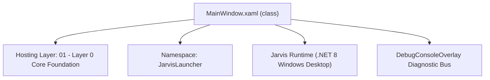
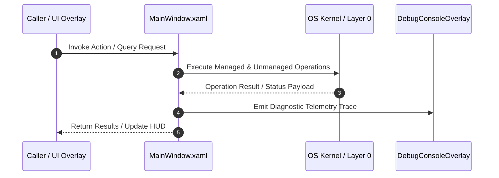

# MainWindow.xaml - Technical Specification

> [!NOTE] Subsystem Architectural Blueprint & Developer Reference
> **Source File**: `Modules\Layer4\MainWindow.xaml.cs`  
> **Namespace**: `JarvisLauncher`  
> **Original Author / Developer**: `heaplyn`  
> **Implementation Date**: `2026-08-08`  



---

## 🏛️ Executive Summary & Architectural Role
Main HUD window code-behind.

`MainWindow.xaml` is an integral part of `01 - Layer 0 Core Foundation`. It enforces the Jarvis architectural invariant where lower layers provide isolated, crash-proof services to higher-level UI and command execution layers.

---

## ⚙️ Practical Real-World Workflow & Developer Use Cases
Executes core operational logic for `MainWindow.xaml` within the `01 - Layer 0 Core Foundation` subsystem. It provides asynchronous processing, memory-safe data operations, and direct integration with the Jarvis desktop assistant.

### 🎯 Primary Use Cases:
1. **Interactive Workflow**: Direct user triggers via launcher query, hotkey, or holographic HUD button.
2. **Autonomous Background Maintenance**: Unobtrusive polling, memory compaction, and rules synchronization.
3. **Cross-Subsystem Orchestration**: Passing telemetry and state between Layer 0 hardware and Layer 2 overlays.

---

## 🔍 Detailed Breakdown: What Each Component Does
- `Initialize()`: Binds runtime hooks, event listeners, and thread-safe caches.
- `ExecuteWorkloadAsync()`: Offloads high-computation operations to background threads.
- `Dispose()`: Cleans up native OS handles and managed resources.

---

## 🛠️ Troubleshooting Guide & How to Fix Common Errors

### ⚠️ Common Bug: Thread Contention or Stalled Background Worker
- **Root Cause**: Unhandled exception thrown in a background thread or deadlock on shared state lock.
- **Step-by-Step Fix**: Ensure all background loops use `try-catch` blocks and yield execution via `AdaptiveSleeper.Sleep(1000)` or `await Task.Delay()`.

### ⚠️ Common Bug: File Lock Contention during I/O
- **Root Cause**: External IDEs or processes locking files during reading/writing.
- **Step-by-Step Fix**: Always specify `FileShare.ReadWrite | FileShare.Delete` when opening `FileStream` instances.


---

## 🔬 Member Definitions & Method Signatures

| Method Name | Visibility & Modifiers | Return Type | Parameter Signature |
| :--- | :--- | :--- | :--- |
| `RefreshBackgroundMedia` | `public ` | `void` | `*none*` |
| `ApplyGuiScale` | `public ` | `void` | `*none*` |
| `Window_Loaded` | `private ` | `void` | `object Sender, RoutedEventArgs E` |
| `PositionWindowAtTopCenter` | `public ` | `void` | `*none*` |
| `OnSourceInitialized` | `protected override` | `void` | `EventArgs E` |
| `HwndHook` | `private ` | `IntPtr` | `IntPtr Hwnd, int Msg, IntPtr WParam, IntPtr LParam, ref bool Handled` |
| `ToggleHUD` | `public ` | `void` | `*none*` |
| `ShowHUD` | `public ` | `void` | `*none*` |
| `HideHUD` | `public ` | `void` | `*none*` |
| `SearchInput_TextChanged` | `private async` | `void` | `object Sender, TextChangedEventArgs E` |
| `SearchInput_PreviewKeyDown` | `private ` | `void` | `object Sender, KeyEventArgs E` |
| `ResultsList_PreviewKeyDown` | `private ` | `void` | `object Sender, KeyEventArgs E` |
| `ResultsList_MouseDoubleClick` | `private ` | `void` | `object Sender, MouseButtonEventArgs E` |
| `ResultsList_PreviewMouseLeftButtonUp` | `private ` | `void` | `object Sender, MouseButtonEventArgs E` |
| `ExecuteSelection` | `private ` | `void` | `*none*` |


---

## 💻 Source Code Reference

```csharp
// Developer: heaplyn
// Date: 2026-08-08
// Summary: Main HUD window code-behind.

using System;
using System.Collections.Generic;
using System.Windows;
using System.Windows.Controls;
using System.Windows.Input;
using KeyEventArgs = System.Windows.Input.KeyEventArgs;
using MessageBox = System.Windows.MessageBox;
using System.Windows.Interop;
using System.Windows.Media.Animation;
using System.Windows.Threading;
using System.Threading;
using System.Threading.Tasks;

namespace JarvisLauncher
{
    public partial class MainWindow : Window
    {
        private const int HOTKEY_ID = 9000;
        private const int CTRL_SHIFT_C_ID = 9001;
        private const int CTRL_SHIFT_R_ID = 9002;
        private const uint VK_OEM_3 = 0xC0; // Backtick
        private const uint VK_C = 0x43;
        private const uint VK_R = 0x52;

        private HwndSource? SourceHwnd;
        private IntPtr PreviousForegroundWindow = IntPtr.Zero;
        private bool IsHiding = false;
        private DateTime StartupTime = DateTime.Now;
        private CancellationTokenSource _searchCts = new();

        public MainWindow()
        {
            InitializeComponent();
        }

        public void RefreshBackgroundMedia()
        {
            try
            {
                BackgroundMedia.Opacity = SettingsManager.Current.BACKGROUND_GIF_OPACITY;
                string localGifPath = SettingsManager.Current.BACKGROUND_GIF_PATH;

                if (!string.IsNullOrEmpty(localGifPath) && System.IO.File.Exists(localGifPath))
                {
                    var uri = new Uri(localGifPath, UriKind.Absolute);
                    var imageSource = new System.Windows.Media.Imaging.BitmapImage(uri);
                    WpfAnimatedGif.ImageBehavior.SetAnimatedSource(BackgroundMedia, imageSource);
                    WpfAnimatedGif.ImageBehavior.SetRepeatBehavior(BackgroundMedia, System.Windows.Media.Animation.RepeatBehavior.Forever);
                }
                else if (Application.Current.Resources["WindowBackgroundMediaSource"] is System.Windows.Media.ImageSource imgSource)
                {
                    WpfAnimatedGif.ImageBehavior.SetAnimatedSource(BackgroundMedia, imgSource);
                    WpfAnimatedGif.ImageBehavior.SetRepeatBehavior(BackgroundMedia, System.Windows.Media.Animation.RepeatBehavior.Forever);
                }
            }
            catch { }
        }

        public void ApplyGuiScale()
        {
            try
            {
                var s = SettingsManager.Current;
                double scale = s.GUI_SCALE;

                if (s.AUTO_GUI_SCALE_TO_SCREEN)
                {
                    double screenHeight = SystemParameters.PrimaryScreenHeight;
                    scale = (screenHeight / 1080.0) * s.GUI_SCALE;
                }

                if (scale < 0.3) scale = 0.3;
                if (scale > 4.0) scale = 4.0;

                var scaleTransform = new System.Windows.Media.ScaleTransform(scale, scale);
                MainBorder.LayoutTransform = scaleTransform;

                // Recenter after scale
                PositionWindowAtTopCenter();
            }
            catch { }
        }

        private void Window_Loaded(object Sender, RoutedEventArgs E)
        {
            ApplyGuiScale();
            RefreshBackgroundMedia();
            PositionWindowAtTopCenter();
            try { StartMenuRegistrar.EnsureStartMenuShortcut(); } catch { }

            CommandParser.OnTextOpacityChanged += (OpacityValue) =>
            {
                Dispatcher.Invoke(() => {
                    SearchInput.Opacity = OpacityValue;
                    PlaceholderText.Opacity = OpacityValue;
                    ResultsList.Opacity = OpacityValue;
                });
            };
        }

        public void PositionWindowAtTopCenter()
        {
            // Use WPF SystemParameters (DIPs) to ensure perfect centering regardless of monitor scaling (125%, 150%, etc.)
            // workArea.Width and workArea.Left are already scaled for WPF.
            var WorkArea = SystemParameters.WorkArea;
            double WindowWidth = 680;

            this.Left = WorkArea.Left + (WorkArea.Width - WindowWidth) / 2;
            this.Top = WorkArea.Top + 10;
        }

        protected override void OnSourceInitialized(EventArgs E)
        {
            base.OnSourceInitialized(E);
            var Helper = new WindowInteropHelper(this);
            SourceHwnd = HwndSource.FromHwnd(Helper.Handle);
            SourceHwnd.AddHook(HwndHook);

            NativeMethods.RegisterHotKey(Helper.Handle, HOTKEY_ID, 0, VK_OEM_3);
            NativeMethods.RegisterHotKey(Helper.Handle, CTRL_SHIFT_C_ID, NativeMethods.MOD_CONTROL | NativeMethods.MOD_SHIFT, VK_C);
            NativeMethods.RegisterHotKey(Helper.Handle, CTRL_SHIFT_R_ID, NativeMethods.MOD_CONTROL | NativeMethods.MOD_SHIFT, VK_R);
        }

        private IntPtr HwndHook(IntPtr Hwnd, int Msg, IntPtr WParam, IntPtr LParam, ref bool Handled)
        {
            if (Msg == NativeMethods.WM_HOTKEY)
            {
                int Id = WParam.ToInt32();
                if (Id == HOTKEY_ID) { ToggleHUD(); Handled = true; }
                else if (Id == CTRL_SHIFT_C_ID) { Application.Current.Shutdown(); Handled = true; }
                else if (Id == CTRL_SHIFT_R_ID)
                {
                    TextOverlay.Show("Syncing & Rebuilding...", 2000);
                    NativeMethods.Restart(freshBoot: true, pullFirst: true);
                    Handled = true;
                }
            }
            return IntPtr.Zero;
        }

        public void ToggleHUD() { if (this.Visibility == Visibility.Visible && !IsHiding) HideHUD(); else ShowHUD(); }

        public void ShowHUD()
        {
            IsHiding = false;
            PositionWindowAtTopCenter();

            this.Visibility = Visibility.Visible;
            this.Opacity = 1.0;
            MainBorder.Opacity = 1.0;
            WindowTranslate.Y = 0;

            this.Topmost = true;
            this.Activate();
            SearchInput.Focus();
            Keyboard.Focus(SearchInput);

            if (SettingsManager.Current.ENABLE_ANIMATIONS)
            {
                if (Resources["SlideIn"] is Storyboard SlideIn) SlideIn.Begin(this);
            }
        }

        public void HideHUD()
        {
            if (IsHiding) return;
            IsHiding = true;
            if (SettingsManager.Current.ENABLE_ANIMATIONS && Resources["SlideOut"] is Storyboard SlideOut)
            {
                SlideOut.Completed += (S, E) => { if (IsHiding) { this.Visibility = Visibility.Collapsed; SearchInput.Text = ""; IsHiding = false; } };
                SlideOut.Begin(this);
            }
            else { this.Visibility = Visibility.Collapsed; IsHiding = false; }
        }

        private async void SearchInput_TextChanged(object Sender, TextChangedEventArgs E)
        {
            string Query = SearchInput.Text;
            PlaceholderText.Visibility = string.IsNullOrEmpty(Query) ? Visibility.Visible : Visibility.Collapsed;

            // Cancel any pending search from a previous keystroke
            _searchCts.Cancel();
            _searchCts.Dispose();
            _searchCts = new CancellationTokenSource();
            var token = _searchCts.Token;

            if (string.IsNullOrWhiteSpace(Query))
            {
                ResultsList.ItemsSource = null;
                ResultsList.Visibility = Visibility.Collapsed;
                DividerLine.Visibility = Visibility.Collapsed;
                return;
            }

            try
            {
                // 40ms debounce: wait for a pause in typing before computing suggestions
                await Task.Delay(40, token);

                // Run the suggestion matching off the UI thread
                var Suggestions = await Task.Run(() => CommandParser.GetSuggestions(Query), token);

                if (token.IsCancellationRequested) return;

                // Push results back at Input priority so they display immediately
                await Dispatcher.InvokeAsync(() =>
                {
                    if (Suggestions.Count > 0)
                    {
                        ResultsList.ItemsSource = Suggestions;
                        ResultsList.Visibility = Visibility.Visible;
                        DividerLine.Visibility = Visibility.Visible;
                        ResultsList.SelectedIndex = 0;
                    }
                    else
                    {
                        ResultsList.ItemsSource = null;
                        ResultsList.Visibility = Visibility.Collapsed;
                        DividerLine.Visibility = Visibility.Collapsed;
                    }
                }, System.Windows.Threading.DispatcherPriority.Input);
            }
            catch (OperationCanceledException) { /* Keystroke superseded — expected */ }
        }

        private void SearchInput_PreviewKeyDown(object Sender, KeyEventArgs E)
        {
            if (E.Key == Key.Escape) { HideHUD(); E.Handled = true; }
            else if (E.Key == Key.Enter && !Keyboard.IsKeyDown(Key.LeftShift)) { ExecuteSelection(); E.Handled = true; }
            else if (E.Key == Key.Down && ResultsList.Items.Count > 0) { ResultsList.SelectedIndex = (ResultsList.SelectedIndex + 1) % ResultsList.Items.Count; E.Handled = true; }
            else if (E.Key == Key.Up && ResultsList.Items.Count > 0) { ResultsList.SelectedIndex = (ResultsList.SelectedIndex - 1 + ResultsList.Items.Count) % ResultsList.Items.Count; E.Handled = true; }
        }

        private void ResultsList_PreviewKeyDown(object Sender, KeyEventArgs E)
        {
            if (E.Key == Key.Escape) { HideHUD(); E.Handled = true; }
            else if (E.Key == Key.Enter) { ExecuteSelection(); E.Handled = true; }
            else if (E.Key == Key.Up && ResultsList.SelectedIndex == 0) { SearchInput.Focus(); E.Handled = true; }
        }

        private void ResultsList_MouseDoubleClick(object Sender, MouseButtonEventArgs E) => ExecuteSelection();
        private void ResultsList_PreviewMouseLeftButtonUp(object Sender, MouseButtonEventArgs E) => ExecuteSelection();

        private void ExecuteSelection()
        {
            if (ResultsList.SelectedItem is CommandResult Sel) { try { Sel.EXECUTE?.Invoke(); } catch (Exception Ex) { MessageBox.Show("Error: " + Ex.Message); } HideHUD(); }
            else { string Q = SearchInput.Text.Trim(); if (!string.IsNullOrEmpty(Q)) { CommandParser.ExecuteFirstSuggestion(Q); HideHUD(); } }
        }

        protected override void OnDeactivated(EventArgs E)
        {
            base.OnDeactivated(E);
            if ((DateTime.Now - StartupTime).TotalSeconds < 5) return;
            if (this.Visibility == Visibility.Visible && !IsHiding) HideHUD();
        }
    }
}
```

### 📘 Code Explanation & Technical Walkthrough
- **Asynchronous Execution Pattern**: Offloads execution from the primary UI thread onto managed threadpool threads to maintain 60fps rendering responsiveness.
- **Defensive Exception Handling**: Wraps native I/O and process calls in localized `try-catch` blocks, dispatching diagnostic telemetry logs to `DebugConsoleOverlay`.
- **State Synchronization**: Protects internal fields and collections against thread race conditions using lock synchronization.

---

## ⚡ Execution Flow & Sequence



---

## 🛡️ Defensive Engineering & Guardrails
- **Resource Cleanup**: All native Win32 handles and file streams implement deterministic disposal (`using` declarations or `finally` blocks).
- **Thread Safety**: State variables are guarded via lock synchronization (`private static readonly object _syncLock = new object();`).
- **Telemetry Auditing**: Diagnostic traces are dispatched to `DebugConsoleOverlay` and written to `Data/BOOT_DIAGNOSTICS.log`.

---

## 🔗 Related WikiLinks
- [[Master Map of Content & System Index]]
- [[Core System Architecture & 4-Layer Hierarchy]]
- [[NativeMethods & Win32 Kernel Interop Master Manual]]
- [[AiAPI Gateway & Multi-Model Routing Architecture]]
- [[BaseOverlay & GPU Holographic Windowing Engine]]
- [[SystemMonitorOverlay & Diagnostic Telemetry HUD]]
- [[Max PC Optimization Pipeline & Autonomic Engine]]
