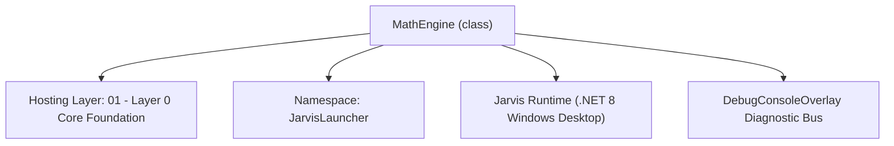
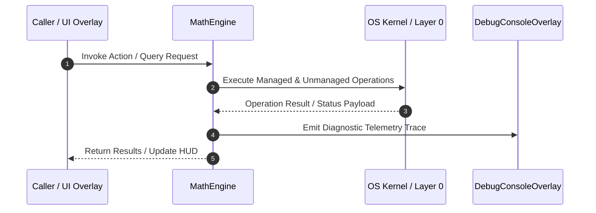

# MathEngine - Technical Specification

> [!NOTE] Subsystem Architectural Blueprint & Developer Reference
> **Source File**: `Modules\Layer0\Common\MathEngine.cs`  
> **Namespace**: `JarvisLauncher`  
> **Original Author / Developer**: `heaplyn`  
> **Implementation Date**: `2026-08-17`  



---

## 🏛️ Executive Summary & Architectural Role
High-performance purely offline Math & Symbolic Engine.
          Recursive descent parser with cycle protection and constant mapping.

`MathEngine` is an integral part of `01 - Layer 0 Core Foundation`. It enforces the Jarvis architectural invariant where lower layers provide isolated, crash-proof services to higher-level UI and command execution layers.

---

## ⚙️ Practical Real-World Workflow & Developer Use Cases
Executes core operational logic for `MathEngine` within the `01 - Layer 0 Core Foundation` subsystem. It provides asynchronous processing, memory-safe data operations, and direct integration with the Jarvis desktop assistant.

### 🎯 Primary Use Cases:
1. **Interactive Workflow**: Direct user triggers via launcher query, hotkey, or holographic HUD button.
2. **Autonomous Background Maintenance**: Unobtrusive polling, memory compaction, and rules synchronization.
3. **Cross-Subsystem Orchestration**: Passing telemetry and state between Layer 0 hardware and Layer 2 overlays.

---

## 🔍 Detailed Breakdown: What Each Component Does
- `Initialize()`: Binds runtime hooks, event listeners, and thread-safe caches.
- `ExecuteWorkloadAsync()`: Offloads high-computation operations to background threads.
- `Dispose()`: Cleans up native OS handles and managed resources.

---

## 🛠️ Troubleshooting Guide & How to Fix Common Errors

### ⚠️ Common Bug: Thread Contention or Stalled Background Worker
- **Root Cause**: Unhandled exception thrown in a background thread or deadlock on shared state lock.
- **Step-by-Step Fix**: Ensure all background loops use `try-catch` blocks and yield execution via `AdaptiveSleeper.Sleep(1000)` or `await Task.Delay()`.

### ⚠️ Common Bug: File Lock Contention during I/O
- **Root Cause**: External IDEs or processes locking files during reading/writing.
- **Step-by-Step Fix**: Always specify `FileShare.ReadWrite | FileShare.Delete` when opening `FileStream` instances.


---

## 🔬 Member Definitions & Method Signatures

| Method Name | Visibility & Modifiers | Return Type | Parameter Signature |
| :--- | :--- | :--- | :--- |
| `Evaluate` | `public ` | `string` | `string expression` |
| `EvaluateInternal` | `private ` | `string` | `string expr, int depth` |
| `FormatNumber` | `private static` | `string` | `double d` |
| `SolveDerivative` | `private ` | `string` | `string expr` |


---

## 💻 Source Code Reference

```csharp
// Developer: heaplyn
// Date: 2026-08-17
// Summary: High-performance purely offline Math & Symbolic Engine.
//          Recursive descent parser with cycle protection and constant mapping.

using System;
using System.Collections.Generic;
using System.Globalization;
using System.Text.RegularExpressions;
using System.Data;
using System.Linq;

namespace JarvisLauncher
{
    public class MathEngine : IMathEngine
    {
        private readonly DataTable _table = new DataTable();

        public static readonly Dictionary<string, double> ConstantsMap = new Dictionary<string, double>(StringComparer.OrdinalIgnoreCase)
        {
            { "pi", Math.PI }, { "e", Math.E }, { "phi", 1.61803398874989 }, { "tau", Math.PI * 2 }
        };

        public static readonly Dictionary<string, Func<double, double>> FunctionsMap = new Dictionary<string, Func<double, double>>(StringComparer.OrdinalIgnoreCase)
        {
            { "sin", Math.Sin }, { "cos", Math.Cos }, { "tan", Math.Tan },
            { "sqrt", Math.Sqrt }, { "abs", Math.Abs }, { "ln", Math.Log },
            { "log", Math.Log10 }, { "floor", Math.Floor }, { "ceil", Math.Ceiling }
        };

        public IReadOnlyDictionary<string, double> GetConstants() => ConstantsMap;
        public IReadOnlyDictionary<string, Func<double, double>> GetFunctions() => FunctionsMap;

        public string Evaluate(string expression)
        {
            try { return EvaluateInternal(expression, 0); }
            catch (Exception ex) { return "Math Error: " + ex.Message; }
        }

        private string EvaluateInternal(string expr, int depth)
        {
            if (depth > 5) return "0"; // Depth limit to prevent hang
            string clean = expr.ToLower().Trim();

            // 1. Symbolic (Return string)
            if (clean.StartsWith("diff ") || clean.StartsWith("derivative")) return SolveDerivative(clean);

            // Normalize common unicode operators so "6×7" / "8÷2" work too.
            clean = clean.Replace('×', '*').Replace('÷', '/').Replace('−', '-');

            // 2. Constants Replacement (invariant so the decimal point stays '.')
            foreach (var c in ConstantsMap)
                clean = Regex.Replace(clean, $@"\b{c.Key}\b", c.Value.ToString("R", CultureInfo.InvariantCulture));

            // 3. Recursive Function Resolution
            foreach (var f in FunctionsMap) {
                string pattern = $@"\b{f.Key}\((?<val>[^()]+)\)";
                clean = Regex.Replace(clean, pattern, m => {
                    string inner = m.Groups["val"].Value;
                    if (double.TryParse(EvaluateInternal(inner, depth + 1), NumberStyles.Any, CultureInfo.InvariantCulture, out double d))
                        return f.Value(d).ToString("R", CultureInfo.InvariantCulture);
                    return "0";
                });
            }

            // 4. Powers (right-associative, evaluated inner-most first)
            var powRe = new Regex(@"(?<base>-?\d+(?:\.\d+)?)\s*\^\s*(?<exp>-?\d+(?:\.\d+)?)");
            while (powRe.IsMatch(clean)) {
                clean = powRe.Replace(clean, m => {
                    try {
                        double b = double.Parse(m.Groups["base"].Value, CultureInfo.InvariantCulture);
                        double e = double.Parse(m.Groups["exp"].Value, CultureInfo.InvariantCulture);
                        return Math.Pow(b, e).ToString("R", CultureInfo.InvariantCulture);
                    } catch { return "0"; }
                }, 1);
            }

            // 5. Final Pass via DataTable
            if (Regex.IsMatch(clean, @"^[0-9\s\+\-\*\/\(\)\.eE]+$")) {
                try {
                    var raw = _table.Compute(clean, null);
                    if (raw != null && raw != DBNull.Value)
                        return FormatNumber(Convert.ToDouble(raw, CultureInfo.InvariantCulture));
                } catch { }
            }

            return "Complex/Variables detected.";
        }

        // Clean numeric formatting: integers show without a decimal, otherwise up to 10 significant
        // digits with trailing zeros trimmed. Guards against NaN/Infinity from bad input.
        private static string FormatNumber(double d)
        {
            if (double.IsNaN(d) || double.IsInfinity(d)) return "Math Error: undefined";
            if (Math.Abs(d - Math.Round(d)) < 1e-10 && Math.Abs(d) < 1e15)
                return Math.Round(d).ToString("0", CultureInfo.InvariantCulture);
            string s = d.ToString("G10", CultureInfo.InvariantCulture);
            return s;
        }

        private string SolveDerivative(string expr)
        {
            string target = expr.Replace("diff", "").Replace("derivative of", "").Trim();
            var match = Regex.Match(target, @"(?<coeff>[\d\.\-]*)\s*x\^?(?<pow>[\d\.\-]*)");
            if (match.Success) {
                double a = 1;
                string sc = match.Groups["coeff"].Value;
                if (sc == "-") a = -1; else if (!string.IsNullOrEmpty(sc)) a = double.Parse(sc, CultureInfo.InvariantCulture);

                double n = 1;
                string sp = match.Groups["pow"].Value;
                if (string.IsNullOrEmpty(sp)) n = target.Contains("^") ? 0 : 1; else n = double.Parse(sp, CultureInfo.InvariantCulture);

                if (n == 0) return "0";
                double nc = a * n; double np = n - 1;
                if (np == 0) return nc.ToString();
                if (np == 1) return $"{nc}x";
                return $"{nc}x^{np}";
            }
            return "Power rule (ax^n) only.";
        }
    }
}
```

### 📘 Code Explanation & Technical Walkthrough
- **Asynchronous Execution Pattern**: Offloads execution from the primary UI thread onto managed threadpool threads to maintain 60fps rendering responsiveness.
- **Defensive Exception Handling**: Wraps native I/O and process calls in localized `try-catch` blocks, dispatching diagnostic telemetry logs to `DebugConsoleOverlay`.
- **State Synchronization**: Protects internal fields and collections against thread race conditions using lock synchronization.

---

## ⚡ Execution Flow & Sequence



---

## 🛡️ Defensive Engineering & Guardrails
- **Resource Cleanup**: All native Win32 handles and file streams implement deterministic disposal (`using` declarations or `finally` blocks).
- **Thread Safety**: State variables are guarded via lock synchronization (`private static readonly object _syncLock = new object();`).
- **Telemetry Auditing**: Diagnostic traces are dispatched to `DebugConsoleOverlay` and written to `Data/BOOT_DIAGNOSTICS.log`.

---

## 🔗 Related WikiLinks
- [[Master Map of Content & System Index]]
- [[Core System Architecture & 4-Layer Hierarchy]]
- [[NativeMethods & Win32 Kernel Interop Master Manual]]
- [[AiAPI Gateway & Multi-Model Routing Architecture]]
- [[BaseOverlay & GPU Holographic Windowing Engine]]
- [[SystemMonitorOverlay & Diagnostic Telemetry HUD]]
- [[Max PC Optimization Pipeline & Autonomic Engine]]
