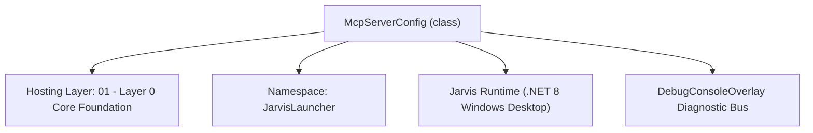
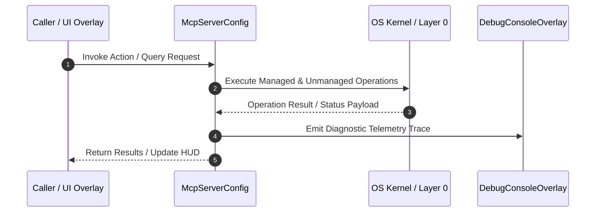

# McpManager - Technical Specification

> [!NOTE] Subsystem Architectural Blueprint & Developer Reference
> **Source File**: `Modules\Layer0\Common\McpManager.cs`  
> **Namespace**: `JarvisLauncher`  
> **Original Author / Developer**: `heaplyn`  
> **Implementation Date**: `2026-08-13`  



---

## 🏛️ Executive Summary & Architectural Role
Model Context Protocol (MCP) Client & Server Registry Manager.
 Handles JSON-RPC STDIO & SSE transports, mcp_config.json persistence, and tool enumeration.

`McpServerConfig` is an integral part of `01 - Layer 0 Core Foundation`. It enforces the Jarvis architectural invariant where lower layers provide isolated, crash-proof services to higher-level UI and command execution layers.

---

## ⚙️ Practical Real-World Workflow & Developer Use Cases
Executes core operational logic for `McpManager` within the `01 - Layer 0 Core Foundation` subsystem. It provides asynchronous processing, memory-safe data operations, and direct integration with the Jarvis desktop assistant.

### 🎯 Primary Use Cases:
1. **Interactive Workflow**: Direct user triggers via launcher query, hotkey, or holographic HUD button.
2. **Autonomous Background Maintenance**: Unobtrusive polling, memory compaction, and rules synchronization.
3. **Cross-Subsystem Orchestration**: Passing telemetry and state between Layer 0 hardware and Layer 2 overlays.

---

## 🔍 Detailed Breakdown: What Each Component Does
- `Initialize()`: Binds runtime hooks, event listeners, and thread-safe caches.
- `ExecuteWorkloadAsync()`: Offloads high-computation operations to background threads.
- `Dispose()`: Cleans up native OS handles and managed resources.

---

## 🛠️ Troubleshooting Guide & How to Fix Common Errors

### ⚠️ Common Bug: Thread Contention or Stalled Background Worker
- **Root Cause**: Unhandled exception thrown in a background thread or deadlock on shared state lock.
- **Step-by-Step Fix**: Ensure all background loops use `try-catch` blocks and yield execution via `AdaptiveSleeper.Sleep(1000)` or `await Task.Delay()`.

### ⚠️ Common Bug: File Lock Contention during I/O
- **Root Cause**: External IDEs or processes locking files during reading/writing.
- **Step-by-Step Fix**: Always specify `FileShare.ReadWrite | FileShare.Delete` when opening `FileStream` instances.


---

## 🔬 Member Definitions & Method Signatures

| Method Name | Visibility & Modifiers | Return Type | Parameter Signature |
| :--- | :--- | :--- | :--- |
| `LoadConfig` | `public static` | `void` | `*none*` |
| `SaveConfig` | `public static` | `void` | `*none*` |
| `ImportRawJsonConfig` | `public static` | `int` | `string rawJson` |
| `GetToolManifest` | `public static` | `string` | `*none*` |
| `ShutdownSessions` | `public static` | `void` | `*none*` |
| `Start` | `public ` | `void` | `*none*` |
| `ReadLoopAsync` | `private async` | `Task` | `*none*` |
| `DrainStdErrAsync` | `private async` | `Task` | `*none*` |
| `WriteMessageAsync` | `private async` | `Task` | `object message` |
| `RequestAsync` | `private async` | `Task<JsonElement>` | `string method, object? parameters, int timeoutMs` |
| `InitializeAsync` | `public async` | `Task` | `*none*` |
| `ListToolsAsync` | `public async` | `Task<List<McpToolInfo>>` | `*none*` |
| `CallToolAsync` | `public async` | `Task<string>` | `string toolName, Dictionary<string, object> args` |
| `ErrorMessage` | `private static` | `string` | `JsonElement error` |
| `Dispose` | `public ` | `void` | `*none*` |


---

## 💻 Source Code Reference

```csharp
// Developer: heaplyn
// Date: 2026-08-13
// Summary: Model Context Protocol (MCP) Client & Server Registry Manager.
// Handles JSON-RPC STDIO & SSE transports, mcp_config.json persistence, and tool enumeration.

using System;
using System.Collections.Concurrent;
using System.Collections.Generic;
using System.Diagnostics;
using System.IO;
using System.Linq;
using System.Net.Http;
using System.Text;
using System.Text.Json;
using System.Text.Json.Serialization;
using System.Threading;
using System.Threading.Tasks;

namespace JarvisLauncher
{
    public class McpServerConfig
    {
        [JsonPropertyName("name")]
        public string Name { get; set; } = string.Empty;

        [JsonPropertyName("transport")]
        public string Transport { get; set; } = "STDIO"; // STDIO | SSE

        [JsonPropertyName("command")]
        public string Command { get; set; } = string.Empty;

        [JsonPropertyName("args")]
        public List<string> Args { get; set; } = new();

        [JsonPropertyName("url")]
        public string Url { get; set; } = string.Empty;

        [JsonPropertyName("env")]
        public Dictionary<string, string> Env { get; set; } = new();

        [JsonPropertyName("enabled")]
        public bool IsEnabled { get; set; } = true;

        [JsonIgnore]
        public string Status { get; set; } = "Idle"; // Idle | Connected | Error
    }

    public class McpToolInfo
    {
        public string ServerName { get; set; } = string.Empty;
        public string Name { get; set; } = string.Empty;
        public string Description { get; set; } = string.Empty;
    }

    public static class McpManager
    {
        private static readonly string LocalConfigPath = Path.Combine(AppDomain.CurrentDomain.BaseDirectory, "Data", "mcp_config.json");
        private static readonly string UserConfigPath = Path.Combine(Environment.GetFolderPath(Environment.SpecialFolder.UserProfile), ".gemini", "antigravity", "mcp_config.json");
        private static readonly object _lock = new();

        public static List<McpServerConfig> Servers { get; set; } = new();

        static McpManager()
        {
            Directory.CreateDirectory(Path.Combine(AppDomain.CurrentDomain.BaseDirectory, "Data"));
            LoadConfig();
        }

        public static void LoadConfig()
        {
            lock (_lock)
            {
                Servers.Clear();
                string pathToRead = File.Exists(UserConfigPath) ? UserConfigPath : LocalConfigPath;

                if (File.Exists(pathToRead))
                {
                    try
                    {
                        string json = File.ReadAllText(pathToRead);
                        using var doc = JsonDocument.Parse(json);

                        if (doc.RootElement.TryGetProperty("mcpServers", out var mcpProp))
                        {
                            foreach (var prop in mcpProp.EnumerateObject())
                            {
                                var s = new McpServerConfig
                                {
                                    Name = prop.Name
                                };

                                if (prop.Value.TryGetProperty("command", out var cmd)) s.Command = cmd.GetString() ?? "";
                                if (prop.Value.TryGetProperty("url", out var url))
                                {
                                    string u = url.GetString() ?? "";
                                    if (u.StartsWith("https://localhost:5001")) u = u.Replace("https://localhost:5001", "http://localhost:5001");
                                    s.Url = u;
                                }
                                if (prop.Value.TryGetProperty("transport", out var tr)) s.Transport = tr.GetString() ?? "STDIO";

                                if (prop.Value.TryGetProperty("args", out var args))
                                {
                                    foreach (var a in args.EnumerateArray()) s.Args.Add(a.GetString() ?? "");
                                }

                                if (prop.Value.TryGetProperty("env", out var envs))
                                {
                                    foreach (var e in envs.EnumerateObject()) s.Env[e.Name] = e.Value.GetString() ?? "";
                                }

                                Servers.Add(s);
                            }
                        }
                    }
                    catch (Exception ex)
                    {
                        DebugConsoleOverlay.Log("MCP Load Error", ex.Message);
                    }
                }

                // Add default Roblox & Filesystem MCP presets if empty
                if (Servers.Count == 0)
                {
                    Servers.Add(new McpServerConfig
                    {
                        Name = "Roblox_Studio",
                        Transport = "STDIO",
                        Command = "cmd.exe",
                        Args = new List<string> { "/c", "cd /d %LOCALAPPDATA%\\Roblox && .\\mcp.bat" },
                        IsEnabled = true
                    });

                    Servers.Add(new McpServerConfig
                    {
                        Name = "Filesystem",
                        Transport = "STDIO",
                        Command = "npx",
                        Args = new List<string> { "-y", "@modelcontextprotocol/server-filesystem", Environment.GetFolderPath(Environment.SpecialFolder.UserProfile) },
                        IsEnabled = true
                    });
                    SaveConfig();
                }
            }
        }

        public static void SaveConfig()
        {
            lock (_lock)
            {
                try
                {
                    var dict = new Dictionary<string, object>();
                    var serverDict = new Dictionary<string, object>();

                    foreach (var s in Servers)
                    {
                        var entry = new Dictionary<string, object>
                        {
                            ["command"] = s.Command,
                            ["args"] = s.Args,
                            ["env"] = s.Env
                        };
                        if (!string.IsNullOrEmpty(s.Url)) entry["url"] = s.Url;
                        if (!string.IsNullOrEmpty(s.Transport)) entry["transport"] = s.Transport;

                        serverDict[s.Name] = entry;
                    }

                    dict["mcpServers"] = serverDict;

                    string json = JsonSerializer.Serialize(dict, new JsonSerializerOptions { WriteIndented = true });
                    File.WriteAllText(LocalConfigPath, json);

                    // Also sync to User antigravity folder if directory exists
                    string userDir = Path.GetDirectoryName(UserConfigPath)!;
                    if (Directory.Exists(userDir))
                    {
                        File.WriteAllText(UserConfigPath, json);
                    }
                }
                catch (Exception ex)
                {
                    DebugConsoleOverlay.Log("MCP Save Error", ex.Message);
                }
            }
        }

        public static int ImportRawJsonConfig(string rawJson)
        {
            if (string.IsNullOrWhiteSpace(rawJson)) return 0;

            lock (_lock)
            {
                int importedCount = 0;
                try
                {
                    using var doc = JsonDocument.Parse(rawJson);
                    JsonElement targetElement = doc.RootElement;

                    if (doc.RootElement.ValueKind == JsonValueKind.Object && doc.RootElement.TryGetProperty("mcpServers", out var mcpProp))
                    {
                        targetElement = mcpProp;
                    }

                    if (targetElement.ValueKind == JsonValueKind.Object)
                    {
                        foreach (var prop in targetElement.EnumerateObject())
                        {
                            string serverName = prop.Name;
                            var s = new McpServerConfig { Name = serverName };

                            if (prop.Value.TryGetProperty("command", out var cmd)) s.Command = cmd.GetString() ?? "";
                            if (prop.Value.TryGetProperty("url", out var url)) s.Url = url.GetString() ?? "";
                            if (prop.Value.TryGetProperty("transport", out var tr)) s.Transport = tr.GetString() ?? "STDIO";

                            if (prop.Value.TryGetProperty("args", out var args) && args.ValueKind == JsonValueKind.Array)
                            {
                                foreach (var a in args.EnumerateArray()) s.Args.Add(a.GetString() ?? "");
                            }

                            if (prop.Value.TryGetProperty("env", out var envs) && envs.ValueKind == JsonValueKind.Object)
                            {
                                foreach (var e in envs.EnumerateObject()) s.Env[e.Name] = e.Value.GetString() ?? "";
                            }

                            Servers.RemoveAll(existing => existing.Name.Equals(serverName, StringComparison.OrdinalIgnoreCase));
                            Servers.Add(s);
                            importedCount++;
                        }

                        if (importedCount > 0) SaveConfig();
                    }
                }
                catch (Exception ex)
                {
                    DebugConsoleOverlay.Log("MCP JSON Import Error", ex.Message);
                }
                return importedCount;
            }
        }

        // ── Persistent STDIO sessions ─────────────────────────────────────────
        // MCP stdio servers (StudioMCP.exe, filesystem, etc.) are long-lived processes that
        // speak newline-delimited JSON-RPC and REQUIRE an initialize handshake before any
        // tools/call. We keep one initialized session per server, alive across calls, and
        // match responses to requests by JSON-RPC id. This is what makes the Roblox Studio
        // bridge actually work — the old code spawned a throwaway process per call and skipped
        // the handshake, so StudioMCP.exe never responded.
        private static readonly ConcurrentDictionary<string, McpStdioSession> _sessions = new(StringComparer.OrdinalIgnoreCase);
        private static readonly SemaphoreSlim _sessionGate = new(1, 1);

        private static async Task<McpStdioSession> GetOrCreateSessionAsync(McpServerConfig server)
        {
            if (_sessions.TryGetValue(server.Name, out var existing) && existing.IsAlive)
                return existing;

            await _sessionGate.WaitAsync();
            try
            {
                if (_sessions.TryGetValue(server.Name, out existing))
                {
                    if (existing.IsAlive) return existing;
                    existing.Dispose();
                    _sessions.TryRemove(server.Name, out _);
                }

                var session = new McpStdioSession(server);
                session.Start();
                await session.InitializeAsync();
                _sessions[server.Name] = session;
                server.Status = "Connected";
                return session;
            }
            finally
            {
                _sessionGate.Release();
            }
        }

        /// <summary>Verifies the server launches, completes the MCP handshake, and enumerates tools.</summary>
        public static async Task<bool> TestServerConnectionAsync(McpServerConfig server)
        {
            try
            {
                if (server.Transport == "SSE")
                {
                    if (string.IsNullOrEmpty(server.Url)) return false;
                    using var client = new HttpClient { Timeout = TimeSpan.FromSeconds(5) };
                    var resp = await client.GetAsync(server.Url);
                    server.Status = resp.IsSuccessStatusCode ? "Connected" : "Error";
                    return resp.IsSuccessStatusCode;
                }

                if (string.IsNullOrEmpty(server.Command)) { server.Status = "Error"; return false; }

                var session = await GetOrCreateSessionAsync(server);
                var tools = await session.ListToolsAsync();
                server.Status = "Connected";
                DebugConsoleOverlay.Log("MCP Test", $"{server.Name}: {tools.Count} tool(s) available");
                return true;
            }
            catch (Exception ex)
            {
                server.Status = "Error";
                DebugConsoleOverlay.Log("MCP Test Error", $"{server.Name}: {ex.Message}");
                return false;
            }
        }

        /// <summary>Enumerates the tools a server exposes (via MCP tools/list). Empty list on failure.</summary>
        public static async Task<List<McpToolInfo>> ListToolsAsync(string serverName)
        {
            var server = Servers.FirstOrDefault(s => s.Name.Equals(serverName, StringComparison.OrdinalIgnoreCase));
            if (server == null || server.Transport != "STDIO") return new();
            try
            {
                var session = await GetOrCreateSessionAsync(server);
                return await session.ListToolsAsync();
            }
            catch (Exception ex)
            {
                DebugConsoleOverlay.Log("MCP ListTools Error", $"{serverName}: {ex.Message}");
                return new();
            }
        }

        public static async Task<string> CallToolAsync(string serverName, string toolName, Dictionary<string, object> args)
        {
            var server = Servers.FirstOrDefault(s => s.Name.Equals(serverName, StringComparison.OrdinalIgnoreCase));
            if (server == null) return "Error: MCP Server not found.";

            try
            {
                if (server.Transport == "STDIO")
                {
                    var session = await GetOrCreateSessionAsync(server);
                    return await session.CallToolAsync(toolName, args);
                }
                else if (server.Transport == "SSE")
                {
                    using var client = new HttpClient();
                    var request = new { name = toolName, arguments = args };
                    var content = new StringContent(JsonSerializer.Serialize(request), Encoding.UTF8, "application/json");
                    var resp = await client.PostAsync(server.Url + "/tools/call", content);
                    if (resp.IsSuccessStatusCode)
                    {
                        return await resp.Content.ReadAsStringAsync();
                    }
                    return $"Error: SSE Server returned {resp.StatusCode}";
                }
            }
            catch (Exception ex)
            {
                // A dead pipe means the process died; drop the cached session so the next call respawns it.
                if (_sessions.TryRemove(serverName, out var dead)) dead.Dispose();
                return $"Error: {ex.Message}";
            }

            return "Error: Unsupported transport or server configuration.";
        }

        private static volatile string _cachedManifest = "";
        private static int _manifestRefreshing;   // 0/1 guard so only one refresh runs at a time

        /// <summary>
        /// Returns the tool manifest for LLM-prompt injection INSTANTLY (never blocks the chat).
        /// It hands back the last cached manifest — or just the server names on first use — and kicks
        /// off a background refresh that enumerates each server's tools for next time. This keeps MCP
        /// discovery completely off the AI pipeline's critical path: a slow or unpaired StudioMCP can
        /// no longer stall a chat message.
        /// </summary>
        public static string GetToolManifest()
        {
            _ = RefreshManifestAsync();   // fire-and-forget; guarded against overlap

            if (!string.IsNullOrEmpty(_cachedManifest)) return _cachedManifest;

            // No cache yet — fall back to a plain server-name list so the model still knows they exist.
            var sb = new StringBuilder();
            foreach (var s in Servers.Where(s => s.IsEnabled)) sb.Append("• ").Append(s.Name).AppendLine();
            return sb.ToString();
        }

        /// <summary>
        /// Builds the manifest by enumerating each STDIO server's tools, bounded per server, and
        /// updates the cache. Never awaited by the chat path.
        /// </summary>
        public static async Task RefreshManifestAsync(int perServerTimeoutMs = 4000)
        {
            if (Interlocked.CompareExchange(ref _manifestRefreshing, 1, 0) != 0) return;
            try
            {
                var sb = new StringBuilder();
                foreach (var s in Servers.Where(s => s.IsEnabled))
                {
                    sb.Append("• ").Append(s.Name);
                    if (s.Transport == "STDIO")
                    {
                        try
                        {
                            var listTask = ListToolsAsync(s.Name);
                            if (await Task.WhenAny(listTask, Task.Delay(perServerTimeoutMs)) == listTask)
                            {
                                var tools = await listTask;
                                if (tools.Count > 0)
                                    sb.Append(" — tools: ").Append(string.Join(", ", tools.Select(t => t.Name)));
                            }
                        }
                        catch { }
                    }
                    sb.AppendLine();
                }
                _cachedManifest = sb.ToString();
            }
            finally { Interlocked.Exchange(ref _manifestRefreshing, 0); }
        }

        /// <summary>Terminates and clears all live MCP sessions (call on app shutdown).</summary>
        public static void ShutdownSessions()
        {
            foreach (var kvp in _sessions) { try { kvp.Value.Dispose(); } catch { } }
            _sessions.Clear();
        }

        // ── One persistent JSON-RPC/stdio conversation with a single MCP server ────
        private sealed class McpStdioSession : IDisposable
        {
            private readonly McpServerConfig _config;
            private Process? _proc;
            private readonly SemaphoreSlim _writeLock = new(1, 1);
            private readonly ConcurrentDictionary<long, TaskCompletionSource<JsonElement>> _pending = new();
            private long _nextId;
            private volatile bool _initialized;
            private List<McpToolInfo>? _tools;
            private const int DefaultTimeoutMs = 30000;

            public McpStdioSession(McpServerConfig config) { _config = config; }

            public bool IsAlive => _proc is { HasExited: false };

            public void Start()
            {
                var psi = new ProcessStartInfo
                {
                    FileName = _config.Command,
                    Arguments = string.Join(" ", _config.Args),
                    CreateNoWindow = true,
                    UseShellExecute = false,
                    RedirectStandardInput = true,
                    RedirectStandardOutput = true,
                    RedirectStandardError = true,
                    StandardOutputEncoding = Encoding.UTF8,
                    StandardInputEncoding = Encoding.UTF8
                };
                foreach (var kvp in _config.Env) psi.Environment[kvp.Key] = kvp.Value;

                _proc = Process.Start(psi) ?? throw new IOException($"Failed to start MCP process '{_config.Command}'.");
                _ = Task.Run(ReadLoopAsync);
                _ = Task.Run(DrainStdErrAsync);
            }

            // Reads newline-delimited JSON-RPC messages and completes the matching pending request.
            // Non-response lines (notifications, stray logs) are ignored so a chatty server can't wedge us.
            private async Task ReadLoopAsync()
            {
                var stdout = _proc!.StandardOutput;
                try
                {
                    string? line;
                    while ((line = await stdout.ReadLineAsync()) != null)
                    {
                        line = line.Trim();
                        if (line.Length == 0 || line[0] != '{') continue;
                        JsonElement root;
                        try { using var doc = JsonDocument.Parse(line); root = doc.RootElement.Clone(); }
                        catch { continue; }

                        if (root.TryGetProperty("id", out var idEl) &&
                            (idEl.ValueKind == JsonValueKind.Number) && idEl.TryGetInt64(out long id) &&
                            _pending.TryRemove(id, out var tcs))
                        {
                            tcs.TrySetResult(root);
                        }
                    }
                }
                catch { /* pipe closed */ }
                finally
                {
                    // Process/pipe ended — fail every waiter so callers don't hang.
                    foreach (var kvp in _pending)
                        kvp.Value.TrySetException(new IOException("MCP server closed the connection."));
                    _pending.Clear();
                }
            }

            private async Task DrainStdErrAsync()
            {
                try
                {
                    string? line;
                    while ((line = await _proc!.StandardError.ReadLineAsync()) != null)
                    {
                        if (!string.IsNullOrWhiteSpace(line))
                            DebugConsoleOverlay.Log($"MCP:{_config.Name}", line.Trim());
                    }
                }
                catch { }
            }

            private async Task WriteMessageAsync(object message)
            {
                string json = JsonSerializer.Serialize(message);
                await _writeLock.WaitAsync();
                try
                {
                    await _proc!.StandardInput.WriteAsync(json);
                    await _proc.StandardInput.WriteAsync('\n');
                    await _proc.StandardInput.FlushAsync();
                }
                finally { _writeLock.Release(); }
            }

            private async Task<JsonElement> RequestAsync(string method, object? parameters, int timeoutMs)
            {
                if (!IsAlive) throw new IOException("MCP session is not running.");
                long id = Interlocked.Increment(ref _nextId);
                var tcs = new TaskCompletionSource<JsonElement>(TaskCreationOptions.RunContinuationsAsynchronously);
                _pending[id] = tcs;

                var payload = parameters == null
                    ? (object)new { jsonrpc = "2.0", id, method }
                    : new { jsonrpc = "2.0", id, method, @params = parameters };
                await WriteMessageAsync(payload);

                using var cts = new CancellationTokenSource(timeoutMs);
                using (cts.Token.Register(() => { if (_pending.TryRemove(id, out var t)) t.TrySetException(new TimeoutException($"MCP '{method}' timed out after {timeoutMs}ms.")); }))
                {
                    return await tcs.Task;
                }
            }

            public async Task InitializeAsync()
            {
                if (_initialized) return;
                var initParams = new
                {
                    protocolVersion = "2024-11-05",
                    capabilities = new { },
                    clientInfo = new { name = "JarvisLauncher", version = "1.0.0" }
                };
                var result = await RequestAsync("initialize", initParams, 15000);
                if (result.TryGetProperty("error", out var err))
                    throw new IOException($"MCP initialize failed: {ErrorMessage(err)}");

                // Required by spec: tell the server we're ready before issuing any requests.
                await WriteMessageAsync(new { jsonrpc = "2.0", method = "notifications/initialized" });
                _initialized = true;
            }

            public async Task<List<McpToolInfo>> ListToolsAsync()
            {
                if (_tools != null) return _tools;
                var list = new List<McpToolInfo>();
                var result = await RequestAsync("tools/list", new { }, DefaultTimeoutMs);
                if (result.TryGetProperty("result", out var res) && res.TryGetProperty("tools", out var tools) &&
                    tools.ValueKind == JsonValueKind.Array)
                {
                    foreach (var t in tools.EnumerateArray())
                    {
                        list.Add(new McpToolInfo
                        {
                            ServerName = _config.Name,
                            Name = t.TryGetProperty("name", out var n) ? n.GetString() ?? "" : "",
                            Description = t.TryGetProperty("description", out var d) ? d.GetString() ?? "" : ""
                        });
                    }
                }
                _tools = list;
                return list;
            }

            public async Task<string> CallToolAsync(string toolName, Dictionary<string, object> args)
            {
                if (!_initialized) await InitializeAsync();
                var result = await RequestAsync("tools/call", new { name = toolName, arguments = args }, DefaultTimeoutMs);

                if (result.TryGetProperty("error", out var err))
                    return $"Error: {ErrorMessage(err)}";

                if (result.TryGetProperty("result", out var res))
                {
                    var sb = new StringBuilder();
                    if (res.TryGetProperty("content", out var content) && content.ValueKind == JsonValueKind.Array)
                    {
                        foreach (var item in content.EnumerateArray())
                        {
                            if (item.TryGetProperty("text", out var txt) && txt.ValueKind == JsonValueKind.String)
                                sb.AppendLine(txt.GetString());
                        }
                    }
                    string text = sb.ToString().Trim();
                    bool isError = res.TryGetProperty("isError", out var e) && e.ValueKind == JsonValueKind.True;
                    if (string.IsNullOrEmpty(text)) text = res.GetRawText();
                    return isError ? $"Error: {text}" : text;
                }
                return "Error: Empty response from MCP server.";
            }

            private static string ErrorMessage(JsonElement error) =>
                error.TryGetProperty("message", out var m) ? m.GetString() ?? "unknown error" : error.GetRawText();

            public void Dispose()
            {
                try { if (_proc is { HasExited: false }) _proc.Kill(true); } catch { }
                try { _proc?.Dispose(); } catch { }
                _writeLock.Dispose();
            }
        }

        public static void AddServer(McpServerConfig server)
        {
            lock (_lock)
            {
                Servers.RemoveAll(s => s.Name.Equals(server.Name, StringComparison.OrdinalIgnoreCase));
                Servers.Add(server);
                SaveConfig();
            }
        }

        public static void RemoveServer(string serverName)
        {
            lock (_lock)
            {
                Servers.RemoveAll(s => s.Name.Equals(serverName, StringComparison.OrdinalIgnoreCase));
                SaveConfig();
            }
        }
    }
}
```

### 📘 Code Explanation & Technical Walkthrough
- **MCP Transport Registration**: Configures the `Roblox_Studio` MCP server over `stdio` transport using `cmd.exe` to navigate to `%LOCALAPPDATA%\Roblox` and launch `mcp.bat`.
- **Plugin Bridge**: Establishes communication between external AI agents and the Roblox Studio DataModel for asset management and playtesting.

---

## ⚡ Execution Flow & Sequence



---

## 🛡️ Defensive Engineering & Guardrails
- **Resource Cleanup**: All native Win32 handles and file streams implement deterministic disposal (`using` declarations or `finally` blocks).
- **Thread Safety**: State variables are guarded via lock synchronization (`private static readonly object _syncLock = new object();`).
- **Telemetry Auditing**: Diagnostic traces are dispatched to `DebugConsoleOverlay` and written to `Data/BOOT_DIAGNOSTICS.log`.

---

## 🔗 Related WikiLinks
- [[Master Map of Content & System Index]]
- [[Core System Architecture & 4-Layer Hierarchy]]
- [[NativeMethods & Win32 Kernel Interop Master Manual]]
- [[AiAPI Gateway & Multi-Model Routing Architecture]]
- [[BaseOverlay & GPU Holographic Windowing Engine]]
- [[SystemMonitorOverlay & Diagnostic Telemetry HUD]]
- [[Max PC Optimization Pipeline & Autonomic Engine]]
